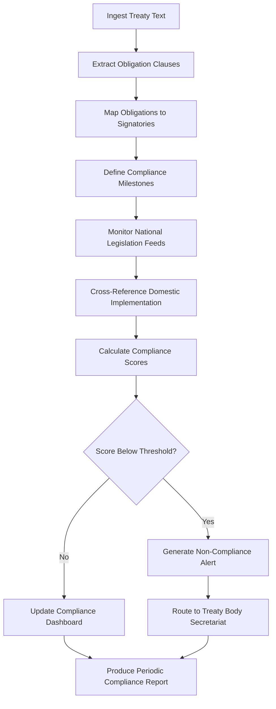

# Treaty Compliance Monitor

Frankmax

NAICS 928120

> **International Institutions (UN/EU/AU/GCC/ASEAN)** — Compliance Monitoring Module

## Objective & Purpose

International treaties represent binding commitments between sovereign states, yet implementation tracking remains overwhelmingly manual. The Treaty Compliance Monitor uses AI to ingest treaty texts, extract obligation clauses, map them to signatory states, and continuously track implementation status against defined milestones. Without automated monitoring, compliance gaps widen silently until they become diplomatic crises.

The platform processes treaty language in over 40 languages, normalizes obligation definitions across legal traditions (common law, civil law, Sharia-based, customary), and cross-references national legislation databases to determine whether domestic laws align with treaty requirements. Each obligation is assigned a compliance score updated in real time as new legislative actions, executive orders, or judicial rulings are detected.

For secretariats managing hundreds of active treaties with thousands of individual obligations across 193 member states, manual tracking is not just inefficient --- it is structurally impossible. This tool reduces compliance assessment cycles from 18-24 months to continuous monitoring, giving treaty bodies the visibility they need to intervene before non-compliance becomes entrenched.

## Business Context

| Attribute | Value |
|---|---|
| **Business Process** | Treaty implementation tracking |
| **Business Function** | Compliance Monitoring |
| **Category** | Governance |
| **Target Audience** | 4. International Institutions (UN/EU/AU/GCC/ASEAN) |
| **Bundle** | Custom Pricing |
| **Monthly Cost of Inaction** | $250,000+ in delayed compliance assessments and diplomatic escalation |

## BPMN Workflow

## Features

1. **Multi-Language Treaty Parser** --- Ingests treaty texts in 40+ languages, extracts structured obligation data using legal NLP models trained on international law corpora.
2. **Obligation Decomposition Engine** --- Breaks compound treaty clauses into discrete, measurable obligations with defined timelines, responsible parties, and success criteria.
3. **National Legislation Scanner** --- Continuously monitors legislative databases across signatory states to detect alignment or divergence with treaty obligations.
4. **Compliance Scoring Matrix** --- Assigns quantitative scores (0-100) to each obligation-signatory pair based on legislative alignment, reported actions, and independent verification.
5. **Early Warning System** --- Triggers alerts when compliance trajectories suggest a signatory will miss upcoming milestones, enabling proactive diplomatic engagement.
6. **Cross-Treaty Conflict Detector** --- Identifies cases where obligations under different treaties create conflicting requirements for the same signatory state.
7. **Historical Compliance Analytics** --- Tracks compliance trends over time, identifying patterns of systematic non-compliance by region, treaty type, or obligation category.

## Workflow & Automation

**Step 1: Treaty Ingestion** --- Upload treaty documents in any format (PDF, DOCX, scanned images). OCR and NLP extract structured obligation data automatically.

**Step 2: Obligation Mapping** --- AI decomposes treaty text into individual obligations, tags each with responsible signatories, deadlines, and verification criteria.

**Step 3: Baseline Assessment** --- System scans existing national legislation for each signatory to establish current compliance baseline scores.

**Step 4: Continuous Monitoring** --- Automated feeds from national legislation databases, government gazettes, and official publications detect new laws and policy changes.

**Step 5: Score Recalculation** --- Each detected change triggers compliance score recalculation for affected obligation-signatory pairs.

**Step 6: Alert Generation** --- Non-compliance or declining trajectory triggers alerts routed to designated treaty body officials with recommended actions.

**Step 7: Report Compilation** --- Periodic compliance reports generated automatically with visualizations, trend analysis, and executive summaries for treaty review conferences.

## Input/Output Specifications

| Direction | Data | Format | Description |
|---|---|---|---|
| Input | Treaty documents | PDF, DOCX, XML | Full treaty texts including annexes and protocols |
| Input | National legislation feeds | API, RSS, XML | Real-time legislative database connections |
| Input | Implementation reports | PDF, structured forms | Self-reported state compliance data |
| Output | Compliance scores | JSON, dashboard | Per-obligation, per-signatory compliance ratings |
| Output | Non-compliance alerts | Email, webhook, API | Automated notifications with severity classification |
| Output | Compliance reports | PDF, XLSX | Formatted reports for treaty review bodies |

## Integration Points

| System | Integration Type | Data Flow |
|---|---|---|
| UN Treaty Body Database | API | Bidirectional treaty and compliance data |
| National Legislation Databases | Web scraping, API | Inbound legislative updates |
| UNTERM (UN Terminology Database) | API | Reference for multilingual legal terminology |
| Document Management Systems | API | Treaty document ingestion and report storage |
| Diplomatic Communication Platforms | Webhook | Outbound compliance alerts to missions |

## Pricing & Revenue Model

| Component | Price |
|---|---|
| Platform Access | Custom pricing based on treaty portfolio size |
| Per-Treaty Monitoring | Tiered by signatory count |
| Compliance Reporting Module | Included in base |
| Historical Analytics Add-on | Custom quote |
| ORF Governance Layer | Included |

Revenue is driven by treaty portfolio complexity. Institutions managing over 50 active treaties with 100+ signatories each represent annual contract values in the $500K-$2M range. The governance layer (ORF protocol) ensures every compliance determination carries an auditable decision trail, creating high switching costs once embedded in institutional workflows.

## NAICS/SIC Mapping

| NAICS | SIC | Industry | Relevance |
|---|---|---|---|
| 928120 | 9721 | International Affairs | Primary: treaty compliance for international bodies |
| 813910 | 8611 | Business Associations | Secondary: standards bodies with treaty-adjacent mandates |
| 541611 | 7371 | Administrative Management Consulting | Tertiary: compliance advisory services |
| 541199 | 7389 | All Other Legal Services | Tertiary: international legal compliance |
