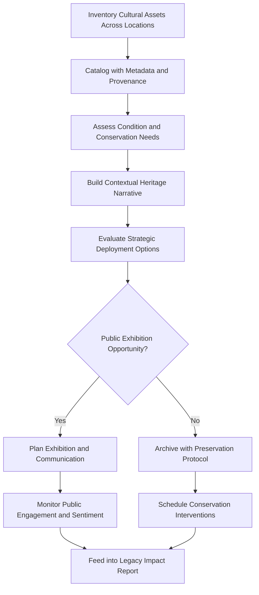

# Cultural Legacy Curator

Frankmax

NAICS 525920

> **Dynasties & Royal Houses** — Cultural Affairs Module

## Objective & Purpose

Dynasties accumulate cultural assets over centuries --- art collections, architectural heritage, manuscript libraries, ceremonial traditions, and patronage histories --- that define their identity and legitimacy. Yet these assets are often scattered across residences, warehouses, and institutions, inadequately documented, and vulnerable to loss through neglect, theft, or political seizure. The Cultural Legacy Curator uses AI to catalog, connect, preserve, and strategically deploy cultural assets as instruments of dynastic continuity and public legitimacy.

Cultural assets serve dual functions for dynasties: intrinsic value as heritage and strategic value as legitimacy instruments. A well-curated collection opened to the public builds goodwill. A patronage history that demonstrates centuries of cultural stewardship reinforces the dynasty's claim to relevance. Conversely, cultural assets that are hidden, poorly maintained, or associated with controversial provenance become liabilities. This platform helps dynasty leadership understand and manage both dimensions.

The curator also connects cultural assets to their historical context --- linking an artwork to the relationship that produced its commissioning, a building to the political events it witnessed, a manuscript to the intellectual tradition it represents. This contextual layer transforms isolated objects into a narrative of dynastic identity that can be communicated to future generations, the public, and political stakeholders.

## Business Context

| Attribute | Value |
|---|---|
| **Business Process** | Heritage and legacy management |
| **Business Function** | Cultural Affairs |
| **Category** | Archive |
| **Target Audience** | 5. Dynasties & Royal Houses |
| **Bundle** | Dynasty/Family Office Continuity Pack ($12,000/mo) |
| **Monthly Cost of Inaction** | $1M+ in cultural asset depreciation and missed legitimacy opportunities |

## BPMN Workflow

## Features

1. **Comprehensive Asset Catalog** --- Documents every cultural asset with photographs, provenance records, condition reports, location data, and estimated values, creating a single source of truth across all holdings.
2. **Provenance Research Engine** --- AI traces ownership histories of artworks, manuscripts, and artifacts, identifying gaps in provenance that could create legal or reputational risk.
3. **Conservation Management** --- Tracks condition assessments, schedules conservation interventions, and connects with specialist conservators based on asset type, period, and material.
4. **Heritage Narrative Builder** --- Constructs the historical narrative connecting cultural assets to dynastic events, relationships, and values, producing materials for exhibitions, publications, and education programs.
5. **Strategic Deployment Advisor** --- Recommends which cultural assets to exhibit, loan, or donate based on current political context, public sentiment, and strategic objectives.
6. **Digital Preservation** --- Creates high-resolution digital replicas of fragile physical assets, ensuring the knowledge and cultural value survives even if the physical object is damaged or lost.
7. **Patronage Impact Tracker** --- Documents the dynasty's cultural patronage activities (commissions, restorations, grants, exhibitions) and measures their impact on public perception and stakeholder relationships.

## Workflow & Automation

**Step 1: Asset Discovery** --- Survey all dynasty properties, storage facilities, and loaned collections to build a comprehensive inventory of cultural holdings.

**Step 2: Cataloging** --- Each asset is photographed, described, measured, and tagged with metadata including provenance, condition, location, and estimated value.

**Step 3: Provenance Verification** --- AI researches ownership histories using auction records, exhibition catalogs, and archival databases to verify provenance and identify gaps.

**Step 4: Narrative Construction** --- Historical context is linked to each asset, building a navigable story of the dynasty's cultural identity across centuries.

**Step 5: Strategic Planning** --- The deployment advisor analyzes current political and cultural context to recommend exhibition, loan, donation, or acquisition opportunities.

**Step 6: Preservation Execution** --- Conservation schedules are maintained automatically, with alerts for upcoming interventions and recommendations for specialist providers.

## Input/Output Specifications

| Direction | Data | Format | Description |
|---|---|---|---|
| Input | Asset photographs and scans | JPEG, TIFF, 3D scan files | Visual documentation of cultural holdings |
| Input | Provenance documents | PDF, archival records | Ownership history and transaction records |
| Input | Condition reports | Structured forms, PDF | Professional conservation assessments |
| Input | Auction and exhibition records | API, database | Reference data for provenance research |
| Output | Asset catalog | Searchable database, API | Complete cultural holdings inventory |
| Output | Heritage narrative materials | PDF, interactive web | Exhibition texts, educational materials |
| Output | Conservation schedules | Calendar, alerts | Upcoming preservation interventions |

## Integration Points

| System | Integration Type | Data Flow |
|---|---|---|
| Dynasty Knowledge Vault | API | Bidirectional historical context and asset records |
| Reputation Risk Sentinel | API | Inbound public sentiment for deployment decisions |
| Insurance Management Systems | API | Outbound valuation data for coverage |
| Museum and Gallery Networks | Secure export | Outbound loan and exhibition coordination |
| Conservation Specialist Networks | API | Bidirectional conservation scheduling and reporting |

## Pricing & Revenue Model

| Component | Price |
|---|---|
| Dynasty/Family Office Continuity Pack | $12,000/mo |
| Cultural Legacy Curator Core | Included in pack |
| Digital Preservation Module | Included |
| Provenance Research Engine | Included |
| High-Resolution 3D Scanning Services | Per-asset pricing |

Revenue is subscription-based through the Continuity Pack. Premium services --- professional photography, 3D scanning, provenance deep research, and exhibition consulting --- drive attach revenue of 20-35% above base subscription. The catalog becomes irreplaceable once populated, as the provenance research and contextual narratives represent years of accumulated work that cannot be easily replicated.

## NAICS/SIC Mapping

| NAICS | SIC | Industry | Relevance |
|---|---|---|---|
| 525920 | 6726 | Trusts, Estates, and Agency Accounts | Primary: dynastic cultural asset management |
| 551112 | 6712 | Offices of Other Holding Companies | Secondary: family holding cultural portfolio |
| 712110 | 8412 | Museums | Tertiary: museum-grade cataloging and curation |
| 519120 | 7375 | Libraries and Archives | Tertiary: archival preservation services |
