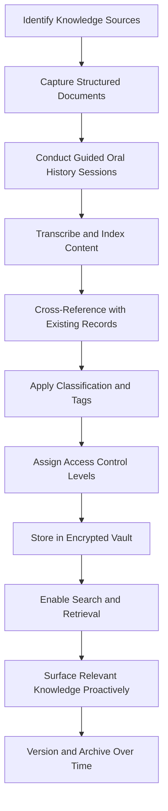

# Dynasty Knowledge Vault

Frankmax

NAICS 525920

> **Dynasties & Royal Houses** — Knowledge Management Module

## Objective & Purpose

Dynasties accumulate institutional knowledge over generations --- relationship histories, negotiation precedents, investment lessons, political alliances, and cultural protocols --- yet this knowledge overwhelmingly resides in the minds of aging patriarchs and matriarchs. When a generation passes, decades of context, nuance, and hard-won wisdom vanish irretrievably. The Dynasty Knowledge Vault uses AI to capture, index, and preserve this institutional memory in a secure, searchable, and inheritable format.

The challenge goes beyond simple document storage. The most valuable dynastic knowledge is tacit: why a particular alliance was formed, what an elder's handshake commitment really meant, which business partners can be trusted under pressure, and which historical decisions contain lessons for the future. This platform combines structured data ingestion (documents, contracts, financial records) with guided oral history capture, converting unstructured conversations into indexed, cross-referenced knowledge assets.

Access control is paramount. Different family branches, generations, and advisors need different levels of access. Some knowledge is appropriate for all family members; other information is restricted to the patriarch, the family council, or specific successors. The vault implements granular, role-based access controls that respect dynastic governance structures while ensuring that no critical knowledge is lost when access rights change.

## Business Context

| Attribute | Value |
|---|---|
| **Business Process** | Institutional memory preservation |
| **Business Function** | Knowledge Management |
| **Category** | Archive |
| **Target Audience** | 5. Dynasties & Royal Houses |
| **Bundle** | Dynasty/Family Office Continuity Pack ($12,000/mo) |
| **Monthly Cost of Inaction** | $2M+ in lost institutional knowledge per generational transition |

## BPMN Workflow

## Features

1. **Oral History Capture Engine** --- Guided interview protocols help family elders articulate tacit knowledge, with AI-powered transcription, summarization, and cross-referencing against existing records.
2. **Multi-Format Document Ingestion** --- Accepts documents, photographs, audio, video, financial records, correspondence, and legal documents, converting all into searchable, indexed assets.
3. **Contextual Knowledge Graph** --- Builds a relationship graph connecting people, events, decisions, and outcomes across decades, enabling users to trace the context behind any historical decision.
4. **Granular Access Controls** --- Role-based permissions aligned with dynastic governance structures: patriarch-only, family council, specific branch, next-generation, or advisor-specific access levels.
5. **Proactive Knowledge Surfacing** --- When family members face decisions similar to historical precedents, the vault surfaces relevant past experiences, outcomes, and lessons learned.
6. **Temporal Knowledge Layers** --- Organizes knowledge chronologically and thematically, allowing users to view the dynasty's knowledge base at any point in history and trace how understanding evolved.
7. **Succession Knowledge Transfer** --- Curates knowledge packages tailored to incoming successors, packaging the historical context, relationship histories, and decision precedents they need to lead effectively.
8. **Encrypted Sovereign Storage** --- All data encrypted at rest and in transit with encryption keys held exclusively by designated family members, ensuring no third party (including the platform provider) can access vault contents.

## Workflow & Automation

**Step 1: Knowledge Audit** --- AI catalogs existing documented knowledge (contracts, correspondence, financial records) and identifies gaps where critical institutional knowledge exists only in human memory.

**Step 2: Structured Capture** --- Documents, records, and digital assets are ingested, OCR-processed, and indexed with metadata tags for people, dates, topics, and decisions.

**Step 3: Oral History Sessions** --- Guided interview protocols engage family elders in structured conversations designed to capture tacit knowledge about relationships, decisions, and lessons.

**Step 4: Knowledge Graph Construction** --- AI builds connections between captured knowledge elements, creating a navigable graph of people, events, decisions, and outcomes across the dynasty's history.

**Step 5: Access Configuration** --- Family governance administrators define access rules for each knowledge category, branch, and generation, with emergency override protocols for succession events.

**Step 6: Continuous Enrichment** --- New events, decisions, and outcomes are continuously added to the vault, with AI suggesting connections to existing knowledge and prompting for context.

## Input/Output Specifications

| Direction | Data | Format | Description |
|---|---|---|---|
| Input | Historical documents | PDF, DOCX, scanned images | Contracts, correspondence, legal records |
| Input | Audio/video recordings | MP3, MP4, WAV | Oral history interviews and family recordings |
| Input | Photographs and artifacts | JPEG, PNG, TIFF | Visual historical records |
| Input | Financial records | CSV, XLSX, PDF | Transaction histories and investment records |
| Output | Knowledge search results | Web, API | Contextual search across all vault contents |
| Output | Successor knowledge packages | PDF, interactive | Curated briefings for incoming leaders |
| Output | Knowledge gap reports | PDF, dashboard | Identified areas where institutional memory is at risk |

## Integration Points

| System | Integration Type | Data Flow |
|---|---|---|
| Succession Intelligence Platform | API | Outbound institutional context for succession planning |
| Cultural Legacy Curator | API | Bidirectional cultural and heritage knowledge |
| Private Treaty Analyzer | API | Inbound agreement history and obligations |
| Family Governance Facilitator | API | Outbound historical decision precedents |
| Secure Cloud Storage | Encrypted API | Bidirectional sovereign data storage |

## Pricing & Revenue Model

| Component | Price |
|---|---|
| Dynasty/Family Office Continuity Pack | $12,000/mo |
| Knowledge Vault Core | Included in pack |
| Oral History Capture Module | Included |
| Sovereign Encrypted Storage | Included (up to 5TB) |
| Extended Storage | $500/TB/mo additional |

Revenue comes through the Continuity Pack subscription. The vault's value increases with each year of captured knowledge, creating exponential switching costs --- a dynasty with 20 years of indexed institutional memory cannot replicate this asset elsewhere. Storage expansion and premium capture services (professional oral history facilitators) drive attach revenue of 15-25% above base subscription.

## NAICS/SIC Mapping

| NAICS | SIC | Industry | Relevance |
|---|---|---|---|
| 525920 | 6726 | Trusts, Estates, and Agency Accounts | Primary: dynastic institutional memory management |
| 551112 | 6712 | Offices of Other Holding Companies | Secondary: family holding company knowledge management |
| 519190 | 7375 | All Other Information Services | Tertiary: knowledge indexing and retrieval services |
| 512110 | 7812 | Motion Picture and Video Production | Tertiary: oral history and video archive capture |
