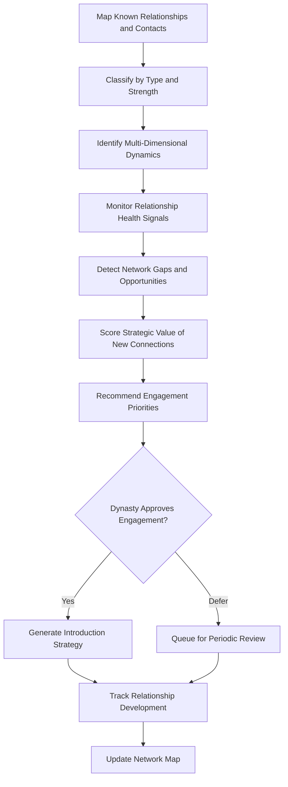

# Dynasty Network Intelligence

Frankmax

NAICS 525920

> **Dynasties & Royal Houses** — Stakeholder Management Module

## Objective & Purpose

Dynastic power operates through networks --- political alliances, business partnerships, marriage connections, patronage relationships, and informal influence channels that span generations and continents. These networks shift constantly as allies gain or lose power, relationships atrophy, and new connections form. The Dynasty Network Intelligence platform uses AI to map, monitor, and analyze the dynasty's relationship ecosystem, identifying opportunities to strengthen advantageous connections and risks from deteriorating ones.

The most valuable relationship intelligence is not who the dynasty knows, but how those relationships interact. A political ally who is also a business competitor creates a complex dynamic that requires nuanced management. A marriage connection to a dynasty under political pressure may create contagion risk. A trusted advisor who serves multiple families may inadvertently create information leakage. This platform maps these multi-dimensional relationships and their interactions, surfacing dynamics that would be invisible to any individual family member.

The platform also identifies network gaps --- influential figures, institutions, or families where the dynasty lacks connection but where a relationship would be strategically valuable. By analyzing the networks of peer dynasties and cross-referencing with the dynasty's strategic objectives, the system recommends targeted relationship development priorities and suggests warm introduction pathways through existing connections.

## Business Context

| Attribute | Value |
|---|---|
| **Business Process** | Relationship mapping |
| **Business Function** | Stakeholder Management |
| **Category** | Intelligence |
| **Target Audience** | 5. Dynasties & Royal Houses |
| **Bundle** | Dynasty/Family Office Continuity Pack ($12,000/mo) |
| **Monthly Cost of Inaction** | $2M+ in missed relationship opportunities and undetected network risks |

## BPMN Workflow

## Features

1. **Multi-Layer Network Mapping** --- Visualizes the dynasty's relationship ecosystem across layers: political, business, social, familial, and institutional, showing how connections interact across domains.
2. **Relationship Health Scoring** --- Assigns quantitative scores to each relationship based on interaction frequency, reciprocity, alignment of interests, and external signals of deterioration or strengthening.
3. **Network Risk Detection** --- Identifies relationships that create contagion risk (association with politically exposed persons), conflict risk (overlapping interests with competitors), or information risk (shared advisors).
4. **Gap Analysis Engine** --- Compares the dynasty's network against strategic objectives and peer dynasty networks to identify missing connections with high strategic value.
5. **Introduction Pathway Finder** --- Maps warm introduction routes through existing connections, ranking pathways by social distance, intermediary reliability, and probability of success.
6. **Generational Network Transfer** --- Tracks which relationships have been successfully transferred to the next generation and which remain dependent on aging principals, flagging transition priorities.
7. **Event and Interaction Tracker** --- Logs meetings, communications, and exchanges of value across all relationships, building a searchable history that informs future engagement strategy.

## Workflow & Automation

**Step 1: Network Census** --- Dynasty members and advisors input known relationships, categorizing each by type (political, business, social, familial), strength, and history.

**Step 2: Enrichment** --- AI enriches relationship records with publicly available information about contacts: positions, affiliations, financial interests, and recent activities.

**Step 3: Dynamic Mapping** --- The platform generates multi-layer network visualizations showing relationship clusters, bridge nodes, and isolated contacts.

**Step 4: Health Monitoring** --- Automated signals (meeting frequency, communication patterns, public statements, political changes) are tracked to detect strengthening or deteriorating relationships.

**Step 5: Strategic Analysis** --- Gap analysis and opportunity scoring identify which new relationships would most advance the dynasty's strategic objectives.

**Step 6: Engagement Planning** --- For approved relationship targets, the system generates engagement strategies including introduction pathways, meeting contexts, and value propositions.

## Input/Output Specifications

| Direction | Data | Format | Description |
|---|---|---|---|
| Input | Contact and relationship data | Secure web form, JSON | Known relationships with classification and history |
| Input | Public profile information | API, web intelligence | Positions, affiliations, and activities of contacts |
| Input | Interaction logs | CRM, calendar, email metadata | Meeting and communication records |
| Output | Network visualizations | Interactive dashboard | Multi-layer relationship maps |
| Output | Relationship health reports | PDF, dashboard | Scored assessments of key relationships |
| Output | Strategic engagement plans | PDF, secure delivery | Recommended new connections and approach strategies |

## Integration Points

| System | Integration Type | Data Flow |
|---|---|---|
| Political Landscape Navigator | API | Inbound political context for relationship risk assessment |
| Reputation Risk Sentinel | API | Inbound reputational risk data on contacts |
| Dynasty Knowledge Vault | API | Bidirectional relationship history and context |
| Private Treaty Analyzer | API | Inbound agreement-based relationships |
| Secure Calendar and CRM Systems | API | Inbound interaction tracking data |

## Pricing & Revenue Model

| Component | Price |
|---|---|
| Dynasty/Family Office Continuity Pack | $12,000/mo |
| Dynasty Network Intelligence Core | Included in pack |
| Network Mapping and Visualization | Included |
| Gap Analysis Engine | Included |
| Premium Enrichment Services | Per-contact pricing for deep profiles |

Revenue is subscription-based through the Continuity Pack. Deep profile enrichment on high-value relationship targets drives attach revenue of $2,000-$10,000 per profile. The network map becomes exponentially more valuable as relationship data accumulates, creating switching costs that increase geometrically over time --- a dynasty's complete relationship map represents decades of intelligence that cannot be rebuilt.

## NAICS/SIC Mapping

| NAICS | SIC | Industry | Relevance |
|---|---|---|---|
| 525920 | 6726 | Trusts, Estates, and Agency Accounts | Primary: dynastic relationship and stakeholder management |
| 551112 | 6712 | Offices of Other Holding Companies | Secondary: family enterprise stakeholder intelligence |
| 541618 | 7389 | Other Management Consulting | Tertiary: strategic relationship advisory |
| 561611 | 7382 | Investigation Services | Tertiary: due diligence and intelligence services |
