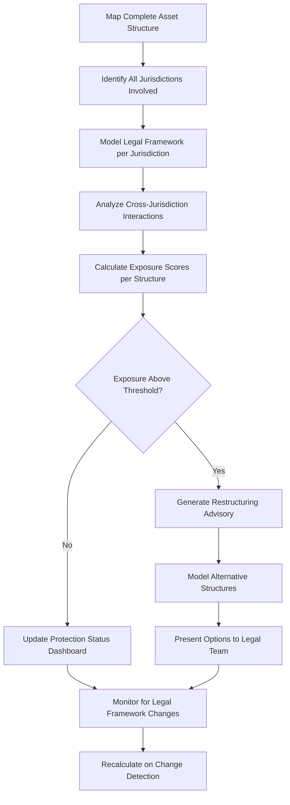

# Multi-Jurisdiction Asset Shield

Frankmax

NAICS 525920

> **Dynasties & Royal Houses** — Wealth Protection Module

## Objective & Purpose

Dynastic wealth spans dozens of jurisdictions with conflicting legal frameworks --- common law trusts that are not recognized in civil law countries, Sharia-compliant structures that interact unpredictably with European tax law, and sovereign immunity provisions that erode when political regimes change. The Multi-Jurisdiction Asset Shield uses AI to continuously model legal exposure across every jurisdiction where dynasty assets are held, identifying structural vulnerabilities before they are exploited by creditors, regulators, or political adversaries.

Asset protection for dynasties is not about hiding wealth. It is about structuring holdings so that the legal protections available in each jurisdiction are properly utilized and the interactions between jurisdictions do not create unintended exposures. A trust structure that is robust in Jersey may be pierceable from a Brazilian court. A holding company domiciled in Luxembourg may lose treaty benefits if beneficial ownership reporting changes in the UAE. These cross-jurisdictional interactions are too numerous and dynamic for any team of human advisors to monitor comprehensively.

The platform maintains a living model of the dynasty's complete asset structure --- every entity, trust, fund, and direct holding --- overlaid with the current legal framework in each jurisdiction. When laws change, treaties are renegotiated, or new case law is established, the model recalculates exposure scores and alerts the dynasty's legal team to structures that may need adjustment.

## Business Context

| Attribute | Value |
|---|---|
| **Business Process** | Cross-border asset protection |
| **Business Function** | Wealth Protection |
| **Category** | Legal/Finance |
| **Target Audience** | 5. Dynasties & Royal Houses |
| **Bundle** | Dynasty/Family Office Continuity Pack ($12,000/mo) |
| **Monthly Cost of Inaction** | $10M+ in undetected legal exposure across jurisdictions |

## BPMN Workflow

## Features

1. **Complete Structure Mapping** --- Visualizes the dynasty's entire asset structure including all entities, trusts, funds, nominees, and direct holdings across every jurisdiction, with beneficial ownership chains.
2. **Jurisdictional Legal Modeling** --- Maintains current models of asset protection law in 80+ jurisdictions, updated as legislation changes, treaties are modified, and relevant case law is decided.
3. **Cross-Jurisdiction Interaction Analysis** --- Identifies how legal provisions in one jurisdiction interact with structures in another, detecting hidden vulnerabilities such as treaty override, forced heirship conflicts, and piercing exposure.
4. **Exposure Scoring Engine** --- Assigns quantitative risk scores to each structural element based on legal robustness, jurisdictional stability, political risk, and regulatory scrutiny level.
5. **Restructuring Scenario Modeler** --- When vulnerabilities are identified, the system models alternative structures, comparing protection strength, tax efficiency, and implementation complexity.
6. **Regulatory Change Monitor** --- Tracks legislative changes, tax treaty renegotiations, beneficial ownership reporting requirements, and sanctions developments across all relevant jurisdictions in real time.
7. **ETLB Compliance Integration** --- Applies Execution-Time Liability Binding protocol to ensure every structural decision carries documented liability assignment, protecting advisors and principals alike.

## Workflow & Automation

**Step 1: Structure Ingestion** --- The dynasty's legal and financial advisors input the complete asset structure: entities, trusts, nominees, holding chains, and direct assets across all jurisdictions.

**Step 2: Legal Framework Loading** --- The system loads current legal frameworks for each involved jurisdiction, including asset protection statutes, trust law, corporate law, tax treaties, and relevant case law.

**Step 3: Interaction Modeling** --- AI analyzes how legal provisions in each jurisdiction interact with the dynasty's specific structures, identifying cross-border vulnerabilities.

**Step 4: Exposure Assessment** --- Each structural element receives an exposure score based on legal analysis, with detailed reasoning explaining identified vulnerabilities.

**Step 5: Continuous Monitoring** --- Automated feeds from legal databases, government gazettes, and tax treaty registers detect changes that may affect the dynasty's structures.

**Step 6: Adaptive Restructuring** --- When changes are detected, the system recalculates exposure scores and, if thresholds are breached, generates restructuring recommendations with modeled alternatives.

## Input/Output Specifications

| Direction | Data | Format | Description |
|---|---|---|---|
| Input | Entity structure data | JSON, secure web form | Corporate and trust structures with ownership chains |
| Input | Asset registers | CSV, XLSX | Holdings by entity, type, jurisdiction, and value |
| Input | Legal framework databases | API, structured data | Current law in 80+ jurisdictions |
| Input | Treaty and tax agreement data | PDF, structured data | Bilateral and multilateral treaty provisions |
| Output | Structure visualization | Interactive dashboard | Complete asset structure with exposure overlays |
| Output | Exposure assessment reports | PDF, secure dashboard | Risk scores with detailed legal reasoning |
| Output | Restructuring recommendations | PDF, DOCX | Alternative structure proposals with comparison |

## Integration Points

| System | Integration Type | Data Flow |
|---|---|---|
| Succession Intelligence Platform | API | Outbound structure data for succession modeling |
| Political Landscape Navigator | API | Inbound political risk for jurisdictional assessment |
| Sovereign Wealth Optimizer | API | Bidirectional asset allocation and protection data |
| External Legal Databases (LexisNexis, Westlaw) | API | Inbound legislation and case law updates |
| Tax Advisory Platforms | API | Bidirectional tax structure analysis |

## Pricing & Revenue Model

| Component | Price |
|---|---|
| Dynasty/Family Office Continuity Pack | $12,000/mo |
| Multi-Jurisdiction Asset Shield Core | Included in pack |
| Jurisdictional Coverage | Included (up to 15 jurisdictions) |
| Extended Jurisdiction Coverage | $800/mo per additional jurisdiction |
| ORF/ETLB Governance Layer | Included |

Revenue is subscription-based through the Continuity Pack, with significant upsell through extended jurisdiction coverage. Complex dynasties with assets in 30+ jurisdictions generate $12,000-$24,000/mo in extended coverage. Restructuring advisory engagements triggered by the platform drive consulting revenue of $200K-$1M per restructuring project.

## NAICS/SIC Mapping

| NAICS | SIC | Industry | Relevance |
|---|---|---|---|
| 525920 | 6726 | Trusts, Estates, and Agency Accounts | Primary: dynastic asset protection and trust management |
| 551112 | 6712 | Offices of Other Holding Companies | Secondary: holding company structure optimization |
| 541199 | 7389 | All Other Legal Services | Tertiary: cross-border legal analysis |
| 523920 | 6282 | Portfolio Management and Investment Advice | Tertiary: wealth structuring advisory |
