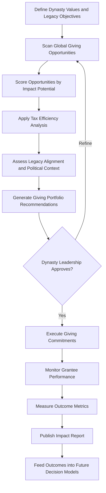

# Philanthropic Impact Optimizer

Frankmax

NAICS 525920

> **Dynasties & Royal Houses** — Philanthropy Module

## Objective & Purpose

Dynastic philanthropy serves dual purposes: genuine social impact and strategic legacy positioning. Yet charitable giving in prominent families is often driven by personal whim, political calculation, or advisor recommendations with opaque motivations rather than evidence-based impact analysis. The Philanthropic Impact Optimizer uses AI to analyze giving opportunities against impact metrics, tax efficiency, legacy alignment, and political context, ensuring every philanthropic dollar achieves maximum measurable social return while strengthening the dynasty's long-term position.

The failure mode is not giving too little --- it is giving ineffectively. A dynasty that donates $50M to a cause that produces negligible measurable impact while ignoring adjacent causes where the same amount could transform outcomes has wasted not just money but reputational capital. Conversely, a dynasty that strategically concentrates philanthropy in areas where its giving creates outsized, visible impact builds a legacy narrative that compounds over generations.

This platform maps the global landscape of giving opportunities, scores each by impact potential (lives improved per dollar, systemic change leverage, sustainability of outcomes), tax optimization potential, and alignment with the dynasty's stated values and legacy objectives. It also tracks outcomes longitudinally, building an evidence base that improves future giving decisions and provides the transparency that increasingly scrutinous publics demand.

## Business Context

| Attribute | Value |
|---|---|
| **Business Process** | Charitable giving strategy |
| **Business Function** | Philanthropy |
| **Category** | Social Impact |
| **Target Audience** | 5. Dynasties & Royal Houses |
| **Bundle** | Dynasty/Family Office Continuity Pack ($12,000/mo) |
| **Monthly Cost of Inaction** | $500K+ in suboptimal giving and missed impact per annual giving cycle |

## BPMN Workflow

## Features

1. **Impact Scoring Engine** --- Evaluates giving opportunities using evidence-based impact metrics: cost-effectiveness ratios, outcome sustainability, systemic change potential, and counterfactual impact.
2. **Legacy Alignment Scorer** --- Maps giving opportunities against the dynasty's stated values, historical patronage themes, and long-term legacy objectives, ensuring philanthropic coherence across generations.
3. **Tax Optimization Module** --- Models the tax implications of different giving structures (direct grants, foundation disbursements, DAFs, impact investments) across relevant jurisdictions to maximize after-tax impact.
4. **Political Context Analyzer** --- Assesses how philanthropic choices will be perceived in current political environments, flagging opportunities that could generate controversy or strategically valuable goodwill.
5. **Grantee Due Diligence** --- Performs automated due diligence on potential grantee organizations, assessing governance quality, financial management, track record, and reputational risk.
6. **Outcome Tracking Dashboard** --- Monitors funded programs against committed outcomes, providing real-time visibility into whether giving is producing the projected impact.
7. **Inter-Generational Giving Planner** --- Models multi-decade giving strategies that build on previous generations' philanthropy, creating a compounding legacy narrative rather than fragmented one-off donations.

## Workflow & Automation

**Step 1: Values Definition** --- Dynasty leadership articulates philanthropic values, focus areas, geographic priorities, and legacy objectives through guided facilitation tools.

**Step 2: Opportunity Scanning** --- AI scans global databases of charitable organizations, social enterprises, and impact investment opportunities matching the dynasty's defined priorities.

**Step 3: Impact Analysis** --- Each opportunity is scored on evidence-based impact metrics using data from charity evaluators, academic research, and outcome databases.

**Step 4: Portfolio Construction** --- Recommendations are assembled into a diversified giving portfolio balancing high-impact direct grants, systemic change investments, and legacy-building patronage.

**Step 5: Execution Support** --- The platform generates grant agreements, disbursement schedules, and reporting requirements for approved giving commitments.

**Step 6: Outcome Monitoring** --- Grantee organizations submit outcome data on defined schedules, which is validated against independent data sources and compiled into impact dashboards.

**Step 7: Legacy Reporting** --- Annual impact reports document the dynasty's philanthropic outcomes for family archives, public communications, and next-generation education.

## Input/Output Specifications

| Direction | Data | Format | Description |
|---|---|---|---|
| Input | Dynasty values and priorities | Structured interview, JSON | Philanthropic focus areas and legacy objectives |
| Input | Charity evaluation data | API | GiveWell, Charity Navigator, regional evaluators |
| Input | Tax framework data | Structured data | Jurisdictional tax treatment of charitable giving |
| Input | Grantee outcome reports | Structured forms, PDF | Performance data from funded organizations |
| Output | Giving portfolio recommendations | PDF, dashboard | Scored and ranked giving opportunities |
| Output | Impact dashboards | Web, API | Real-time philanthropic outcome tracking |
| Output | Annual impact reports | PDF, web | Formatted legacy documentation |

## Integration Points

| System | Integration Type | Data Flow |
|---|---|---|
| Dynasty Knowledge Vault | API | Outbound philanthropic history and impact records |
| Reputation Risk Sentinel | API | Inbound public sentiment for giving context |
| Multi-Jurisdiction Asset Shield | API | Inbound tax structure data for optimization |
| Charity Evaluation Databases | API | Inbound impact evidence and ratings |
| Foundation Management Systems | API | Bidirectional grant management and disbursement |

## Pricing & Revenue Model

| Component | Price |
|---|---|
| Dynasty/Family Office Continuity Pack | $12,000/mo |
| Philanthropic Impact Optimizer Core | Included in pack |
| Outcome Tracking Dashboard | Included |
| Tax Optimization Module | Included |
| Grantee Due Diligence Reports | Per-report pricing |

Revenue is subscription-based through the Continuity Pack. Premium due diligence reports on potential grantees and custom impact evaluation engagements drive attach revenue of 15-25%. Dynasties typically allocate 3-10% of annual income to philanthropy; a dynasty with $500M annual income represents a $15M-$50M giving budget where even marginal optimization improvements justify the platform cost many times over.

## NAICS/SIC Mapping

| NAICS | SIC | Industry | Relevance |
|---|---|---|---|
| 525920 | 6726 | Trusts, Estates, and Agency Accounts | Primary: dynastic philanthropic management |
| 551112 | 6712 | Offices of Other Holding Companies | Secondary: family foundation governance |
| 813211 | 8399 | Grantmaking Foundations | Tertiary: foundation management and grantmaking |
| 541611 | 7371 | Administrative Management Consulting | Tertiary: philanthropic strategy advisory |
