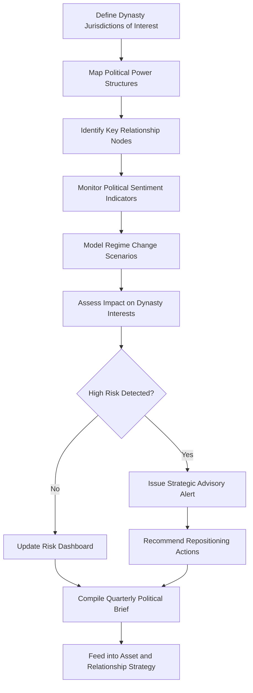

# Political Landscape Navigator

Frankmax

NAICS 525920

> **Dynasties & Royal Houses** — Strategic Intelligence Module

## Objective & Purpose

Dynasties exist at the intersection of wealth, politics, and culture, making them uniquely sensitive to shifts in political power structures. A change in government can transform a dynasty from a favored national institution to a politically inconvenient legacy overnight. The Political Landscape Navigator uses AI to map power structures, track political sentiment, model regime change scenarios, and assess geopolitical risks specific to the dynasty's jurisdictions of interest.

Unlike generic geopolitical risk services that focus on country-level assessments, this platform maps political risk at the relationship level. It tracks which political figures are allies, which are adversaries, and which are neutral --- and how those positions shift with elections, cabinet reshuffles, and generational leadership changes within political parties. For a dynasty with interests spanning multiple countries, understanding these relationship dynamics across jurisdictions is essential for protecting assets, maintaining access, and preserving influence.

The platform also models second-order political risks: sanctions contagion, anti-corruption investigations that may sweep through allied networks, regulatory changes targeting specific industries, and populist movements that threaten wealth concentration narratives. By identifying these risks 6-12 months before they materialize, dynasty leadership can reposition assets, adjust political engagement strategies, and prepare contingency plans.

## Business Context

| Attribute | Value |
|---|---|
| **Business Process** | Geopolitical risk assessment |
| **Business Function** | Strategic Intelligence |
| **Category** | Analytics |
| **Target Audience** | 5. Dynasties & Royal Houses |
| **Bundle** | Dynasty/Family Office Continuity Pack ($12,000/mo) |
| **Monthly Cost of Inaction** | $3M+ in unhedged political risk exposure per jurisdiction |

## BPMN Workflow

## Features

1. **Power Structure Mapping** --- Builds dynamic models of political hierarchies in each jurisdiction, tracking formal authority (cabinet positions, legislative majorities) and informal influence (advisory networks, financial backers).
2. **Relationship Risk Scoring** --- Assigns risk scores to the dynasty's political relationships based on stability of the ally's position, alignment of interests, and vulnerability to opposition or scandal.
3. **Regime Change Scenario Modeling** --- Simulates election outcomes, coup scenarios, and leadership transition dynamics, projecting the impact of each scenario on the dynasty's political standing and business interests.
4. **Sanctions and Regulatory Forecasting** --- Tracks legislative and executive actions that could result in new sanctions, anti-corruption investigations, or regulatory changes affecting dynasty assets or associates.
5. **Populist Movement Tracker** --- Monitors populist narratives targeting wealth concentration, monarchy, or specific families, scoring the political viability and escalation potential of these movements.
6. **Multi-Jurisdiction Correlation Engine** --- Identifies political risks that span jurisdictions --- diplomatic disputes, trade wars, or anti-money-laundering crackdowns that could simultaneously affect dynasty interests in multiple countries.
7. **Historical Pattern Library** --- Maintains a database of historical political transitions and their impact on prominent families, providing precedents for strategic planning.

## Workflow & Automation

**Step 1: Jurisdiction Mapping** --- Define the countries, regions, and political entities relevant to the dynasty's interests. AI builds initial power structure maps from open-source intelligence.

**Step 2: Relationship Identification** --- The system identifies and scores political relationships relevant to the dynasty, flagging allies, adversaries, and critical neutral parties.

**Step 3: Continuous Monitoring** --- Automated feeds from political news, legislative databases, election commissions, and social media track changes in political dynamics across all jurisdictions.

**Step 4: Scenario Simulation** --- When political indicators shift beyond defined thresholds, the system runs scenario simulations modeling potential outcomes and their impact on dynasty interests.

**Step 5: Advisory Generation** --- High-risk scenarios trigger strategic advisory briefs with recommended actions: asset repositioning, relationship cultivation, communication adjustments, or legal preparations.

**Step 6: Quarterly Strategic Review** --- Comprehensive political landscape reports are compiled quarterly, integrating monitoring data, scenario analysis, and strategic recommendations for dynasty leadership.

## Input/Output Specifications

| Direction | Data | Format | Description |
|---|---|---|---|
| Input | Political news and intelligence | API, RSS | Global political media and analytical sources |
| Input | Election and legislative data | API, structured data | Election results, legislative calendars, voting records |
| Input | Dynasty relationship data | Secure web form | Known political allies, adversaries, and contacts |
| Input | Economic and trade data | API | Indicators affecting political stability |
| Output | Power structure maps | Interactive dashboard | Visual political hierarchy and influence networks |
| Output | Risk assessment reports | PDF, secure dashboard | Jurisdiction-specific political risk scores |
| Output | Strategic advisory briefs | PDF, encrypted delivery | Actionable recommendations for dynasty leadership |

## Integration Points

| System | Integration Type | Data Flow |
|---|---|---|
| Reputation Risk Sentinel | API | Bidirectional political threat and media correlation |
| Dynasty Network Intelligence | API | Inbound relationship data for political network mapping |
| Multi-Jurisdiction Asset Shield | API | Outbound risk assessments for asset protection decisions |
| Succession Intelligence Platform | API | Outbound political context for succession planning |
| Open-Source Intelligence Feeds | API | Inbound political and security intelligence |

## Pricing & Revenue Model

| Component | Price |
|---|---|
| Dynasty/Family Office Continuity Pack | $12,000/mo |
| Political Landscape Navigator Core | Included in pack |
| Multi-Jurisdiction Coverage | Included (up to 10 jurisdictions) |
| Extended Jurisdiction Coverage | $1,000/mo per additional jurisdiction |
| ORF Governance Layer | Included |

Revenue is subscription-based through the Continuity Pack, with upsell potential through extended jurisdiction coverage. Dynasties with interests in 20+ countries generate $8,000-$15,000/mo in extended coverage fees. Crisis-driven consulting engagements during political transitions add $75K-$250K per event, with high conversion rates when the platform has already identified the risk.

## NAICS/SIC Mapping

| NAICS | SIC | Industry | Relevance |
|---|---|---|---|
| 525920 | 6726 | Trusts, Estates, and Agency Accounts | Primary: dynastic strategic intelligence |
| 551112 | 6712 | Offices of Other Holding Companies | Secondary: family enterprise political risk management |
| 541618 | 7389 | Other Management Consulting | Tertiary: geopolitical advisory services |
| 561611 | 7382 | Investigation Services | Tertiary: political intelligence gathering |
