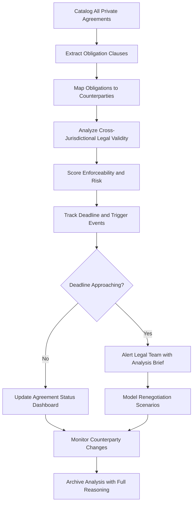

# Private Treaty Analyzer

Frankmax

NAICS 525920

> **Dynasties & Royal Houses** — Legal Affairs Module

## Objective & Purpose

Dynasties maintain webs of private agreements --- inter-family marriage contracts, business partnership treaties, succession pacts, land use covenants, and political alliance agreements --- some dating back centuries. These agreements carry binding obligations that shape asset flows, relationship dynamics, and strategic options, yet they are often poorly documented, inconsistently interpreted, and vulnerable to renegotiation by counterparties who sense weakness during succession transitions. The Private Treaty Analyzer uses AI to catalog, interpret, track, and model the full portfolio of inter-family agreements.

The complexity is compounded by the legal diversity of these agreements. A marriage contract between a Gulf dynasty and a European noble house may incorporate elements of Sharia law, French civil code, and English trust provisions. A business partnership formed in the 1960s may reference currency arrangements, land use rights, and dispute resolution mechanisms that have been overtaken by legal reforms. Determining what remains binding, what has lapsed, and what is ambiguous requires cross-jurisdictional legal analysis at a scale that no advisory team can maintain manually.

The platform also serves as an early warning system for obligation deadlines --- renewal dates, renegotiation windows, performance milestones, and termination triggers --- that could catch dynasty leadership off guard if missed. By maintaining a complete, continuously analyzed portfolio of private treaties, the dynasty operates from a position of knowledge rather than assumption.

## Business Context

| Attribute | Value |
|---|---|
| **Business Process** | Inter-family agreement management |
| **Business Function** | Legal Affairs |
| **Category** | Legal |
| **Target Audience** | 5. Dynasties & Royal Houses |
| **Bundle** | Dynasty/Family Office Continuity Pack ($12,000/mo) |
| **Monthly Cost of Inaction** | $3M+ in untracked obligations and missed renegotiation opportunities |

## BPMN Workflow

## Features

1. **Agreement Portfolio Catalog** --- Maintains a comprehensive, searchable registry of all private treaties, contracts, and agreements with counterparty details, key terms, and obligation summaries.
2. **Multi-Jurisdictional Validity Analysis** --- Assesses enforceability of each agreement under all relevant legal systems, identifying provisions that may have been invalidated by legal reforms or jurisdictional changes.
3. **Obligation Extraction and Tracking** --- AI extracts discrete obligations from agreement texts, assigns deadlines and responsible parties, and maintains a calendar of upcoming triggers and milestones.
4. **Counterparty Risk Monitoring** --- Tracks counterparty dynasties and entities for changes in ownership, leadership, financial condition, or political status that could affect agreement dynamics.
5. **Renegotiation Scenario Modeler** --- When agreements approach renewal or renegotiation windows, the system models possible outcomes, leverage positions, and optimal negotiation strategies.
6. **Conflict Detection** --- Identifies provisions across different agreements that create conflicting obligations, enabling resolution before conflicts become actionable disputes.
7. **Historical Interpretation Engine** --- Analyzes historical context of archaic agreement language, mapping obsolete legal concepts to modern equivalents to determine current applicability.

## Workflow & Automation

**Step 1: Agreement Ingestion** --- All known private treaties and agreements are uploaded, including original language texts, amendments, and related correspondence.

**Step 2: Clause Extraction** --- AI parses agreement texts to extract individual obligations, rights, conditions, and triggers, creating structured records from unstructured legal prose.

**Step 3: Validity Assessment** --- Each agreement is analyzed against current law in all relevant jurisdictions, producing enforceability scores with detailed legal reasoning.

**Step 4: Obligation Scheduling** --- Extracted obligations, deadlines, and trigger events are entered into a managed calendar with automated alerts at configurable lead times.

**Step 5: Counterparty Monitoring** --- Automated intelligence feeds track counterparty entities for material changes that could affect agreement dynamics or create renegotiation opportunities.

**Step 6: Periodic Review** --- Quarterly reviews reassess the full agreement portfolio, updating validity assessments, risk scores, and strategic recommendations.

## Input/Output Specifications

| Direction | Data | Format | Description |
|---|---|---|---|
| Input | Private agreement documents | PDF, scanned images, DOCX | Original texts in any language including historical scripts |
| Input | Legal framework databases | API, structured data | Current law in relevant jurisdictions |
| Input | Counterparty intelligence | API, manual input | Information about counterparty entities and leadership |
| Output | Agreement portfolio dashboard | Secure web, API | Complete registry with status and risk indicators |
| Output | Obligation calendars | Calendar feed, alerts | Upcoming deadlines and trigger events |
| Output | Enforceability assessments | PDF, secure dashboard | Legal validity analysis with jurisdictional detail |

## Integration Points

| System | Integration Type | Data Flow |
|---|---|---|
| Dynasty Knowledge Vault | API | Bidirectional historical context and agreement records |
| Succession Intelligence Platform | API | Outbound agreement obligations for succession modeling |
| Multi-Jurisdiction Asset Shield | API | Bidirectional asset-related agreement provisions |
| Dynasty Network Intelligence | API | Inbound counterparty relationship data |
| External Legal Research Platforms | API | Inbound legislation and case law for validity analysis |

## Pricing & Revenue Model

| Component | Price |
|---|---|
| Dynasty/Family Office Continuity Pack | $12,000/mo |
| Private Treaty Analyzer Core | Included in pack |
| Multi-Language Processing | Included |
| Counterparty Monitoring | Included |
| Historical Document Digitization | Per-document pricing |

Revenue is subscription-based through the Continuity Pack. Historical document digitization and specialist translation services for archaic legal texts drive attach revenue of 10-20%. The agreement portfolio becomes irreplaceable once populated --- cataloging, translating, and analyzing decades or centuries of private treaties represents years of invested effort that cannot be replicated.

## NAICS/SIC Mapping

| NAICS | SIC | Industry | Relevance |
|---|---|---|---|
| 525920 | 6726 | Trusts, Estates, and Agency Accounts | Primary: dynastic agreement and obligation management |
| 551112 | 6712 | Offices of Other Holding Companies | Secondary: family enterprise legal affairs |
| 541110 | 8111 | Offices of Lawyers | Tertiary: legal analysis and advisory |
| 541199 | 7389 | All Other Legal Services | Tertiary: cross-jurisdictional legal research |
