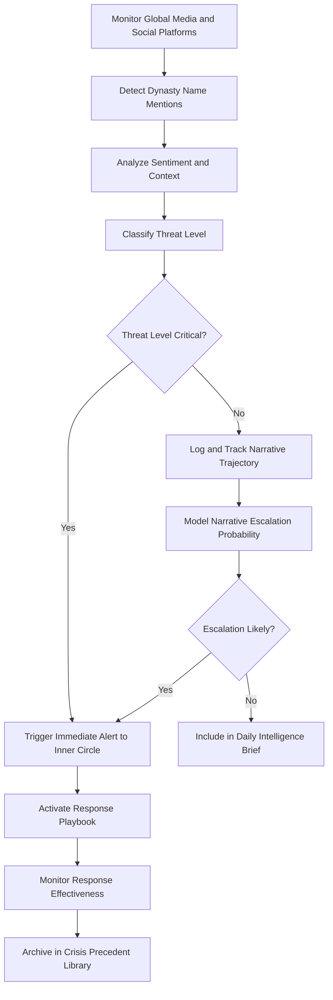

# Reputation Risk Sentinel

Frankmax

NAICS 525920

> **Dynasties & Royal Houses** — Risk Management Module

## Objective & Purpose

Royal families and prominent dynasties face asymmetric reputational risk: a single incident involving any family member can dominate global news cycles for weeks, threatening political standing, business relationships, and generational legacy. The Reputation Risk Sentinel uses AI to monitor global media, social platforms, dark web forums, and political discourse in real time, detecting reputational threats before they escalate and providing the intelligence needed for rapid, informed response.

Traditional media monitoring services deliver keyword alerts --- useful but insufficient for dynastic contexts where threats emerge through coded language, regional media in obscure languages, or social media narratives that build gradually before exploding. This platform uses sentiment analysis, narrative trajectory modeling, and influence network mapping to identify emerging threats while they are still containable, distinguishing genuine risks from background noise.

The sentinel also tracks the reputational trajectories of allied and rival dynasties, providing competitive intelligence on how other prominent families manage similar challenges. By maintaining a library of reputational crisis precedents and resolution strategies, the platform enables dynasty communications teams to respond with tested playbooks rather than improvised reactions.

## Business Context

| Attribute | Value |
|---|---|
| **Business Process** | Reputation monitoring |
| **Business Function** | Risk Management |
| **Category** | Communications |
| **Target Audience** | 5. Dynasties & Royal Houses |
| **Bundle** | Dynasty/Family Office Continuity Pack ($12,000/mo) |
| **Monthly Cost of Inaction** | $10M+ per reputational crisis in political capital and business relationship damage |

## BPMN Workflow

## Features

1. **Omnilingual Media Monitoring** --- Scans media in 100+ languages across print, broadcast, online, and social platforms, detecting mentions of family members, entities, and associated brands.
2. **Narrative Trajectory Modeling** --- Tracks how stories evolve over time, modeling escalation probability based on source authority, pickup rate, and historical patterns of similar narratives.
3. **Influence Network Mapping** --- Identifies the journalists, commentators, social media accounts, and political figures driving narrative around the dynasty, distinguishing amplifiers from originators.
4. **Dark Web and Closed Forum Monitoring** --- Scans restricted forums, messaging platforms, and dark web marketplaces for leaked information, planned actions, or coordinated campaigns targeting the dynasty.
5. **Crisis Response Playbook Engine** --- Maintains a library of tested response strategies mapped to crisis types, recommending communication templates, spokesperson deployment, and stakeholder outreach sequences.
6. **Competitive Reputation Intelligence** --- Tracks reputational trajectories of peer dynasties, extracting lessons from how they handle similar challenges and identifying emerging industry-wide reputational risks.
7. **Sentiment Trend Dashboard** --- Visualizes long-term sentiment trends by geography, topic, and platform, enabling proactive reputation management rather than reactive crisis response.

## Workflow & Automation

**Step 1: Continuous Monitoring** --- Automated crawlers scan 500,000+ global media sources, social platforms, forums, and dark web sites for mentions of dynasty members, entities, and associated keywords.

**Step 2: Threat Classification** --- AI classifies each mention by sentiment (positive, negative, neutral), topic category, source authority, and potential impact on dynastic interests.

**Step 3: Escalation Assessment** --- For negative mentions, narrative trajectory models estimate probability of escalation based on source reach, topic sensitivity, and historical pattern matching.

**Step 4: Alert Routing** --- Critical threats trigger immediate alerts to designated inner circle members via secure channels. Lower-severity items are compiled into daily intelligence briefs.

**Step 5: Response Activation** --- For confirmed threats, the playbook engine recommends response strategies, communication templates, and stakeholder outreach sequences based on crisis type and precedent.

**Step 6: Effectiveness Monitoring** --- Once response actions are taken, the system tracks narrative evolution to measure whether interventions are dampening or inadvertently amplifying the threat.

**Step 7: Precedent Archival** --- Resolved incidents are archived in the crisis precedent library with outcome analysis, informing future response strategy recommendations.

## Input/Output Specifications

| Direction | Data | Format | Description |
|---|---|---|---|
| Input | Media feeds | API, RSS, web scraping | Global news, broadcast, and online media |
| Input | Social media streams | API | Twitter/X, Instagram, TikTok, regional platforms |
| Input | Dark web and forum feeds | Specialized crawlers | Restricted forums and messaging platforms |
| Input | Family entity watchlist | JSON, web form | Names, entities, brands, and keywords to monitor |
| Output | Threat alerts | Secure messaging, email | Real-time critical threat notifications |
| Output | Daily intelligence briefs | PDF, secure dashboard | Summarized media landscape and sentiment trends |
| Output | Response playbooks | PDF, DOCX | Crisis-specific communication strategies |

## Integration Points

| System | Integration Type | Data Flow |
|---|---|---|
| Dynasty Knowledge Vault | API | Outbound crisis precedent archival |
| Political Landscape Navigator | API | Inbound political context for threat assessment |
| Dynasty Network Intelligence | API | Inbound relationship data for stakeholder impact analysis |
| Secure Communication Platforms | API | Outbound encrypted alert distribution |
| PR and Communications Agencies | Secure export | Outbound response briefs for external advisors |

## Pricing & Revenue Model

| Component | Price |
|---|---|
| Dynasty/Family Office Continuity Pack | $12,000/mo |
| Reputation Risk Sentinel Core | Included in pack |
| Dark Web Monitoring Module | Included |
| Crisis Playbook Engine | Included |
| Premium 24/7 Monitoring Desk | $5,000/mo add-on |

Revenue is primarily subscription-based through the Continuity Pack. The 24/7 monitoring desk add-on provides premium human oversight for dynasties requiring continuous real-time coverage, adding $60K/year per client. Crisis events drive consulting attach revenue as dynasties engage response specialists, with per-incident values of $50K-$300K.

## NAICS/SIC Mapping

| NAICS | SIC | Industry | Relevance |
|---|---|---|---|
| 525920 | 6726 | Trusts, Estates, and Agency Accounts | Primary: dynastic risk management |
| 551112 | 6712 | Offices of Other Holding Companies | Secondary: family enterprise reputation protection |
| 541820 | 7311 | Public Relations Agencies | Tertiary: reputation management services |
| 561611 | 7382 | Investigation Services | Tertiary: threat intelligence and monitoring |
