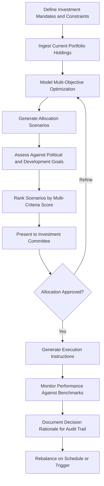

# Sovereign Wealth Optimizer

Frankmax

NAICS 551112

> **Dynasties & Royal Houses** — Investment Management Module

## Objective & Purpose

Sovereign wealth funds and dynasty-controlled national investment vehicles frequently underperform their benchmarks due to political allocation constraints, opaque governance, and conflicts between national development objectives and pure return maximization. The Sovereign Wealth Optimizer uses AI to model optimal allocation strategies that satisfy political mandates, development goals, and fiduciary obligations simultaneously --- finding the efficient frontier where national interests and investment returns align.

The challenge is not generic portfolio optimization. Standard models assume a single objective (risk-adjusted return). Sovereign wealth management involves multiple, often competing objectives: long-term capital preservation, domestic economic development, employment generation, geopolitical influence, and succession of resource-dependent economies. This platform builds multi-objective optimization models that explicitly incorporate these constraints rather than treating them as distortions.

The platform also provides governance transparency tools. Many sovereign wealth funds face criticism for opaque investment decisions that may serve political rather than national interests. By documenting the analytical basis for every allocation decision, the optimizer creates an audit trail that demonstrates fiduciary rigor to domestic constituencies, international investors, and successor leadership --- critical for dynasties that must justify wealth stewardship across generations.

## Business Context

| Attribute | Value |
|---|---|
| **Business Process** | National wealth management |
| **Business Function** | Investment Management |
| **Category** | Finance |
| **Target Audience** | 5. Dynasties & Royal Houses |
| **Bundle** | Dynasty/Family Office Continuity Pack ($12,000/mo) |
| **Monthly Cost of Inaction** | $50M+ annually in suboptimal allocation of sovereign wealth |

## BPMN Workflow

## Features

1. **Multi-Objective Optimization Engine** --- Builds allocation models that simultaneously optimize for return, risk, domestic development impact, employment generation, and geopolitical objectives with configurable weighting.
2. **Political Constraint Modeler** --- Explicitly incorporates political allocation mandates (minimum domestic investment, sector exclusions, geopolitical alignment rules) as constraints rather than ignoring them.
3. **Economic Diversification Analyzer** --- For resource-dependent economies, models how sovereign wealth allocation can accelerate economic diversification away from hydrocarbon or mineral dependence.
4. **Benchmark Customization** --- Creates bespoke benchmarks reflecting the fund's unique mandate mix rather than comparing against generic indices that ignore political and development constraints.
5. **Governance Transparency Dashboard** --- Documents the analytical basis for every allocation decision, creating an auditable record that demonstrates fiduciary rigor to all stakeholders.
6. **Scenario Stress Testing** --- Simulates portfolio performance under adverse scenarios: commodity price collapses, geopolitical crises, currency shocks, and domestic political transitions.
7. **Intergenerational Fairness Modeler** --- Calculates optimal spending rates that balance current national needs against future generation entitlements, modeling the dynasty's fiduciary obligation across time horizons.

## Workflow & Automation

**Step 1: Mandate Definition** --- Investment mandates, political constraints, development objectives, and risk parameters are defined through collaboration with fund governance bodies.

**Step 2: Portfolio Ingestion** --- Current holdings across all asset classes and geographies are loaded, with market data feeds providing real-time valuations.

**Step 3: Optimization Modeling** --- The multi-objective engine generates allocation scenarios across the efficient frontier defined by the fund's unique constraint set.

**Step 4: Political Feasibility Check** --- Each scenario is assessed against political constraints and development objectives, with sensitivity analysis showing how constraint relaxation affects returns.

**Step 5: Committee Presentation** --- Ranked scenarios are presented to the investment committee with full analytical documentation, trade-off visualizations, and implementation requirements.

**Step 6: Performance Monitoring** --- Approved allocations are tracked against custom benchmarks, with automated rebalancing triggers when drift exceeds defined thresholds.

**Step 7: Accountability Reporting** --- Quarterly reports document performance, decision rationale, and constraint impact for domestic constituencies and international observers.

## Input/Output Specifications

| Direction | Data | Format | Description |
|---|---|---|---|
| Input | Portfolio holdings | CSV, API | Current positions across all asset classes |
| Input | Market data | API (Bloomberg, Reuters) | Real-time pricing, indices, and economic data |
| Input | Political mandates | Structured document | Investment constraints from governing authority |
| Input | Economic development data | API, CSV | National economic indicators and development targets |
| Output | Allocation scenarios | Dashboard, PDF | Ranked investment strategies with trade-off analysis |
| Output | Performance reports | PDF, XLSX | Portfolio returns against custom benchmarks |
| Output | Governance audit trail | Secure database, PDF | Documented decision rationale for every allocation |

## Integration Points

| System | Integration Type | Data Flow |
|---|---|---|
| Multi-Jurisdiction Asset Shield | API | Bidirectional asset structure and legal constraint data |
| Political Landscape Navigator | API | Inbound geopolitical risk for allocation decisions |
| Bloomberg/Reuters Terminals | API | Inbound market data and analytics |
| Fund Administration Systems | API | Bidirectional portfolio holdings and transaction data |
| National Economic Planning Bodies | Secure export | Outbound development impact analysis |

## Pricing & Revenue Model

| Component | Price |
|---|---|
| Dynasty/Family Office Continuity Pack | $12,000/mo |
| Sovereign Wealth Optimizer Core | Included in pack (for portfolio under $1B) |
| Enterprise Scaling | Custom pricing for portfolio over $1B |
| Multi-Objective Optimization Engine | Included |
| ORF Governance Layer | Included |

Revenue for dynasty-scale sovereign wealth mandates significantly exceeds the base Continuity Pack. Portfolios over $1B require enterprise pricing at $50K-$200K/mo, reflecting the complexity and scale of multi-objective optimization. The governance audit trail becomes legally significant documentation that creates institutional dependency, while the custom benchmark methodology creates analytical lock-in.

## NAICS/SIC Mapping

| NAICS | SIC | Industry | Relevance |
|---|---|---|---|
| 551112 | 6712 | Offices of Other Holding Companies | Primary: sovereign wealth fund governance |
| 525920 | 6726 | Trusts, Estates, and Agency Accounts | Secondary: national trust and wealth management |
| 523920 | 6282 | Portfolio Management and Investment Advice | Tertiary: investment advisory services |
| 523910 | 6159 | Miscellaneous Business Credit Institutions | Tertiary: development finance optimization |
