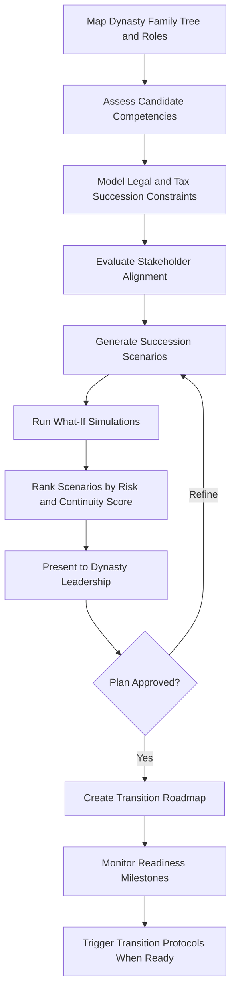

# Succession Intelligence Platform

Frankmax

NAICS 525920

> **Dynasties & Royal Houses** — Governance Module

## Objective & Purpose

Generational wealth transfer fails 70% of the time by the second generation and 90% by the third. The Succession Intelligence Platform uses AI to model succession scenarios across multiple dimensions --- leadership capability, family dynamics, legal constraints, tax implications, and stakeholder readiness --- producing evidence-based succession plans that account for the full complexity of dynastic transitions rather than relying on tradition or assumption.

Succession in dynastic contexts is fundamentally different from corporate succession planning. The decision space includes primogeniture customs, religious law, political considerations, inter-family treaties, and emotional dynamics that corporate models ignore entirely. This platform builds multi-variable succession models that weight traditional expectations alongside competency assessments, stakeholder alignment scores, and jurisdiction-specific legal requirements (Sharia inheritance rules, European noble succession law, trust deed provisions).

The platform also runs "what-if" simulations: what happens if the designated successor declines, becomes incapacitated, or is deemed unsuitable by key stakeholders? What are the cascading effects on asset structures, political relationships, and philanthropic commitments? By modeling these scenarios in advance, dynasty leadership can prepare contingency plans that prevent the paralysis and internal conflict that destroy multi-generational wealth.

## Business Context

| Attribute | Value |
|---|---|
| **Business Process** | Succession planning |
| **Business Function** | Governance |
| **Category** | Strategic |
| **Target Audience** | 5. Dynasties & Royal Houses |
| **Bundle** | Dynasty/Family Office Continuity Pack ($12,000/mo) |
| **Monthly Cost of Inaction** | $5M+ in wealth destruction from unprepared generational transitions |

## BPMN Workflow

## Features

1. **Dynasty Family Tree Mapper** --- Builds a living organizational chart of the dynasty including roles, relationships, competencies, and succession eligibility status across all branches.
2. **Competency Assessment Framework** --- Evaluates potential successors against customizable criteria: leadership capability, domain knowledge, stakeholder relationships, and cultural fluency.
3. **Legal Constraint Modeler** --- Maps succession rules across all relevant jurisdictions (inheritance law, trust provisions, corporate governance requirements, religious law) and identifies conflicts.
4. **Stakeholder Alignment Scoring** --- Quantifies support levels from key stakeholders (family elders, board members, political allies, institutional partners) for each succession scenario.
5. **What-If Simulation Engine** --- Models cascading effects of succession decisions on asset structures, political relationships, philanthropic commitments, and family dynamics.
6. **Transition Roadmap Generator** --- Produces detailed timelines for succession transitions, including role handovers, authority transfers, communication plans, and contingency triggers.
7. **Readiness Monitoring Dashboard** --- Tracks successor development milestones, stakeholder engagement progress, and legal preparation status against the transition timeline.

## Workflow & Automation

**Step 1: Dynasty Mapping** --- Input family structure, roles, asset ownership, legal entities, and relationship dynamics into the platform. AI identifies potential successors and succession paths.

**Step 2: Competency Assessment** --- Potential successors are evaluated against governance, financial, diplomatic, and cultural competency frameworks customized to the dynasty's specific needs.

**Step 3: Constraint Analysis** --- Legal and tax implications of each succession scenario are modeled across all relevant jurisdictions, identifying blockers and optimization opportunities.

**Step 4: Scenario Modeling** --- AI generates ranked succession scenarios weighing competency scores, stakeholder alignment, legal feasibility, and tax efficiency.

**Step 5: Simulation and Stress Testing** --- Each scenario is stress-tested against adverse events (sudden incapacitation, family disputes, regulatory changes, political shifts) to assess resilience.

**Step 6: Roadmap Execution** --- The approved plan becomes an active roadmap with milestone tracking, automated reminders, and progress reporting to dynasty leadership.

## Input/Output Specifications

| Direction | Data | Format | Description |
|---|---|---|---|
| Input | Family structure data | Secure web form, JSON | Family tree, roles, relationships, competencies |
| Input | Legal and trust documents | PDF, DOCX | Trust deeds, wills, corporate governance documents |
| Input | Jurisdictional legal frameworks | Database | Inheritance, corporate, and religious law provisions |
| Output | Succession scenario reports | PDF, dashboard | Ranked scenarios with risk and continuity scores |
| Output | Transition roadmaps | PDF, Gantt chart | Detailed timelines with milestones and contingencies |
| Output | Readiness dashboards | Web, API | Real-time successor development tracking |

## Integration Points

| System | Integration Type | Data Flow |
|---|---|---|
| Dynasty Knowledge Vault | API | Bidirectional family history and institutional memory |
| Multi-Jurisdiction Asset Shield | API | Inbound asset structure and legal entity data |
| Private Treaty Analyzer | API | Inbound inter-family agreement constraints |
| Legal Document Management | API | Inbound trust deeds and governance documents |
| Reputation Risk Sentinel | API | Inbound reputational risk factors for candidates |

## Pricing & Revenue Model

| Component | Price |
|---|---|
| Dynasty/Family Office Continuity Pack | $12,000/mo |
| Succession Simulation Engine | Included in pack |
| Multi-Jurisdiction Legal Modeling | Included |
| What-If Scenario Analysis | Included |
| ORF Governance Layer | Included |

Revenue is anchored by the $12,000/mo Continuity Pack, which bundles succession planning with other dynasty tools. The high-touch nature of dynastic succession drives premium consulting attach rates of 40-60%, with individual engagement values of $100K-$500K for comprehensive succession planning projects. Once embedded in a dynasty's governance framework, the platform becomes the institutional memory for succession planning, creating multi-decade retention.

## NAICS/SIC Mapping

| NAICS | SIC | Industry | Relevance |
|---|---|---|---|
| 525920 | 6726 | Trusts, Estates, and Agency Accounts | Primary: dynastic wealth and succession management |
| 551112 | 6712 | Offices of Other Holding Companies | Secondary: family holding company governance |
| 541611 | 7371 | Administrative Management Consulting | Tertiary: succession advisory services |
| 541199 | 7389 | All Other Legal Services | Tertiary: succession-related legal analysis |
