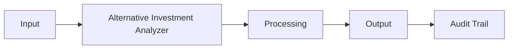

# Alternative Investment Analyzer

Frankmax

Audience 6

> **Family Offices** — Investment & Portfolio Intelligence

## Objective & Purpose

PE/VC/RE due diligence is manual and slow; AI analyzes deal flow, comps, and risks

## Business Context

| Attribute | Value |
|---|---|
| **Business Process** | Due diligence on alternatives |
| **Business Function** | Investment Analysis |
| **Category** | Finance |
| **Target Audience** | 6. Family Offices |

## BPMN Workflow

<!-- TODO: Expand BPMN with actual process steps -->

## Features

<!-- TODO: Define 5-8 key features -->

1. Feature 1
2. Feature 2
3. Feature 3

## Workflow & Automation

<!-- TODO: Step-by-step automation description -->

## Input/Output Specifications

| Direction | Data | Format |
|---|---|---|
| Input | <!-- TODO --> | <!-- TODO --> |
| Output | <!-- TODO --> | <!-- TODO --> |

## Integration Points

<!-- TODO: Connections to other systems -->

## Pricing & Revenue Model

<!-- TODO: From economic model -->

## NAICS/SIC Mapping

<!-- TODO: Industry codes -->
