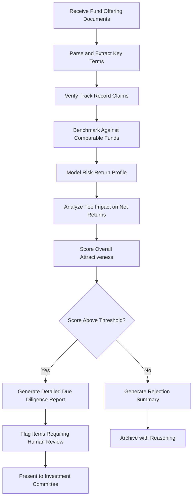

# Alternative Investment Analyzer

Frankmax

NAICS 523920

> **Family Offices** — Investment Analysis Module

## Objective & Purpose

Family offices allocate 30-60% of portfolios to alternative investments --- private equity, venture capital, real estate, hedge funds, and private credit --- yet due diligence on these illiquid, opaque asset classes remains overwhelmingly manual. The Alternative Investment Analyzer uses AI to process fund documents, model risk-return profiles, benchmark manager performance, and identify red flags across the entire alternatives pipeline, compressing due diligence timelines from weeks to days.

The information asymmetry in alternative investments is acute. Fund managers control the narrative through polished pitch decks while family offices must independently verify track records, attribution claims, and risk exposures. A single family office analyst reviewing 200+ fund opportunities per year cannot perform the depth of analysis required to avoid the 30-40% of PE/VC funds that fail to return capital. This tool automates the structural work --- document parsing, comparable analysis, fee modeling, and track record verification --- freeing analysts to focus on judgment calls that genuinely require human insight.

The platform also maintains a proprietary database of fund performance, fee structures, and terms across thousands of alternative investment vehicles. This enables benchmarking that individual family offices cannot achieve alone: comparing a new PE fund's proposed terms against the actual terms of 500 similar funds, or benchmarking a hedge fund's reported alpha against systematically constructed factor exposures.

## Business Context

| Attribute | Value |
|---|---|
| **Business Process** | Due diligence on alternatives |
| **Business Function** | Investment Analysis |
| **Category** | Finance |
| **Target Audience** | 6. Family Offices |
| **Bundle** | Dynasty/Family Office Continuity Pack ($12,000/mo) |
| **Monthly Cost of Inaction** | $200,000+ annually in sub-par fund selections and excess fees |

## BPMN Workflow

## Features

1. **Automated Document Processing** --- Parses PPMs, LPAs, pitch decks, and data room contents, extracting key terms (fees, hurdle rates, clawback provisions, lock-up periods) into standardized comparison formats.
2. **Track Record Verification** --- Cross-references reported fund performance against public benchmarks, portfolio company outcomes, and independent databases to identify inflated or misleading return claims.
3. **Fee Waterfall Modeler** --- Models the complete fee structure (management fees, carried interest, organizational expenses, transaction fees) and calculates net-of-fee returns under multiple performance scenarios.
4. **Comparable Fund Benchmarking** --- Compares fund terms, strategy, team experience, and performance against a proprietary database of thousands of alternative investment vehicles.
5. **Red Flag Detection** --- Identifies governance weaknesses, key-person risk, style drift, concentration risk, and other structural concerns that indicate elevated probability of underperformance.
6. **Portfolio Fit Analysis** --- Evaluates how a new investment fits within the existing alternatives portfolio, assessing diversification impact, liquidity effects, and correlation with current holdings.
7. **Manager Relationship Tracker** --- Maintains a database of all GP relationships, tracking fund series performance, communication quality, and terms evolution across successive vintages.

## Workflow & Automation

**Step 1: Document Ingestion** --- Fund offering documents, pitch decks, and data room access credentials are uploaded. AI extracts and structures all key information automatically.

**Step 2: Terms Extraction** --- Key terms (fees, economics, governance, liquidity) are extracted and normalized for comparison against the platform's benchmarking database.

**Step 3: Performance Verification** --- Reported track records are verified against independent sources, with discrepancies flagged and quantified.

**Step 4: Benchmarking** --- The fund is scored against comparable vehicles on terms, performance, team quality, and strategy coherence.

**Step 5: Risk Analysis** --- Red flag detection algorithms assess structural, governance, and strategy risks, producing a weighted risk score.

**Step 6: Portfolio Integration Modeling** --- The potential investment is modeled within the existing portfolio to assess diversification, liquidity, and correlation impacts.

**Step 7: Committee Package** --- A comprehensive due diligence report is generated, highlighting key findings, risk factors, and items requiring human judgment.

## Input/Output Specifications

| Direction | Data | Format | Description |
|---|---|---|---|
| Input | Fund offering documents | PDF, DOCX | PPMs, LPAs, pitch decks, side letters |
| Input | Data room contents | Various | Financial models, portfolio company data, references |
| Input | Market benchmark data | API | Public market indices, PE/VC benchmark returns |
| Input | Existing portfolio data | CSV, API | Current alternative investment holdings |
| Output | Due diligence reports | PDF, dashboard | Comprehensive fund analysis with scoring |
| Output | Terms comparison matrices | XLSX, dashboard | Side-by-side fund terms benchmarking |
| Output | Portfolio impact analysis | PDF, charts | Diversification and liquidity impact modeling |

## Integration Points

| System | Integration Type | Data Flow |
|---|---|---|
| Consolidated Reporting Platform | API | Outbound fund data for portfolio reporting |
| Co-Investment Network Engine | API | Bidirectional fund and deal intelligence |
| ESG Impact Scoring Engine | API | Inbound ESG scores for fund evaluation |
| Portfolio Management Systems | API | Bidirectional holdings and performance data |
| Fund Administrator Portals | API | Inbound NAV and performance statements |

## Pricing & Revenue Model

| Component | Price |
|---|---|
| Dynasty/Family Office Continuity Pack | $12,000/mo |
| Alternative Investment Analyzer Core | Included in pack |
| Fund Benchmarking Database | Included |
| Unlimited Fund Analyses | Included |
| Premium Manager Intelligence Reports | Per-report pricing |

Revenue is subscription-based through the Continuity Pack. The benchmarking database creates a network effect: each family office's fund data (anonymized) enriches the database for all users. Premium intelligence reports on specific managers drive attach revenue of $5,000-$15,000 per report. A family office evaluating 100+ opportunities annually that avoids even one poor fund selection worth $5M justifies the subscription cost instantly.

## NAICS/SIC Mapping

| NAICS | SIC | Industry | Relevance |
|---|---|---|---|
| 523920 | 6282 | Portfolio Management and Investment Advice | Primary: alternative investment due diligence |
| 525920 | 6726 | Trusts, Estates, and Agency Accounts | Secondary: family office investment management |
| 523910 | 6159 | Miscellaneous Business Credit Institutions | Tertiary: private credit analysis |
| 541611 | 7371 | Administrative Management Consulting | Tertiary: investment process advisory |
