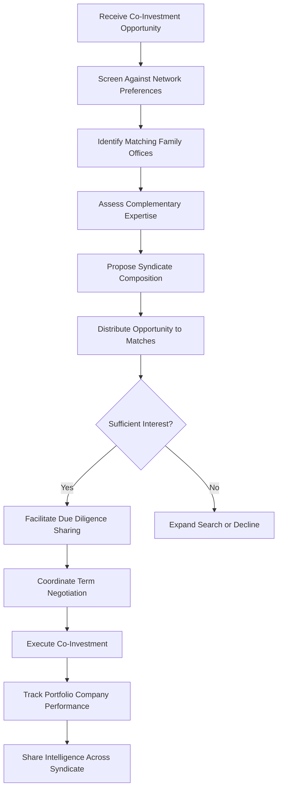

# Co-Investment Network Engine

Frankmax

NAICS 523920

> **Family Offices** — Deal Sourcing Module

## Objective & Purpose

Family offices increasingly seek direct and co-investment opportunities to avoid the double layer of fees inherent in fund-of-fund structures, yet deal flow is constrained by the limited networks of individual offices. The Co-Investment Network Engine uses AI to match co-investment opportunities across a network of participating family offices, analyzing investment preferences, risk tolerances, check sizes, and sector expertise to create deal-specific syndicates that would never form through traditional relationship-based sourcing.

The economic argument for co-investment is compelling: eliminating one layer of fees (typically 1.5-2% management fee plus 15-20% carried interest) on a $10M commitment saves $150K-$200K annually. But the barrier is access. The best co-investment opportunities are offered to LPs who can move quickly, conduct their own due diligence, and bring strategic value beyond capital. A single family office with $500M AUM lacks the deal flow, analytical capacity, and negotiating leverage of a $5B institution.

This platform solves the collective action problem. By aggregating the deal flow, expertise, and capital of multiple family offices, it creates an investment network with institutional-grade access and capabilities while preserving the independence and flexibility that family offices value. AI handles the matching, screening, and coordination that would otherwise require a dedicated deal team at each participating office.

## Business Context

| Attribute | Value |
|---|---|
| **Business Process** | Co-investment sourcing |
| **Business Function** | Deal Sourcing |
| **Category** | Finance |
| **Target Audience** | 6. Family Offices |
| **Bundle** | Dynasty/Family Office Continuity Pack ($12,000/mo) |
| **Monthly Cost of Inaction** | $300,000+ annually in missed co-investment opportunities and excess fund fees |

## BPMN Workflow

## Features

1. **Preference Matching Engine** --- Maintains detailed investment preference profiles for each participating family office (sectors, stages, check sizes, geographies, exclusions) and matches inbound opportunities automatically.
2. **Expertise Complementarity Analysis** --- Identifies which family offices bring domain expertise (industry knowledge, operational experience, board capabilities) relevant to each specific opportunity.
3. **Deal Flow Aggregation** --- Ingests co-investment opportunities from GPs, direct sourcing channels, and participating family offices, creating a unified pipeline with standardized information.
4. **Syndicate Formation** --- Proposes optimal syndicate compositions balancing capital requirements, expertise needs, and interpersonal compatibility between family office principals.
5. **Shared Due Diligence Platform** --- Enables syndicate members to share due diligence findings, reducing duplicated effort and improving analytical depth through diverse perspectives.
6. **Term Sheet Negotiation Support** --- Benchmarks proposed terms against comparable co-investments and coordinates negotiation positions across syndicate members for stronger collective leverage.
7. **Portfolio Monitoring Network** --- Tracks co-invested portfolio company performance, sharing operational updates and strategic intelligence across syndicate members.

## Workflow & Automation

**Step 1: Profile Setup** --- Each family office configures investment preferences: target sectors, stages, geographies, check size range, return expectations, and exclusion criteria.

**Step 2: Opportunity Intake** --- Co-investment opportunities enter the system from GPs, direct sourcing, or participating family offices, with standardized information extraction.

**Step 3: Matching** --- AI identifies family offices whose preferences match the opportunity, ranking by fit score and complementary expertise.

**Step 4: Syndicate Proposal** --- The system proposes a syndicate composition, specifying each member's potential role (lead investor, follow-on, operational advisor, board seat candidate).

**Step 5: Due Diligence Collaboration** --- Matched offices conduct due diligence with shared workspaces, avoiding duplication and pooling analytical resources.

**Step 6: Execution** --- Coordinated term negotiation and legal documentation streamlined through standardized templates and shared counsel.

**Step 7: Portfolio Management** --- Ongoing monitoring of co-invested companies with shared dashboards and periodic syndicate calls.

## Input/Output Specifications

| Direction | Data | Format | Description |
|---|---|---|---|
| Input | Family office investment profiles | Secure web form, JSON | Preferences, constraints, and expertise areas |
| Input | Co-investment opportunities | PDF, structured data | Deal memos, financial models, management presentations |
| Input | Portfolio company updates | API, structured forms | Revenue, milestones, and operational metrics |
| Output | Matched opportunity alerts | Email, secure dashboard | Filtered deal flow matching office preferences |
| Output | Syndicate proposals | PDF, dashboard | Recommended co-investor groups with rationale |
| Output | Portfolio monitoring dashboards | Web, API | Aggregated co-investment portfolio performance |

## Integration Points

| System | Integration Type | Data Flow |
|---|---|---|
| Alternative Investment Analyzer | API | Bidirectional fund and deal intelligence sharing |
| Consolidated Reporting Platform | API | Outbound co-investment data for portfolio reporting |
| ESG Impact Scoring Engine | API | Inbound ESG assessment for deal screening |
| CRM and Contact Management | API | Inbound relationship data for syndicate formation |
| Legal Document Management | API | Bidirectional term sheets and legal documentation |

## Pricing & Revenue Model

| Component | Price |
|---|---|
| Dynasty/Family Office Continuity Pack | $12,000/mo |
| Co-Investment Network Engine Core | Included in pack |
| Deal Flow Access | Included |
| Shared Due Diligence Platform | Included |
| Syndicate Formation Services | Per-deal coordination fee (0.25-0.5% of commitment) |

Revenue combines the subscription base from the Continuity Pack with per-deal coordination fees. A family office participating in 5-10 co-investments annually at $5M-$20M per deal generates $12,500-$100,000 in coordination fees. The network effect is the moat: as more family offices join, deal flow quality and matching accuracy improve for all participants, making the platform increasingly valuable and difficult to leave.

## NAICS/SIC Mapping

| NAICS | SIC | Industry | Relevance |
|---|---|---|---|
| 523920 | 6282 | Portfolio Management and Investment Advice | Primary: co-investment deal sourcing and structuring |
| 525920 | 6726 | Trusts, Estates, and Agency Accounts | Secondary: family office investment coordination |
| 523110 | 6211 | Investment Banking and Securities Dealing | Tertiary: deal syndication services |
| 541611 | 7371 | Administrative Management Consulting | Tertiary: investment process advisory |
