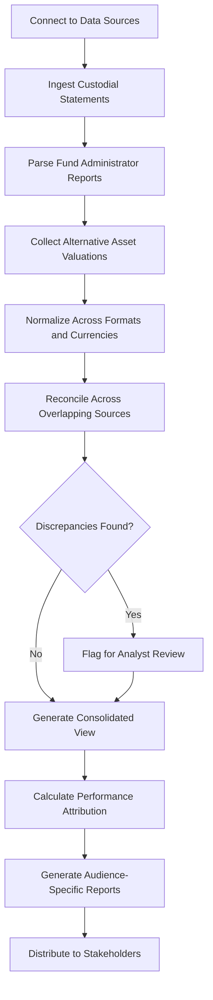

# Consolidated Reporting Platform

Frankmax

NAICS 523920

> **Family Offices** — Financial Reporting Module

## Objective & Purpose

A typical family office manages wealth across 20-80 separate legal entities --- holding companies, trusts, LPs, LLCs, foundations, and direct accounts --- each with its own custodian, administrator, and reporting format. Producing a single consolidated view of the family's total wealth, performance, and exposure requires manual data gathering, normalization, and reconciliation that consumes hundreds of analyst hours per quarter and still produces reports that are weeks late. The Consolidated Reporting Platform uses AI to automate multi-entity aggregation, normalization, and reporting.

The challenge is not just volume but heterogeneity. A family office might receive custodial statements from Goldman Sachs, JP Morgan, and UBS in different formats; fund NAV reports from 30 PE/VC managers with different valuation methodologies; real estate appraisals from multiple firms using different comparables; and art and collectibles valuations that arrive annually if at all. Producing a single number for "total family wealth" requires reconciling all of these sources, handling currency conversions, adjusting for pending transactions, and making judgment calls about illiquid asset valuations.

This platform automates the mechanical work: ingesting data from custodians, administrators, and managers via API and statement parsing; normalizing across formats, currencies, and valuation methodologies; performing automated reconciliation; and generating customizable reports for different audiences (principals, investment committee, tax advisors, family council).

## Business Context

| Attribute | Value |
|---|---|
| **Business Process** | Multi-entity reporting |
| **Business Function** | Financial Reporting |
| **Category** | Finance |
| **Target Audience** | 6. Family Offices |
| **Bundle** | Dynasty/Family Office Continuity Pack ($12,000/mo) |
| **Monthly Cost of Inaction** | $150,000+ annually in manual reporting labor and delayed decision-making |

## BPMN Workflow

## Features

1. **Universal Data Connector** --- Integrates with 200+ custodians, fund administrators, banks, and alternative asset managers via API, SFTP, and automated statement parsing.
2. **Multi-Currency Consolidation** --- Handles holdings denominated in 40+ currencies with real-time exchange rate feeds, configurable reporting currency, and currency hedging analysis.
3. **Valuation Normalization** --- Reconciles different valuation methodologies for illiquid assets (PE NAVs, real estate appraisals, collectibles estimates) into a consistent framework with source transparency.
4. **Automated Reconciliation** --- Cross-references data from overlapping sources (custodian vs. manager, bank vs. accounting system), flagging discrepancies for analyst resolution.
5. **Performance Attribution** --- Breaks portfolio performance into asset class, geography, manager, and strategy contributions, enabling evidence-based allocation decisions.
6. **Custom Report Builder** --- Generates reports tailored to different audiences: detailed investment committee packages, summary principal dashboards, tax advisor data exports, and family council overviews.
7. **Historical Trend Analysis** --- Maintains historical portfolio data enabling long-term performance analysis, allocation drift tracking, and benchmark comparison across multi-year horizons.
8. **Real-Time Portfolio Dashboard** --- Provides an always-current consolidated view of total family wealth with drill-down capability from aggregate to individual holding level.

## Workflow & Automation

**Step 1: Source Connection** --- API connections and automated statement parsing are configured for all custodians, fund administrators, banks, and alternative asset managers.

**Step 2: Data Ingestion** --- Scheduled and event-driven data pulls gather the latest statements, NAV reports, and transaction records from all connected sources.

**Step 3: Normalization** --- Incoming data is converted to standardized formats, with currency conversion, unit normalization, and valuation methodology alignment.

**Step 4: Reconciliation** --- Automated cross-referencing identifies discrepancies between overlapping data sources, routing unresolved items for analyst review.

**Step 5: Consolidation** --- Validated data is aggregated into a unified portfolio view with configurable hierarchies (by entity, asset class, geography, manager, or strategy).

**Step 6: Report Generation** --- Scheduled and on-demand reports are generated for each stakeholder audience, with automated distribution via secure channels.

## Input/Output Specifications

| Direction | Data | Format | Description |
|---|---|---|---|
| Input | Custodial statements | API, PDF, CSV | Holdings and transaction data from custodians |
| Input | Fund NAV reports | API, PDF, XLSX | Net asset values from fund administrators |
| Input | Bank statements | API, MT940/MT942 | Cash balances and transaction records |
| Input | Alternative asset valuations | PDF, manual entry | PE, RE, collectibles, and other illiquid valuations |
| Output | Consolidated dashboards | Web, API | Real-time total wealth and allocation views |
| Output | Investment committee reports | PDF, PPTX | Detailed performance and allocation analysis |
| Output | Tax data exports | CSV, XLSX | Formatted data for tax preparation |

## Integration Points

| System | Integration Type | Data Flow |
|---|---|---|
| Alternative Investment Analyzer | API | Inbound fund performance and terms data |
| Tax-Efficient Structuring Advisor | API | Outbound financial data for tax analysis |
| ESG Impact Scoring Engine | API | Inbound ESG scores for integrated reporting |
| Liquidity Cash Flow Predictor | API | Bidirectional portfolio and cash flow data |
| Family Governance Facilitator | API | Outbound summary reports for family meetings |

## Pricing & Revenue Model

| Component | Price |
|---|---|
| Dynasty/Family Office Continuity Pack | $12,000/mo |
| Consolidated Reporting Platform Core | Included in pack |
| Universal Data Connectors | Included (up to 50 sources) |
| Extended Source Connections | $200/mo per additional source |
| Custom Report Templates | Included |

Revenue is subscription-based through the Continuity Pack. Extended data source connections drive incremental revenue for complex family offices with over 50 data sources. The platform becomes the operational backbone of the family office --- the single source of truth for wealth data --- creating structural dependency that drives retention rates above 95%.

## NAICS/SIC Mapping

| NAICS | SIC | Industry | Relevance |
|---|---|---|---|
| 523920 | 6282 | Portfolio Management and Investment Advice | Primary: investment reporting and performance analytics |
| 525920 | 6726 | Trusts, Estates, and Agency Accounts | Secondary: multi-entity trust and estate reporting |
| 541211 | 8721 | Offices of Certified Public Accountants | Tertiary: financial reporting and reconciliation |
| 519190 | 7375 | All Other Information Services | Tertiary: data aggregation services |
