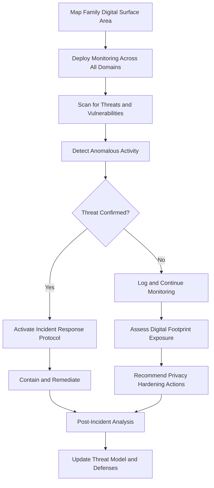

# Cybersecurity & Privacy Shield

Frankmax

NAICS 525920

> **Family Offices** — Security Module

## Objective & Purpose

High-net-worth families are prime targets for cyberattacks, social engineering, and privacy exploitation. Family offices manage sensitive financial data across dozens of systems while family members maintain expansive digital footprints across personal devices, social media, and cloud services. A single compromised email account can expose the family's complete financial position, travel plans, and personal communications. The Cybersecurity and Privacy Shield uses AI to monitor threats across the entire family's digital surface area, detect intrusion attempts, and manage privacy exposure before it can be exploited.

The threat landscape for wealthy families is distinct from corporate cybersecurity. Attackers target family members personally --- not just office systems. A child's social media post revealing a vacation location becomes a physical security risk. A family member's personal email, compromised through a phishing attack, provides access to financial statements forwarded from the family office. A vendor's data breach exposes the family's home addresses, vehicle registrations, and travel patterns. The attack surface extends far beyond the family office's IT perimeter.

This platform provides comprehensive coverage across three domains: family office IT security (network monitoring, endpoint protection, email security), family member personal security (digital footprint monitoring, device security, social media risk assessment), and vendor security (third-party risk assessment for all service providers with access to family data). The integration of these three domains into a single platform eliminates the gaps that attackers exploit when security is managed in silos.

## Business Context

| Attribute | Value |
|---|---|
| **Business Process** | Personal security management |
| **Business Function** | Security |
| **Category** | IT/Security |
| **Target Audience** | 6. Family Offices |
| **Bundle** | Dynasty/Family Office Continuity Pack ($12,000/mo) |
| **Monthly Cost of Inaction** | $2M+ per successful cyberattack in direct losses and remediation |

## BPMN Workflow

## Features

1. **Digital Surface Area Mapping** --- Discovers and catalogs the complete digital footprint of the family: domains, email accounts, cloud services, social media profiles, connected devices, and vendor data access points.
2. **Unified Threat Monitoring** --- Monitors family office networks, personal devices, email accounts, and cloud services through a single security operations center with correlated threat detection.
3. **Social Media Risk Assessment** --- Scans family members' social media activity for inadvertent security disclosures: location data, travel plans, asset identification, and relationship information.
4. **Vendor Security Scoring** --- Assesses the cybersecurity posture of every service provider with access to family data, scoring their risk level and recommending contractual security requirements.
5. **Phishing and Social Engineering Defense** --- AI-powered email filtering and training programs designed for the specific phishing vectors that target high-net-worth individuals (wire transfer fraud, impersonation, investment scams).
6. **Privacy Exposure Monitor** --- Continuously scans data broker databases, public records, and dark web marketplaces for exposed family data (addresses, phone numbers, financial records, travel patterns).
7. **Incident Response Automation** --- Pre-configured response playbooks for common attack types (ransomware, business email compromise, account takeover) with automated containment actions and escalation procedures.
8. **Device Security Management** --- Monitors and manages security configurations across all family member devices (phones, laptops, tablets, smart home systems) with remote wipe capability.

## Workflow & Automation

**Step 1: Digital Surface Discovery** --- Automated scanning identifies all digital assets associated with the family: domains, accounts, devices, cloud services, and vendor connections.

**Step 2: Security Baseline** --- Each discovered asset is assessed for current security posture, identifying vulnerabilities, misconfigurations, and exposed data.

**Step 3: Monitoring Deployment** --- Continuous monitoring is established across all domains: network traffic analysis, endpoint detection, email filtering, and social media scanning.

**Step 4: Threat Detection** --- AI-powered correlation engine analyzes signals across all monitored domains, identifying coordinated attacks that span multiple vectors.

**Step 5: Incident Response** --- Confirmed threats trigger automated containment (account lockout, network isolation, device quarantine) and human escalation based on severity.

**Step 6: Privacy Hardening** --- Periodic privacy assessments identify new data exposures and recommend removal actions (data broker opt-outs, public record suppression, social media privacy adjustments).

**Step 7: Continuous Improvement** --- Post-incident analysis and threat intelligence updates feed into improved detection rules, response playbooks, and security awareness training.

## Input/Output Specifications

| Direction | Data | Format | Description |
|---|---|---|---|
| Input | Family digital asset inventory | JSON, manual discovery | Domains, accounts, devices, and services |
| Input | Network traffic and logs | Syslog, API | Family office network and endpoint telemetry |
| Input | Email and communication data | API | Inbound message analysis for phishing detection |
| Input | Threat intelligence feeds | API | Known threats, IOCs, and vulnerability data |
| Output | Security dashboard | Web, API | Real-time threat and posture overview |
| Output | Incident alerts | SMS, email, secure messaging | Immediate threat notifications |
| Output | Privacy exposure reports | PDF, dashboard | Identified data exposures with remediation steps |

## Integration Points

| System | Integration Type | Data Flow |
|---|---|---|
| Reputation Risk Sentinel | API | Bidirectional threat and media intelligence correlation |
| Family Office IT Infrastructure | API, agent | Bidirectional security monitoring and response |
| Email Security Gateways | API | Bidirectional phishing detection and filtering |
| Vendor Management Systems | API | Inbound vendor security assessment data |
| Threat Intelligence Platforms | API | Inbound IOCs, TTPs, and vulnerability data |

## Pricing & Revenue Model

| Component | Price |
|---|---|
| Dynasty/Family Office Continuity Pack | $12,000/mo |
| Cybersecurity Shield Core | Included in pack |
| Personal Device Monitoring | Included (up to 25 devices) |
| Extended Device Coverage | $100/mo per additional device |
| 24/7 Security Operations Center | $8,000/mo add-on |

Revenue is subscription-based through the Continuity Pack. The 24/7 SOC add-on provides premium around-the-clock human oversight, adding $96K/year per client. Extended device coverage for larger families drives incremental revenue. Incident response retainer services for guaranteed response SLAs add $50K-$150K annually. The security domain creates urgent, fear-driven retention: no family will downgrade cybersecurity once a near-miss demonstrates the threat.

## NAICS/SIC Mapping

| NAICS | SIC | Industry | Relevance |
|---|---|---|---|
| 525920 | 6726 | Trusts, Estates, and Agency Accounts | Primary: family office security management |
| 523920 | 6282 | Portfolio Management and Investment Advice | Secondary: financial data protection |
| 541512 | 7371 | Computer Systems Design Services | Tertiary: cybersecurity architecture and implementation |
| 561621 | 7382 | Security Systems Services | Tertiary: integrated security monitoring |
