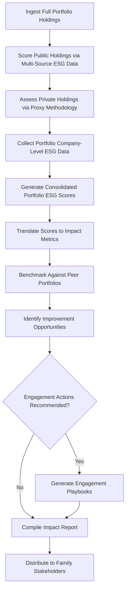

# ESG & Impact Scoring Engine

Frankmax

NAICS 523920

> **Family Offices** — ESG Compliance Module

## Objective & Purpose

Family offices face mounting pressure from next-generation family members, regulators, and the public to demonstrate that their investments align with environmental, social, and governance principles. Yet ESG reporting remains fragmented: different data providers use different methodologies, scores are inconsistent across platforms, and the gap between ESG marketing and ESG reality is wide. The ESG and Impact Scoring Engine uses AI to cut through the noise, producing rigorous, methodology-transparent scores across the entire portfolio.

The problem is particularly acute for alternative investments, which constitute the bulk of most family office portfolios but are largely invisible to standard ESG rating agencies. A family office may hold impeccable public equity ESG scores while its private equity, real estate, and venture capital allocations --- representing 40-60% of the portfolio --- are completely unscored. This platform extends ESG analysis into illiquid holdings using proxy methodologies, supply chain analysis, and portfolio company-level data collection.

Beyond scoring, the platform enables impact measurement: translating ESG metrics into tangible outcomes (tonnes of CO2 avoided, jobs created, water conserved, governance improvements implemented). For family offices that articulate impact as a core investment thesis, this measurement capability transforms ESG from a compliance exercise into a strategic differentiator, demonstrating to next-generation family members and external stakeholders that the family's wealth generates positive real-world outcomes.

## Business Context

| Attribute | Value |
|---|---|
| **Business Process** | Impact measurement |
| **Business Function** | ESG Compliance |
| **Category** | Analytics |
| **Target Audience** | 6. Family Offices |
| **Bundle** | Dynasty/Family Office Continuity Pack ($12,000/mo) |
| **Monthly Cost of Inaction** | $150,000+ in compliance gaps and missed impact investment opportunities |

## BPMN Workflow

## Features

1. **Multi-Source ESG Aggregation** --- Ingests scores from MSCI, Sustainalytics, ISS, CDP, and other providers, reconciling discrepancies with transparent methodology weighting to produce consensus scores.
2. **Private Asset ESG Scoring** --- Extends ESG analysis to private equity, venture capital, real estate, and private credit holdings using proxy methodologies, sector benchmarks, and portfolio company data.
3. **Impact Quantification Engine** --- Translates ESG scores into measurable real-world outcomes: carbon emissions avoided, water conserved, jobs created, diversity improvements, governance upgrades implemented.
4. **Regulatory Compliance Mapper** --- Tracks evolving ESG disclosure requirements (SFDR, EU Taxonomy, SEC Climate Rules, TCFD) and maps portfolio exposure to each regulatory framework.
5. **Peer Benchmarking** --- Compares the family office's ESG profile against anonymized peer portfolios, identifying areas of relative strength and weakness.
6. **Engagement Recommendation Engine** --- For portfolio companies with improvable ESG scores, generates specific engagement recommendations with expected score improvement and implementation guidance.
7. **Next-Gen Reporting Module** --- Produces impact reports formatted for family stakeholder communication, translating complex ESG data into accessible narratives that engage next-generation family members.

## Workflow & Automation

**Step 1: Portfolio Loading** --- Complete holdings across all asset classes are loaded, including public equities, fixed income, private equity, venture capital, real estate, and hedge funds.

**Step 2: Public Market Scoring** --- Public holdings are scored using aggregated data from multiple ESG rating providers, with methodology-transparent consensus scoring.

**Step 3: Private Market Assessment** --- Private holdings are assessed using sector proxy scores, portfolio company questionnaires, and available operational data.

**Step 4: Portfolio Consolidation** --- Individual holding scores are weighted by portfolio allocation to produce consolidated portfolio-level ESG and impact scores.

**Step 5: Impact Translation** --- Aggregate ESG scores are converted into tangible impact metrics using evidence-based conversion factors.

**Step 6: Reporting and Communication** --- Impact reports are generated for different audiences: family members, regulators, investment committee, and public disclosure as applicable.

## Input/Output Specifications

| Direction | Data | Format | Description |
|---|---|---|---|
| Input | Portfolio holdings | CSV, API | Complete positions across all asset classes |
| Input | ESG rating data | API | Scores from MSCI, Sustainalytics, ISS, CDP |
| Input | Portfolio company ESG responses | Structured questionnaires | Direct ESG data from private holdings |
| Input | Regulatory framework requirements | Database | SFDR, EU Taxonomy, SEC, TCFD specifications |
| Output | ESG score dashboards | Web, API | Portfolio and holding-level ESG scores |
| Output | Impact reports | PDF, interactive web | Quantified real-world impact metrics |
| Output | Regulatory compliance maps | Dashboard, PDF | Alignment with applicable disclosure frameworks |

## Integration Points

| System | Integration Type | Data Flow |
|---|---|---|
| Consolidated Reporting Platform | API | Outbound ESG data for integrated reporting |
| Alternative Investment Analyzer | API | Bidirectional ESG factors in due diligence |
| Co-Investment Network Engine | API | Outbound ESG scores for deal screening |
| ESG Data Providers (MSCI, Sustainalytics) | API | Inbound rating data |
| Family Governance Facilitator | API | Outbound impact reports for family meetings |

## Pricing & Revenue Model

| Component | Price |
|---|---|
| Dynasty/Family Office Continuity Pack | $12,000/mo |
| ESG Scoring Engine Core | Included in pack |
| Private Asset Proxy Scoring | Included |
| Impact Quantification Module | Included |
| Custom Regulatory Compliance Reports | Per-report pricing |

Revenue is subscription-based through the Continuity Pack. Custom regulatory compliance reports for specific jurisdictions drive attach revenue of $5,000-$20,000 per report. As ESG disclosure requirements expand globally, the platform becomes a compliance necessity rather than a nice-to-have, converting voluntary adopters into mandatory subscribers and creating a regulatory-driven retention mechanism.

## NAICS/SIC Mapping

| NAICS | SIC | Industry | Relevance |
|---|---|---|---|
| 523920 | 6282 | Portfolio Management and Investment Advice | Primary: ESG-integrated investment management |
| 525920 | 6726 | Trusts, Estates, and Agency Accounts | Secondary: family office impact measurement |
| 541620 | 8711 | Environmental Consulting Services | Tertiary: environmental impact assessment |
| 541611 | 7371 | Administrative Management Consulting | Tertiary: ESG strategy advisory |
