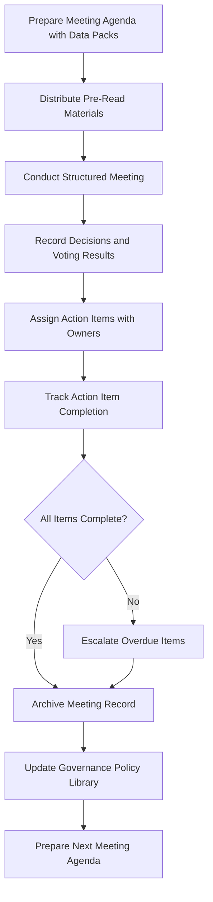

# Family Governance Facilitator

Frankmax

NAICS 525920

> **Family Offices** — Governance Module

## Objective & Purpose

Family disputes are the single largest destroyer of multi-generational wealth --- more destructive than market crashes, bad investments, or tax inefficiency. The Family Governance Facilitator uses AI to structure family decision-making processes, manage meeting agendas and follow-through, document governance policies, and provide the neutral analytical framework that prevents emotional dynamics from overriding rational wealth management.

The challenge is that family offices operate at the intersection of business and emotion. Investment decisions are influenced by sibling rivalries. Distribution policies become proxies for perceived favoritism. Strategic direction debates mask power struggles between generations. Without structured governance, these dynamics produce suboptimal decisions (investing in a cousin's failing business), paralysis (no decision because family members cannot agree), or fracture (disgruntled branches litigating for their share).

This platform does not replace human governance --- it provides the structure that makes human governance effective. Meeting agendas are prepared with relevant data pre-loaded. Voting protocols ensure every voice is heard and every decision is documented. Policy libraries maintain the family's governance precedents so that decisions are consistent over time. Follow-up tracking ensures that agreed actions actually get implemented rather than evaporating after the meeting ends.

## Business Context

| Attribute | Value |
|---|---|
| **Business Process** | Family meeting and decision support |
| **Business Function** | Governance |
| **Category** | Administration |
| **Target Audience** | 6. Family Offices |
| **Bundle** | Dynasty/Family Office Continuity Pack ($12,000/mo) |
| **Monthly Cost of Inaction** | $5M+ in wealth destruction from governance failures and family disputes |

## BPMN Workflow

## Features

1. **Meeting Agenda Builder** --- Generates structured agendas incorporating pending decisions, overdue action items, investment reports, and governance policy reviews with relevant data pre-attached.
2. **Decision Framework Templates** --- Provides structured decision frameworks (majority vote, consensus, veto-with-override) customizable to the family's governance charter, ensuring consistent process.
3. **Voting and Polling System** --- Supports both synchronous (in-meeting) and asynchronous (email/portal) voting with configurable quorum requirements, proxy rules, and branch-weighted representation.
4. **Action Item Tracker** --- Every meeting decision generates assigned action items with owners, deadlines, and status tracking, with automated reminders and escalation for overdue items.
5. **Governance Policy Library** --- Maintains the family's governance documents (family charter, investment policy statement, distribution policy, conflict of interest rules) with version control and review schedules.
6. **Dispute Resolution Protocol** --- When family members disagree, provides structured mediation frameworks, independent data analysis, and documented precedents to facilitate resolution.
7. **Next-Generation Engagement Module** --- Structures young family members' participation in governance through observer roles, mentorship programs, and graduated decision-making authority.

## Workflow & Automation

**Step 1: Agenda Preparation** --- 14 days before each scheduled meeting, the system generates a draft agenda incorporating pending decisions, overdue actions, and relevant reports from other platform modules.

**Step 2: Pre-Read Distribution** --- Finalized agenda and data packs are distributed to all meeting participants 7 days in advance via secure channels.

**Step 3: Meeting Facilitation** --- During meetings, the platform provides structured decision frameworks, voting interfaces, and real-time note-taking with decision tagging.

**Step 4: Decision Documentation** --- Each decision is recorded with the decision framework used, voting results, dissenting views, and the reasoning documented for future reference.

**Step 5: Action Assignment** --- Decisions are decomposed into specific action items with assigned owners, deadlines, and success criteria.

**Step 6: Follow-Through Tracking** --- Automated reminders are sent to action item owners. Overdue items trigger escalation to governance leadership.

**Step 7: Policy Updates** --- Decisions that establish or modify governance policies are incorporated into the policy library with version tracking.

## Input/Output Specifications

| Direction | Data | Format | Description |
|---|---|---|---|
| Input | Family governance charter | PDF, DOCX | Foundational governance documents and bylaws |
| Input | Meeting scheduling data | Calendar integration | Meeting dates, participants, and location |
| Input | Investment and financial reports | API | Data from other platform modules |
| Input | Action item status updates | Web form, API | Progress reports from assigned owners |
| Output | Meeting agendas and data packs | PDF, secure web | Structured pre-meeting materials |
| Output | Meeting minutes and decisions | PDF, searchable archive | Documented decisions with full context |
| Output | Action item dashboards | Web, email | Tracking of assigned actions with status |

## Integration Points

| System | Integration Type | Data Flow |
|---|---|---|
| Consolidated Reporting Platform | API | Inbound financial reports for meeting data packs |
| Next-Gen Education Integration | API | Bidirectional governance education and participation |
| ESG Impact Scoring Engine | API | Inbound impact reports for family review |
| Dynasty Knowledge Vault | API | Outbound meeting records and decisions for archive |
| Secure Calendar and Communication | API | Bidirectional scheduling and notification |

## Pricing & Revenue Model

| Component | Price |
|---|---|
| Dynasty/Family Office Continuity Pack | $12,000/mo |
| Family Governance Facilitator Core | Included in pack |
| Voting and Polling System | Included |
| Policy Library | Included |
| Dispute Resolution Module | Included |

Revenue is subscription-based through the Continuity Pack. The governance facilitator is the platform's retention anchor --- once a family's governance processes, policy library, and decision history are embedded in the system, migration to any alternative would require reconstructing years of institutional process. Professional facilitation services for high-stakes family meetings drive consulting attach revenue of $25K-$100K per engagement.

## NAICS/SIC Mapping

| NAICS | SIC | Industry | Relevance |
|---|---|---|---|
| 525920 | 6726 | Trusts, Estates, and Agency Accounts | Primary: family office governance and administration |
| 523920 | 6282 | Portfolio Management and Investment Advice | Secondary: investment governance framework |
| 541611 | 7371 | Administrative Management Consulting | Tertiary: governance process consulting |
| 541110 | 8111 | Offices of Lawyers | Tertiary: governance legal framework |
