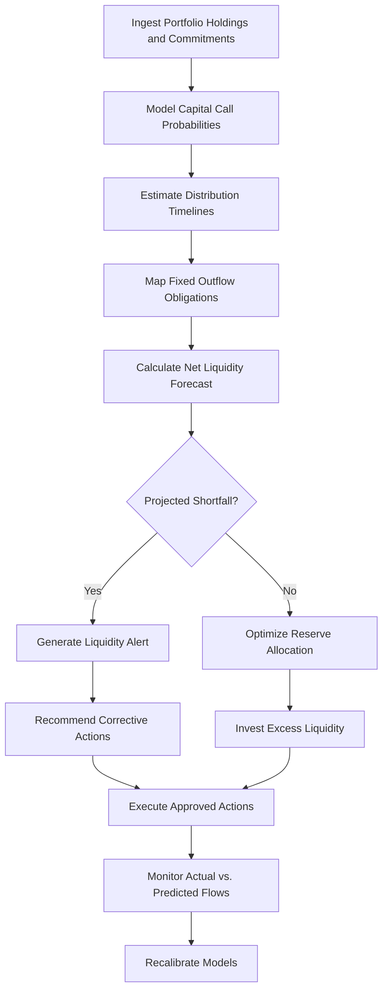

# Liquidity & Cash Flow Predictor

Frankmax

NAICS 523920

> **Family Offices** — Treasury Module

## Objective & Purpose

Family offices with heavy allocations to illiquid alternatives face a persistent cash management challenge: capital calls arrive unpredictably, distributions are irregular, and family lifestyle expenses are non-negotiable. A liquidity crunch forces fire sales of quality assets at discounts of 15-30%, destroying long-term value to solve short-term cash needs. The Liquidity and Cash Flow Predictor uses AI to model cash flow dynamics across the entire portfolio, forecasting liquidity needs 6-24 months forward and triggering early action before crunches develop.

The problem is structural. A family office with 50% in illiquid alternatives might have $200M in committed but uncalled capital that could be drawn at any time. Meanwhile, $30M in annual family expenses, $15M in tax obligations, and $5M in operating costs create predictable outflows. When multiple capital calls coincide with a distribution drought, the math breaks unless sufficient liquid reserves have been maintained --- but maintaining excessive reserves drags portfolio returns.

This platform models the probabilistic distribution of capital calls (using GP communication patterns, fund vintage, and drawdown history), distributions (using portfolio company exit signals and fund lifecycle patterns), and outflows (taxes, expenses, commitments) to maintain an optimal liquidity buffer: enough to prevent forced sales, but not so much that returns are unnecessarily diluted.

## Business Context

| Attribute | Value |
|---|---|
| **Business Process** | Cash management |
| **Business Function** | Treasury |
| **Category** | Finance |
| **Target Audience** | 6. Family Offices |
| **Bundle** | Dynasty/Family Office Continuity Pack ($12,000/mo) |
| **Monthly Cost of Inaction** | $1M+ per forced asset sale at distressed pricing |

## BPMN Workflow

## Features

1. **Capital Call Forecasting** --- Models the probability and timing of future capital calls using fund drawdown history, GP communication patterns, fund vintage position, and market conditions.
2. **Distribution Prediction** --- Estimates distribution timing and amounts based on portfolio company maturity, exit market conditions, fund lifecycle stage, and historical distribution patterns.
3. **Fixed Outflow Calendar** --- Maintains a comprehensive calendar of predictable outflows: tax obligations, insurance premiums, lifestyle expenses, charitable commitments, and operating costs.
4. **Monte Carlo Liquidity Simulation** --- Runs thousands of scenarios combining stochastic capital call timing, distribution probabilities, and market value fluctuations to generate probabilistic liquidity forecasts.
5. **Optimal Reserve Calculator** --- Determines the minimum liquid reserve needed to maintain a 95% or 99% probability of meeting all obligations without forced sales, given the current portfolio composition.
6. **Early Warning System** --- Triggers alerts when the forward-looking liquidity model identifies potential shortfalls at defined probability thresholds (30, 60, 90, 180 days forward).
7. **Secondary Market Valuation** --- For extreme liquidity needs, estimates likely secondary market pricing for illiquid holdings, enabling informed decisions about which assets to liquidate if forced sales become necessary.

## Workflow & Automation

**Step 1: Data Integration** --- Portfolio holdings, unfunded commitments, distribution schedules, and expense budgets are loaded from accounting systems and fund administrator portals.

**Step 2: Inflow Modeling** --- AI builds probabilistic models of capital call timing and distribution flow, calibrated to each fund's specific characteristics and market conditions.

**Step 3: Outflow Mapping** --- Fixed and variable outflows are mapped across a 24-month forward horizon with confidence intervals for variable items (tax obligations, discretionary spending).

**Step 4: Net Forecast Generation** --- Monte Carlo simulation combines inflow and outflow models to produce a probabilistic net liquidity forecast with confidence bands.

**Step 5: Reserve Optimization** --- The system recommends optimal liquid reserve levels and vehicle allocation (money market, short-duration bonds, credit facilities) to balance safety and return.

**Step 6: Continuous Monitoring** --- As actual cash flows occur, the system recalibrates models, updating forecasts and adjusting reserve recommendations automatically.

## Input/Output Specifications

| Direction | Data | Format | Description |
|---|---|---|---|
| Input | Portfolio holdings and NAVs | API, CSV | Current positions across all asset classes |
| Input | Unfunded commitments | CSV, manual entry | Capital call obligations by fund |
| Input | GP capital call notices | PDF, email parsing | Actual and estimated capital call schedules |
| Input | Expense budgets | XLSX, CSV | Family lifestyle, operating, and tax obligations |
| Output | Liquidity forecast dashboards | Web, API | Probabilistic cash flow projections |
| Output | Reserve recommendations | PDF, dashboard | Optimal liquid reserve levels and allocation |
| Output | Liquidity alerts | Email, SMS, dashboard | Early warning notifications of potential shortfalls |

## Integration Points

| System | Integration Type | Data Flow |
|---|---|---|
| Consolidated Reporting Platform | API | Bidirectional portfolio and cash flow data |
| Alternative Investment Analyzer | API | Inbound fund lifecycle and distribution intelligence |
| Fund Administrator Portals | API | Inbound NAV statements and capital call notices |
| Banking and Custody Platforms | API | Inbound cash balances and transaction data |
| Tax-Efficient Structuring Advisor | API | Inbound tax obligation projections |

## Pricing & Revenue Model

| Component | Price |
|---|---|
| Dynasty/Family Office Continuity Pack | $12,000/mo |
| Liquidity Predictor Core | Included in pack |
| Monte Carlo Simulation Engine | Included |
| Early Warning System | Included |
| Secondary Market Valuation Module | Premium add-on |

Revenue is subscription-based through the Continuity Pack. The value proposition is loss prevention rather than return enhancement: a single avoided forced sale at a 20% discount on a $10M position saves $2M, paying for 14 years of subscription cost. The secondary market valuation add-on drives additional revenue for family offices actively considering liquidity options.

## NAICS/SIC Mapping

| NAICS | SIC | Industry | Relevance |
|---|---|---|---|
| 523920 | 6282 | Portfolio Management and Investment Advice | Primary: family office treasury and liquidity management |
| 525920 | 6726 | Trusts, Estates, and Agency Accounts | Secondary: trust and estate cash flow management |
| 522320 | 6159 | Financial Transactions Processing | Tertiary: cash flow processing and forecasting |
| 523130 | 6231 | Commodity Contracts Intermediation and Brokerage | Tertiary: secondary market intermediation |
