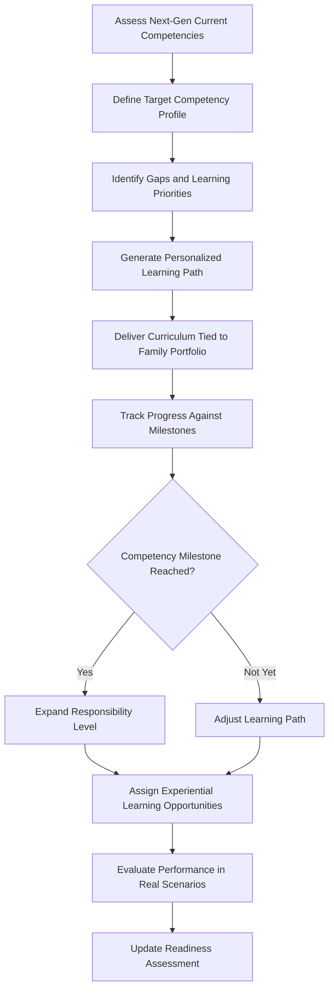

# Next-Gen Education & Integration

Frankmax

NAICS 525920

> **Family Offices** — Education Module

## Objective & Purpose

The 70% failure rate of wealth transfer by the second generation is not a financial problem --- it is an education problem. Heirs inherit portfolios they do not understand, governance structures they did not build, and responsibilities they were never prepared to assume. The Next-Gen Education and Integration platform uses AI to create personalized learning paths that connect academic knowledge to the family's actual portfolio, progressively building the competencies needed to steward multi-generational wealth.

Generic wealth management education teaches theory. What heirs actually need is applied understanding: how their family's specific PE portfolio works, why the trust structure is configured the way it is, what the real estate holdings require in active management, and how the family's governance policies evolved to their current form. This platform bridges theory and practice by using the family's actual portfolio data, governance history, and investment decisions as teaching materials.

The platform also manages the integration process --- the gradual transfer of responsibility from current generation to next. A 22-year-old heir observing investment committee meetings has different needs than a 35-year-old taking on board seats. The system tracks each heir's development against defined competency milestones, recommending experiences (attending deal sourcing meetings, shadowing the CFO through a reporting cycle, leading a philanthropic initiative) calibrated to their current capability level.

## Business Context

| Attribute | Value |
|---|---|
| **Business Process** | Heir preparation |
| **Business Function** | Education |
| **Category** | HR/Development |
| **Target Audience** | 6. Family Offices |
| **Bundle** | Dynasty/Family Office Continuity Pack ($12,000/mo) |
| **Monthly Cost of Inaction** | $10M+ per unprepared generational transition in wealth destruction |

## BPMN Workflow

## Features

1. **Competency Assessment Framework** --- Evaluates each heir's current knowledge and capabilities across financial literacy, governance understanding, investment analysis, risk management, and leadership.
2. **Personalized Learning Paths** --- AI generates individualized curricula that progress from foundational financial literacy through advanced topics (alternative investments, tax structuring, governance leadership) at each heir's pace.
3. **Portfolio-Linked Education** --- Uses the family's actual holdings as case studies, teaching investment analysis through the family's PE portfolio, tax planning through the family's actual structures, and governance through the family's real policies.
4. **Experiential Integration Planner** --- Recommends real-world experiences (meeting attendance, project leadership, advisory board participation) calibrated to each heir's development stage.
5. **Mentorship Coordination** --- Matches heirs with appropriate mentors (family elders, trusted advisors, peer next-generation members) and structures mentorship relationships with defined objectives.
6. **Progress Dashboard** --- Tracks each heir's development against competency milestones, providing family leadership with visibility into succession readiness across the next generation.
7. **Simulation Exercises** --- AI-generated scenario exercises using realistic (but de-risked) versions of actual family decisions, allowing heirs to practice judgment in a safe environment.

## Workflow & Automation

**Step 1: Baseline Assessment** --- Each next-generation family member completes a competency assessment covering financial literacy, investment knowledge, governance understanding, and leadership skills.

**Step 2: Gap Analysis** --- AI compares current competencies against target profiles (based on the roles each heir may assume), identifying priority learning areas.

**Step 3: Curriculum Generation** --- Personalized learning paths are generated combining self-study modules, facilitated workshops, and experiential assignments tied to the family's actual portfolio and governance.

**Step 4: Content Delivery** --- Learning modules are delivered through the platform, with content automatically updated when portfolio changes or governance decisions create new teaching opportunities.

**Step 5: Experience Assignment** --- Based on progress, the system recommends experiential assignments: attending investment committee meetings, conducting due diligence on a deal, or leading a philanthropic project.

**Step 6: Performance Evaluation** --- Mentors and family leadership evaluate heir performance on experiential assignments, feeding results back into the competency model.

**Step 7: Readiness Reporting** --- Periodic readiness reports assess each heir's trajectory toward succession-capable competency levels, informing family succession planning.

## Input/Output Specifications

| Direction | Data | Format | Description |
|---|---|---|---|
| Input | Competency assessment results | Web form, structured data | Heir knowledge and skill evaluations |
| Input | Family portfolio data | API | Actual holdings for portfolio-linked education |
| Input | Governance policies and history | API | Family charter and decision archive |
| Input | Mentor feedback | Structured forms | Performance assessments on experiential assignments |
| Output | Personalized learning paths | Interactive web | Customized curriculum for each heir |
| Output | Progress dashboards | Web, PDF | Competency development tracking per heir |
| Output | Readiness reports | PDF, dashboard | Succession readiness assessment for family leadership |

## Integration Points

| System | Integration Type | Data Flow |
|---|---|---|
| Family Governance Facilitator | API | Bidirectional governance education and meeting participation |
| Consolidated Reporting Platform | API | Inbound portfolio data for education content |
| Succession Intelligence Platform | API | Outbound readiness data for succession planning |
| Dynasty Knowledge Vault | API | Inbound family history for contextual education |
| External Learning Platforms | API, LTI | Inbound academic content and certifications |

## Pricing & Revenue Model

| Component | Price |
|---|---|
| Dynasty/Family Office Continuity Pack | $12,000/mo |
| Next-Gen Education Core | Included in pack |
| Personalized Learning Paths | Included |
| Simulation Exercise Engine | Included |
| Professional Facilitation Services | Per-session pricing |

Revenue is subscription-based through the Continuity Pack. Professional facilitation services for workshops, assessment centers, and mentorship program design drive attach revenue of $15K-$75K per engagement. The platform addresses the root cause of generational wealth failure, making it a high-emotional-value proposition for principals who care about legacy. Multi-year engagement is inherent: heir development programs run 5-15 years per individual.

## NAICS/SIC Mapping

| NAICS | SIC | Industry | Relevance |
|---|---|---|---|
| 525920 | 6726 | Trusts, Estates, and Agency Accounts | Primary: family office succession preparation |
| 523920 | 6282 | Portfolio Management and Investment Advice | Secondary: investment education and development |
| 611430 | 8299 | Professional and Management Development Training | Tertiary: leadership development services |
| 541612 | 8742 | Human Resources Consulting Services | Tertiary: talent development consulting |
