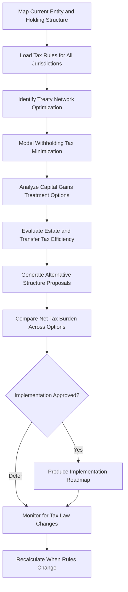

# Tax-Efficient Structuring Advisor

Frankmax

NAICS 523920

> **Family Offices** — Tax Management Module

## Objective & Purpose

Family offices with multi-jurisdictional holdings face a tax optimization problem of staggering complexity. Each investment, entity, and transaction triggers tax consequences in multiple jurisdictions, with interactions between treaty networks, holding structures, and local tax rules creating a combinatorial space that human advisors can only partially navigate. The Tax-Efficient Structuring Advisor uses AI to model the full tax landscape across all holdings, identifying structuring opportunities that minimize aggregate tax burden while maintaining full compliance.

The cost of suboptimal tax structuring is not obvious because it appears as taxes paid rather than money lost. A family office with $1B in assets spread across 8 jurisdictions may be paying $5M-$15M more in annual taxes than necessary simply because its structures evolved organically rather than being systematically optimized. The savings opportunity is not aggressive tax avoidance but rather ensuring that available treaty benefits, holding company efficiencies, and timing optimizations are actually utilized.

This platform maintains a continuously updated model of tax law across 60+ jurisdictions, including withholding tax rates, treaty networks, capital gains treatment, estate and inheritance tax provisions, and CFC (Controlled Foreign Corporation) rules. When the family office considers a new investment, restructuring, or distribution, the advisor models the tax consequences across every viable structural alternative, identifying the most efficient path and documenting the analysis for audit trail purposes.

## Business Context

| Attribute | Value |
|---|---|
| **Business Process** | Tax planning |
| **Business Function** | Tax Management |
| **Category** | Legal/Finance |
| **Target Audience** | 6. Family Offices |
| **Bundle** | Dynasty/Family Office Continuity Pack ($12,000/mo) |
| **Monthly Cost of Inaction** | $500,000+ annually in excess tax burden from suboptimal structures |

## BPMN Workflow

## Features

1. **Multi-Jurisdiction Tax Modeler** --- Maintains current tax rules for 60+ jurisdictions, modeling income tax, capital gains, withholding tax, estate tax, and transfer pricing implications across all holdings.
2. **Treaty Network Optimizer** --- Maps the complete bilateral tax treaty network relevant to the family's structures, identifying routing opportunities to minimize withholding taxes on dividends, interest, and royalties.
3. **Structure Comparison Engine** --- Evaluates alternative holding structures (Luxembourg SOPARFI, Dutch BV, Singapore holding, Delaware LLC, UAE free zone entities) against specific investment scenarios.
4. **Estate and Transfer Tax Planner** --- Models the multi-jurisdictional estate and inheritance tax consequences of different ownership structures, optimizing for intergenerational wealth transfer efficiency.
5. **CFC Rule Analyzer** --- Identifies Controlled Foreign Corporation exposure across all jurisdictions, flagging structures that could trigger adverse CFC taxation and proposing compliant alternatives.
6. **Tax Calendar Manager** --- Maintains filing deadlines, estimated payment schedules, and reporting requirements across all jurisdictions, preventing penalties from missed deadlines.
7. **Regulatory Change Monitor** --- Tracks tax law changes, treaty renegotiations, and OECD/G20 initiatives (BEPS, Pillar Two) that could affect the family's structures, with impact analysis.

## Workflow & Automation

**Step 1: Structure Mapping** --- The family office's complete entity structure is loaded, including all holding companies, trusts, partnerships, and direct holdings with jurisdictional locations.

**Step 2: Tax Law Loading** --- Current tax rules, treaty provisions, and regulatory requirements are loaded for every involved jurisdiction.

**Step 3: Baseline Analysis** --- The system calculates the current aggregate tax burden across all structures, identifying the highest-cost elements and largest optimization opportunities.

**Step 4: Alternative Modeling** --- AI generates alternative structural configurations, modeling the tax consequences of each across all affected jurisdictions.

**Step 5: Recommendation** --- The most tax-efficient structures are ranked by net savings, implementation complexity, compliance risk, and substance requirements, with full documentation.

**Step 6: Ongoing Monitoring** --- Approved structures are continuously monitored against tax law changes, with automatic alerts when regulatory shifts erode the efficiency of current arrangements.

## Input/Output Specifications

| Direction | Data | Format | Description |
|---|---|---|---|
| Input | Entity structure data | JSON, secure web form | Complete holding and ownership structure |
| Input | Financial statements | XLSX, CSV, API | Revenue, expenses, and distributions by entity |
| Input | Tax law databases | API | Current tax rules, rates, and treaty provisions |
| Input | Proposed transactions | Structured forms | New investments or restructurings to evaluate |
| Output | Tax optimization reports | PDF, dashboard | Structural recommendations with savings quantification |
| Output | Structure comparison matrices | XLSX, dashboard | Side-by-side tax burden analysis |
| Output | Tax calendar and alerts | Calendar feed, email | Upcoming deadlines and regulatory changes |

## Integration Points

| System | Integration Type | Data Flow |
|---|---|---|
| Consolidated Reporting Platform | API | Bidirectional financial data for tax calculations |
| Alternative Investment Analyzer | API | Inbound investment structure data |
| Multi-Jurisdiction Asset Shield | API | Bidirectional structure and legal data |
| External Tax Research (IBFD, BNA) | API | Inbound tax law and treaty databases |
| Accounting and ERP Systems | API | Bidirectional financial transaction data |

## Pricing & Revenue Model

| Component | Price |
|---|---|
| Dynasty/Family Office Continuity Pack | $12,000/mo |
| Tax-Efficient Structuring Advisor Core | Included in pack |
| Multi-Jurisdiction Tax Modeling | Included (up to 10 jurisdictions) |
| Extended Jurisdiction Coverage | $600/mo per additional jurisdiction |
| ORF Governance Layer | Included |

Revenue is subscription-based through the Continuity Pack, with upsell through extended jurisdiction coverage. A family office with holdings in 20 jurisdictions adds $6,000/mo in coverage fees. The value proposition is straightforward: the platform typically identifies tax savings of 3-8x the annual subscription cost within the first analysis cycle, making ROI demonstration immediate and retention nearly automatic.

## NAICS/SIC Mapping

| NAICS | SIC | Industry | Relevance |
|---|---|---|---|
| 523920 | 6282 | Portfolio Management and Investment Advice | Primary: investment tax structuring |
| 525920 | 6726 | Trusts, Estates, and Agency Accounts | Secondary: estate and trust tax planning |
| 541211 | 8721 | Offices of Certified Public Accountants | Tertiary: tax advisory services |
| 541199 | 7389 | All Other Legal Services | Tertiary: cross-border tax legal analysis |
