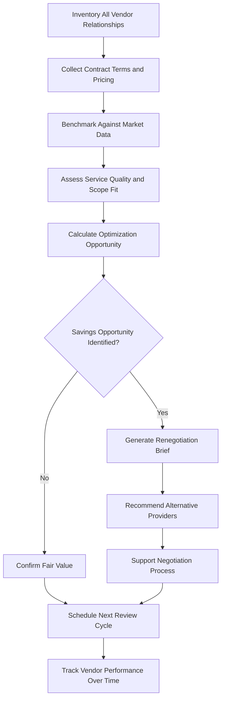

# Vendor & Service Provider Optimizer

Frankmax

NAICS 525920

> **Family Offices** — Operations Module

## Objective & Purpose

Family offices routinely overpay for professional services because they lack benchmarking data. A single family office cannot know whether the $500/hour charged by its law firm, the 1.2% management fee from its investment advisor, or the $50,000 annual retainer from its tax accountant represents fair market value or a significant premium. The Vendor and Service Provider Optimizer uses AI to benchmark every vendor relationship against anonymized market data, identify cost savings, and negotiate improved terms using data-driven leverage.

The aggregate cost is substantial. A well-staffed family office spends $2M-$10M annually on external service providers: legal counsel, tax advisors, investment consultants, insurance brokers, property managers, IT services, security firms, and concierge services. Industry data suggests that family offices overpay by 15-30% compared to institutional peers who negotiate from a position of data-informed leverage. On a $5M annual spend, that is $750K-$1.5M in unnecessary cost.

Beyond pricing, the platform assesses service quality and scope. Many family offices receive services designed for institutional clients (with corresponding institutional pricing) when their actual needs could be met by more appropriately scoped providers. The optimizer evaluates whether each vendor relationship delivers appropriate value by benchmarking scope, responsiveness, and outcome quality alongside pricing.

## Business Context

| Attribute | Value |
|---|---|
| **Business Process** | Vendor management |
| **Business Function** | Operations |
| **Category** | Procurement |
| **Target Audience** | 6. Family Offices |
| **Bundle** | Dynasty/Family Office Continuity Pack ($12,000/mo) |
| **Monthly Cost of Inaction** | $100,000+ annually in excess vendor costs |

## BPMN Workflow

## Features

1. **Vendor Cost Benchmarking** --- Compares every vendor's pricing (hourly rates, retainers, percentage fees, transaction costs) against anonymized market data from comparable family offices.
2. **Service Scope Assessment** --- Evaluates whether the scope of services from each vendor matches the family office's actual needs, identifying over-provisioning and under-provisioning.
3. **Quality Scoring** --- Rates vendor performance on responsiveness, accuracy, proactiveness, and outcome quality based on family office staff feedback and objective metrics.
4. **Alternative Provider Database** --- Maintains a vetted database of alternative service providers across all categories, with pricing benchmarks and peer reviews.
5. **Renegotiation Brief Generator** --- Produces data-backed negotiation documents showing benchmark comparisons, alternative provider options, and specific terms to target in renegotiation.
6. **Contract Lifecycle Manager** --- Tracks contract renewal dates, auto-renewal triggers, and termination notice periods, preventing costly auto-renewals and missed negotiation windows.
7. **Total Cost of Relationship Calculator** --- Aggregates all costs from each vendor relationship including base fees, disbursements, expenses, and hidden charges to reveal true relationship cost.

## Workflow & Automation

**Step 1: Vendor Inventory** --- All current vendor relationships are cataloged with service category, contract terms, pricing structure, and annual spend.

**Step 2: Data Collection** --- Invoices, engagement letters, and contract documents are ingested to extract precise pricing and scope details.

**Step 3: Benchmarking** --- Each vendor's pricing and scope is compared against anonymized market data, producing a fair value assessment for every relationship.

**Step 4: Quality Assessment** --- Family office staff complete structured assessments of vendor performance across responsiveness, quality, and value delivery.

**Step 5: Optimization Prioritization** --- Vendors are ranked by savings opportunity (difference between current cost and benchmark fair value), with the highest-opportunity relationships targeted first.

**Step 6: Negotiation Support** --- For targeted relationships, the system generates renegotiation briefs with market data, alternative providers, and suggested target terms.

**Step 7: Ongoing Monitoring** --- Vendor performance and pricing are tracked continuously, with alerts when costs drift above benchmark or quality scores decline.

## Input/Output Specifications

| Direction | Data | Format | Description |
|---|---|---|---|
| Input | Vendor contracts | PDF, DOCX | Engagement letters, service agreements, retainer terms |
| Input | Invoices and billing data | PDF, CSV, API | Historical and current billing from all vendors |
| Input | Staff satisfaction surveys | Web form | Quality and responsiveness assessments |
| Input | Market benchmark data | Database | Anonymized pricing from comparable family offices |
| Output | Benchmarking reports | PDF, dashboard | Per-vendor fair value assessment |
| Output | Renegotiation briefs | PDF, DOCX | Data-backed negotiation documents |
| Output | Contract renewal alerts | Email, calendar | Upcoming renewal and termination deadlines |

## Integration Points

| System | Integration Type | Data Flow |
|---|---|---|
| Consolidated Reporting Platform | API | Inbound vendor cost data from financial reporting |
| Family Governance Facilitator | API | Outbound vendor optimization reports for family meetings |
| Accounting and AP Systems | API | Inbound invoice and payment data |
| Contract Management Systems | API | Bidirectional contract and deadline data |
| Vendor Reference Networks | API | Inbound peer reviews and quality benchmarks |

## Pricing & Revenue Model

| Component | Price |
|---|---|
| Dynasty/Family Office Continuity Pack | $12,000/mo |
| Vendor Optimizer Core | Included in pack |
| Benchmarking Database Access | Included |
| Renegotiation Brief Generator | Included |
| Vendor Search and Vetting | Per-search pricing |

Revenue is subscription-based through the Continuity Pack. Per-search vendor vetting engagements drive attach revenue of $2,000-$10,000 per search. The platform typically identifies first-year savings of 3-5x the annual subscription cost, creating an immediately demonstrable ROI that simplifies sales and retention. The benchmarking database improves with each participating family office's data (anonymized), creating a network effect.

## NAICS/SIC Mapping

| NAICS | SIC | Industry | Relevance |
|---|---|---|---|
| 525920 | 6726 | Trusts, Estates, and Agency Accounts | Primary: family office operations management |
| 523920 | 6282 | Portfolio Management and Investment Advice | Secondary: investment service provider management |
| 561110 | 7389 | Office Administrative Services | Tertiary: administrative operations optimization |
| 541611 | 7371 | Administrative Management Consulting | Tertiary: vendor management consulting |
