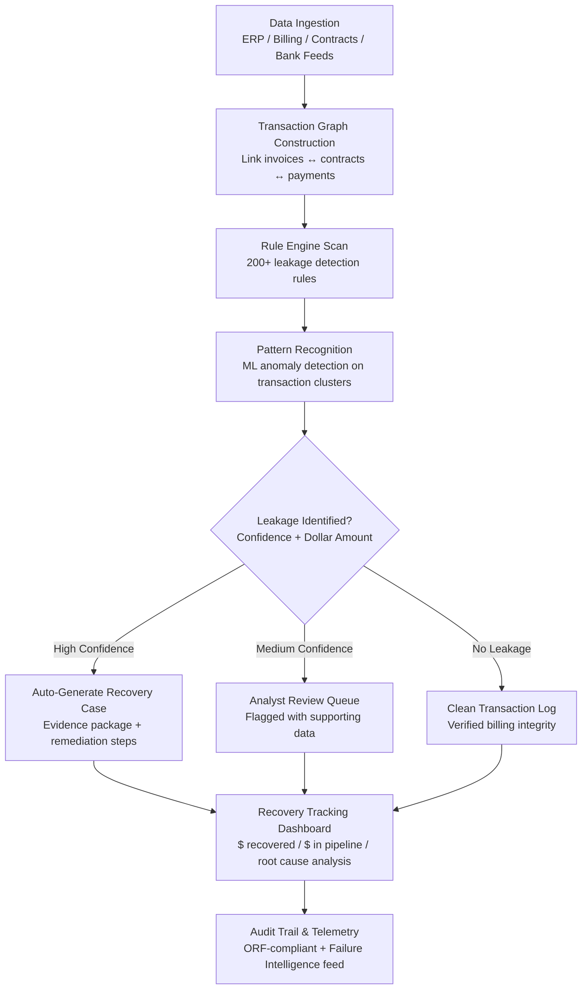

# Billing Leakage Detector

Frankmax

NAICS 551112, 541611-541990

> **Multinational Corporate Empires** — Enterprise AI Operations

## Objective & Purpose

Revenue leakage -- the gap between what a company should bill or collect and what it actually receives -- affects every multinational. Industry research consistently places the leakage rate between 2% and 7% of total revenue. For a $1B enterprise, that is $20M to $70M disappearing annually through billing errors, contract non-compliance, pricing discrepancies, unbilled services, duplicate payments, and misapplied credits. Most finance teams know leakage exists but lack the tooling to find it systematically across millions of transactions, hundreds of contracts, and dozens of billing systems.

The Billing Leakage Detector applies pattern recognition AI across the full billing lifecycle: contract terms to invoice generation, invoice to payment matching, credit and adjustment analysis, and revenue recognition validation. The system ingests data from ERP systems, billing platforms, contract management tools, and bank statements to build a unified transaction graph. It then applies over 200 detection rules -- both pre-configured and learned from the organization's own data -- to identify specific leakage instances with dollar amounts, root causes, and remediation paths.

The business case is immediate and self-funding. Organizations typically recover 10-25x the annual cost of the tool within the first 90 days of deployment. The Billing Leakage Detector is the #2 revenue priority in the marketplace because it provides the fastest proof of ROI: the tool pays for itself on the first recovered invoice. Every leakage pattern detected feeds the marketplace's Failure Intelligence Library, creating a cross-industry leakage pattern database that no single organization could build alone.

## Business Context

| Attribute | Value |
|---|---|
| **Business Process** | Revenue assurance and billing accuracy |
| **Business Function** | Finance / Revenue Operations |
| **Category** | Audit |
| **Target Audience** | 7. Multinational Corporate Empires |
| **Revenue Priority** | #2 (30-60 day revenue stream) |
| **Bundle** | Enterprise Operations Pack ($4,500/mo) |
| **Monthly Cost of Inaction** | $10K-$500K (Tier 1 Chokepoint) |

## BPMN Workflow

## Features

1. **Multi-Source Data Ingestion** — Connects to ERP systems (SAP, Oracle, NetSuite), billing platforms (Zuora, Chargebee, Stripe), contract management tools (DocuSign CLM, Ironclad), and banking feeds (MT940, BAI2, ISO 20022). Normalizes disparate data formats into a unified transaction model within 48 hours of initial connection.

2. **200+ Pre-Built Detection Rules** — Covers the most common leakage patterns: duplicate invoices, pricing discrepancies vs. contract terms, unbilled deliverables, expired discount application, incorrect tax calculations, misapplied credits/returns, volume threshold misses, FX conversion errors, and late-payment penalty failures.

3. **Contract-to-Invoice Reconciliation** — Maps every invoice line item back to the originating contract clause. Identifies deviations: pricing different from contracted rates, quantities outside agreed ranges, services delivered but not invoiced, and contractual penalties not enforced.

4. **ML-Driven Anomaly Detection** — Beyond rules-based detection, the system trains on the organization's historical transaction patterns to identify statistical outliers: unusual discount patterns by sales rep, seasonal billing irregularities, vendor-specific payment timing anomalies, and emerging leakage patterns not yet covered by rules.

5. **Dollar-Quantified Recovery Cases** — Every detected leakage instance is packaged as an actionable recovery case with: exact dollar amount, root cause classification, affected transactions, responsible department, and recommended remediation steps. Cases are prioritized by recovery value.

6. **Revenue-Share Alignment** — Pricing model can be structured as a percentage of recovered leakage, aligning the tool's cost directly with its value delivery. The organization pays only when the tool finds money.

7. **Continuous Monitoring Mode** — Shifts from retrospective audit to real-time monitoring. New transactions are scanned against detection rules within minutes of entry, catching leakage before it compounds across billing cycles.

8. **Regulatory & Audit Readiness** — All detection results, recovery actions, and remediation steps are logged in an ORF-compliant audit trail. Exportable reports formatted for SOX compliance, external audit review, and regulatory examination.

## Workflow & Automation

**Step 1: Data Connection & Normalization** — Connect to the organization's billing ecosystem: ERP general ledger, accounts receivable, accounts payable, contract management system, and banking feeds. The system normalizes transaction records across systems into a unified schema with standardized fields: transaction ID, date, amount, currency, counterparty, contract reference, and status.

**Step 2: Transaction Graph Assembly** — Build a connected graph linking contracts to purchase orders to invoices to payments to credits. Each node represents a financial event; each edge represents a business relationship. Orphaned nodes (invoices without contracts, payments without invoices) are immediately flagged as potential leakage indicators.

**Step 3: Rules-Based Scanning** — Apply 200+ detection rules across the transaction graph. Each rule targets a specific leakage pattern with configurable sensitivity. Rules fire independently and in combination -- a single transaction can trigger multiple rules, with composite scores indicating compound leakage risk.

**Step 4: Machine Learning Pattern Analysis** — Train anomaly detection models on the organization's 12-24 months of historical data. The ML layer identifies leakage patterns that rules cannot: gradual pricing drift, correlated anomalies across vendors, time-series irregularities in billing cycles, and behavioral patterns associated with manual override abuse.

**Step 5: Recovery Case Generation** — Each confirmed leakage instance is packaged into a recovery case: dollar amount, confidence score, root cause taxonomy (pricing error / unbilled service / duplicate payment / credit misapplication / contract non-compliance), affected transactions with links, and recommended recovery action.

**Step 6: Analyst Review & Action** — High-confidence cases (>95%) can be auto-routed to recovery workflows. Medium-confidence cases enter an analyst queue with all supporting evidence pre-assembled. Analysts accept, reject, or escalate each case. Every decision is logged for model improvement.

**Step 7: Recovery Tracking & Reporting** — Track recovery progress: cases opened, cases in progress, dollars recovered, dollars in pipeline. Weekly executive dashboards show leakage rate trends, top leakage categories, and ROI metrics. Monthly reports feed into CFO briefings and audit committee materials.

## Input/Output Specifications

| Direction | Data | Format | Description |
|---|---|---|---|
| Input | General ledger transactions | SAP BAPI / Oracle REST / CSV | AR, AP, and GL transaction records |
| Input | Invoice records | JSON/XML/EDI (810/INVOIC) | Invoice headers and line items |
| Input | Contract terms | JSON/API | Pricing, volume commitments, discount schedules, penalty clauses |
| Input | Payment records | MT940, BAI2, ISO 20022 | Bank statement and payment matching data |
| Input | Credit/adjustment memos | ERP export / CSV | Returns, credits, write-offs |
| Output | Recovery cases | JSON + PDF report | Dollar amount, root cause, evidence, remediation steps |
| Output | Leakage dashboard | REST API / UI | Real-time leakage rate, trend analysis, category breakdown |
| Output | Audit trail | JSON (immutable log) | ORF-compliant detection and recovery history |
| Output | Executive summary | PDF / API | Weekly/monthly CFO-ready leakage and recovery report |

## Integration Points

| System | Integration Type | Data Flow |
|---|---|---|
| **DocuFlow — Document Intelligence** | Inbound data feed | Extracted invoice and contract data from DocuFlow feeds leakage analysis |
| **Chokepoint Intelligence Engine** | Outbound telemetry | Billing process bottlenecks feed chokepoint mapping |
| **Board Decision Intelligence** | Outbound summary | Revenue leakage metrics included in board briefing packages |
| **Audit Trail & Traceability Engine** | Outbound log stream | All detection events and recovery actions logged immutably |
| **AI Cost Optimization Engine** | Cross-reference | AI spend billing accuracy validated against provider invoices |
| **SAP / Oracle / NetSuite** | Bidirectional API | Transaction data in; recovery actions and corrections out |
| **Zuora / Chargebee / Stripe** | Inbound API | Subscription billing data for recurring revenue leakage detection |
| **Failure Intelligence Library** | Outbound anonymized patterns | Leakage patterns (anonymized) feed cross-industry intelligence |

## Pricing & Revenue Model

| Component | Pricing | Notes |
|---|---|---|
| **Enterprise Operations Pack** | $4,500/month | Includes Billing Leakage Detector + DocuFlow + Chokepoint Intelligence |
| **Standalone — Fixed Fee** | $2,800/month | Up to $500M annual revenue scanned |
| **Standalone — Revenue Share** | 15-25% of recovered leakage | Aligned incentive model; minimum $1,500/month floor |
| **Large Enterprise (>$1B revenue)** | Custom pricing | Dedicated instance, custom rules, SLA guarantees |
| **Governance & Audit add-on** | +$800/month | SOX-ready reporting, audit committee export, regulatory format |
| **Continuous Monitoring upgrade** | +$1,200/month | Real-time scanning vs. batch (default: nightly batch) |

**Revenue model**: Billing Leakage Detector is the fastest ROI product in the marketplace. The revenue-share model means $0 risk to the buyer -- the tool pays for itself from recovered revenue. Typical first-90-day recovery: $200K-$2M for enterprises in the $500M-$5B revenue range. The "fries" attach through governance layers: audit trail compliance, regulatory reporting, and continuous monitoring at 70-85% margin.

## NAICS/SIC Mapping

| NAICS Code | SIC Code | Industry | Relevance |
|---|---|---|---|
| 551112 | 6712 | Offices of Other Holding Companies | Multi-entity billing reconciliation |
| 522110 | 6021 | Commercial Banking | Fee and interest leakage across accounts |
| 524114 | 6311 | Direct Health and Medical Insurance | Premium billing accuracy, claims overpayment |
| 441-454 | 5211-5999 | Retail Trade | Vendor billing reconciliation, promotional pricing errors |
| 481-488 | 4011-4789 | Transportation & Warehousing | Freight billing discrepancies, fuel surcharge errors |
| 236-238 | 1500-1799 | Construction | Change order billing, retention tracking |
| 311-339 | 2000-3999 | Manufacturing | Volume discount verification, raw material pricing |
| 541 | 7371-7389 | Professional Services | Time & materials billing accuracy, rate card compliance |
