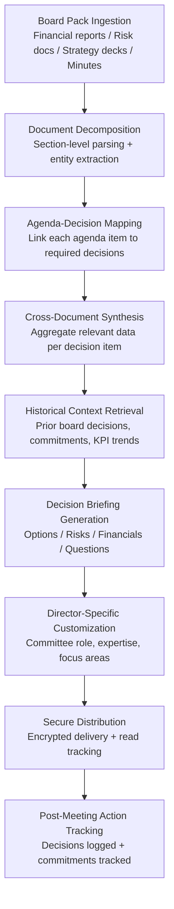

# Board Decision Intelligence

Frankmax

NAICS 551112, 541611-541990

> **Multinational Corporate Empires** — Corporate Governance & Risk

## Objective & Purpose

Board directors at multinational corporations receive 300-500 page board packs before each quarterly meeting. These packs contain financial statements, strategic updates, risk reports, compliance summaries, committee minutes, and management proposals -- produced by dozens of teams across the organization over 3-6 weeks. The result: directors spend 15-20 hours preparing for each meeting, yet consistently report that they lack the specific information needed to make decisions. A 2023 NACD survey found that 62% of directors feel they receive too much data and not enough insight, while 71% say board materials arrive too late for adequate preparation.

Board Decision Intelligence transforms raw board materials into decision-ready briefings. The system ingests the full board pack -- financial reports, strategic documents, risk assessments, compliance filings, market analyses, and competitor intelligence -- and produces structured briefings organized around the specific decisions on the agenda. Each briefing includes: the decision to be made, the relevant data synthesized from across all source documents, the options available, the risks associated with each option, the financial implications, precedents from prior board decisions, and recommended questions for management.

This is a pure "fries" product -- high-margin governance tooling that sells to the most senior decision-makers in the organization. Board-level AI tools carry premium pricing because the cost of a bad board decision (failed M&A, missed regulatory shift, inadequate risk oversight) is measured in hundreds of millions. The tool also functions as a strategic insertion point: once board members rely on AI-generated briefings, the governance and audit requirements create deep lock-in for the entire marketplace compliance stack.

## Business Context

| Attribute | Value |
|---|---|
| **Business Process** | Board meeting preparation and decision support |
| **Business Function** | Corporate Governance / Corporate Secretary |
| **Category** | Governance |
| **Target Audience** | 7. Multinational Corporate Empires |
| **Bundle** | Corporate Governance Pack (custom pricing) |
| **Buyer** | Board chairs, lead directors, corporate secretaries, general counsel |
| **Decision Frequency** | Quarterly board meetings + ad-hoc special sessions |
| **Monthly Cost of Inaction** | Director time waste ($50K-$200K/quarter) + decision quality degradation (unquantifiable) |

## BPMN Workflow

## Features

1. **Multi-Format Board Pack Ingestion** — Processes board materials in all common formats: PowerPoint decks, Word documents, Excel spreadsheets, PDF reports, and email attachments. Handles 300-500 page board packs within 4 hours of ingestion, with incremental updates as materials are revised before the meeting.

2. **Decision-Centric Briefing Structure** — Organizes output around decisions, not documents. For each agenda item requiring a decision, the briefing includes: decision statement, relevant data synthesized from multiple source documents, available options with pros/cons, risk analysis per option, financial impact projections, regulatory implications, and prior board context.

3. **Historical Decision Memory** — Maintains a searchable database of all prior board decisions, management commitments, KPI trajectories, and strategic priorities. Each new briefing references relevant history: "In Q2 2024, the board approved a $50M expansion contingent on 12% margin improvement -- current margin is 9.3%."

4. **Director-Specific Customization** — Tailors briefings to each director's committee assignments, domain expertise, and stated focus areas. The audit committee chair receives deeper financial analysis; the technology committee member receives more detail on IT risk; the compensation committee chair receives workforce-related context.

5. **Competitive & Market Context Injection** — Supplements internal data with external intelligence: competitor earnings calls, industry regulatory developments, macroeconomic indicators, and market analyst reports relevant to each decision item. Directors see internal proposals in the context of external reality.

6. **Question Generation Engine** — For each decision item, generates 5-10 specific, data-informed questions that directors should ask management. Questions are designed to expose assumptions, test financial projections, identify missing information, and probe risk scenarios.

7. **Secure, Auditable Distribution** — Board briefings contain the most sensitive corporate information. Distribution uses end-to-end encryption with individual access controls per director. Read receipts and time-on-page analytics help the corporate secretary understand engagement levels. All access is logged for governance compliance.

8. **Post-Meeting Decision & Action Tracking** — After the meeting, the system logs formal decisions, management commitments with deadlines, and follow-up items. Subsequent briefings automatically reference outstanding commitments and track KPI progress against board-approved targets.

## Workflow & Automation

**Step 1: Board Pack Collection** — The corporate secretary uploads board materials to the system as they become available (typically 2-3 weeks before the meeting). Materials arrive in waves: financial reports first, then strategy updates, then risk reports, then committee materials. The system processes each document incrementally, building a cumulative knowledge base for the upcoming meeting.

**Step 2: Document Decomposition & Analysis** — Each document is parsed at the section level. Financial statements are decomposed into individual line items with trend analysis. Strategy documents are broken into proposals with stated assumptions and projected outcomes. Risk reports are categorized by risk type, severity, and organizational impact.

**Step 3: Agenda-to-Decision Mapping** — Using the board agenda (uploaded by the corporate secretary), the system maps each agenda item to the specific decisions required and identifies which documents contain relevant information. If an agenda item references an M&A proposal, the system pulls financial analysis, legal due diligence, competitive context, and risk assessment from across all uploaded materials.

**Step 4: Cross-Document Synthesis** — For each decision item, the system synthesizes information from all relevant documents into a unified briefing section. Contradictions between documents are flagged (e.g., the financial forecast shows 15% growth while the risk report identifies 3 headwinds that could reduce growth to 8%). Data gaps are identified and reported.

**Step 5: Historical Context & Trend Analysis** — The system retrieves relevant prior board decisions, management commitments, and KPI trends from its historical database. Each briefing section includes a "Board History" sidebar showing how the current decision relates to previous board actions and whether prior commitments have been met.

**Step 6: Briefing Generation & Customization** — Decision-ready briefings are generated for each director, customized to their committee roles and areas of focus. The general briefing runs 15-25 pages (vs. the 300-500 page raw pack). Committee-specific supplements add 5-10 pages for relevant committee members.

**Step 7: Distribution, Feedback & Action Tracking** — Briefings are distributed through the secure portal with individual encryption. Directors can annotate, flag questions, and request deeper analysis on specific items. Post-meeting, the corporate secretary logs decisions and commitments, which the system tracks in subsequent cycles.

## Input/Output Specifications

| Direction | Data | Format | Description |
|---|---|---|---|
| Input | Board pack materials | PPTX, DOCX, XLSX, PDF | Financial reports, strategy decks, risk assessments |
| Input | Board agenda | DOCX / PDF / structured text | Agenda items with decision requirements |
| Input | Historical board records | System database | Prior decisions, commitments, KPI history |
| Input | External intelligence | API feeds / web scrape | Competitor filings, regulatory updates, market data |
| Input | Director profiles | JSON / admin config | Committee assignments, expertise, focus areas |
| Output | Decision-ready briefings | PDF (encrypted) + secure web portal | Per-director customized board briefings |
| Output | Question sets | PDF / portal | Generated questions per agenda item per director |
| Output | Decision log | JSON (immutable) | Formal decisions and commitments with deadlines |
| Output | Audit trail | JSON (immutable log) | ORF-compliant document access and briefing generation log |
| Output | Engagement analytics | REST API / admin UI | Read times, annotation frequency, question submission |

## Integration Points

| System | Integration Type | Data Flow |
|---|---|---|
| **DocuFlow — Document Intelligence** | Inbound processed data | Extracted and classified board materials feed briefing generation |
| **Billing Leakage Detector** | Inbound metrics | Revenue leakage KPIs included in financial briefing sections |
| **Chokepoint Intelligence Engine** | Inbound metrics | Top operational chokepoints included in operations briefing |
| **Regulatory Change Tracker** | Inbound intelligence | Regulatory developments relevant to board decisions |
| **ESG Compliance & Reporting Engine** | Inbound reports | ESG metrics and compliance status for board oversight |
| **Supply Chain Risk Neural Network** | Inbound risk data | Supply chain risk assessment for relevant decisions |
| **M&A Due Diligence Accelerator** | Inbound analysis | Due diligence findings for acquisition decisions |
| **Audit Trail & Traceability Engine** | Outbound log stream | All document access and briefing generation logged |

## Pricing & Revenue Model

| Component | Pricing | Notes |
|---|---|---|
| **Corporate Governance Pack** | $8,000-$15,000/month | Board Decision Intelligence + Regulatory Change Tracker + ESG Reporting |
| **Standalone** | $5,500/month | Up to 12 board members, quarterly meetings |
| **Enterprise (>12 directors, monthly meetings)** | $9,000/month | Unlimited directors, unlimited meeting frequency |
| **Committee-specific supplements** | +$1,500/month per committee | Deep analysis for audit, risk, compensation, technology committees |
| **Historical context module** | +$2,000 one-time + $500/month | Digitization and indexing of 3-5 years of prior board materials |
| **Post-meeting action tracking** | Included | Decision logging, commitment tracking, KPI monitoring |

**Revenue model**: Board Decision Intelligence is a pure "fries" product -- 80-90% gross margin, sold to the highest-value decision-makers in the enterprise. The tool creates governance lock-in: once directors rely on AI briefings, the audit trail requirements and historical context make switching prohibitively expensive. Average contract value: $120K-$180K annually. Expansion path: from board briefings to C-suite operational briefings to investor relations materials.

## NAICS/SIC Mapping

| NAICS Code | SIC Code | Industry | Relevance |
|---|---|---|---|
| 551112 | 6712 | Offices of Other Holding Companies | Multi-entity board governance |
| 551111 | 6711 | Offices of Bank Holding Companies | Bank board oversight and regulatory governance |
| 524210 | 6411 | Insurance Agencies and Brokerages | Insurance board risk oversight |
| 522110 | 6021 | Commercial Banking | Bank board regulatory compliance |
| 541611 | 7371 | Administrative Management Consulting | Board advisory and governance consulting |
| 921110 | 9111 | Executive Offices (Government) | Public sector governance equivalents |
| 813910 | 8611 | Business Associations | Non-profit board governance |
| 525110 | 6722 | Pension Funds | Fiduciary board oversight |
