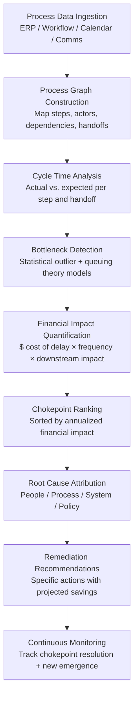

# Chokepoint Intelligence Engine

Frankmax

NAICS 551112, 541611-541990

> **Multinational Corporate Empires** — Enterprise AI Operations

## Objective & Purpose

Every multinational has operational chokepoints -- single points of failure, approval bottlenecks, resource constraints, and process dependencies that silently drain millions in delayed execution, rework, and opportunity cost. The problem is not that chokepoints exist; it is that they are invisible. They hide inside process complexity, across departmental boundaries, and between systems that do not share data. A procurement approval that takes 3 days might gate a $50M contract. A single sign-off requirement in a 15-step workflow might idle 40 people. These costs never appear on a P&L line item, so they never get fixed.

The Chokepoint Intelligence Engine ingests process data from workflow systems, ERP platforms, project management tools, communication channels, and calendar systems to build a real-time process execution graph. It identifies bottlenecks by measuring actual cycle times, wait times, handoff delays, and approval latencies across every business process. Each chokepoint is quantified in dollars: cost of delay, cost of rework, opportunity cost of blocked downstream work. The system produces ranked lists of chokepoints by financial impact, enabling leadership to prioritize operational improvements by ROI rather than intuition.

This tool is the diagnostic layer for the entire Enterprise Operations Pack. While DocuFlow and Billing Leakage Detector address specific process domains, the Chokepoint Intelligence Engine provides the map -- identifying where the next dollar of operational improvement should be invested. Its output directly feeds the Board Decision Intelligence system, giving executives visibility into operational friction that traditional financial reporting cannot surface.

## Business Context

| Attribute | Value |
|---|---|
| **Business Process** | Operational bottleneck identification and quantification |
| **Business Function** | Operations / Strategy / Continuous Improvement |
| **Category** | Analytics |
| **Target Audience** | 7. Multinational Corporate Empires |
| **Bundle** | Enterprise Operations Pack ($4,500/mo) |
| **Related Chokepoints** | Tier 2 #26 (Approval bottlenecks), #28 (Process handoff delays) |
| **Monthly Cost of Inaction** | $100K-$5M (aggregate hidden process waste) |

## BPMN Workflow

## Features

1. **Multi-System Process Mining** — Ingests event logs from ERP systems (SAP, Oracle), workflow platforms (ServiceNow, Jira, Monday.com), communication tools (Slack, Teams message timestamps), calendar systems (Outlook, Google Calendar), and email metadata. Reconstructs actual process execution paths without requiring pre-defined process models.

2. **Process Execution Graph** — Builds a dynamic, real-time graph of how work actually flows through the organization -- not how it is documented in SOPs. Nodes represent process steps; edges represent handoffs. Edge weights reflect actual cycle times, wait times, and rework loops. Updated continuously as new event data arrives.

3. **Queuing Theory Bottleneck Detection** — Applies queuing theory and statistical process control to identify genuine bottlenecks vs. normal variation. Distinguishes between capacity constraints (not enough people), dependency constraints (waiting for upstream), policy constraints (unnecessary approvals), and system constraints (slow tools).

4. **Dollar-Quantified Impact Scoring** — Every identified chokepoint is scored in dollars per month: (delay hours x fully loaded labor cost) + (downstream idle time x team size x hourly rate) + (opportunity cost of delayed revenue or delivery). Chokepoints are ranked by annualized financial impact to enable ROI-driven prioritization.

5. **Root Cause Taxonomy** — Classifies each chokepoint by root cause: People (skill gap, single-person dependency, overloaded approver), Process (unnecessary steps, sequential where parallel is possible, missing SLAs), System (slow tools, integration gaps, data re-entry), Policy (approval thresholds too low, outdated compliance requirements).

6. **Cross-Entity Comparison** — For multinationals with multiple business units or geographies, compares process performance across entities. Identifies best-practice units and quantifies the gap between best and worst performers for the same process.

7. **Simulation & What-If Analysis** — Models the impact of proposed process changes before implementation: "What if we raise the approval threshold from $5K to $25K?" "What if we parallelize steps 3 and 4?" "What if we add a second approver for Region APAC?" Provides projected cycle time and cost impact.

8. **Automated Alerting** — Configurable alerts when chokepoints exceed defined thresholds: "Procurement approval cycle time exceeded 5-day SLA for 3 consecutive weeks" or "New chokepoint detected in month-end close process with $200K+ monthly impact."

## Workflow & Automation

**Step 1: Data Source Connection** — Connect to the organization's workflow ecosystem: ERP event logs, ticketing systems, project management tools, email metadata (timestamps and routing, not content), and calendar data (meeting duration and participants). Each data source provides event-level records: who did what, when, and what happened next.

**Step 2: Process Discovery** — The system automatically discovers process models from raw event data using process mining algorithms. No pre-defined process maps required. The discovered models show the actual execution paths, including common variations, exception handling routes, and rework loops that formal documentation typically omits.

**Step 3: Cycle Time Decomposition** — For each process step and handoff, decompose total cycle time into: active work time (value-adding), wait time (queued for next step), rework time (sent back for correction), and idle time (no activity). This decomposition reveals where time is spent vs. where time is wasted.

**Step 4: Bottleneck Identification** — Apply statistical models to identify steps and handoffs that consistently exceed expected cycle times. Use queuing theory to determine whether bottlenecks are caused by arrival rate (too many requests), service rate (too slow processing), or variability (inconsistent performance). Distinguish systemic bottlenecks from transient spikes.

**Step 5: Financial Impact Calculation** — For each identified chokepoint, calculate monthly and annual financial impact using the organization's actual cost data: labor rates, revenue at risk, penalty exposure, and downstream dependency costs. Rank all chokepoints by impact to create a prioritized improvement backlog.

**Step 6: Remediation Planning** — Generate specific, actionable recommendations for each chokepoint: automate a manual handoff, raise an approval threshold, add capacity at a constraint point, parallelize sequential steps, or eliminate a redundant review. Each recommendation includes projected savings, implementation complexity, and time to value.

**Step 7: Continuous Monitoring & Trending** — Track chokepoint metrics over time: are resolved chokepoints staying resolved? Are new chokepoints emerging? Is the organization's aggregate process efficiency improving? Monthly trend reports feed into operational reviews and board briefings.

## Input/Output Specifications

| Direction | Data | Format | Description |
|---|---|---|---|
| Input | ERP event logs | SAP IDoc / Oracle REST / CSV | Transaction and workflow event records |
| Input | Workflow system logs | ServiceNow API / Jira REST / Webhook | Ticket lifecycle events, approval timestamps |
| Input | Calendar data | Microsoft Graph / Google Calendar API | Meeting duration, participants, scheduling patterns |
| Input | Communication metadata | Slack API / Teams API | Message timestamps, channel activity (not content) |
| Input | Organizational data | HRIS API / CSV | Org structure, labor costs, team assignments |
| Output | Chokepoint report | JSON + PDF | Ranked list with dollar impact, root cause, remediation |
| Output | Process execution graph | JSON (graph format) / UI visualization | Interactive process map with timing overlays |
| Output | Simulation results | JSON / UI | What-if scenario projections |
| Output | Audit trail | JSON (immutable log) | ORF-compliant analysis and recommendation history |
| Output | Executive dashboard | REST API / UI | Top 10 chokepoints, trend lines, aggregate savings |

## Integration Points

| System | Integration Type | Data Flow |
|---|---|---|
| **DocuFlow — Document Intelligence** | Inbound telemetry | Document processing cycle times feed chokepoint analysis |
| **Billing Leakage Detector** | Inbound telemetry | Billing process delays identified as chokepoints |
| **Board Decision Intelligence** | Outbound summary | Top chokepoints and savings opportunities feed board briefings |
| **Multi-Model AI Orchestrator** | Infrastructure dependency | AI model routing for process mining and anomaly detection |
| **Operator Performance Analytics** | Bidirectional | Individual performance data feeds bottleneck attribution; chokepoint data contextualizes individual metrics |
| **Enterprise Knowledge Graph** | Outbound structured data | Process models and organizational relationships feed knowledge graph |
| **SAP / Oracle / ServiceNow** | Inbound event streams | Raw workflow and transaction event data |
| **Audit Trail & Traceability Engine** | Outbound log stream | All analysis events and recommendations logged immutably |

## Pricing & Revenue Model

| Component | Pricing | Notes |
|---|---|---|
| **Enterprise Operations Pack** | $4,500/month | Includes Chokepoint Intelligence + DocuFlow + Billing Leakage Detector |
| **Standalone** | $2,500/month | Up to 50 mapped business processes |
| **Enterprise tier (50-200 processes)** | $4,200/month | Cross-entity comparison, simulation module |
| **Enterprise Plus (200+ processes)** | Custom pricing | Dedicated instance, custom integrations, SLA |
| **Governance & Audit add-on** | +$800/month | ORF-compliant audit trail with regulatory export |
| **Simulation module** | Included in Enterprise tier | What-if scenario modeling |

**Revenue model**: Chokepoint Intelligence is a "fries" product -- high margin (75-85%) analytics that upsells from the operations tools. Organizations that deploy DocuFlow or Billing Leakage Detector naturally ask "where else are we losing money?" Chokepoint Intelligence answers that question across the entire organization. Average deal expansion: standalone customers upgrade to the full Enterprise Operations Pack within 4 months.

## NAICS/SIC Mapping

| NAICS Code | SIC Code | Industry | Relevance |
|---|---|---|---|
| 551112 | 6712 | Offices of Other Holding Companies | Cross-entity process benchmarking |
| 541611 | 7371 | Administrative Management Consulting | Operational efficiency assessment |
| 541618 | 7389 | Other Management Consulting | Process optimization advisory |
| 522110 | 6021 | Commercial Banking | Month-end close, loan origination bottlenecks |
| 524114 | 6311 | Direct Health and Medical Insurance | Claims processing, underwriting bottlenecks |
| 311-339 | 2000-3999 | Manufacturing | Production scheduling, quality control bottlenecks |
| 481-488 | 4011-4789 | Transportation & Warehousing | Logistics routing, customs clearance delays |
| 236-238 | 1500-1799 | Construction | Permitting, inspection, change order approval delays |
