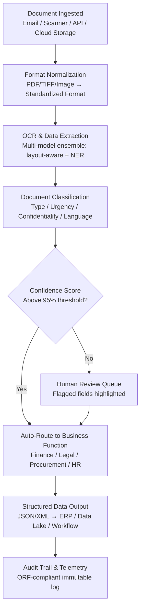

# DocuFlow — Document Intelligence

Frankmax

NAICS 551112, 541611-541990

> **Multinational Corporate Empires** — Enterprise AI Operations

## Objective & Purpose

Large enterprises process between 2 million and 10 million documents annually across procurement, legal, finance, HR, and operations. The majority of these documents -- invoices, contracts, purchase orders, compliance filings, internal memos -- are still handled through manual data entry, email routing, and spreadsheet tracking. Industry benchmarks show that manual document processing costs between $6 and $25 per document when accounting for labor, error correction, and re-work. For a multinational processing 5 million documents per year, that translates to $30M-$125M in annual document handling costs alone.

DocuFlow applies multi-model AI to extract structured data from unstructured documents, classify documents by type and urgency, route them to the correct business function, and flag anomalies for human review. The system handles 40+ document types out of the box (invoices, contracts, purchase orders, shipping manifests, regulatory filings, board materials) and learns new document types within 48 hours of exposure to 50+ examples.

The strategic value of DocuFlow extends beyond cost reduction. Every document processed creates a telemetry event that feeds the marketplace's Failure Intelligence Library. Document classification accuracy, extraction error rates, and routing decisions accumulate into an organizational knowledge layer that compounds over time -- making the system harder to replicate and more expensive to abandon with each passing month.

## Business Context

| Attribute | Value |
|---|---|
| **Business Process** | Document processing, extraction, classification, and routing |
| **Business Function** | Operations / Shared Services |
| **Category** | Automation |
| **Target Audience** | 7. Multinational Corporate Empires |
| **Revenue Priority** | #3 (30-60 day revenue stream) |
| **Bundle** | Enterprise Operations Pack ($4,500/mo) |
| **Monthly Cost of Inaction** | $50K-$500K (labor, errors, delayed processing) |

## BPMN Workflow

## Features

1. **Multi-Format Ingestion Engine** — Accepts PDF, TIFF, JPEG, PNG, DOCX, XLSX, email (EML/MSG), and scanned images. Handles multi-page documents, rotated pages, and low-resolution scans with pre-processing normalization.

2. **Layout-Aware Data Extraction** — Goes beyond basic OCR by understanding document structure: tables, headers, footers, sidebars, multi-column layouts. Extracts key-value pairs from invoices (vendor, amount, line items, tax), contracts (parties, dates, obligations), and forms (field-level extraction).

3. **40+ Document Type Classification** — Pre-trained classifiers for invoices, purchase orders, contracts, NDAs, shipping manifests, regulatory filings, board resolutions, HR documents, insurance claims, and more. New document types trainable within 48 hours with 50+ examples.

4. **Multi-Language Support** — Processes documents in 25+ languages with automatic language detection. Critical for multinationals operating across jurisdictions with local-language documentation requirements.

5. **Anomaly Detection & Flagging** — Identifies duplicate invoices, amount mismatches, missing required fields, unusual vendor patterns, and compliance red flags. Escalates to human review with specific anomaly annotations.

6. **Intelligent Routing Engine** — Routes extracted data to the correct business function, ERP system, or approval workflow based on document type, content, amount thresholds, and organizational rules. Supports configurable routing logic per entity and jurisdiction.

7. **Confidence Scoring & Human-in-the-Loop** — Every extraction carries a field-level confidence score. Fields below the configurable threshold (default 95%) are flagged for human review. Human corrections feed back into the model, improving accuracy over time.

8. **ORF-Compliant Audit Trail** — Every document processing event is logged immutably: ingestion timestamp, extraction results, classification decision, routing destination, human review actions. Meets ETLB requirements for binding human accountability to AI-assisted decisions.

## Workflow & Automation

**Step 1: Document Capture** — Documents enter the system through four channels: email forwarding (dedicated inbox per document type), scanner integration (network-connected MFPs), API upload (from existing applications), and cloud storage monitoring (S3, Azure Blob, GCS, SharePoint). Each ingestion event is timestamped and assigned a unique Document Processing ID.

**Step 2: Pre-Processing & Normalization** — Raw documents are converted to a standardized internal format. Image enhancement algorithms correct for skew, rotation, and low contrast. Multi-page documents are split into logical sections. Encrypted or password-protected files are flagged for manual decryption.

**Step 3: Multi-Model Extraction** — Three AI models process each document in parallel: (a) an OCR model for raw text extraction, (b) a layout analysis model that understands document structure and spatial relationships, (c) a named entity recognition model that identifies specific data points (dates, amounts, names, addresses, account numbers). Results are merged using ensemble scoring.

**Step 4: Classification & Prioritization** — The extracted content is classified by document type, assigned an urgency score (based on deadlines, amounts, and compliance implications), and tagged with confidentiality level and applicable jurisdiction. Documents requiring same-day action are escalated to a priority queue.

**Step 5: Validation & Quality Check** — Extracted data is cross-referenced against master data (vendor lists, employee directories, contract databases) to validate accuracy. Business rules are applied: invoice amounts checked against PO limits, contract dates validated against existing agreements, regulatory filings checked for completeness.

**Step 6: Routing & Integration** — Validated data is routed to destination systems via pre-configured connectors: ERP (SAP, Oracle, NetSuite), contract management (DocuSign CLM, Ironclad), workflow tools (ServiceNow, Jira), and data lakes. Routing rules are configurable per organization, entity, and document type.

**Step 7: Continuous Learning & Reporting** — Processing metrics are aggregated into daily/weekly dashboards: documents processed, extraction accuracy, human review rate, processing time distribution, anomaly frequency. Human corrections are fed back into the model training pipeline on a weekly cycle.

## Input/Output Specifications

| Direction | Data | Format | Description |
|---|---|---|---|
| Input | Raw documents | PDF, TIFF, JPEG, PNG, DOCX, XLSX, EML/MSG | Scanned, digital-native, or email-attached documents |
| Input | Configuration rules | JSON/YAML | Routing rules, confidence thresholds, classification mappings |
| Input | Master data references | CSV/API | Vendor lists, employee directories, contract databases |
| Output | Extracted structured data | JSON, XML, CSV | Key-value pairs, line items, entity relationships |
| Output | Classification metadata | JSON | Document type, urgency score, confidentiality level, language |
| Output | Routing events | Webhook/API | Destination system, timestamp, processing ID |
| Output | Audit trail records | JSON (immutable log) | ORF-compliant processing history per document |
| Output | Analytics dashboards | REST API / UI | Throughput, accuracy, anomaly rates, cost savings |

## Integration Points

| System | Integration Type | Data Flow |
|---|---|---|
| **Billing Leakage Detector** | Bidirectional API | Extracted invoice data feeds leakage analysis; flagged invoices returned for re-processing |
| **Chokepoint Intelligence Engine** | Outbound telemetry | Document processing bottlenecks feed chokepoint identification |
| **Multi-Model AI Orchestrator** | Infrastructure dependency | DocuFlow uses orchestrator for model selection and routing |
| **Board Decision Intelligence** | Outbound feed | Processed board materials, regulatory filings, and financial documents feed board briefings |
| **Enterprise Knowledge Graph** | Outbound structured data | Extracted entities and relationships feed the organizational knowledge layer |
| **SAP / Oracle / NetSuite** | ERP connectors (REST/RFC) | Extracted invoice, PO, and payment data pushed to ERP |
| **ServiceNow / Jira** | Workflow trigger | Document processing events trigger downstream workflows |
| **Audit Trail & Traceability Engine** | Outbound log stream | All processing events written to immutable audit log |

## Pricing & Revenue Model

| Component | Pricing | Notes |
|---|---|---|
| **Enterprise Operations Pack** | $4,500/month | Includes DocuFlow + Billing Leakage Detector + Chokepoint Intelligence |
| **Standalone DocuFlow** | $2,200/month | Up to 50,000 documents/month |
| **Volume tier (50K-200K docs)** | $3,800/month | Includes priority support and custom document types |
| **Volume tier (200K+ docs)** | Custom pricing | Dedicated model training, SLA guarantees |
| **AI token consumption** | Included at 80% discount | 1M tokens/month in bundle; overage at marketplace rates |
| **Governance & Audit add-on** | +$800/month | ORF-compliant audit trail with regulatory export |

**Revenue model**: DocuFlow is the "burger" -- priced to win against manual processing costs ($6-$25/doc vs. $0.04-$0.08/doc). The "fries" attach through governance layers (audit trail, compliance reporting, failure intelligence) at 70-85% margin. Target attachment rate: 55%+ within 6 months.

## NAICS/SIC Mapping

| NAICS Code | SIC Code | Industry | Relevance |
|---|---|---|---|
| 551112 | 6712 | Offices of Other Holding Companies | Corporate shared services document processing |
| 541611 | 7371 | Administrative Management Consulting | Consulting document management |
| 541990 | 7389 | All Other Professional Services | Cross-functional document workflows |
| 522110 | 6021 | Commercial Banking | Loan documentation, KYC documents |
| 524114 | 6311 | Direct Health and Medical Insurance | Claims documentation, policy documents |
| 236220 | 1542 | Commercial Construction | Contract documents, permits, inspections |
| 311-339 | 2000-3999 | Manufacturing | Purchase orders, quality documents, shipping manifests |
| 481-488 | 4011-4789 | Transportation & Warehousing | Bills of lading, customs documents |
