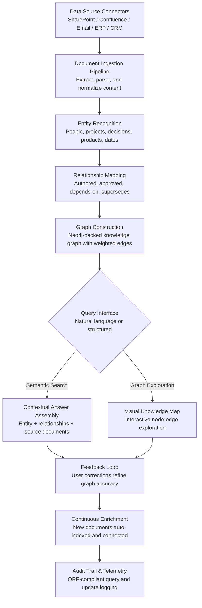

# Enterprise Knowledge Graph

Frankmax

NAICS 551112, 541611-541990

> **Multinational Corporate Empires** — Enterprise Knowledge Graph

## Objective & Purpose

Large multinationals generate millions of documents, decisions, and data artifacts annually across hundreds of business units, geographies, and functions. The institutional knowledge embedded in these artifacts -- who decided what, why, with what outcome, and what dependencies exist -- is almost never captured in a way that makes it searchable, connectable, or reusable. When a product manager in Singapore needs to understand why a pricing decision was made in Frankfurt three years ago, the answer lives in someone's email, a forgotten SharePoint folder, or the memory of an employee who has since left the company. McKinsey estimates knowledge workers spend 19% of their time searching for information, costing a 10,000-person enterprise $60M-$90M annually in lost productivity.

The Enterprise Knowledge Graph ingests structured and unstructured data from across the organization -- documents, emails, chat transcripts, meeting recordings, project files, CRM records, ERP transactions, and code repositories -- and builds a connected graph of entities (people, projects, decisions, products, markets, technologies) and relationships (authored, approved, depends-on, superseded-by, related-to). Natural language queries return not just documents but contextual answers: the decision, who made it, what preceded it, what followed, and what still depends on it.

Unlike traditional enterprise search (keyword matching against document indexes), the Knowledge Graph understands semantic relationships. It can answer questions like "What were all the compliance issues raised during EMEA expansion between 2021 and 2023, and which were resolved?" or "Which internal teams have expertise in transformer-based NLP models?" The graph compounds in value: every query that refines a relationship, every new document ingested, and every user correction strengthens the knowledge network. This compounding effect is core to the marketplace's "kitchen" strategy -- organizational intelligence that becomes more valuable every day and creates switching costs no competitor can replicate.

## Business Context

| Attribute | Value |
|---|---|
| **Business Process** | Knowledge management |
| **Business Function** | Information Management |
| **Category** | Knowledge |
| **Target Audience** | 7. Multinational Corporate Empires |
| **Bundle** | Enterprise Operations Pack ($4,500/mo) |
| **Monthly Cost of Inaction** | $50K-$250K (lost productivity, duplicated work, decision latency) |

## BPMN Workflow

## Features

1. **Multi-Source Data Ingestion** — Connects to 30+ enterprise data sources including SharePoint, Confluence, Google Workspace, Slack, Microsoft Teams, Salesforce, SAP, Oracle, Jira, GitHub, and email systems (Exchange, Gmail). Normalizes content across formats (PDF, DOCX, PPTX, HTML, Markdown, code) into a unified representation with metadata preservation.

2. **Intelligent Entity Extraction** — NLP models identify and classify entities across ingested content: people (roles, departments, expertise), projects (timelines, outcomes, dependencies), decisions (rationale, approvers, alternatives considered), products (specifications, markets, lifecycle stage), and regulatory requirements (jurisdictions, compliance status, deadlines).

3. **Semantic Relationship Mapping** — Goes beyond keyword co-occurrence to identify meaningful relationships: authorship chains, approval hierarchies, dependency trees, temporal sequences, causal links, and contradiction detection. Each relationship carries a confidence score and provenance trail back to source documents.

4. **Natural Language Query Engine** — Users ask questions in plain language. The system translates queries into graph traversals, returning contextual answers with supporting evidence rather than ranked document lists. Supports follow-up questions that refine the graph traversal scope without requiring query reformulation.

5. **Visual Knowledge Explorer** — Interactive graph visualization showing entity clusters, relationship paths, and knowledge density maps. Users can explore connections visually, identify knowledge gaps (disconnected subgraphs), and discover non-obvious relationships between projects, teams, or decisions.

6. **Expertise Discovery** — Maps individual and team expertise based on document authorship, project participation, and peer citation patterns. Enables "find me someone who knows about X" queries that return ranked expert lists with evidence of their expertise.

7. **Knowledge Decay Detection** — Identifies knowledge assets that are aging out: documents not updated in 18+ months, decision rationale referencing outdated conditions, process documentation that contradicts current practice. Generates knowledge refresh recommendations prioritized by business impact.

8. **Cross-Subsidiary Intelligence** — For multinational holding companies, maintains separate knowledge graphs per subsidiary while enabling cross-graph queries. A question asked in one subsidiary can surface relevant knowledge from another, respecting access controls and confidentiality boundaries.

## Workflow & Automation

**Step 1: Data Source Connection** — Configure connectors to the organization's document repositories, communication platforms, project management tools, and enterprise systems. Each connector maps source-specific metadata (folder structure, tags, permissions) to the graph schema. Initial crawl indexes historical content; incremental sync captures new and modified content.

**Step 2: Content Processing & Entity Extraction** — Ingested content passes through the NLP pipeline: language detection, text extraction (including OCR for scanned documents), entity recognition, and classification. Each entity is assigned a unique identifier, type classification, and confidence score. Ambiguous entities (e.g., "the project" without context) are flagged for disambiguation.

**Step 3: Relationship Inference & Graph Construction** — The system identifies relationships between entities using co-occurrence analysis, semantic similarity, temporal proximity, and explicit references (hyperlinks, citations, @mentions). Relationships are typed (authored, approved, depends-on, supersedes, contradicts) and weighted by confidence. The graph is constructed incrementally with conflict resolution for duplicate entities.

**Step 4: Quality Validation & Deduplication** — Automated quality checks identify duplicate entities (same person referenced by different names or email addresses), contradictory relationships, and low-confidence edges. Deduplication rules merge entity records while preserving provenance. Quality metrics are tracked: entity resolution accuracy, relationship coverage, and graph completeness.

**Step 5: Query Processing & Answer Assembly** — User queries are parsed into intent (what are they looking for), scope (time range, business unit, topic), and format (answer, document list, expert list, visual map). The query engine traverses the graph, assembles contextual answers from multiple source documents, and ranks results by relevance and recency.

**Step 6: Feedback Integration & Graph Refinement** — Users provide implicit feedback (clicking, bookmarking, sharing) and explicit feedback (correcting entity classifications, confirming or rejecting relationships). Feedback is incorporated into the graph, improving accuracy over time. Monthly graph quality reports track accuracy trends and identify areas needing curation.

## Input/Output Specifications

| Direction | Data | Format | Description |
|---|---|---|---|
| Input | Document repositories | API (SharePoint, Confluence, GDrive) | Organizational documents, wikis, knowledge bases |
| Input | Communication data | API (Slack, Teams, Exchange) | Emails, chat messages, meeting transcripts |
| Input | Project data | API (Jira, Asana, Monday.com) | Project artifacts, tasks, timelines, outcomes |
| Input | Enterprise system data | API (SAP, Salesforce, Oracle) | CRM records, ERP transactions, financial data |
| Output | Contextual answers | JSON + rendered UI | Entity-relationship answers with source citations |
| Output | Knowledge maps | JSON (graph format) / SVG | Visual entity-relationship graphs |
| Output | Expert recommendations | JSON + PDF | Ranked expertise lists with evidence |
| Output | Audit trail | JSON (immutable log) | ORF-compliant query and graph update history |

## Integration Points

| System | Integration Type | Data Flow |
|---|---|---|
| **DocuFlow -- Document Intelligence** | Inbound data feed | Extracted document content feeds graph construction |
| **Board Decision Intelligence** | Bidirectional | Decision records enrich the graph; graph queries support board briefings |
| **Chokepoint Intelligence Engine** | Outbound analytics | Knowledge bottlenecks (single-expert dependencies) feed chokepoint analysis |
| **Organizational Drift Detector** | Outbound analytics | Knowledge distribution patterns indicate cultural alignment or drift |
| **Talent-to-Task Matching Engine** | Outbound expertise data | Expertise maps inform resource allocation decisions |
| **Multi-Model AI Orchestrator** | Infrastructure | NLP model routing for entity extraction and query processing |
| **Audit Trail and Traceability Engine** | Outbound log stream | All graph operations logged immutably |
| **Failure Intelligence Library** | Outbound anonymized patterns | Knowledge management failure patterns feed cross-industry intelligence |

## Pricing & Revenue Model

| Component | Pricing | Notes |
|---|---|---|
| **Enterprise Operations Pack** | $4,500/month | Includes Knowledge Graph + DocuFlow + Chokepoint Intelligence |
| **Standalone -- Subscription** | $3,200/month | Up to 10,000 users, 5M documents indexed |
| **Large Enterprise (over 10K users)** | Custom pricing | Dedicated instance, custom entity models, SLA guarantees |
| **Cross-subsidiary module** | +$1,500/month | Multi-graph federation with access control |
| **Expertise discovery add-on** | +$800/month | Skills mapping, expert routing, gap analysis |
| **AI token consumption** | Included at 80% discount | 3M tokens/month in bundle; overage at marketplace rates |

**Revenue model**: Enterprise Knowledge Graph is a high-retention "kitchen" product -- once an organization's institutional knowledge is mapped, the switching cost is extreme. Initial deployment drives the "burger" sale (discounted AI access for NLP processing). The "fries" attach through governance layers: audit trail compliance for knowledge access, expertise certification for regulated industries, and knowledge decay monitoring at 75-90% margin. Typical deployment reaches positive ROI within 6 months through reduced search time and eliminated duplicate work.

## NAICS/SIC Mapping

| NAICS Code | SIC Code | Industry | Relevance |
|---|---|---|---|
| 551112 | 6712 | Offices of Other Holding Companies | Cross-subsidiary knowledge federation |
| 541611 | 7371 | Administrative Management Consulting | Organizational knowledge optimization |
| 541512 | 7372 | Computer Systems Design Services | Technical knowledge management |
| 541990 | 7389 | All Other Professional Services | Professional knowledge capture |
| 541720 | 8733 | Research and Development | R&D knowledge graph and prior art tracking |
| 523920 | 6282 | Portfolio Management | Investment research knowledge management |
| 311-339 | 2000-3999 | Manufacturing | Engineering and process knowledge capture |
