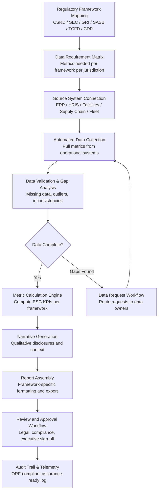

# ESG Compliance & Reporting Engine

Frankmax

NAICS 551112, 541611-541990

> **Multinational Corporate Empires** — ESG Compliance & Reporting Engine

## Objective & Purpose

ESG (Environmental, Social, and Governance) reporting has shifted from voluntary PR exercise to mandatory regulatory obligation across every major market. The EU Corporate Sustainability Reporting Directive (CSRD) requires 50,000+ companies to report under European Sustainability Reporting Standards (ESRS) starting in 2024. The SEC's climate disclosure rules mandate Scope 1, 2, and (for large filers) Scope 3 emissions reporting. California's SB 253 and SB 261 add state-level requirements. For a multinational operating across 20+ jurisdictions, the compliance matrix is staggering: different frameworks (GRI, SASB, TCFD, CDP, ISSB), different metrics, different reporting periods, different assurance requirements, and different penalties for non-compliance. A single ESG report can require data from 500+ internal sources across dozens of subsidiaries.

The ESG Compliance & Reporting Engine automates the end-to-end ESG reporting lifecycle: data collection from operational systems (energy consumption, waste generation, water usage, workforce demographics, supply chain audits, governance records), metric calculation against multiple frameworks simultaneously, gap analysis identifying missing data points, narrative generation for qualitative disclosures, and report assembly in the format required by each jurisdiction and framework. The system maintains a single source of truth for ESG data, eliminating the spreadsheet-driven processes that plague most organizations and introduce errors, versioning conflicts, and audit failures.

The business case is built on both risk avoidance and efficiency gains. Non-compliance penalties under CSRD can reach 5% of annual turnover. Beyond penalties, ESG data quality directly affects capital cost -- investors with $130T in AUM have signed onto ESG-linked investment frameworks. The "fries" attach naturally: ESG audit trail (required for third-party assurance), regulatory change tracking (ESG regulations evolve quarterly), and board-ready ESG dashboards. Organizations that start with reporting quickly expand to ESG strategy optimization, creating a multi-year, expanding engagement.

## Business Context

| Attribute | Value |
|---|---|
| **Business Process** | Sustainability reporting |
| **Business Function** | ESG/Compliance |
| **Category** | Reporting |
| **Target Audience** | 7. Multinational Corporate Empires |
| **Bundle** | Enterprise Operations Pack ($4,500/mo) |
| **Monthly Cost of Inaction** | $25K-$500K (regulatory penalties, capital cost premium, audit failures) |

## BPMN Workflow

## Features

1. **Multi-Framework Compliance Engine** — Supports 12+ ESG reporting frameworks simultaneously: CSRD/ESRS, SEC Climate Rules, GRI Standards, SASB Standards, TCFD Recommendations, CDP Questionnaire, ISSB (IFRS S1/S2), UN SDGs, EU Taxonomy, California SB 253/261, UK Streamlined Energy and Carbon Reporting (SECR), and Australian climate disclosure. Cross-maps metrics across frameworks to minimize duplicate data collection.

2. **Automated Data Collection** — Connects to operational systems (ERP for energy and procurement data, HRIS for workforce demographics, facilities management for emissions sources, fleet management for Scope 1 mobile emissions, supply chain platforms for Scope 3 data) and pulls ESG-relevant metrics on configurable schedules. Reduces manual data gathering from months to days.

3. **Scope 1-2-3 Emissions Calculator** — Calculates greenhouse gas emissions across all three scopes using IPCC-aligned emission factors, regional grid intensity data, and activity-based calculation methodologies. Supports both location-based and market-based Scope 2 calculations. Scope 3 estimation covers all 15 categories with data quality scoring.

4. **Data Gap Analysis & Quality Scoring** — Compares collected data against framework requirements and flags gaps: missing metrics, insufficient granularity, outdated data, and statistical outliers. Each data point receives a quality score based on source reliability, measurement methodology, and temporal relevance. Gap remediation workflows route data requests to responsible business units.

5. **AI-Generated Narrative Disclosures** — Produces draft qualitative disclosures (risk descriptions, strategy narratives, target explanations) based on collected data and organizational context. Narratives follow framework-specific language requirements and include quantitative evidence. Human reviewers edit rather than draft from scratch, reducing report writing time by 60-80%.

6. **Regulatory Change Monitoring** — Tracks ESG regulatory changes across jurisdictions in real time. When a new requirement or amendment is published, the system assesses impact on the organization's reporting obligations, identifies new data requirements, and updates the compliance matrix automatically.

7. **Assurance-Ready Audit Trail** — Every data point, calculation, narrative section, and approval carries a complete provenance chain: source system, extraction date, calculation methodology, reviewer identity, and approval timestamp. Designed for third-party limited or reasonable assurance engagements required under CSRD.

## Workflow & Automation

**Step 1: Framework Configuration** — Configure the applicable reporting frameworks based on the organization's jurisdictions, listing status, revenue thresholds, and voluntary commitments. The system generates a unified data requirements matrix showing every metric needed, mapped to source systems, responsible business units, and collection deadlines.

**Step 2: Data Source Integration** — Connect to operational systems that hold ESG-relevant data. The integration layer normalizes units (kWh vs. MJ, metric tons vs. short tons), currencies, and reporting periods. Historical data is imported for trend analysis and baseline establishment.

**Step 3: Automated Data Collection & Validation** — The system pulls data from connected sources on configurable schedules (daily, weekly, monthly). Validation rules check for completeness, range plausibility, year-over-year variance thresholds, and cross-metric consistency. Failed validations generate data quality tickets routed to business unit data owners.

**Step 4: Metric Calculation & Aggregation** — Raw data is transformed into framework-specific metrics. Emissions calculations apply appropriate factors and methodologies. Social metrics aggregate workforce data across subsidiaries. Governance metrics compile board and committee information. All calculations carry methodology documentation and assumption disclosures.

**Step 5: Report Generation & Review** — The system assembles framework-specific reports combining quantitative metrics and AI-generated narrative disclosures. Reports enter a configurable approval workflow: business unit review, legal review, compliance sign-off, and executive approval. Each reviewer's edits and approvals are logged in the audit trail.

**Step 6: Submission & Archival** — Finalized reports are exported in required formats (XHTML for CSRD/ESEF, PDF for SEC, online portal submissions for CDP). All submitted reports and underlying data are archived with immutable timestamps for regulatory reference and year-over-year comparison.

## Input/Output Specifications

| Direction | Data | Format | Description |
|---|---|---|---|
| Input | Energy consumption data | API / CSV (utility feeds, ERP) | Electricity, gas, fuel consumption by facility |
| Input | Workforce demographics | API (HRIS - Workday, SAP HCM) | Headcount, diversity, safety, training metrics |
| Input | Supply chain data | API / CSV | Supplier audits, procurement spend, Scope 3 inputs |
| Input | Governance records | API / manual entry | Board composition, committee activity, policy documents |
| Input | Regulatory framework updates | RSS / API (regulatory feeds) | New and amended ESG reporting requirements |
| Output | ESG reports | XHTML (ESEF), PDF, XLSX | Framework-specific formatted reports |
| Output | Data quality dashboard | REST API / UI | Completeness scores, gap status, validation results |
| Output | Audit trail | JSON (immutable log) | ORF-compliant provenance chain for assurance |
| Output | Board ESG summary | PDF / API | Executive dashboard with KPI trends and risk flags |

## Integration Points

| System | Integration Type | Data Flow |
|---|---|---|
| **Regulatory Change Tracker** | Inbound feed | New ESG regulations update the compliance matrix automatically |
| **Board Decision Intelligence** | Outbound summary | ESG performance metrics included in board briefing packages |
| **DocuFlow -- Document Intelligence** | Inbound data feed | Extracted data from supplier audit reports and policy documents |
| **Billing Leakage Detector** | Cross-reference | Energy billing accuracy validated against utility invoices |
| **Chokepoint Intelligence Engine** | Outbound analytics | ESG data collection bottlenecks feed chokepoint analysis |
| **Supply Chain Risk Neural Network** | Bidirectional | Supply chain ESG risk data shared for comprehensive risk modeling |
| **Audit Trail and Traceability Engine** | Outbound log stream | All ESG data operations logged immutably for assurance |
| **Failure Intelligence Library** | Outbound anonymized patterns | ESG reporting failure patterns feed cross-industry intelligence |

## Pricing & Revenue Model

| Component | Pricing | Notes |
|---|---|---|
| **Enterprise Operations Pack** | $4,500/month | Includes ESG Reporting + DocuFlow + Chokepoint Intelligence |
| **Standalone -- Subscription** | $3,500/month | Up to 3 frameworks, 50 facilities, single jurisdiction |
| **Multi-jurisdiction tier** | $5,800/month | Unlimited frameworks, unlimited facilities, global coverage |
| **Assurance-ready audit module** | +$1,200/month | Enhanced provenance tracking for third-party assurance |
| **Scope 3 deep analysis** | +$900/month | Full 15-category Scope 3 estimation with supplier engagement |
| **AI token consumption** | Included at 80% discount | 2M tokens/month in bundle; overage at marketplace rates |

**Revenue model**: ESG reporting is a compliance-driven purchase with annual recurrence and expanding scope (regulations only increase). The "burger" is automated data collection and report assembly at 80% cost reduction vs. manual processes. The "fries" are high-margin governance layers: audit trail for assurance readiness (required by CSRD), regulatory change tracking (ESG rules change quarterly), and board dashboards at 70-90% margin. Once an organization's ESG data infrastructure is built on the platform, switching costs are substantial -- the data history, calculation methodologies, and audit trails are deeply embedded.

## NAICS/SIC Mapping

| NAICS Code | SIC Code | Industry | Relevance |
|---|---|---|---|
| 551112 | 6712 | Offices of Other Holding Companies | Group-level ESG consolidation reporting |
| 541611 | 7371 | Administrative Management Consulting | ESG strategy and reporting advisory |
| 541620 | 8742 | Environmental Consulting Services | Environmental data management and reporting |
| 541990 | 7389 | All Other Professional Services | ESG assurance and verification services |
| 311-339 | 2000-3999 | Manufacturing | Emissions reporting, waste management, safety metrics |
| 211-213 | 1311-1389 | Oil and Gas / Mining | High-intensity environmental reporting requirements |
| 221 | 4911-4932 | Utilities | Energy generation and distribution emissions reporting |
