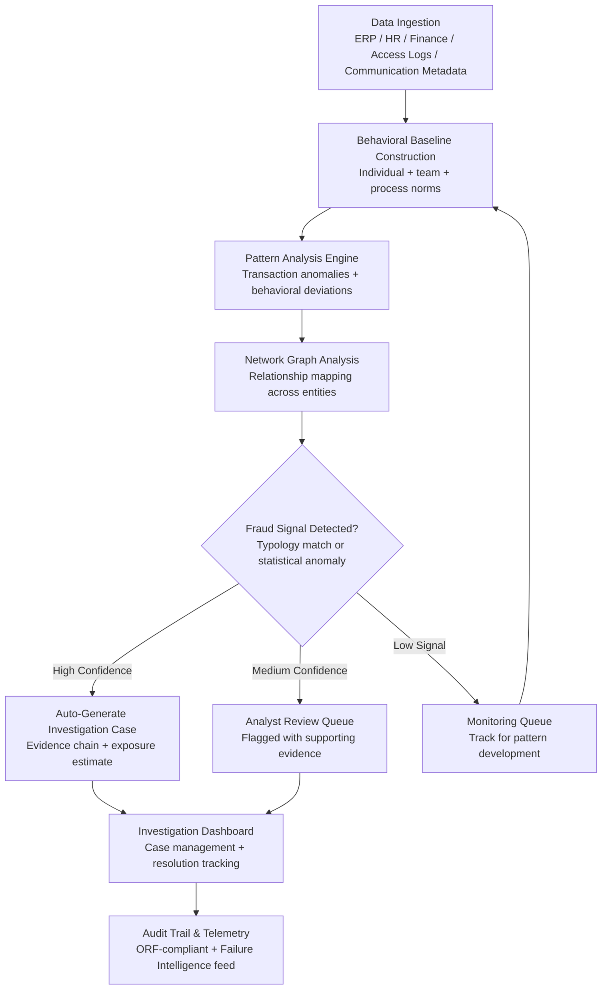

# Internal Fraud Pattern Detector

Frankmax

NAICS 551112, 541611-541990

> **Multinational Corporate Empires** — Internal Fraud Pattern Detector

## Objective & Purpose

The Association of Certified Fraud Examiners (ACFE) estimates that organizations lose 5% of annual revenue to occupational fraud. For a $2B multinational, that is $100M per year -- and the median fraud scheme runs for 12 months before detection. Internal fraud takes many forms: expense report manipulation, vendor kickback schemes, payroll ghost employees, procurement bid rigging, revenue recognition manipulation, intellectual property theft, and unauthorized access to sensitive data. Traditional audit approaches -- annual sampling, periodic reviews, whistleblower hotlines -- catch only a fraction. Most internal fraud is detected by accident or tip, not by systematic controls.

The Internal Fraud Pattern Detector applies behavioral analytics, transaction pattern analysis, and network graph intelligence to detect anomalous patterns indicative of internal fraud across the enterprise. The system ingests data from ERP systems (procurement, accounts payable, expense management), HR systems (employee records, access logs, organizational hierarchy), communication metadata (email patterns, login times, system access), and financial systems (journal entries, wire transfers, intercompany transactions). It builds behavioral baselines for individuals, teams, and business processes, then flags deviations that match known fraud typologies or represent statistical anomalies requiring investigation.

The critical advantage over rules-based fraud detection is pattern recognition across multiple data sources. A procurement manager who always approves invoices just below the approval threshold, from a vendor registered at the same address as a relative, with deliveries that never appear in inventory -- each data point alone might pass a single-system audit, but the network pattern is unmistakable. The Internal Fraud Pattern Detector connects these dots across systems, generating investigation-ready case files with evidence chains, estimated financial exposure, and recommended response actions.

## Business Context

| Attribute | Value |
|---|---|
| **Business Process** | Internal audit |
| **Business Function** | Audit |
| **Category** | Security |
| **Target Audience** | 7. Multinational Corporate Empires |
| **Bundle** | Enterprise Operations Pack ($4,500/mo) |
| **Monthly Cost of Inaction** | $50K-$500K (undetected fraud losses, audit failures, regulatory fines) |

## BPMN Workflow

## Features

1. **Multi-Source Behavioral Baselining** — Builds behavioral profiles across 50+ dimensions for every employee with financial system access: transaction volumes, approval patterns, vendor relationships, expense timing, login patterns, access frequency, and communication networks. Baselines adapt seasonally and account for role changes, ensuring deviations represent genuine anomalies rather than normal business variation.

2. **Fraud Typology Library** — Pre-built detection models for 30+ internal fraud schemes: expense report padding, fictitious vendor creation, bid rigging, payroll manipulation, unauthorized discounts, revenue recognition timing abuse, intercompany transfer manipulation, intellectual property exfiltration, and more. Each typology includes detection rules, red flag indicators, and investigation playbooks.

3. **Network Graph Intelligence** — Maps relationships between employees, vendors, customers, and external entities using shared attributes (addresses, phone numbers, bank accounts, IP addresses, corporate registrations). Identifies hidden connections that indicate collusion: employees approving invoices from vendors linked to their personal networks, or coordinated transaction patterns across seemingly independent actors.

4. **Threshold Clustering Detection** — Identifies transactions clustered just below approval thresholds -- a classic fraud indicator. The system detects not just individual threshold proximity but patterns: an employee who consistently submits expenses at $4,950 when the threshold is $5,000, or purchase orders split across multiple days to avoid cumulative review triggers.

5. **Journal Entry Anomaly Detection** — Analyzes general ledger journal entries for fraud indicators: unusual account combinations, entries posted outside business hours, round-dollar amounts, entries reversing within the same period, and entries posted by users who do not normally make journal entries. Particularly effective for detecting revenue recognition manipulation and asset misappropriation.

6. **Investigation Case Builder** — When fraud signals cross confidence thresholds, the system auto-generates investigation case files containing: the detected pattern, all supporting transactions with timestamps, estimated financial exposure, involved entities with relationship maps, similar historical cases (if any), and recommended investigation steps.

7. **Continuous Monitoring Dashboard** — Real-time visibility into fraud risk across the organization: heat maps by business unit, trend analysis of fraud indicators, open investigation status, and resolved case outcomes. Executive summaries track fraud prevention ROI (losses avoided vs. tool cost).

## Workflow & Automation

**Step 1: Data Integration & Normalization** — Connect to the organization's transactional systems: ERP (procurement, AP, AR, GL), HRIS (employee records, org chart), expense management (Concur, Expensify), IT access logs (Active Directory, VPN, application access), and communication metadata (email headers, login timestamps). Data is normalized into a unified entity-transaction model.

**Step 2: Behavioral Baseline Construction** — The system analyzes 12-24 months of historical data to establish behavioral norms for each employee, team, and process. Baselines cover transaction volumes, amounts, timing, approval chains, vendor relationships, and system access patterns. Seasonal adjustments account for year-end close, budget cycles, and business-specific patterns.

**Step 3: Real-Time Pattern Scanning** — New transactions and activities are continuously scanned against both baselines (statistical deviation detection) and fraud typology rules (pattern matching). Each scan produces a fraud risk score combining multiple signals. Low-scoring transactions pass silently; elevated scores enter the review pipeline.

**Step 4: Network Analysis & Correlation** — For elevated-risk transactions, the system performs deeper network analysis: mapping all relationships between involved entities, checking for hidden connections, correlating with other recent anomalies from the same individual or business unit, and cross-referencing external data sources (corporate registrations, sanctions lists).

**Step 5: Case Generation & Prioritization** — Confirmed fraud signals generate investigation cases ranked by estimated financial exposure. Each case contains the complete evidence chain, involved parties, timeline, and recommended investigation steps. Cases are routed to internal audit teams with appropriate access controls to prevent tip-offs.

**Step 6: Investigation Support & Resolution** — Investigators work cases through a secure dashboard, adding findings, requesting additional data pulls, and documenting interviews. The system supports investigation workflows: evidence preservation, chain of custody documentation, and resolution tracking (confirmed fraud, policy violation, false positive, inconclusive).

**Step 7: Feedback & Model Refinement** — Investigation outcomes feed back into the detection models. Confirmed fraud cases strengthen the relevant typology models. False positives trigger threshold adjustments. New fraud patterns discovered during investigation are codified into new detection rules.

## Input/Output Specifications

| Direction | Data | Format | Description |
|---|---|---|---|
| Input | ERP transactions | SAP BAPI / Oracle REST / CSV | Procurement, AP, AR, GL transaction records |
| Input | Employee records | API (Workday, SAP HCM) | Org hierarchy, roles, access permissions |
| Input | Expense reports | API (Concur, Expensify) | Individual expense claims with receipts |
| Input | Access logs | Syslog / API (Active Directory) | System login, application access, VPN connections |
| Input | Communication metadata | API (Exchange, Slack headers) | Email patterns, message timing (not content) |
| Output | Investigation cases | JSON + PDF report | Evidence chain, exposure estimate, investigation playbook |
| Output | Fraud risk dashboard | REST API / UI | Organizational fraud risk heat map and trend analysis |
| Output | Audit trail | JSON (immutable log) | ORF-compliant detection and investigation history |
| Output | Executive summary | PDF / API | Monthly fraud risk briefing with prevention ROI |

## Integration Points

| System | Integration Type | Data Flow |
|---|---|---|
| **Billing Leakage Detector** | Bidirectional | Financial anomalies from billing feed fraud analysis; fraud patterns inform leakage detection |
| **Board Decision Intelligence** | Outbound summary | Fraud risk metrics and material investigation outcomes in board briefings |
| **Chokepoint Intelligence Engine** | Outbound analytics | Audit process bottlenecks and control weaknesses feed chokepoint analysis |
| **Enterprise Knowledge Graph** | Inbound context | Organizational relationships provide context for network analysis |
| **Regulatory Change Tracker** | Inbound feed | New anti-fraud regulations update detection rules |
| **Audit Trail and Traceability Engine** | Outbound log stream | All detection and investigation activities logged immutably |
| **SAP / Oracle / NetSuite** | Inbound API | Transactional data for continuous fraud monitoring |
| **Failure Intelligence Library** | Outbound anonymized patterns | Fraud patterns (anonymized) feed cross-industry intelligence |

## Pricing & Revenue Model

| Component | Pricing | Notes |
|---|---|---|
| **Enterprise Operations Pack** | $4,500/month | Includes Fraud Pattern Detector + DocuFlow + Chokepoint Intelligence |
| **Standalone -- Subscription** | $3,200/month | Up to 5,000 employees monitored |
| **Large Enterprise (over 5K employees)** | Custom pricing | Dedicated instance, custom typologies, SLA guarantees |
| **Network graph intelligence add-on** | +$1,200/month | External entity resolution and relationship mapping |
| **Investigation case management** | +$800/month | Full investigation workflow, evidence management, resolution tracking |
| **AI token consumption** | Included at 80% discount | 2M tokens/month in bundle; overage at marketplace rates |

**Revenue model**: Internal Fraud Pattern Detector sells on loss prevention -- the 5% revenue leakage statistic makes the ROI conversation immediate. The "burger" is anomaly detection at a fraction of the cost of building internal data science teams. The "fries" attach through investigation case management, regulatory compliance reporting, and audit trail at 75-90% margin. Organizations that deploy fraud detection typically expand to Billing Leakage Detector and Chokepoint Intelligence within 6 months, driving bundle adoption.

## NAICS/SIC Mapping

| NAICS Code | SIC Code | Industry | Relevance |
|---|---|---|---|
| 551112 | 6712 | Offices of Other Holding Companies | Multi-subsidiary fraud detection and correlation |
| 541611 | 7371 | Administrative Management Consulting | Internal controls and fraud risk advisory |
| 541211 | 8721 | Offices of Certified Public Accountants | Internal audit and forensic accounting support |
| 541990 | 7389 | All Other Professional Services | Corporate investigation and compliance services |
| 522110 | 6021 | Commercial Banking | Employee fraud in financial institutions |
| 524114 | 6311 | Direct Health and Medical Insurance | Claims-related internal fraud detection |
| 311-339 | 2000-3999 | Manufacturing | Procurement fraud, inventory theft, vendor kickbacks |
