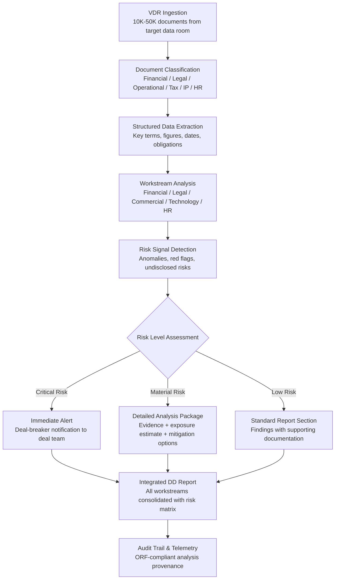

# M&A Due Diligence Accelerator

Frankmax

NAICS 551112, 541611-541990

> **Multinational Corporate Empires** — M&A Due Diligence Accelerator

## Objective & Purpose

Mergers and acquisitions due diligence is one of the most labor-intensive processes in corporate finance. A typical mid-market deal ($100M-$1B enterprise value) requires 4-8 weeks of intensive analysis across financial, legal, operational, commercial, tax, environmental, and technology dimensions. The acquirer's team reviews 10,000-50,000 documents in a virtual data room (VDR), supported by external advisors billing $500-$1,500 per hour. Total advisory fees for due diligence alone run $2M-$10M per transaction. Despite this investment, 40-60% of acquisitions fail to deliver projected synergies, and post-close surprises -- undisclosed liabilities, customer concentration risks, technology debt, or cultural incompatibilities -- are cited in 70% of underperforming deals.

The M&A Due Diligence Accelerator applies AI to compress the due diligence timeline and improve coverage depth. The system ingests the complete VDR contents, applies document classification (financial statements, contracts, litigation files, IP registrations, employee records, regulatory filings), extracts structured data from unstructured documents, and performs automated analysis across all due diligence workstreams. Financial analysis cross-validates revenue recognition, working capital trends, and EBITDA normalization. Legal analysis identifies change-of-control provisions, pending litigation exposure, and IP ownership gaps. Operational analysis maps customer concentration, supplier dependencies, and technology architecture risks.

The output is not a replacement for human judgment but a force multiplier: instead of associates spending three weeks reading contracts, the system extracts key terms from every contract in hours and flags the 5% that require detailed human review. Instead of financial analysts manually building adjustment tables, the system produces draft quality-of-earnings analysis with anomalies pre-flagged. The result is due diligence that is faster (2-3 weeks vs. 4-8), deeper (100% document coverage vs. sampling), and cheaper (50-70% reduction in advisory hours). Every deal processed adds to the marketplace's Failure Intelligence Library -- anonymized patterns of deal risks that improve detection for all users.

## Business Context

| Attribute | Value |
|---|---|
| **Business Process** | Mergers and acquisitions |
| **Business Function** | Corporate Development |
| **Category** | Finance |
| **Target Audience** | 7. Multinational Corporate Empires |
| **Bundle** | Enterprise Operations Pack ($4,500/mo) |
| **Monthly Cost of Inaction** | $100K-$2M per deal (advisory fees, missed risks, deal delays) |

## BPMN Workflow

## Features

1. **Automated VDR Ingestion & Classification** — Ingests complete virtual data room contents (10,000-50,000+ documents) and classifies each document into due diligence workstreams: financial statements, tax returns, material contracts, customer agreements, employment contracts, IP filings, litigation documents, regulatory correspondence, and organizational documents. Classification accuracy exceeds 95% with human review for edge cases.

2. **Contract Intelligence Engine** — Extracts key terms from every contract in the VDR: parties, effective dates, termination provisions, change-of-control clauses, assignment restrictions, non-compete provisions, indemnification caps, payment terms, and renewal conditions. Flags contracts with unusual terms, missing standard provisions, or terms that conflict with the deal structure.

3. **Financial Quality-of-Earnings Analysis** — Automates the core of financial due diligence: revenue recognition pattern analysis, EBITDA adjustment identification (one-time items, related-party transactions, owner perks), working capital normalization, customer revenue concentration, and trend analysis. Produces draft QoE tables with anomalies pre-flagged for analyst review.

4. **Litigation & Regulatory Risk Assessment** — Analyzes all legal filings, correspondence with regulators, and disclosed litigation to estimate total legal exposure. Maps pending cases by jurisdiction, claim type, and estimated resolution timeline. Identifies undisclosed regulatory risks by cross-referencing company activities against regulatory databases.

5. **Technology & IP Due Diligence** — Assesses the target's technology stack: code repository analysis (technical debt indicators, dependency risks, license compliance), patent portfolio strength, trademark coverage gaps, trade secret protection adequacy, and cybersecurity posture. Particularly valuable for technology-heavy acquisitions where IP is the primary asset.

6. **Synergy Validation Engine** — Stress-tests the acquirer's synergy assumptions against the target's actual data. Revenue synergies validated against customer overlap analysis and market sizing. Cost synergies validated against operational benchmarks and integration complexity scores. Produces adjusted synergy estimates with confidence intervals.

7. **Integrated Risk Matrix** — Consolidates risks across all workstreams into a single prioritized matrix: risk description, financial exposure range, probability assessment, mitigation options, and impact on deal valuation. The risk matrix feeds directly into purchase price negotiation and representation & warranty discussions.

8. **Deal Comparison Analytics** — For serial acquirers, maintains a database of prior deal analyses enabling pattern recognition: which risk types were missed in past deals, which synergy assumptions proved accurate, and how current deal characteristics compare to historical acquisition performance.

## Workflow & Automation

**Step 1: VDR Connection & Document Ingestion** — Connect to the target's virtual data room (Intralinks, Datasite, DealRoom, or file export). The system downloads and indexes all documents, extracting text content (including OCR for scanned documents), metadata, and version history. Documents are classified by workstream and priority.

**Step 2: Structured Data Extraction** — NLP models extract structured data from unstructured documents: financial figures from statements, key terms from contracts, entity names from organizational documents, dates and deadlines from regulatory filings. Extracted data is stored in a structured database for cross-reference analysis.

**Step 3: Workstream Analysis** — Parallel analysis runs across all due diligence workstreams. Financial models build QoE adjustments. Legal models assess contract risk and litigation exposure. Commercial models analyze customer concentration and market position. Technology models evaluate IP strength and technical debt. HR models assess key person dependencies and compensation structures.

**Step 4: Risk Signal Detection & Escalation** — Cross-workstream analysis identifies risks that span multiple dimensions: a customer contract with unusual terms AND declining revenue from that customer AND pending litigation involving that customer. Multi-dimensional risks receive elevated priority scores. Critical risks trigger immediate deal team notifications.

**Step 5: Report Assembly & Review** — Workstream analyses are consolidated into an integrated due diligence report with executive summary, detailed findings by workstream, risk matrix, synergy validation, and recommended deal terms. The report enters a review workflow where analysts validate AI findings and add judgment-based commentary.

**Step 6: Deal Room Integration** — Finalized findings integrate into the deal team's workflow: risk-adjusted valuation models, representation & warranty negotiation points, integration planning inputs, and Day 1 readiness checklists. Post-close, actual outcomes feed back into the system for model improvement.

## Input/Output Specifications

| Direction | Data | Format | Description |
|---|---|---|---|
| Input | Virtual data room contents | PDF, DOCX, XLSX, PPTX, images | Target company documents across all workstreams |
| Input | Deal parameters | JSON / manual entry | Enterprise value, synergy assumptions, deal structure |
| Input | Acquirer benchmarks | CSV / API | Historical deal performance, industry benchmarks |
| Input | Public records | API (SEC, courts, patent offices) | Regulatory filings, litigation records, IP registrations |
| Output | Integrated DD report | PDF + interactive dashboard | Consolidated findings across all workstreams |
| Output | Risk matrix | JSON + PDF | Prioritized risks with exposure estimates |
| Output | Contract analysis | JSON + XLSX | Extracted terms from all material contracts |
| Output | Audit trail | JSON (immutable log) | ORF-compliant analysis provenance and methodology |

## Integration Points

| System | Integration Type | Data Flow |
|---|---|---|
| **DocuFlow -- Document Intelligence** | Infrastructure | Document extraction models power VDR content processing |
| **Board Decision Intelligence** | Outbound summary | Deal risk summaries and investment committee materials |
| **Enterprise Knowledge Graph** | Bidirectional | Target company knowledge integrated post-close; acquirer history informs analysis |
| **Billing Leakage Detector** | Post-close integration | Target company billing systems analyzed for leakage post-acquisition |
| **Multi-Model AI Orchestrator** | Infrastructure | AI model routing for document analysis, financial modeling, and NLP |
| **Audit Trail and Traceability Engine** | Outbound log stream | All analysis activities logged immutably |
| **Regulatory Change Tracker** | Inbound feed | Regulatory environment assessment for target's jurisdictions |
| **Failure Intelligence Library** | Outbound anonymized patterns | Deal risk patterns feed cross-industry intelligence |

## Pricing & Revenue Model

| Component | Pricing | Notes |
|---|---|---|
| **Enterprise Operations Pack** | $4,500/month | Base platform access for corporate development teams |
| **Per-deal analysis fee** | $15,000-$75,000 per deal | Based on VDR size, deal complexity, and workstream scope |
| **Annual subscription (serial acquirers)** | $8,500/month | Unlimited deals, deal comparison analytics, pattern library |
| **Technology DD deep dive** | +$5,000 per deal | Code repository analysis, IP portfolio assessment |
| **Synergy validation module** | +$3,000 per deal | Quantitative synergy stress-testing with confidence intervals |
| **AI token consumption** | Included at 80% discount | High-volume processing during active deals |

**Revenue model**: M&A Due Diligence Accelerator has a unique pricing structure -- per-deal fees create spiky but high-value revenue. A single large-cap deal can generate $50K-$75K in a month. The "fries" attach naturally: audit trail for deal governance, regulatory compliance for cross-border transactions, and ongoing monitoring for earn-out and integration milestones at 80-90% margin. Serial acquirers (PE firms, holding companies) convert to annual subscriptions, creating predictable revenue.

## NAICS/SIC Mapping

| NAICS Code | SIC Code | Industry | Relevance |
|---|---|---|---|
| 551112 | 6712 | Offices of Other Holding Companies | Holding company acquisition due diligence |
| 541611 | 7371 | Administrative Management Consulting | M&A advisory and transaction support |
| 523110 | 6211 | Investment Banking and Securities | Deal origination and transaction execution |
| 541211 | 8721 | Offices of Certified Public Accountants | Financial due diligence and QoE analysis |
| 541110 | 8111 | Offices of Lawyers | Legal due diligence and contract review |
| 523920 | 6282 | Portfolio Management | PE and VC portfolio acquisition analysis |
| 541990 | 7389 | All Other Professional Services | Specialized due diligence advisory |
