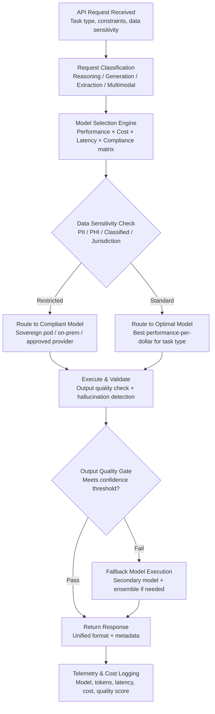

# Multi-Model AI Orchestrator

Frankmax

NAICS 551112, 541611-541990

> **Multinational Corporate Empires** — Enterprise AI Operations

## Objective & Purpose

Enterprises adopting AI face a structural problem: no single model is best at everything. Claude excels at reasoning and analysis; GPT-4 at creative generation; Gemini at multimodal tasks; open-source models at latency-sensitive, high-volume inference. Yet most organizations lock into a single provider -- signing enterprise agreements with OpenAI or Anthropic that create dependency on one model family. When that provider has an outage (OpenAI averaged 2.4 significant incidents per month in 2024), raises prices, deprecates a model version, or underperforms on a specific task type, the organization has no fallback.

The Multi-Model AI Orchestrator provides a unified API layer that routes AI requests to the optimal model based on task type, latency requirements, cost constraints, data sensitivity, and jurisdictional restrictions. A single API call from an internal application hits the orchestrator, which selects the best model (or combination of models) for the specific request, executes the call, validates the output, and returns results -- all while logging every decision for audit and cost tracking. The enterprise writes to one API; the orchestrator handles provider diversity, failover, cost optimization, and compliance.

This is the infrastructure layer through which all marketplace AI traffic flows. It is the "kitchen" in the economic model -- the more traffic it routes, the more telemetry it collects on model performance, cost efficiency, and failure patterns. That data compounds into the marketplace's core competitive moat: a cross-industry model performance database that no single enterprise or provider can replicate. Revenue priority #9, but strategic priority #1 -- because every other marketplace tool depends on it.

## Business Context

| Attribute | Value |
|---|---|
| **Business Process** | AI model selection, routing, and management |
| **Business Function** | IT / AI Operations / Platform Engineering |
| **Category** | Infrastructure |
| **Target Audience** | 7. Multinational Corporate Empires |
| **Revenue Priority** | #9 (120-180 day revenue stream) |
| **Bundle** | Enterprise Operations Pack ($4,500/mo) — subscription component |
| **Strategic Value** | Core routing layer -- all marketplace traffic flows through |
| **Margin** | 65-75% on platform fee per orchestrated call |

## BPMN Workflow

## Features

1. **Unified API Gateway** — Single REST/gRPC endpoint that accepts requests in a standardized format. Internal applications integrate once; the orchestrator handles provider-specific API formats, authentication, rate limiting, and retry logic for Claude, GPT-4/4o, Gemini Pro/Ultra, Llama, Mistral, and any OpenAI-compatible endpoint.

2. **Intelligent Model Routing** — Selects the optimal model for each request based on a multi-dimensional scoring matrix: task type (reasoning, generation, extraction, summarization, code, multimodal), latency requirement (real-time vs. batch), cost ceiling (per-request budget), quality threshold (acceptable confidence level), and data sensitivity classification.

3. **Provider Failover & Redundancy** — Automatic failover when a provider is unavailable, slow, or returning degraded results. Configurable failover chains per task type: "For reasoning tasks, try Claude Opus first, fall back to GPT-4, then Gemini Ultra." Health checks run every 30 seconds; failover triggers in under 2 seconds.

4. **Cost Optimization Engine** — Tracks per-token cost across all providers in real-time. Routes cost-insensitive batch jobs to the cheapest capable model; routes latency-sensitive real-time requests to the fastest. Monthly cost reports show spend by model, by team, by application, and by task type. Typical savings: 30-50% vs. single-provider pricing.

5. **Data Sovereignty Routing** — Enforces jurisdictional data handling requirements at the routing layer. PII from EU subjects routes only to EU-hosted endpoints. ITAR-restricted content routes only to US-sovereign infrastructure. Configurable policies per data classification, jurisdiction, and regulatory framework.

6. **Output Validation & Hallucination Detection** — Post-processing layer that validates model outputs before returning to the caller: fact-checking against provided context, format validation (JSON schema compliance, required fields), confidence scoring, and hallucination detection using cross-model verification for high-stakes outputs.

7. **Token-Level Cost Attribution** — Every API call is attributed to a team, application, project, and cost center. Finance teams get granular AI spend visibility equivalent to cloud cost management tools. Supports chargeback models, budget alerts, and spend caps per organizational unit.

8. **Model Performance Telemetry** — Continuous benchmarking of model performance across task types using production traffic. Tracks accuracy, latency, cost, and failure rates per model per task type. Performance dashboards show which models are improving, degrading, or being deprecated. Feeds the marketplace's cross-industry model intelligence database.

## Workflow & Automation

**Step 1: Application Integration** — Internal applications integrate with the orchestrator through a single SDK (Python, Node.js, Java, Go) or REST API. The SDK handles authentication, request formatting, retry logic, and response parsing. Average integration time: 2-4 hours per application for teams already using an AI provider SDK.

**Step 2: Request Classification** — Each incoming request is classified by task type using a lightweight classifier that adds less than 10ms of latency. Classification considers the prompt structure, requested output format, and application metadata. Task types: reasoning/analysis, text generation, data extraction, summarization, code generation, multimodal (image/document), and embedding generation.

**Step 3: Policy Evaluation** — Before model selection, the request passes through the policy engine. Policies check data sensitivity classification, jurisdictional requirements, cost ceilings, and organizational rules ("Legal department requests must use models with SOC 2 attestation"). Policies narrow the eligible model set.

**Step 4: Model Selection & Routing** — From the eligible model set, the routing engine selects the optimal model using the scoring matrix. Scores are computed from real-time telemetry: current latency percentiles, recent accuracy metrics, current cost per token, and provider health status. The selected model receives the request in its native API format.

**Step 5: Execution & Monitoring** — The request executes against the selected model with real-time monitoring. If the response exceeds the latency SLA or the provider returns an error, the failover chain activates automatically. Streaming responses are supported for real-time applications.

**Step 6: Output Validation** — The model response passes through the validation layer. For structured output (JSON, data extraction), schema validation confirms completeness and format compliance. For reasoning and generation tasks, confidence scoring evaluates output quality. High-stakes outputs (financial, legal, medical) can optionally trigger cross-model verification.

**Step 7: Telemetry Recording & Cost Attribution** — Every request-response cycle is logged: model selected, tokens consumed (input + output), latency (total and per-phase), cost, quality score, and whether failover was triggered. Costs are attributed to the requesting team, application, and cost center. Telemetry feeds dashboards, alerts, and the marketplace's model intelligence database.

## Input/Output Specifications

| Direction | Data | Format | Description |
|---|---|---|---|
| Input | AI request | REST/gRPC (unified schema) | Prompt, task type, constraints, data classification |
| Input | Routing policies | JSON/YAML | Jurisdictional rules, cost ceilings, model preferences |
| Input | Application metadata | Headers/SDK config | Team, application ID, cost center, priority level |
| Output | AI response | JSON (unified schema) | Model output, confidence score, metadata |
| Output | Cost attribution record | JSON | Tokens, cost, model, team, application, timestamp |
| Output | Performance telemetry | JSON stream / API | Latency, accuracy, failure rate per model per task |
| Output | Provider health status | REST API / UI | Real-time provider availability and performance |
| Output | Audit trail | JSON (immutable log) | ORF-compliant routing decision and execution log |

## Integration Points

| System | Integration Type | Data Flow |
|---|---|---|
| **DocuFlow — Document Intelligence** | Infrastructure provider | DocuFlow's extraction models route through orchestrator |
| **Billing Leakage Detector** | Infrastructure provider | ML anomaly detection models route through orchestrator |
| **Chokepoint Intelligence Engine** | Infrastructure provider | Process mining AI models route through orchestrator |
| **Board Decision Intelligence** | Infrastructure provider | Summarization and analysis models route through orchestrator |
| **AI Cost Optimization Engine** | Bidirectional | Cost data feeds optimization; optimization recommendations feed routing policies |
| **Governed AI Execution Engine** | Compliance layer | ETLB compliance enforcement at the routing layer |
| **Audit Trail & Traceability Engine** | Outbound log stream | All routing decisions and model executions logged immutably |
| **Failure Intelligence Library** | Outbound anonymized telemetry | Model failures, hallucinations, and degradations feed library |

## Pricing & Revenue Model

| Component | Pricing | Notes |
|---|---|---|
| **Enterprise Operations Pack** | $4,500/month | Orchestrator included as subscription component |
| **Standalone — Platform Fee** | $1,800/month | Up to 5M orchestrated tokens/month |
| **Per-token orchestration fee** | $0.0001 per 1K tokens | Above included allocation |
| **AI token pass-through** | Provider cost minus 80% discount | Marketplace bulk purchasing advantage |
| **Enterprise tier (>50M tokens/mo)** | Custom pricing | Dedicated routing instance, priority support |
| **Data Sovereignty add-on** | +$1,200/month | Jurisdictional routing policies, sovereign pod access |
| **Advanced Telemetry add-on** | +$600/month | Cross-model benchmarking, model recommendation engine |

**Revenue model**: The orchestrator is the "kitchen" -- every AI request across every marketplace tool flows through it. Platform fee per orchestrated call at 65-75% margin. The AI tokens themselves are the "burger" (sold at 80% below provider list prices using bulk purchasing). The real value compounds in the telemetry: every routed call improves the model performance database, creating a data moat that grows with usage.

## NAICS/SIC Mapping

| NAICS Code | SIC Code | Industry | Relevance |
|---|---|---|---|
| 551112 | 6712 | Offices of Other Holding Companies | Enterprise-wide AI infrastructure standardization |
| 541511 | 7371 | Custom Computer Programming | Application integration and AI development |
| 541512 | 7372 | Computer Systems Design | AI infrastructure architecture |
| 518210 | 7374 | Data Processing and Hosting | AI model hosting and routing |
| 522110 | 6021 | Commercial Banking | Multi-model AI for financial analysis |
| 524114 | 6311 | Direct Health and Medical Insurance | Regulated AI model compliance |
| 311-339 | 2000-3999 | Manufacturing | Industrial AI with latency constraints |
| 921-928 | 9100-9700 | Public Administration | Sovereign AI requirements |
