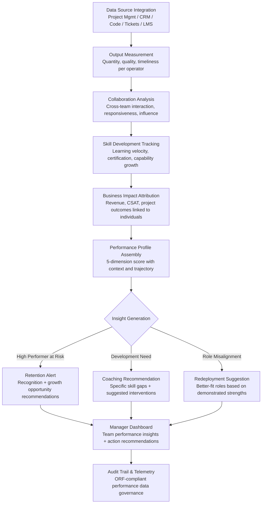

# Operator Performance Analytics

Frankmax

NAICS 551112, 541611-541990

> **Multinational Corporate Empires** — Operator Performance Analytics

## Objective & Purpose

Performance management in large multinationals is broken. Annual reviews are subjective, recency-biased, and disconnected from actual output. Gallup research shows that only 14% of employees strongly agree their performance reviews inspire them to improve, and 95% of managers are dissatisfied with their organization's review system. The cost of getting performance wrong is enormous: mis-promoted employees create cascading organizational drag, high performers leave when they feel invisible, and underperformers entrench when feedback is vague. For a 10,000-person enterprise with average fully-loaded cost of $120K per employee, a 5% productivity gap from misaligned performance management costs $60M annually.

The Operator Performance Analytics platform replaces subjective assessments with objective, multi-dimensional performance measurement. The system ingests data from work output systems (project management tools, code repositories, CRM activity, ticket resolution, document production), collaboration platforms (meeting patterns, communication responsiveness, cross-team interaction), learning systems (training completion, certification progress), and business outcome data (revenue attribution, customer satisfaction, project delivery metrics). It constructs a holistic performance profile for each operator across five dimensions: output quantity, output quality, collaboration effectiveness, skill development velocity, and business impact.

The platform is explicitly not surveillance software. It does not track keystrokes, monitor screens, or record conversations. It measures outcomes and patterns at a level that respects individual privacy while providing management with actionable intelligence. Performance insights are contextualized: an employee's output is compared against role-specific benchmarks, team averages, and their own historical trajectory -- not raw leaderboards. The goal is identifying who needs support, who needs challenge, who needs recognition, and who needs a different role -- before annual review cycles make these decisions months too late.

## Business Context

| Attribute | Value |
|---|---|
| **Business Process** | Workforce performance measurement |
| **Business Function** | HR/Operations |
| **Category** | Analytics |
| **Target Audience** | 7. Multinational Corporate Empires |
| **Bundle** | Enterprise Operations Pack ($4,500/mo) |
| **Monthly Cost of Inaction** | $30K-$200K (misaligned talent, turnover costs, productivity gaps) |

## BPMN Workflow

## Features

1. **Multi-Source Output Measurement** — Aggregates work output metrics from project management tools (Jira, Asana, Monday.com), code repositories (GitHub, GitLab, Bitbucket), CRM systems (Salesforce, HubSpot), support platforms (Zendesk, ServiceNow), and document systems (SharePoint, Google Workspace). Normalizes output across roles so a developer's commit velocity is comparable in context to a salesperson's pipeline activity.

2. **Quality-Adjusted Scoring** — Raw output volume is meaningless without quality. The system measures quality through downstream indicators: code that passes review without revisions, proposals that convert to closed deals, support tickets that do not reopen, and documents that do not require rework. Quality scores are weighted by role to prevent volume gaming.

3. **Collaboration Network Analysis** — Maps each employee's collaboration footprint: who they work with across teams, how responsive they are, whether they are a bridge between disconnected groups, and whether their interactions correlate with positive project outcomes. Identifies collaboration stars (high-impact connectors) and collaboration gaps (isolated operators whose work does not integrate).

4. **Skill Development Velocity** — Tracks capability growth over time: new tools adopted, certifications earned, expanding scope of responsibility, and performance improvement in previously weak areas. Growth velocity is a leading indicator of future performance and a key input for promotion readiness and succession planning.

5. **Business Impact Attribution** — Connects individual performance to business outcomes using attribution modeling: revenue influenced (not just closed), customer satisfaction improvements linked to specific interactions, cost reductions tied to process improvements, and project success rates by team composition. Moves performance evaluation from activity to impact.

6. **Contextual Benchmarking** — Performance scores are contextualized against three benchmarks: role-specific norms (what is expected for this role level), team averages (how this person compares to peers), and personal trajectory (is this person improving, plateauing, or declining). Context prevents unfair comparisons between senior and junior operators.

7. **Predictive Attrition Signals** — Identifies performance patterns that precede voluntary departure: declining engagement metrics, reduced collaboration breadth, decreased learning activity, and output changes. Alerts managers 60-90 days before likely departure with retention intervention recommendations.

## Workflow & Automation

**Step 1: Data Source Connection** — Configure integrations with the organization's work systems. Each connector maps source-specific activities to standardized performance dimensions. Role-based configuration ensures that metrics are relevant: developers are measured on code quality, salespeople on pipeline progression, support agents on resolution effectiveness.

**Step 2: Baseline Establishment** — The system analyzes 6-12 months of historical data to establish role-specific and individual baselines. Baselines account for organizational context: company growth rate, seasonal patterns, team size changes, and process modifications that affect output expectations.

**Step 3: Continuous Measurement** — Performance data is collected continuously from all connected sources. The system calculates rolling metrics across configurable windows (weekly, monthly, quarterly) and updates performance profiles in near-real-time. Managers see current-state dashboards rather than point-in-time snapshots.

**Step 4: Insight Generation** — AI models analyze performance profiles to generate actionable insights: high performers needing recognition, developing performers needing specific coaching, role-misaligned employees who would thrive in different positions, and teams with composition imbalances. Insights include recommended actions with expected outcomes.

**Step 5: Manager Dashboard & Alerts** — Managers access a dashboard showing their team's performance across all five dimensions with drill-down capability. Proactive alerts notify managers of significant changes: performance drops, attrition risk signals, skill readiness for promotion, and collaboration pattern shifts. Alerts include context and recommended responses.

**Step 6: Performance Review Integration** — During formal review cycles, the system generates evidence-based review drafts: objective metrics, trend analysis, peer comparison context, and development recommendations. Managers edit and personalize rather than starting from scratch, ensuring reviews are grounded in data rather than memory.

## Input/Output Specifications

| Direction | Data | Format | Description |
|---|---|---|---|
| Input | Project management data | API (Jira, Asana, Monday.com) | Tasks completed, timelines, story points, project outcomes |
| Input | Code repository activity | API (GitHub, GitLab) | Commits, reviews, merge rates, code quality metrics |
| Input | CRM activity | API (Salesforce, HubSpot) | Pipeline activity, deal progression, customer interactions |
| Input | Learning system data | API (Cornerstone, LinkedIn Learning) | Courses completed, certifications, skill assessments |
| Input | Communication metadata | API (Slack, Teams -- metadata only) | Collaboration patterns, responsiveness, network breadth |
| Output | Performance profiles | JSON + dashboard UI | 5-dimension scores with context and trajectory |
| Output | Manager insights | JSON + notifications | Actionable recommendations with evidence |
| Output | Review draft materials | PDF / DOCX | Evidence-based performance review content |
| Output | Audit trail | JSON (immutable log) | ORF-compliant performance data governance |

## Integration Points

| System | Integration Type | Data Flow |
|---|---|---|
| **Talent-to-Task Matching Engine** | Outbound performance data | Performance profiles inform optimal task assignment |
| **Workforce Planning Simulator** | Outbound analytics | Team performance data feeds headcount planning models |
| **Organizational Drift Detector** | Bidirectional | Performance patterns indicate cultural alignment; drift signals contextualize performance |
| **Enterprise Knowledge Graph** | Outbound expertise data | Demonstrated expertise feeds knowledge graph skills mapping |
| **Board Decision Intelligence** | Outbound summary | Workforce productivity metrics included in board briefings |
| **Multi-Model AI Orchestrator** | Infrastructure | AI model routing for NLP analysis and pattern detection |
| **Audit Trail and Traceability Engine** | Outbound log stream | Performance data access and analysis logged immutably |
| **Failure Intelligence Library** | Outbound anonymized patterns | Performance management failure patterns feed cross-industry intelligence |

## Pricing & Revenue Model

| Component | Pricing | Notes |
|---|---|---|
| **Enterprise Operations Pack** | $4,500/month | Includes Performance Analytics + DocuFlow + Chokepoint Intelligence |
| **Standalone -- Subscription** | $2,800/month | Up to 2,000 employees tracked |
| **Large Enterprise (over 2K employees)** | $4 per employee/month | Volume pricing for large deployments |
| **Predictive attrition module** | +$800/month | Early warning system for voluntary departure risk |
| **Review cycle integration** | +$600/month | Automated review draft generation and calibration support |
| **AI token consumption** | Included at 80% discount | 2M tokens/month in bundle; overage at marketplace rates |

**Revenue model**: Operator Performance Analytics is a high-retention product -- organizations that build performance infrastructure on the platform face significant switching costs (historical baselines, calibrated models, integrated workflows). The "burger" is objective performance measurement at a fraction of building internal analytics teams. The "fries" attach through governance layers: performance data privacy compliance, audit trail for employment decisions, and predictive analytics at 75-85% margin. Per-employee pricing scales linearly with organizational growth.

## NAICS/SIC Mapping

| NAICS Code | SIC Code | Industry | Relevance |
|---|---|---|---|
| 551112 | 6712 | Offices of Other Holding Companies | Cross-subsidiary workforce performance comparison |
| 541611 | 7371 | Administrative Management Consulting | Organizational effectiveness and performance advisory |
| 541612 | 7371 | Human Resources Consulting | Performance management system design |
| 541990 | 7389 | All Other Professional Services | Professional services resource performance tracking |
| 541512 | 7372 | Computer Systems Design Services | Technology workforce performance measurement |
| 522110 | 6021 | Commercial Banking | Financial services workforce productivity |
| 311-339 | 2000-3999 | Manufacturing | Operational workforce performance analytics |
