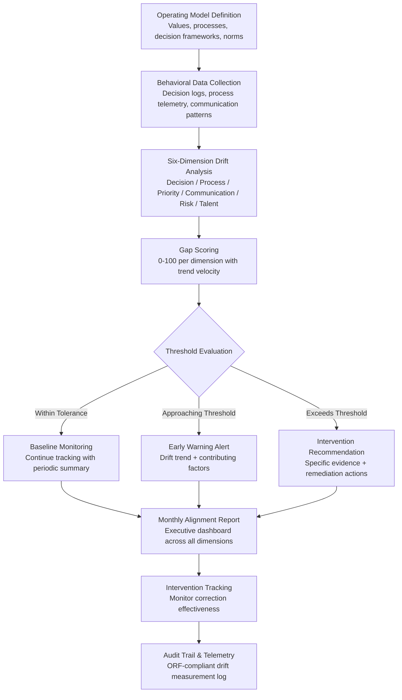

# Organizational Drift Detector

Frankmax

NAICS 551112, 541611-541990

> **Multinational Corporate Empires** — Organizational Drift Detector

## Objective & Purpose

Every organization has stated values, documented processes, and intended culture. And every organization drifts from them. The drift is gradual and invisible: decision-making authority migrates to unintended centers, communication patterns shift away from collaborative norms, risk tolerance creeps in one direction without conscious choice, and the gap between what the organization says it does and what it actually does widens month by month. By the time drift becomes visible -- through a compliance failure, a cultural crisis, or an exodus of key talent -- the remediation cost is 10-50x what early intervention would have required. Research from MIT Sloan shows that companies with strong alignment between stated values and actual behavior outperform peers by 20-30% in employee retention and 15-20% in customer satisfaction.

The Organizational Drift Detector continuously measures the gap between an organization's stated operating model (values, processes, decision frameworks, communication norms) and its actual behavior as revealed through operational data. The system does not read content of private communications. Instead, it analyzes structural patterns: Are decisions being made at the levels the org chart says they should be? Are cross-functional processes following documented workflows or routing through informal shortcuts? Is meeting load distribution consistent with stated priorities? Are resource allocation patterns aligned with strategic objectives? Is response time to different stakeholders consistent with stated customer-first or employee-first values?

The measurement framework operates on six dimensions: decision authority drift (who actually decides vs. who should), process drift (actual workflows vs. documented), priority drift (time allocation vs. stated strategy), communication drift (information flow patterns vs. intended transparency), risk posture drift (actual risk-taking vs. stated appetite), and talent drift (who gets promoted and rewarded vs. stated criteria). Each dimension is scored 0-100, with trend analysis showing the direction and velocity of drift. The system provides early warning: when drift in any dimension exceeds configurable thresholds, it alerts leadership with specific evidence and recommended interventions before the gap becomes a crisis.

## Business Context

| Attribute | Value |
|---|---|
| **Business Process** | Culture and alignment monitoring |
| **Business Function** | HR/Culture |
| **Category** | Analytics |
| **Target Audience** | 7. Multinational Corporate Empires |
| **Bundle** | Enterprise Operations Pack ($4,500/mo) |
| **Monthly Cost of Inaction** | $40K-$300K (cultural erosion, compliance drift, talent attrition) |

## BPMN Workflow

## Features

1. **Operating Model Codification** — Structured intake process to document the organization's intended operating model: stated values with behavioral definitions, documented decision authority matrices, process maps for critical workflows, communication norms (response time expectations, escalation paths, transparency commitments), risk appetite statements, and talent management criteria (promotion criteria, reward structures).

2. **Decision Authority Drift Detection** — Analyzes actual decision patterns (approval chains, sign-off timing, escalation frequency) against the intended authority matrix. Detects authority concentration (one person approving everything), authority avoidance (decisions being passed upward unnecessarily), and authority bypass (decisions made outside the documented framework).

3. **Process Compliance Scoring** — Compares actual process execution (captured through system telemetry) against documented workflows. Identifies process steps that are consistently skipped, workarounds that have become standard practice, and process bottlenecks that force informal shortcuts. Distinguishes between healthy process evolution and dangerous compliance drift.

4. **Priority Alignment Measurement** — Analyzes time and resource allocation patterns against stated strategic priorities. If the organization says "innovation is priority #1" but 80% of engineering time goes to maintenance, the system quantifies that gap. Measures meeting time allocation, budget spending patterns, headcount distribution, and project portfolio mix.

5. **Communication Pattern Analysis** — Tracks structural communication patterns (not content): information flow direction, cross-functional communication frequency, response time distributions, and meeting cadence alignment with stated collaboration norms. Identifies communication silos forming, transparency degradation, and escalation path failures.

6. **Risk Posture Monitoring** — Compares actual risk-taking behavior (project portfolio risk distribution, vendor diversification, financial reserve levels, compliance incident rates) against the organization's stated risk appetite framework. Detects both excessive risk-taking and excessive risk aversion relative to stated intentions.

7. **Talent Drift Scoring** — Analyzes promotion decisions, performance ratings, compensation adjustments, and hiring patterns against the organization's stated talent criteria. Detects when the people being rewarded and advanced do not match the values and capabilities the organization claims to prioritize.

## Workflow & Automation

**Step 1: Operating Model Documentation** — Work with leadership to codify the intended operating model across all six dimensions. This is not a one-time exercise; the model is versioned and updated as the organization's intentions evolve. Each element of the operating model maps to measurable behavioral indicators.

**Step 2: Behavioral Data Integration** — Connect to operational systems that reveal actual behavior: approval workflows (ERP, procurement), project management tools (resource allocation, timeline adherence), HRIS (promotions, ratings, compensation), communication platforms (structural patterns only), and financial systems (budget execution vs. plan).

**Step 3: Baseline Measurement** — Establish the current state across all six dimensions. The initial measurement may reveal that drift has already occurred -- the baseline captures where the organization actually is, not where it thinks it is. Initial drift scores are calibrated with leadership to set realistic improvement trajectories.

**Step 4: Continuous Monitoring** — The system continuously calculates drift scores as new behavioral data arrives. Rolling windows (30-day, 90-day, 12-month) show both current state and trend. Velocity calculations indicate whether drift is accelerating, stabilizing, or reversing.

**Step 5: Alert Generation & Intervention Design** — When drift scores approach or exceed thresholds, the system generates alerts with specific evidence: "Decision authority drift in EMEA procurement has increased 15 points in 90 days. The regional VP is approving 73% of purchase orders that should be approved at director level, based on documented authority matrix." Alerts include recommended interventions based on drift type and severity.

**Step 6: Correction Tracking** — After interventions are implemented, the system monitors correction effectiveness. Did the intervention reduce drift velocity? Did it create unintended drift in another dimension? Correction effectiveness data feeds model refinement and builds an organizational library of what works.

## Input/Output Specifications

| Direction | Data | Format | Description |
|---|---|---|---|
| Input | Operating model documentation | JSON / structured forms | Values, authority matrices, process maps, norms |
| Input | Approval workflows | API (ERP, procurement, ITSM) | Decision patterns, approval chains, escalation data |
| Input | Resource allocation data | API (project mgmt, financial systems) | Time allocation, budget execution, headcount distribution |
| Input | HR data | API (Workday, SAP HCM) | Promotions, ratings, compensation, hiring patterns |
| Input | Communication metadata | API (Slack, Teams -- structural only) | Flow patterns, response times, network topology |
| Output | Drift scorecard | JSON + dashboard UI | Six-dimension scores with trends and velocity |
| Output | Alert notifications | JSON + email / Slack | Threshold breach alerts with evidence and recommendations |
| Output | Alignment report | PDF / API | Monthly executive report on organizational alignment |
| Output | Audit trail | JSON (immutable log) | ORF-compliant drift measurement history |

## Integration Points

| System | Integration Type | Data Flow |
|---|---|---|
| **Operator Performance Analytics** | Bidirectional | Performance data reveals behavioral patterns; drift context explains performance changes |
| **Enterprise Knowledge Graph** | Inbound context | Organizational structure and relationship data enriches drift analysis |
| **Board Decision Intelligence** | Outbound summary | Organizational alignment metrics included in board governance packages |
| **Talent-to-Task Matching Engine** | Outbound signals | Drift in team culture informs task assignment compatibility |
| **Workforce Planning Simulator** | Outbound analytics | Drift patterns predict attrition risk for planning models |
| **Chokepoint Intelligence Engine** | Outbound analytics | Process drift bottlenecks feed chokepoint mapping |
| **Audit Trail and Traceability Engine** | Outbound log stream | All drift measurements logged immutably |
| **Failure Intelligence Library** | Outbound anonymized patterns | Organizational drift patterns feed cross-industry intelligence |

## Pricing & Revenue Model

| Component | Pricing | Notes |
|---|---|---|
| **Enterprise Operations Pack** | $4,500/month | Includes Drift Detector + DocuFlow + Chokepoint Intelligence |
| **Standalone -- Subscription** | $2,500/month | Up to 3 dimensions tracked, single business unit |
| **Full six-dimension deployment** | $4,200/month | All dimensions, unlimited business units |
| **Operating model codification** | $8,000 one-time setup | Facilitated intake to document intended operating model |
| **Intervention effectiveness tracking** | +$700/month | Correction monitoring and recommendation refinement |
| **AI token consumption** | Included at 80% discount | 2M tokens/month in bundle; overage at marketplace rates |

**Revenue model**: Organizational Drift Detector is a "kitchen" product with extreme stickiness -- the longitudinal drift data becomes more valuable over time and cannot be replicated by switching to a competitor. The "burger" is early warning on cultural and operational drift at a fraction of the cost of management consulting engagements ($200K-$500K for one-time culture assessments vs. $4,200/month for continuous monitoring). The "fries" attach through board governance reporting, audit compliance, and intervention tracking at 75-90% margin.

## NAICS/SIC Mapping

| NAICS Code | SIC Code | Industry | Relevance |
|---|---|---|---|
| 551112 | 6712 | Offices of Other Holding Companies | Multi-subsidiary culture alignment monitoring |
| 541611 | 7371 | Administrative Management Consulting | Organizational effectiveness measurement |
| 541612 | 7371 | Human Resources Consulting | Culture assessment and alignment advisory |
| 541990 | 7389 | All Other Professional Services | Organizational development services |
| 522110 | 6021 | Commercial Banking | Regulatory culture compliance in financial services |
| 541512 | 7372 | Computer Systems Design Services | Technology organization culture monitoring |
| 311-339 | 2000-3999 | Manufacturing | Safety culture and operational discipline drift |
