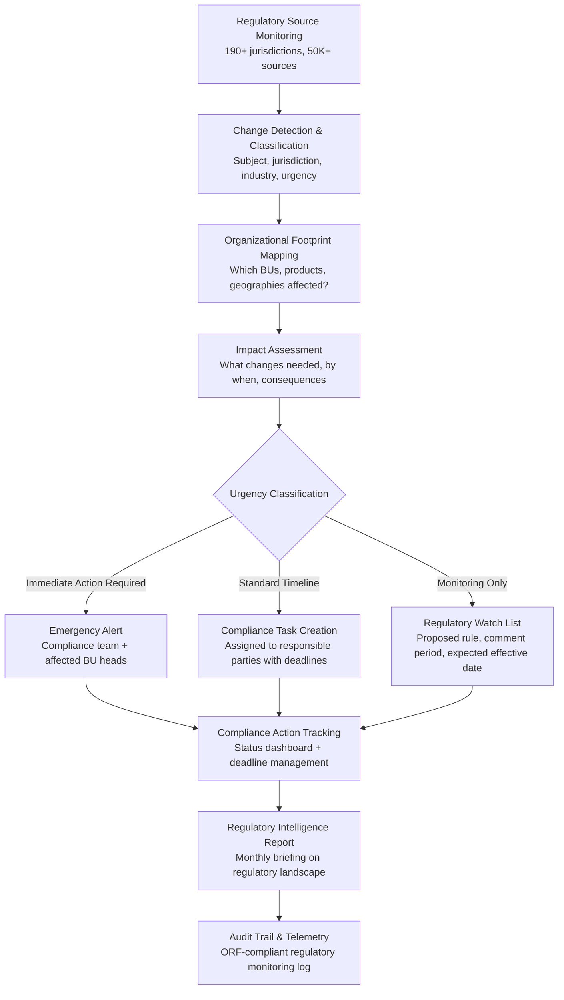

# Regulatory Change Tracker

Frankmax

NAICS 551112, 541611-541990

> **Multinational Corporate Empires** — Regulatory Change Tracker

## Objective & Purpose

A multinational operating across 20+ jurisdictions faces a staggering volume of regulatory change. Thomson Reuters estimates that financial services firms alone must track 257 regulatory alerts per business day. Across industries, the pace is similar: tax code changes, data privacy regulations (GDPR, CCPA, and 130+ national privacy laws), environmental mandates, labor law amendments, trade restrictions, sanctions updates, and sector-specific requirements create a continuous stream of compliance obligations. Most organizations track regulatory change manually -- legal teams reading government gazettes, subscribing to law firm newsletters, and maintaining spreadsheets of upcoming deadlines. This approach is slow (changes discovered weeks after publication), incomplete (obscure jurisdictions missed), and unscalable (a $50K/year analyst can monitor perhaps 3-5 jurisdictions thoroughly).

The Regulatory Change Tracker uses AI to monitor regulatory sources across 190+ jurisdictions: federal registers, state/provincial gazettes, regulatory agency announcements, international treaty databases, industry body publications, and enforcement action databases. When a change is detected, the system classifies it by subject matter, jurisdiction, affected industries, effective date, and compliance urgency. It then maps the change against the organization's operational footprint (which jurisdictions, which business activities, which products/services) to produce a specific impact assessment: what needs to change, by when, in which business units, and with what consequences for non-compliance.

The value compounds through institutional memory. Every regulatory change tracked, every impact assessment performed, and every compliance action documented builds an organizational regulatory knowledge base. When a similar regulation is proposed in a new jurisdiction, the system identifies the precedent and pre-populates the impact assessment based on prior experience. For multinationals that spend $5M-$20M annually on regulatory monitoring and compliance advisory, the Tracker reduces costs by 40-60% while increasing coverage from partial to comprehensive.

## Business Context

| Attribute | Value |
|---|---|
| **Business Process** | Regulatory monitoring |
| **Business Function** | Compliance |
| **Category** | Legal |
| **Target Audience** | 7. Multinational Corporate Empires |
| **Bundle** | Enterprise Operations Pack ($4,500/mo) |
| **Monthly Cost of Inaction** | $50K-$1M (non-compliance penalties, missed deadlines, reactive remediation) |

## BPMN Workflow

## Features

1. **Global Regulatory Source Network** — Monitors 50,000+ regulatory sources across 190+ jurisdictions: federal/national registers, state/provincial gazettes, regulatory agency websites, international treaty organizations (WTO, OECD, Basel Committee), sector-specific regulators (SEC, EBA, APRA, MAS), and enforcement action databases. Sources are checked hourly for new publications.

2. **AI-Powered Change Classification** — Each detected regulatory change is classified across multiple dimensions: subject matter (data privacy, financial regulation, environmental, labor, tax, trade, sanctions), jurisdiction (country, state/province, municipality), affected industries (NAICS-mapped), change type (new regulation, amendment, repeal, guidance, enforcement action), and urgency level (effective immediately, future effective date, proposed rule, comment period).

3. **Organizational Impact Mapping** — Maintains a model of the organization's regulatory footprint: which entities operate in which jurisdictions, which business activities are conducted, which products are sold, and which regulatory frameworks apply. When a change is detected, the system automatically identifies which business units, processes, and compliance programs are affected.

4. **Precedent-Based Impact Assessment** — When a regulation in one jurisdiction mirrors or adapts a regulation from another (e.g., a new state privacy law modeled on CCPA), the system identifies the precedent and pre-populates the impact assessment based on the organization's prior compliance response. Reduces analysis time for similar regulations by 70-80%.

5. **Compliance Task Management** — Converts impact assessments into actionable compliance tasks: policy updates needed, process changes required, system modifications necessary, training to be delivered, and documentation to be updated. Tasks are assigned to responsible parties with deadlines derived from regulatory effective dates minus implementation buffer.

6. **Regulatory Horizon Scanning** — Tracks proposed regulations, comment periods, and legislative developments before they become final rules. Provides early warning of upcoming changes with probability estimates based on legislative momentum, public comment sentiment, and jurisdictional patterns. Enables proactive rather than reactive compliance.

7. **Cross-Jurisdictional Conflict Detection** — Identifies cases where regulatory requirements in different jurisdictions conflict: data localization laws that contradict cross-border transfer agreements, tax provisions that create double-taxation risk, or product safety standards that are mutually exclusive. Flags conflicts with recommended resolution strategies.

8. **Regulatory Intelligence Reporting** — Monthly executive reports summarize the regulatory landscape: changes implemented, changes in progress, upcoming deadlines, emerging trends, and risk areas. Customizable by business unit, jurisdiction, or subject matter to serve different stakeholder needs.

## Workflow & Automation

**Step 1: Source Configuration & Monitoring** — Configure the regulatory source network based on the organization's jurisdictional footprint and industry classification. The system begins monitoring configured sources and establishes a baseline of current regulatory obligations.

**Step 2: Change Detection & Initial Classification** — New regulatory publications are detected, extracted, and classified automatically. NLP models identify the subject matter, affected parties, key provisions, effective dates, and compliance requirements. Changes are matched against the organization's regulatory footprint to determine relevance.

**Step 3: Impact Assessment Generation** — For relevant changes, the system generates a structured impact assessment: which business units are affected, what operational changes are needed, which policies require updates, estimated implementation effort, and consequences of non-compliance (penalties, enforcement risk, reputational impact). Precedent analysis accelerates assessment for regulations similar to those already processed.

**Step 4: Compliance Task Assignment** — Impact assessments convert into compliance tasks with assigned owners, deadlines, and dependencies. Tasks integrate with the organization's project management and GRC (governance, risk, and compliance) tools. Escalation rules ensure that overdue tasks trigger management alerts.

**Step 5: Implementation Monitoring** — As compliance tasks progress, the system tracks status, validates completion artifacts (updated policies, system change records, training records), and confirms that each regulatory requirement has been addressed. Incomplete implementations generate escalation notifications as deadlines approach.

**Step 6: Regulatory Knowledge Base Maintenance** — Every regulatory change, impact assessment, and compliance action is cataloged in a searchable knowledge base. This institutional memory supports regulatory audits, M&A due diligence (regulatory footprint assessment), and ongoing compliance program optimization.

## Input/Output Specifications

| Direction | Data | Format | Description |
|---|---|---|---|
| Input | Regulatory publications | HTML / PDF (web scraping + API) | Government gazettes, regulatory agency publications |
| Input | Organizational footprint | JSON / manual configuration | Entities, jurisdictions, activities, products |
| Input | Prior compliance responses | JSON / document library | Historical impact assessments and remediation records |
| Input | Legislative tracking data | API (Congress.gov, EUR-Lex, etc.) | Bill status, committee actions, vote tracking |
| Output | Impact assessments | JSON + PDF report | Business unit impact, required actions, deadlines |
| Output | Compliance task lists | JSON (GRC integration) | Assigned tasks with owners, deadlines, dependencies |
| Output | Regulatory intelligence report | PDF / API | Monthly landscape summary with trends |
| Output | Audit trail | JSON (immutable log) | ORF-compliant regulatory monitoring history |

## Integration Points

| System | Integration Type | Data Flow |
|---|---|---|
| **ESG Compliance & Reporting Engine** | Outbound feed | ESG regulatory changes update reporting requirements |
| **Board Decision Intelligence** | Outbound summary | Regulatory landscape briefings included in board packages |
| **M&A Due Diligence Accelerator** | Outbound assessment | Target company regulatory footprint analysis for acquisitions |
| **Internal Fraud Pattern Detector** | Outbound rules | Anti-fraud regulation updates inform detection rule changes |
| **DocuFlow -- Document Intelligence** | Inbound data feed | Regulatory document extraction feeds change detection |
| **Chokepoint Intelligence Engine** | Outbound analytics | Compliance process bottlenecks feed chokepoint analysis |
| **Audit Trail and Traceability Engine** | Outbound log stream | All regulatory monitoring activities logged immutably |
| **Failure Intelligence Library** | Outbound anonymized patterns | Compliance failure patterns feed cross-industry intelligence |

## Pricing & Revenue Model

| Component | Pricing | Notes |
|---|---|---|
| **Enterprise Operations Pack** | $4,500/month | Includes Regulatory Tracker + DocuFlow + Chokepoint Intelligence |
| **Standalone -- Subscription** | $3,000/month | Up to 10 jurisdictions, single subject matter area |
| **Global coverage tier** | $5,500/month | Unlimited jurisdictions, all subject matter areas |
| **Compliance task management** | +$900/month | Full task lifecycle with GRC integration |
| **Horizon scanning module** | +$700/month | Proposed regulation tracking with probability scoring |
| **AI token consumption** | Included at 80% discount | 2M tokens/month in bundle; overage at marketplace rates |

**Revenue model**: Regulatory Change Tracker is a compliance-driven purchase with near-zero churn -- organizations cannot stop monitoring regulatory changes. The "burger" is comprehensive monitoring at 40-60% cost reduction vs. manual tracking and law firm subscriptions. The "fries" are high-margin governance layers: compliance task management, audit trail for regulatory exams, horizon scanning for strategic planning, and cross-jurisdictional conflict analysis at 75-90% margin. The institutional regulatory knowledge base compounds in value and creates permanent switching costs.

## NAICS/SIC Mapping

| NAICS Code | SIC Code | Industry | Relevance |
|---|---|---|---|
| 551112 | 6712 | Offices of Other Holding Companies | Multi-jurisdictional regulatory compliance |
| 541611 | 7371 | Administrative Management Consulting | Regulatory compliance advisory |
| 541110 | 8111 | Offices of Lawyers | Legal compliance monitoring and advisory |
| 541990 | 7389 | All Other Professional Services | GRC consulting and regulatory intelligence |
| 522110 | 6021 | Commercial Banking | Banking regulatory change tracking (OCC, FDIC, Fed) |
| 524114 | 6311 | Direct Health and Medical Insurance | Insurance regulatory monitoring (state DOIs, NAIC) |
| 211-213 | 1311-1389 | Oil and Gas / Mining | Environmental and safety regulation tracking |
