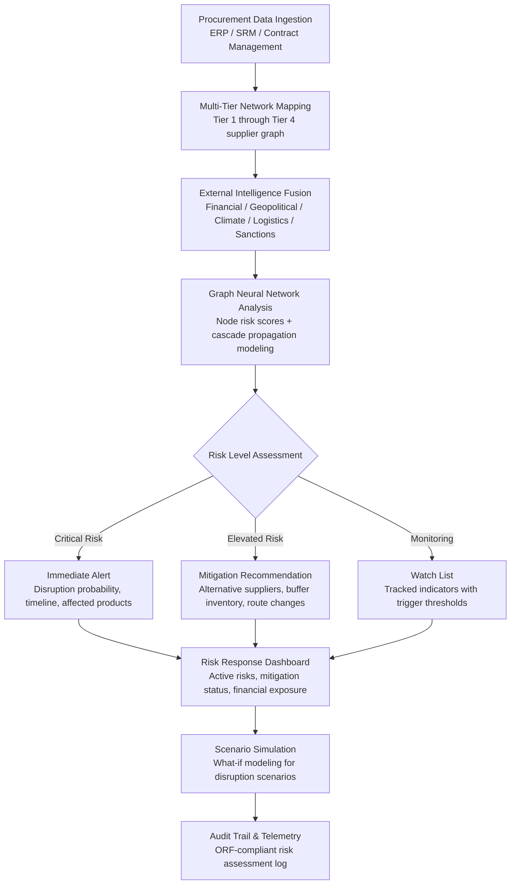

# Supply Chain Risk Neural Network

Frankmax

NAICS 551112, 541611-541990

> **Multinational Corporate Empires** — Supply Chain Risk Neural Network

## Objective & Purpose

The 2020-2024 period exposed catastrophic fragility in global supply chains. The Suez Canal blockage cost $9.6B per day in delayed trade. Semiconductor shortages idled automotive production lines for months, costing the industry $210B in lost revenue. Companies with just-in-time inventory models and single-source dependencies experienced 30-50% revenue disruptions. Yet most multinationals still manage supply chain risk with quarterly supplier reviews, annual audits, and spreadsheet-based risk registers that capture a fraction of their actual exposure. The problem is structural: a typical multinational has 5,000-30,000 Tier 1 suppliers, each with their own Tier 2 and Tier 3 dependencies, creating a supply network of 100,000+ nodes that no human team can monitor in real time.

The Supply Chain Risk Neural Network builds a living model of the organization's multi-tier supply network. It ingests supplier data from procurement systems, augments with external intelligence (financial health signals, geopolitical risk feeds, weather and climate data, shipping and logistics data, sanctions and trade restriction databases, social media and news sentiment), and applies graph neural network models to compute risk scores at every node and edge in the network. The system identifies concentration risks (too many critical inputs from a single geography, supplier, or logistics corridor), cascade risks (a Tier 3 supplier failure that propagates through the network to affect multiple product lines), and emerging risks (deteriorating financial health, political instability, climate events) before they materialize as disruptions.

The critical differentiator is predictive capability. Traditional supply chain risk tools are reactive -- they flag a problem after the supplier misses a delivery. The Neural Network identifies risk indicators 30-90 days before disruption materializes: a Tier 2 supplier's credit rating downgrade, a port congestion trend that will reach critical levels in 6 weeks, a geopolitical development that will trigger new trade restrictions within a quarter. This early warning enables proactive mitigation: qualifying alternative suppliers, building buffer inventory, or rerouting logistics before the disruption hits.

## Business Context

| Attribute | Value |
|---|---|
| **Business Process** | Supply chain risk management |
| **Business Function** | Supply Chain |
| **Category** | Risk |
| **Target Audience** | 7. Multinational Corporate Empires |
| **Bundle** | Enterprise Operations Pack ($4,500/mo) |
| **Monthly Cost of Inaction** | $100K-$5M (supply disruption losses, production downtime, emergency procurement premiums) |

## BPMN Workflow

## Features

1. **Multi-Tier Supply Network Mapping** — Automatically maps the supply network beyond Tier 1 using procurement data, supplier disclosure, public records (corporate registrations, import/export data), and AI inference. Builds a graph of 10,000-100,000+ nodes showing supplier-to-supplier dependencies, geographic concentration, and critical path analysis. Identifies "hidden" dependencies: Tier 3 suppliers that feed multiple Tier 1 suppliers for the same product.

2. **Real-Time External Intelligence Fusion** — Continuously integrates 25+ external data feeds: supplier financial health (credit ratings, payment behavior, litigation filings), geopolitical risk indices (country risk scores, sanctions updates, trade restriction changes), climate and weather (severe weather forecasts, natural disaster alerts), logistics intelligence (port congestion, shipping delays, route disruptions), and news sentiment (supplier-specific and industry-level).

3. **Graph Neural Network Risk Scoring** — Applies graph neural network models that compute risk scores considering not just individual node risk but network-level risk propagation. A financially healthy Tier 1 supplier that sources 80% of a critical component from a single Tier 2 supplier in a politically unstable region receives an elevated score even if its own metrics look clean.

4. **Cascade Risk Simulation** — Models how a disruption at any node propagates through the network. If Supplier X fails, which Tier 1 suppliers are affected, which products cannot be produced, what is the revenue impact timeline, and how long until alternative supply is established? Simulations run in minutes, enabling rapid decision-making during actual disruptions.

5. **Concentration Risk Analysis** — Identifies geographic concentration (too many suppliers in a single earthquake zone, flood plain, or political jurisdiction), supplier concentration (single-source dependencies for critical inputs), and logistics concentration (over-reliance on a single port, shipping lane, or customs corridor). Quantifies exposure in dollar terms per concentration risk.

6. **Predictive Early Warning System** — Machine learning models trained on historical disruption data identify leading indicators 30-90 days before disruption materializes. Indicators include: supplier payment behavior deterioration, unusual inventory buildup or drawdown at supplier facilities, logistics route capacity trending toward congestion thresholds, and geopolitical sentiment shifts in key supplier regions.

7. **Alternative Supplier Intelligence** — When a risk is identified, the system recommends qualified alternative suppliers from its database: capability match, geographic diversification, financial stability, lead time compatibility, and certification status. Reduces the time to qualify and onboard alternative supply from months to weeks.

8. **Regulatory Compliance Integration** — Maps supply chain regulatory requirements (UFLPA forced labor restrictions, conflict minerals reporting, CBAM carbon border adjustments, CSRD supply chain due diligence) against the supplier network, identifying compliance gaps and documentation requirements.

## Workflow & Automation

**Step 1: Supply Network Data Integration** — Connect to procurement systems (SAP Ariba, Coupa, Oracle Procurement), supplier relationship management tools, and contract management platforms. Extract supplier master data, purchase order history, delivery performance metrics, and contractual terms. Establish the Tier 1 supplier base.

**Step 2: Multi-Tier Network Discovery** — Extend the network beyond Tier 1 using supplier disclosure questionnaires, public import/export records, corporate registration databases, and AI inference from financial filing analysis. Build a comprehensive graph showing multi-tier dependencies with geographic coordinates, industry classifications, and business relationship types.

**Step 3: External Intelligence Overlay** — Layer external data feeds onto every network node: financial health indicators, geopolitical risk scores, climate exposure, logistics performance, sanctions screening, and news sentiment. Each data source contributes to a composite risk input vector for the neural network models.

**Step 4: Risk Score Computation** — The graph neural network processes the augmented supply network to produce risk scores at node, edge, and subgraph levels. Scores incorporate both direct risk (the supplier itself) and network risk (the supplier's position in the supply chain and its dependencies). Scores update daily as new intelligence arrives.

**Step 5: Alert Generation & Mitigation Planning** — Risk scores exceeding configured thresholds trigger alerts with specific context: what risk, where in the network, estimated impact timeline, confidence level, and recommended mitigation actions. Mitigation recommendations include alternative suppliers, buffer inventory targets, logistics rerouting options, and contractual remedies.

**Step 6: Scenario Modeling & Response** — During active risk events, the scenario simulation engine models response options: cost and timeline to shift to alternative suppliers, revenue impact of production delays, optimal inventory positioning, and insurance claim triggers. Decision-makers compare scenarios to select the response with the best risk-adjusted outcome.

## Input/Output Specifications

| Direction | Data | Format | Description |
|---|---|---|---|
| Input | Procurement data | API (SAP Ariba, Coupa, Oracle) | Supplier master, PO history, delivery performance |
| Input | Supplier financial data | API (D&B, S&P, Moody's feeds) | Credit ratings, payment behavior, litigation filings |
| Input | Geopolitical intelligence | API (risk index feeds) | Country risk scores, sanctions lists, trade restrictions |
| Input | Climate and weather data | API (NOAA, Copernicus, weather services) | Severe weather forecasts, natural disaster alerts |
| Input | Logistics data | API (port authorities, shipping trackers) | Vessel tracking, port congestion, route disruptions |
| Output | Risk scorecards | JSON + dashboard UI | Node and network risk scores with trend analysis |
| Output | Alert notifications | JSON + email / Slack / Teams | Risk alerts with mitigation recommendations |
| Output | Scenario simulations | JSON + interactive dashboard | Disruption impact models with response options |
| Output | Audit trail | JSON (immutable log) | ORF-compliant risk assessment and response log |

## Integration Points

| System | Integration Type | Data Flow |
|---|---|---|
| **ESG Compliance & Reporting Engine** | Bidirectional | Supply chain ESG data shared; ESG supplier risks feed network model |
| **Board Decision Intelligence** | Outbound summary | Critical supply chain risks included in board risk briefings |
| **Billing Leakage Detector** | Cross-reference | Supplier billing accuracy validated against procurement data |
| **Regulatory Change Tracker** | Inbound feed | Trade restriction and sanctions changes update risk models |
| **Chokepoint Intelligence Engine** | Outbound analytics | Supply chain chokepoints (single-source, single-route) feed enterprise chokepoint mapping |
| **Multi-Model AI Orchestrator** | Infrastructure | Neural network model routing and compute allocation |
| **Audit Trail and Traceability Engine** | Outbound log stream | All risk assessments and response actions logged immutably |
| **Failure Intelligence Library** | Outbound anonymized patterns | Supply chain disruption patterns feed cross-industry intelligence |

## Pricing & Revenue Model

| Component | Pricing | Notes |
|---|---|---|
| **Enterprise Operations Pack** | $4,500/month | Includes Supply Chain Risk + DocuFlow + Chokepoint Intelligence |
| **Standalone -- Subscription** | $3,800/month | Up to 5,000 Tier 1 suppliers, Tier 2 visibility |
| **Full network tier (Tier 3-4)** | $6,200/month | Deep multi-tier mapping, unlimited suppliers |
| **Scenario simulation module** | +$1,500/month | On-demand disruption modeling and response optimization |
| **Alternative supplier intelligence** | +$900/month | Qualified alternative supplier recommendations |
| **AI token consumption** | Included at 80% discount | 3M tokens/month in bundle; overage at marketplace rates |

**Revenue model**: Supply Chain Risk Neural Network sells on insurance logic -- the cost of the tool is trivial compared to a single supply chain disruption (average $184M in revenue impact for large enterprises). The "burger" is AI-powered multi-tier visibility at a fraction of building internal supply chain intelligence capability. The "fries" attach through scenario modeling, regulatory compliance (UFLPA, CBAM, CSRD supply chain due diligence), and continuous monitoring at 75-90% margin. The network intelligence compounds: every supplier mapped and every disruption analyzed improves the model for all users.

## NAICS/SIC Mapping

| NAICS Code | SIC Code | Industry | Relevance |
|---|---|---|---|
| 551112 | 6712 | Offices of Other Holding Companies | Multi-subsidiary supply chain risk aggregation |
| 541611 | 7371 | Administrative Management Consulting | Supply chain risk advisory and strategy |
| 541614 | 7389 | Process and Logistics Consulting | Supply chain optimization and resilience |
| 541990 | 7389 | All Other Professional Services | Supply chain risk management services |
| 311-339 | 2000-3999 | Manufacturing | Manufacturing supply chain risk management |
| 423-425 | 5000-5199 | Wholesale Trade | Distribution network risk assessment |
| 481-488 | 4011-4789 | Transportation & Warehousing | Logistics risk monitoring and route optimization |
