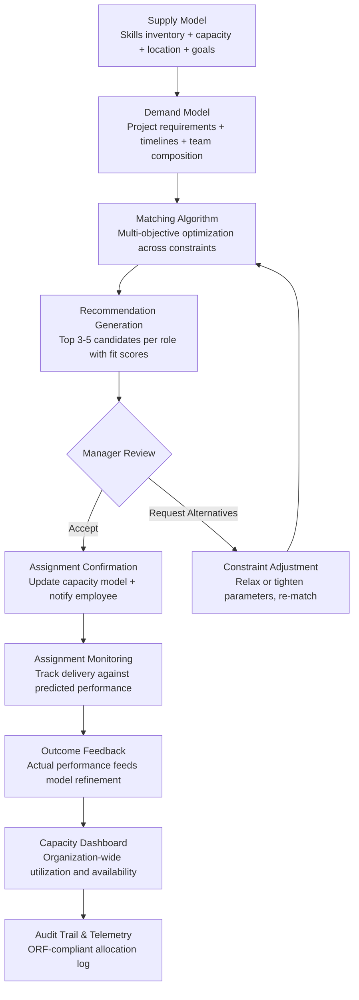

# Talent-to-Task Matching Engine

Frankmax

NAICS 551112, 541611-541990

> **Multinational Corporate Empires** — Talent-to-Task Matching Engine

## Objective & Purpose

Resource allocation in large organizations is consistently suboptimal. Deloitte research shows that 85% of employees feel they are not working at their full potential, and organizations waste an estimated 20-30% of productive capacity through misalignment between skills and assignments. The root cause is information asymmetry: project managers do not know what skills exist across the organization, HR does not have real-time visibility into project demands, and employees do not know which opportunities match their growth objectives. The result is a reliance on "who you know" staffing: the same visible employees get the same types of assignments while underutilized talent sits idle in the wrong seats.

The Talent-to-Task Matching Engine builds a real-time, multi-dimensional model of organizational supply (skills, capacity, location, development goals) and demand (project requirements, timelines, complexity, team composition needs). On the supply side, it ingests data from HRIS systems (skills profiles, certifications, job history), performance systems (demonstrated capabilities, quality metrics), learning platforms (current training, emerging skills), and work output systems (actual work produced, not just listed skills). On the demand side, it ingests project plans, staffing requests, skill requirements, timeline constraints, and budget parameters.

The matching algorithm goes beyond simple skill-keyword matching. It considers proficiency levels (junior, intermediate, expert), complementary skills within a team (diverse capabilities produce better outcomes than homogeneous teams), development goals (stretch assignments accelerate growth), location and timezone constraints, existing workload and availability, and cultural fit factors (team communication patterns, work style preferences). The result is an assignment recommendation that optimizes for project success probability, employee development, and organizational capacity utilization simultaneously. Organizations that deploy talent matching systems report 15-25% improvements in project delivery metrics and 20-30% reductions in external contractor spend.

## Business Context

| Attribute | Value |
|---|---|
| **Business Process** | Resource allocation |
| **Business Function** | HR/Operations |
| **Category** | Optimization |
| **Target Audience** | 7. Multinational Corporate Empires |
| **Bundle** | Enterprise Operations Pack ($4,500/mo) |
| **Monthly Cost of Inaction** | $40K-$250K (underutilization, contractor overspend, project delays) |

## BPMN Workflow

## Features

1. **Dynamic Skills Inventory** — Maintains a real-time skills inventory that goes beyond self-reported profiles. Ingests demonstrated skills from work output (code contributions show programming languages, closed deals show negotiation skill, resolved tickets show technical domains), validated certifications, peer endorsements, and performance review evidence. Skills are mapped to a standardized taxonomy with proficiency levels.

2. **Demand Signal Processing** — Converts project staffing requests into structured demand signals: required skills with proficiency levels, team size and composition needs, timeline and availability windows, location and timezone constraints, budget parameters, and security clearance requirements. Supports both immediate staffing needs and forward-looking resource planning.

3. **Multi-Objective Matching Algorithm** — Optimizes assignments across four objectives simultaneously: project success probability (skill fit and team composition), employee development (stretch opportunities aligned with career goals), capacity utilization (minimize idle time and bench costs), and cost efficiency (internal talent vs. external contractors). Configurable weighting allows organizations to prioritize different objectives.

4. **Team Composition Optimization** — Goes beyond individual skill matching to optimize team composition. Research shows that diverse teams (varied expertise, perspectives, and working styles) outperform homogeneous ones. The system recommends team configurations that balance technical skills, experience levels, communication styles, and cognitive diversity.

5. **Internal Mobility Intelligence** — Identifies employees whose current role underutilizes their capabilities or whose career trajectory aligns with emerging organizational needs. Proactively recommends internal mobility opportunities that serve both employee growth and organizational demand, reducing external hiring costs.

6. **Contractor vs. Internal Decision Support** — When internal supply cannot meet demand, the system quantifies the gap and recommends whether to develop internal capability (training investment), temporarily staff externally (contractor engagement), or permanently hire (headcount addition). Decision support includes cost comparison, timeline implications, and strategic capability considerations.

7. **Real-Time Capacity Dashboard** — Organization-wide visibility into talent supply and demand: current utilization rates by skill category, upcoming capacity availability, demand pipeline by project and timeline, and gap analysis highlighting skill shortages. Enables workforce planning decisions based on actual data rather than anecdotal evidence.

## Workflow & Automation

**Step 1: Skills Inventory Construction** — Integrate with HRIS (Workday, SAP HCM), performance management systems, learning platforms (LinkedIn Learning, Coursera), and work output systems (Jira, GitHub, Salesforce). Build comprehensive skills profiles combining self-reported, demonstrated, certified, and peer-validated skills with proficiency levels and recency indicators.

**Step 2: Demand Signal Capture** — When a project manager or team lead needs resources, they submit a structured staffing request specifying skills, proficiency levels, availability window, duration, location constraints, and team context. The system also ingests demand signals from project planning tools and resource management systems.

**Step 3: Matching and Ranking** — The matching algorithm processes supply and demand inputs, applying multi-objective optimization. For each open role, the system produces a ranked list of 3-5 candidates with detailed fit scores broken down by skill match, development alignment, availability, and cost. Each recommendation includes the rationale and any trade-offs.

**Step 4: Manager Review and Selection** — Hiring managers review recommendations with full visibility into fit scores, candidate profiles, and trade-off analysis. Managers can adjust constraints (relax timeline, accept lower proficiency, expand geographic scope) and re-run matching. Selected assignments update the capacity model in real time.

**Step 5: Assignment Monitoring** — Active assignments are monitored against predicted performance outcomes. The system tracks delivery metrics, quality indicators, and employee engagement signals. Early warning flags identify assignments where performance is tracking below prediction, enabling intervention before project impact.

**Step 6: Outcome Feedback and Model Improvement** — At assignment completion, actual outcomes (project success, skill development, employee satisfaction) feed back into the matching models. Over time, the algorithm learns which matching factors predict success in the organization's specific context, improving recommendation accuracy.

## Input/Output Specifications

| Direction | Data | Format | Description |
|---|---|---|---|
| Input | Employee skills profiles | API (Workday, SAP HCM) | Self-reported and HR-validated skills with proficiency levels |
| Input | Work output data | API (Jira, GitHub, Salesforce) | Demonstrated skills from actual work production |
| Input | Learning and certification data | API (LMS platforms) | Training completed, certifications earned, in-progress courses |
| Input | Staffing requests | JSON / UI form | Project skill requirements, timelines, constraints |
| Input | Project plans | API (MS Project, Smartsheet) | Resource demand forecasts and timeline dependencies |
| Output | Match recommendations | JSON + dashboard UI | Ranked candidates with fit scores and rationale |
| Output | Capacity dashboard | REST API / UI | Organization-wide utilization and availability |
| Output | Gap analysis | JSON + PDF | Skill shortages with development or hiring recommendations |
| Output | Audit trail | JSON (immutable log) | ORF-compliant allocation decision log |

## Integration Points

| System | Integration Type | Data Flow |
|---|---|---|
| **Operator Performance Analytics** | Inbound performance data | Demonstrated performance informs matching quality scores |
| **Workforce Planning Simulator** | Bidirectional | Capacity data feeds planning; planning scenarios generate demand signals |
| **Enterprise Knowledge Graph** | Inbound expertise data | Skills graph enriches matching with demonstrated expertise |
| **Organizational Drift Detector** | Inbound context | Team culture fit data informs team composition recommendations |
| **Board Decision Intelligence** | Outbound summary | Capacity utilization and skill gap metrics in board briefings |
| **Multi-Model AI Orchestrator** | Infrastructure | AI model routing for matching algorithm optimization |
| **Audit Trail and Traceability Engine** | Outbound log stream | All allocation decisions logged immutably |
| **Failure Intelligence Library** | Outbound anonymized patterns | Staffing failure patterns feed cross-industry intelligence |

## Pricing & Revenue Model

| Component | Pricing | Notes |
|---|---|---|
| **Enterprise Operations Pack** | $4,500/month | Includes Talent Matching + DocuFlow + Chokepoint Intelligence |
| **Standalone -- Subscription** | $2,600/month | Up to 2,000 employees in matching pool |
| **Large Enterprise (over 2K employees)** | $3.50 per employee/month | Volume pricing for large deployments |
| **Team composition optimizer** | +$800/month | Multi-person team optimization beyond individual matching |
| **Internal mobility module** | +$600/month | Proactive mobility recommendations and career pathing |
| **AI token consumption** | Included at 80% discount | 2M tokens/month in bundle; overage at marketplace rates |

**Revenue model**: Talent-to-Task Matching Engine delivers measurable ROI through reduced contractor spend (20-30% reduction), improved project delivery (15-25% improvement in on-time delivery), and reduced turnover (engaged employees stay longer). The "burger" is matching intelligence at a fraction of the cost of PSA (Professional Services Automation) platforms ($50K-$200K/year). The "fries" attach through audit trail for allocation decisions, workforce analytics for board reporting, and internal mobility compliance at 75-85% margin.

## NAICS/SIC Mapping

| NAICS Code | SIC Code | Industry | Relevance |
|---|---|---|---|
| 551112 | 6712 | Offices of Other Holding Companies | Cross-subsidiary talent pool optimization |
| 541611 | 7371 | Administrative Management Consulting | Organizational effectiveness and resource optimization |
| 541612 | 7371 | Human Resources Consulting | Talent management and workforce planning |
| 541990 | 7389 | All Other Professional Services | Professional services resource management |
| 541512 | 7372 | Computer Systems Design Services | Technology workforce allocation |
| 541330 | 8711 | Engineering Services | Engineering resource management across projects |
| 541110 | 8111 | Offices of Lawyers | Legal staffing optimization across practice areas |
