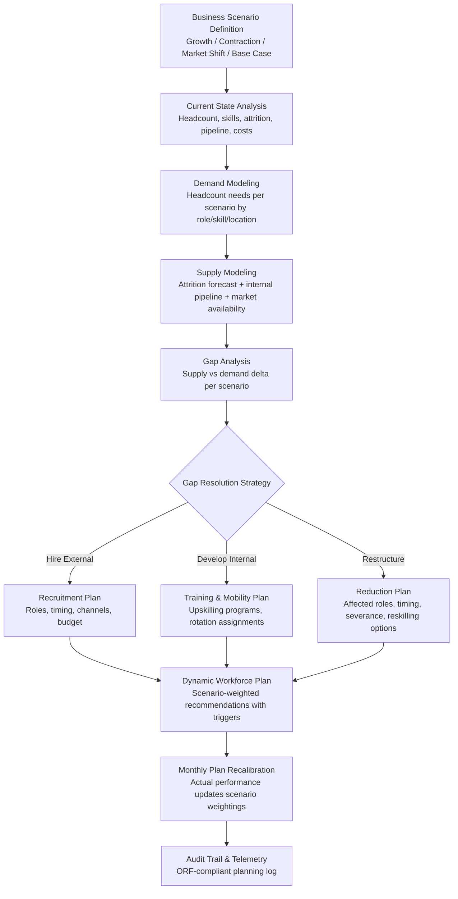

# Workforce Planning Simulator

Frankmax

NAICS 551112, 541611-541990

> **Multinational Corporate Empires** — Workforce Planning Simulator

## Objective & Purpose

Headcount planning in large multinationals is simultaneously one of the most consequential financial decisions and one of the least data-driven. A typical planning cycle works like this: finance sets a headcount budget based on revenue projections, business unit leaders negotiate for more headcount than they receive, HR scrambles to fill approved positions, and within six months the business has either over-hired (triggering costly layoffs) or under-hired (losing market opportunities). The cost of getting it wrong is enormous: a single mis-hire at the professional level costs 1.5-2x annual salary to unwind (recruiting, onboarding, severance, lost productivity, re-hiring). For a 10,000-person enterprise with 15% annual turnover, the planning and talent acquisition process represents a $50M-$100M annual expenditure that is planned with less rigor than a $500K capital equipment purchase.

The Workforce Planning Simulator applies scenario modeling to headcount decisions. Instead of a single headcount plan based on a single revenue forecast, the system models workforce needs across multiple business scenarios: base case, aggressive growth, contraction, market shift, technology disruption, and regulatory change. For each scenario, the simulator calculates optimal headcount by role, skill, location, and timing -- factoring in lead times (hiring takes 60-120 days for professional roles), attrition patterns (which roles and geographies have highest voluntary departure rates), skill development pipelines (how many junior employees advance to senior roles over time), and automation impact (which tasks will be absorbed by AI/automation within the planning horizon).

The output is not a static headcount number but a dynamic workforce plan: when to start hiring for which roles, when to pause hiring, when to invest in internal development vs. external hiring, and when to consider restructuring. The plan adapts as business conditions change -- each month's actual performance data updates the scenario weightings and adjusts the workforce recommendations. Organizations that use workforce analytics for planning report 20-30% reductions in time-to-fill, 25-40% reductions in unplanned turnover costs, and 15-20% improvements in labor cost efficiency.

## Business Context

| Attribute | Value |
|---|---|
| **Business Process** | Headcount planning |
| **Business Function** | HR |
| **Category** | Planning |
| **Target Audience** | 7. Multinational Corporate Empires |
| **Bundle** | Enterprise Operations Pack ($4,500/mo) |
| **Monthly Cost of Inaction** | $50K-$500K (mis-hiring costs, unfilled positions, restructuring expense) |

## BPMN Workflow

## Features

1. **Multi-Scenario Business Modeling** — Supports unlimited business scenarios with configurable parameters: revenue trajectory, market expansion/contraction, product portfolio changes, technology shifts, regulatory changes, and M&A events. Each scenario carries a probability weighting that the system adjusts as actual business performance data arrives.

2. **Attrition Prediction Engine** — Forecasts voluntary and involuntary attrition by role, department, geography, and tenure using historical turnover data enriched with leading indicators: employee engagement scores, market salary competitiveness, team performance trends, and industry-specific labor market conditions. Predicts not just aggregate attrition rates but which specific roles and skill categories are highest risk.

3. **Internal Pipeline Modeling** — Projects how the internal talent pipeline develops over the planning horizon: how many junior employees advance to mid-level, how many mid-level advance to senior, how quickly reskilling programs produce new capabilities, and where internal pipeline cannot meet demand. Factors in promotion velocity, training completion rates, and role readiness assessments.

4. **Labor Market Intelligence** — Integrates external labor market data: salary benchmarks by role and geography, talent availability indicators (job posting volumes, LinkedIn talent pool sizes), and competitive hiring activity. Identifies roles where market conditions make hiring difficult and recommends compensation adjustments or alternative sourcing strategies.

5. **Automation Impact Modeling** — Projects how AI and automation adoption will affect workforce composition over the planning horizon. For each role, estimates the percentage of tasks that can be automated, the timeline for automation implementation, and the resulting headcount impact. Ensures workforce plans account for technology-driven demand changes.

6. **Cost Optimization Engine** — Calculates total workforce cost across scenarios: fully loaded compensation, recruiting costs, training investment, severance provisions, contractor premiums, and location-based cost differentials. Identifies cost optimization opportunities: shifting roles to lower-cost locations, converting contractors to FTEs (or vice versa), and timing hires to match budget cycles.

7. **Dynamic Plan Recalibration** — The workforce plan is not a static annual document. Each month, actual business performance data (revenue, headcount, attrition, hiring velocity) updates scenario probability weightings. The plan automatically recalibrates, adjusting hiring recommendations, training priorities, and restructuring timelines based on evolving conditions.

## Workflow & Automation

**Step 1: Current State Assessment** — Import current workforce data from HRIS: headcount by role, department, location, and tenure. Layer in compensation data, performance ratings, flight risk scores, and skills profiles. Establish the baseline from which all scenario modeling begins.

**Step 2: Business Scenario Configuration** — Work with finance and business unit leaders to define planning scenarios. Each scenario specifies revenue assumptions, strategic initiatives, market conditions, and technology adoption plans. The system maps business assumptions to workforce demand drivers: revenue per employee ratios, project staffing models, and support-to-revenue ratios.

**Step 3: Demand Modeling** — For each scenario, the simulator calculates workforce demand by role, skill, location, and time period. Demand models incorporate role-specific productivity assumptions, team size optimization, and span-of-control guidelines. The output is a time-phased headcount requirement for each scenario.

**Step 4: Supply Modeling** — Project workforce supply by combining current headcount, predicted attrition, internal pipeline advancement, and external hiring capacity. Supply models factor in hiring lead times (time-to-fill by role), offer acceptance rates, onboarding ramp periods, and geographic mobility constraints.

**Step 5: Gap Analysis and Strategy Formulation** — Compare supply and demand across scenarios to identify gaps: roles where demand exceeds supply (hire or develop), roles where supply exceeds demand (redeploy or reduce), and skills that do not exist internally (buy, build, or borrow decisions). Strategy recommendations are probability-weighted across scenarios.

**Step 6: Plan Generation and Approval** — The system produces a dynamic workforce plan with specific actions, timelines, and budget requirements. The plan enters an approval workflow: HR leadership, finance review, business unit sign-off, and executive approval. Approved plans translate into recruitment requisitions, training enrollments, and budget allocations.

**Step 7: Continuous Monitoring and Recalibration** — Monthly actual performance data feeds the recalibration engine. As business conditions evolve, scenario weightings adjust and the workforce plan adapts. Quarterly review sessions compare planned vs. actual hiring, attrition, and development, with variance analysis driving plan refinements.

## Input/Output Specifications

| Direction | Data | Format | Description |
|---|---|---|---|
| Input | Current headcount data | API (Workday, SAP HCM) | Roles, departments, locations, tenure, compensation |
| Input | Business scenario assumptions | JSON / UI forms | Revenue forecasts, strategic plans, market conditions |
| Input | Historical attrition data | API (HRIS) / CSV | Turnover patterns by role, department, geography, tenure |
| Input | Labor market data | API (LinkedIn Talent Insights, BLS) | Salary benchmarks, talent availability, hiring trends |
| Input | Financial budget data | API (ERP, planning tools) | Headcount budgets, compensation bands, cost targets |
| Output | Scenario-weighted workforce plan | JSON + PDF + dashboard | Time-phased headcount recommendations with triggers |
| Output | Gap analysis report | JSON + PDF | Supply-demand gaps by role, skill, location with resolution strategies |
| Output | Cost modeling | XLSX + dashboard | Total workforce cost across scenarios with optimization recommendations |
| Output | Audit trail | JSON (immutable log) | ORF-compliant planning decision log |

## Integration Points

| System | Integration Type | Data Flow |
|---|---|---|
| **Operator Performance Analytics** | Inbound performance data | Team productivity metrics inform demand modeling assumptions |
| **Talent-to-Task Matching Engine** | Bidirectional | Capacity data informs planning; planning outputs create demand signals |
| **Organizational Drift Detector** | Inbound analytics | Drift patterns predict attrition risk for supply modeling |
| **Enterprise Knowledge Graph** | Inbound expertise data | Organizational skill maps inform internal pipeline modeling |
| **Board Decision Intelligence** | Outbound summary | Workforce plan scenarios included in board strategic planning packages |
| **Multi-Model AI Orchestrator** | Infrastructure | AI model routing for scenario simulation and prediction |
| **Audit Trail and Traceability Engine** | Outbound log stream | All planning decisions logged immutably |
| **Failure Intelligence Library** | Outbound anonymized patterns | Workforce planning failure patterns feed cross-industry intelligence |

## Pricing & Revenue Model

| Component | Pricing | Notes |
|---|---|---|
| **Enterprise Operations Pack** | $4,500/month | Includes Workforce Planning + DocuFlow + Chokepoint Intelligence |
| **Standalone -- Subscription** | $3,000/month | Up to 5,000 employees, 5 scenarios |
| **Enterprise tier (over 5K employees)** | $5,200/month | Unlimited employees and scenarios |
| **Automation impact modeling** | +$900/month | AI/automation workforce impact projections |
| **Labor market intelligence** | +$700/month | Real-time salary benchmarking and talent availability data |
| **AI token consumption** | Included at 80% discount | 2M tokens/month in bundle; overage at marketplace rates |

**Revenue model**: Workforce Planning Simulator sells on cost avoidance -- a single prevented layoff-rehire cycle at 100 positions saves $15M-$20M in direct costs. The "burger" is scenario-based planning at a fraction of management consulting engagement costs ($300K-$500K for a one-time workforce study vs. $5,200/month for continuous planning). The "fries" attach through board reporting, audit compliance for workforce decisions, automation impact modeling, and labor market intelligence at 75-90% margin. Annual planning cycles create natural renewal points with expanding scope.

## NAICS/SIC Mapping

| NAICS Code | SIC Code | Industry | Relevance |
|---|---|---|---|
| 551112 | 6712 | Offices of Other Holding Companies | Multi-subsidiary workforce planning and optimization |
| 541611 | 7371 | Administrative Management Consulting | Workforce strategy and organizational planning |
| 541612 | 7371 | Human Resources Consulting | Strategic workforce planning advisory |
| 541990 | 7389 | All Other Professional Services | Professional services workforce management |
| 522110 | 6021 | Commercial Banking | Financial services workforce planning and compliance |
| 541512 | 7372 | Computer Systems Design Services | Technology workforce planning with automation impact |
| 311-339 | 2000-3999 | Manufacturing | Manufacturing workforce planning and shift optimization |
