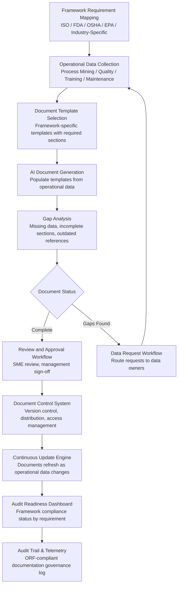

# Compliance Documentation Generator

Frankmax

NAICS 311-339, 423-454

> **Legacy Enterprises** — Compliance Documentation Generator

## Objective & Purpose

Legacy enterprises in manufacturing, distribution, and retail operate under layers of regulatory compliance requirements: ISO 9001 (quality management), ISO 14001 (environmental management), ISO 45001 (occupational health and safety), FDA 21 CFR Part 11 (electronic records in pharma/food), OSHA regulations, EPA reporting, IATF 16949 (automotive quality), AS9100 (aerospace quality), GMP (Good Manufacturing Practice), and dozens of industry-specific standards. Each framework requires extensive documentation: policies, procedures, work instructions, risk assessments, training records, audit records, corrective action reports, and management review minutes. For a mid-size manufacturer, maintaining compliance documentation across 3-5 frameworks requires 2-4 dedicated compliance staff producing and updating thousands of documents annually.

The compliance burden is particularly acute for legacy enterprises because their processes evolved organically over decades, with documentation lagging behind actual practice. The gap between documented procedures and actual operations -- typically 40-60% -- means that compliance documentation is often fiction: it describes how things are supposed to work, not how they actually work. Auditors find these gaps during certification audits, triggering nonconformances, corrective action requirements, and in severe cases, certification suspension. Each major nonconformance costs $50K-$200K in remediation effort, and certification loss can mean losing customers who require certified suppliers.

The Compliance Documentation Generator automates the creation, maintenance, and updating of regulatory compliance documentation from operational data. Instead of compliance staff manually writing procedures that describe how processes should work, the system generates documentation from actual process data: Process Mining outputs become documented procedures, quality data becomes quality management records, training system data becomes training evidence, and equipment maintenance records become asset management documentation. The generated documentation is always current (updated as processes change), always accurate (derived from actual data rather than assumptions), and always audit-ready (formatted per framework requirements with proper revision control and approval workflows).

## Business Context

| Attribute | Value |
|---|---|
| **Business Process** | Regulatory documentation |
| **Business Function** | Compliance |
| **Category** | Legal |
| **Target Audience** | 8. Legacy Enterprises |
| **Bundle** | Enterprise Operations Pack ($4,500/mo) |
| **Monthly Cost of Inaction** | $20K-$200K (audit failures, certification risk, manual documentation labor) |

## BPMN Workflow

## Features

1. **Multi-Framework Template Library** — Pre-built document templates for 15+ compliance frameworks: ISO 9001, ISO 14001, ISO 45001, ISO 27001, FDA 21 CFR Part 11, GMP, HACCP, IATF 16949, AS9100, OSHA standards, EPA reporting formats, SOC 2, GDPR documentation, CMMC, and industry-specific standards. Templates include all required sections, formatting, and cross-references per framework.

2. **Operational Data-Driven Generation** — Generates compliance documents from actual operational data rather than manual writing. Process procedures are generated from Process Mining output (actual process flows), quality records from QMS data, training documentation from LMS records, maintenance documentation from CMMS data, and environmental records from energy and emissions data.

3. **Gap Analysis Engine** — Compares generated documentation against framework requirements to identify gaps: missing procedures, incomplete records, outdated references, and undocumented processes. Each gap is classified by audit risk (major nonconformance, minor nonconformance, observation) and mapped to the responsible function for remediation.

4. **Intelligent Document Updating** — When operational processes change (detected through Process Mining), the system automatically flags affected documentation for update. Updated sections are generated from new operational data and routed through the approval workflow. Ensures documentation stays current without manual tracking of change impacts.

5. **Revision Control and Distribution** — Manages document lifecycle: creation, review, approval, release, distribution, and obsolescence. Tracks document versions with change history. Controls document access by role and department. Ensures that operators always access the current, approved version and that obsolete documents are withdrawn.

6. **Audit Package Preparation** — Before scheduled audits, the system assembles the complete audit evidence package: all required documents by framework clause, evidence of implementation (operational data), training records, management review minutes, corrective action closure evidence, and internal audit results. Reduces audit preparation from weeks to hours.

7. **Corrective Action Tracking** — When nonconformances are identified (from audits, quality events, or customer complaints), the system creates and tracks corrective action records: root cause analysis documentation, corrective action plans, implementation evidence, and effectiveness verification. Ensures corrective actions are closed within required timelines.

## Workflow & Automation

**Step 1: Framework Configuration** — Select applicable compliance frameworks and map requirements to the organization's processes, functions, and documentation. The system generates a documentation matrix showing every required document, its current status (exists/missing/outdated), and the operational data source that will feed its content.

**Step 2: Template Assignment and Data Mapping** — Assign framework-specific templates to each required document. Map template sections to operational data sources: process descriptions from Process Mining, quality metrics from QMS, training records from LMS, and equipment records from CMMS. Identify sections requiring manual input (management commitments, policy statements).

**Step 3: Document Generation** — The AI engine generates document content from mapped data sources. Procedures describe actual operational processes in the language and format required by the framework. Records compile operational evidence into required formats. Policies are drafted with organization-specific context for management review and approval.

**Step 4: Review and Approval** — Generated documents enter a configurable review workflow: subject matter expert review (is the content accurate?), compliance review (does it meet framework requirements?), and management approval (formal sign-off for controlled documents). Reviewer comments are tracked and resolved.

**Step 5: Release and Distribution** — Approved documents are released to the document control system with proper version numbering, effective dates, and distribution lists. Affected personnel are notified of new or updated documents. Training requirements triggered by document changes are automatically created in the LMS.

**Step 6: Continuous Monitoring and Refresh** — The system monitors operational data sources for changes that would invalidate current documentation. When changes are detected, affected documents are flagged for update, and the regeneration cycle begins. Monthly compliance dashboards show documentation currency across all frameworks.

## Input/Output Specifications

| Direction | Data | Format | Description |
|---|---|---|---|
| Input | Process data | API (Process Mining outputs) | Actual process flows, variants, and performance metrics |
| Input | Quality data | API (QMS - ETQ, MasterControl) | Inspection results, NCRs, CAPA records |
| Input | Training records | API (LMS) | Training completions, certifications, competency assessments |
| Input | Maintenance records | API (CMMS) | Work orders, calibration records, equipment histories |
| Input | Environmental data | API (Energy Optimizer, EMS) | Emissions, waste, energy consumption records |
| Output | Compliance documents | PDF / DOCX (controlled) | Procedures, policies, records in framework format |
| Output | Gap analysis report | JSON + PDF | Missing and outdated documentation by framework clause |
| Output | Audit evidence package | PDF (compiled) | Complete audit-ready documentation per framework |
| Output | Audit trail | JSON (immutable log) | ORF-compliant document governance log |

## Integration Points

| System | Integration Type | Data Flow |
|---|---|---|
| **Process Mining & Optimization Engine** | Inbound process data | Actual process flows generate procedure documentation |
| **Quality Prediction Engine** | Inbound quality data | Quality metrics and records feed quality management documentation |
| **Predictive Maintenance Platform** | Inbound maintenance data | Equipment records feed asset management documentation |
| **Energy Consumption Optimizer** | Inbound environmental data | Energy and emissions data feed environmental management docs |
| **Tribal Knowledge Extractor** | Inbound context | Captured tribal knowledge fills documentation gaps |
| **Supplier Dependency Risk Scorer** | Inbound risk data | Supplier assessments feed supplier management documentation |
| **Audit Trail and Traceability Engine** | Outbound log stream | All document operations logged immutably |
| **Failure Intelligence Library** | Outbound anonymized patterns | Documentation failure patterns feed cross-industry intelligence |

## Pricing & Revenue Model

| Component | Pricing | Notes |
|---|---|---|
| **Enterprise Operations Pack** | $4,500/month | Includes Compliance Docs + Process Mining + Tribal Knowledge |
| **Standalone -- per framework** | $1,800/month per framework | Single compliance framework documentation |
| **Multi-framework tier** | $3,500/month | Up to 5 frameworks, all document types |
| **Enterprise tier (over 5 frameworks)** | $5,000/month | Unlimited frameworks and document volume |
| **Audit preparation module** | +$800/month | Automated evidence package assembly |
| **AI token consumption** | Included at 80% discount | 2M tokens/month in bundle; overage at marketplace rates |

**Revenue model**: Compliance Documentation Generator sells on audit risk avoidance and labor cost reduction. A major nonconformance costs $50K-$200K; a certification loss can cost $1M+ in customer attrition. The "burger" is automated documentation at 50-70% of the cost of dedicated compliance staff ($150K-$300K/year for 2 FTEs). The "fries" attach through audit preparation, corrective action tracking, and continuous monitoring at 75-90% margin. Multi-framework pricing creates natural expansion as organizations add certifications.

## NAICS/SIC Mapping

| NAICS Code | SIC Code | Industry | Relevance |
|---|---|---|---|
| 311-312 | 2000-2099 | Food Manufacturing | FDA, HACCP, GMP, FSMA documentation |
| 325 | 2800-2899 | Chemical Manufacturing | EPA, OSHA, ISO 14001 chemical safety documentation |
| 336 | 3700-3799 | Transportation Equipment | IATF 16949 automotive quality documentation |
| 334 | 3600-3699 | Computer and Electronic Products | ISO 9001, ISO 27001 documentation |
| 339 | 3800-3999 | Miscellaneous Manufacturing | FDA, ISO 13485 medical device documentation |
| 332-333 | 3400-3599 | Fabricated Metals and Machinery | AS9100, NADCAP aerospace documentation |
| 423-425 | 5000-5199 | Wholesale Trade | ISO 9001, food safety, cold chain documentation |
