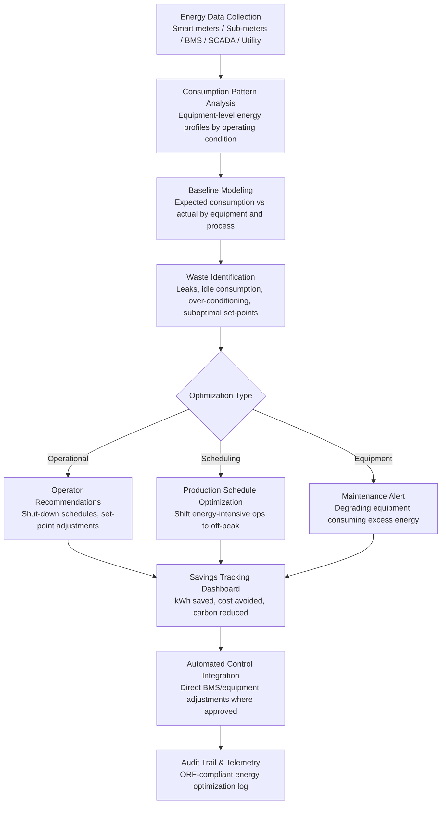

# Energy Consumption Optimizer

Frankmax

NAICS 311-339, 423-454

> **Legacy Enterprises** — Energy Consumption Optimizer

## Objective & Purpose

Energy costs represent 20-30% of total manufacturing operating costs, and for energy-intensive industries (metals, chemicals, glass, cement) the figure exceeds 40%. US manufacturers spend over $200B annually on energy. Despite this magnitude, energy management in legacy enterprises is rudimentary: monthly utility bill review, annual energy audits that identify savings but rarely lead to sustained action, and equipment operators running machines at default settings regardless of production load, ambient conditions, or time-of-use electricity pricing. The result is systematic waste: compressed air leaks (accounting for 20-30% of compressor energy in typical plants), HVAC systems conditioning spaces during non-production hours, motors running at full speed when variable frequency drives could match load, and production scheduling that ignores peak-demand electricity charges.

The Energy Consumption Optimizer uses AI to analyze energy consumption patterns at the equipment level, identify waste, and recommend (or automatically implement) energy-saving actions. The system ingests data from smart meters, sub-meters, building management systems (BMS), SCADA, and utility rate schedules. It builds energy models for each piece of equipment and each production process, understanding how energy consumption varies with production output, ambient conditions, equipment configuration, and operating mode. The system then identifies optimization opportunities across three dimensions: operational waste (equipment running when not needed, set-points higher than necessary), scheduling optimization (shifting energy-intensive operations to off-peak rate periods), and equipment efficiency (degrading equipment consuming more energy than baseline).

The optimizer delivers savings through two mechanisms: prescriptive recommendations (specific actions for operators and facility managers to implement) and automated control (direct integration with BMS and equipment controllers to implement energy-saving actions automatically). Organizations deploying AI-driven energy optimization report 10-25% reductions in energy costs within the first year, with payback periods of 3-6 months. Beyond cost savings, energy reduction directly supports ESG reporting requirements and carbon reduction commitments.

## Business Context

| Attribute | Value |
|---|---|
| **Business Process** | Energy management |
| **Business Function** | Facilities |
| **Category** | Operations |
| **Target Audience** | 8. Legacy Enterprises |
| **Bundle** | Enterprise Operations Pack ($4,500/mo) |
| **Monthly Cost of Inaction** | $20K-$200K (energy waste, peak demand charges, carbon penalties) |

## BPMN Workflow

## Features

1. **Granular Energy Metering Integration** — Connects to utility smart meters, building sub-meters (electrical, gas, water, steam), BMS (Building Management Systems), and equipment-level power monitors. Provides energy visibility from the utility feed down to individual equipment assets. Supports protocols: BACnet, Modbus, SNMP, and utility Green Button data.

2. **Equipment-Level Energy Modeling** — Builds energy consumption models for each significant energy consumer: HVAC systems, compressed air, lighting, process equipment (ovens, furnaces, motors, pumps), and auxiliary systems. Models capture the relationship between energy consumption and operating parameters (production output, ambient conditions, equipment state).

3. **Waste Pattern Detection** — Identifies specific energy waste patterns: equipment running during non-production periods, compressed air leaks (detected through pressure decay analysis and flow-consumption mismatch), HVAC over-conditioning (maintaining tighter temperature bands than production requires), lighting in unoccupied areas, and motors running at constant speed when variable loads are present.

4. **Time-of-Use Rate Optimization** — Analyzes utility rate structures (time-of-use rates, demand charges, ratchet clauses, interruptible rate programs) and recommends production scheduling shifts that minimize energy costs. A batch process that runs during off-peak hours might cost 30-50% less in electricity than the same process during on-peak.

5. **Peak Demand Management** — Monitors and manages peak demand to reduce demand charges (which can represent 30-50% of an industrial electricity bill). Predicts when demand is approaching the monthly peak threshold and recommends or implements load-shedding actions: deferring non-critical loads, staggering equipment start-ups, and cycling thermal loads.

6. **Carbon Emissions Tracking** — Converts energy consumption into carbon emissions using grid-specific emission factors, fuel-specific factors, and market-based accounting where applicable. Tracks progress against carbon reduction targets and generates data for ESG reporting frameworks (CDP, GHG Protocol, Science-Based Targets).

7. **Automated Control Actions** — Where approved by facility management, implements energy-saving actions automatically through BMS integration: adjusting HVAC set-points based on occupancy and production schedule, scheduling equipment shut-downs during planned non-production periods, and modulating variable-speed drives based on load requirements.

## Workflow & Automation

**Step 1: Energy Infrastructure Assessment** — Inventory all energy sources (electricity, natural gas, steam, compressed air), metering infrastructure (utility meters, sub-meters, equipment monitors), and control systems (BMS, SCADA, VFDs). Identify metering gaps and recommend sub-metering additions for high-impact areas.

**Step 2: Data Integration and Baseline** — Connect to energy data sources and utility rate schedules. Analyze 12+ months of historical energy data paired with production output to establish consumption baselines. Baselines normalize for production volume, weather, and seasonal patterns to isolate true waste from demand-driven consumption.

**Step 3: Waste Identification and Prioritization** — Apply pattern detection algorithms to identify energy waste across all monitored equipment and systems. Each waste opportunity is quantified: annual energy savings (kWh), cost savings ($), carbon reduction (metric tons CO2e), and implementation complexity (automatic, operator action, capital investment). Opportunities are ranked by ROI.

**Step 4: Recommendation Generation** — Convert identified waste opportunities into specific, actionable recommendations: which equipment, what action, expected savings, and implementation steps. Recommendations are categorized: no-cost behavioral changes, low-cost operational adjustments, and capital-investment equipment upgrades.

**Step 5: Implementation and Automation** — No-cost and low-cost recommendations are implemented by operators and facility managers. Automated control actions are configured and deployed through BMS integration. Capital investment recommendations enter the organization's capital planning process with ROI justification.

**Step 6: Continuous Monitoring and M&V** — Post-implementation, the system performs measurement and verification (M&V) to confirm actual savings match predicted savings. Ongoing monitoring detects new waste patterns, seasonal optimization opportunities, and regression (previous savings eroding due to configuration drift or behavioral relapse).

## Input/Output Specifications

| Direction | Data | Format | Description |
|---|---|---|---|
| Input | Utility meter data | API (Green Button, smart meter) | Electricity, gas, water consumption |
| Input | Sub-meter data | BACnet / Modbus / SNMP | Equipment and system-level energy consumption |
| Input | Production data | API (MES / ERP) | Production output, schedules, equipment utilization |
| Input | Weather data | API (NOAA, weather services) | Temperature, humidity, solar for HVAC normalization |
| Input | Utility rate schedules | JSON / manual entry | Rate structures, demand charges, TOU periods |
| Output | Energy savings recommendations | JSON + PDF | Prioritized opportunities with ROI estimates |
| Output | Energy dashboard | REST API / UI | Real-time consumption, waste, and savings tracking |
| Output | Carbon emissions report | JSON + PDF | GHG Protocol-compliant emissions data for ESG |
| Output | Audit trail | JSON (immutable log) | ORF-compliant energy optimization decision log |

## Integration Points

| System | Integration Type | Data Flow |
|---|---|---|
| **ESG Compliance & Reporting Engine** | Outbound data | Energy and emissions data feeds ESG reporting requirements |
| **Quality Prediction Engine** | Bidirectional | Energy parameters affect product quality; quality adjustments affect energy |
| **Predictive Maintenance Platform** | Bidirectional | Degrading equipment consumes excess energy; energy anomalies signal equipment issues |
| **Process Mining & Optimization Engine** | Inbound process data | Process schedules inform energy optimization timing |
| **Compliance Documentation Generator** | Outbound data | Energy audit data feeds compliance documentation |
| **Mainframe-to-Cloud Bridge** | Infrastructure | Legacy BMS and SCADA data accessed through bridge |
| **Audit Trail and Traceability Engine** | Outbound log stream | All energy optimization actions logged immutably |
| **Failure Intelligence Library** | Outbound anonymized patterns | Energy waste patterns feed cross-industry intelligence |

## Pricing & Revenue Model

| Component | Pricing | Notes |
|---|---|---|
| **Enterprise Operations Pack** | $4,500/month | Includes Energy Optimizer + Process Mining + Tribal Knowledge |
| **Standalone -- per site** | $2,200/month per site | Single facility, up to 50 monitored points |
| **Multi-site deployment** | $1,500/month per additional site | Volume discount for additional facilities |
| **Automated control module** | +$800/month per site | BMS integration for automatic energy actions |
| **Carbon tracking and ESG module** | +$600/month | GHG Protocol emissions calculation and reporting |
| **AI token consumption** | Included at 80% discount | 2M tokens/month in bundle; overage at marketplace rates |

**Revenue model**: Energy Consumption Optimizer delivers the fastest, most measurable ROI in the legacy enterprise toolkit: 10-25% energy cost reduction with 3-6 month payback. A manufacturing site spending $500K/month on energy saves $50K-$125K/month. The "burger" is AI-powered energy optimization at 30-50% of the cost of energy consulting engagements. The "fries" attach through carbon tracking for ESG reporting, automated control for hands-free savings, and compliance documentation at 75-90% margin. Per-site pricing scales with the customer's facility footprint.

## NAICS/SIC Mapping

| NAICS Code | SIC Code | Industry | Relevance |
|---|---|---|---|
| 311-312 | 2000-2099 | Food Manufacturing | Refrigeration, cooking, and processing energy optimization |
| 325 | 2800-2899 | Chemical Manufacturing | Process heat and reactor energy management |
| 331-332 | 3300-3499 | Primary and Fabricated Metals | Furnace, rolling mill, and heat treatment optimization |
| 327 | 3200-3299 | Nonmetallic Mineral Products | Kiln and furnace energy-intensive process optimization |
| 322 | 2600-2699 | Paper Manufacturing | Pulp processing and drying energy management |
| 423-425 | 5000-5199 | Wholesale Trade | Warehouse and cold chain energy optimization |
| 441-454 | 5211-5999 | Retail Trade | Store HVAC, refrigeration, and lighting optimization |
