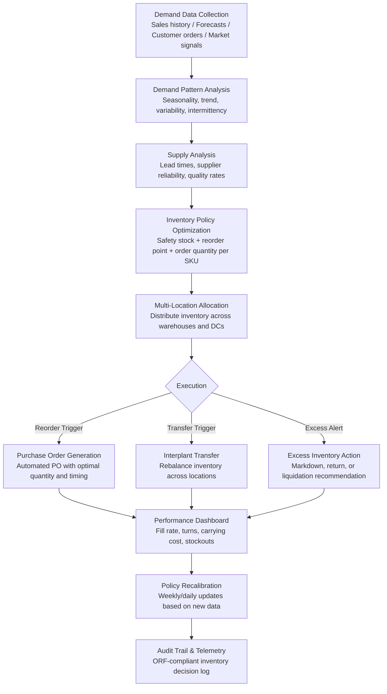

# Inventory Optimization Engine

Frankmax

NAICS 311-339, 423-454

> **Legacy Enterprises** — Inventory Optimization Engine

## Objective & Purpose

Inventory is simultaneously one of the largest assets on a manufacturer's or distributor's balance sheet and one of the least optimized. US manufacturers carry an average of $1.4 trillion in inventory at any given time. Too much inventory ties up working capital ($1M in excess inventory costs $200K-$300K annually in carrying costs: warehousing, insurance, depreciation, obsolescence, and opportunity cost of capital), while too little inventory causes stockouts that lose sales and damage customer relationships. The average stockout rate in manufacturing is 7-12%, meaning nearly one in ten orders cannot be fulfilled on time. For a $200M manufacturer, a 10% stockout rate represents $20M in lost or delayed revenue annually.

Legacy enterprises face a compounded challenge: their inventory management runs on ERP systems configured with static safety stock levels, fixed reorder points, and ABC classification methods that were set years ago and never updated. These static rules cannot adapt to demand variability (seasonal patterns, market shifts, new product introductions), supply variability (lead time fluctuations, supplier reliability changes), or strategic shifts (new market entry, product portfolio changes). The result is a paradox: excess inventory in slow-moving SKUs (30-40% of warehouse space holding items that turn fewer than twice per year) while fast-moving SKUs experience chronic shortages.

The Inventory Optimization Engine replaces static rules with dynamic, AI-driven inventory policies. The system analyzes demand patterns (seasonality, trends, promotional effects, customer ordering behavior), supply variability (lead time distributions, supplier reliability, quality rejection rates), and business constraints (warehouse capacity, working capital limits, service level targets) to compute optimal inventory levels for every SKU at every location. Policies update weekly or daily as conditions change, ensuring the organization always holds the right amount of the right inventory in the right place.

## Business Context

| Attribute | Value |
|---|---|
| **Business Process** | Inventory management |
| **Business Function** | Supply Chain |
| **Category** | Finance |
| **Target Audience** | 8. Legacy Enterprises |
| **Bundle** | Enterprise Operations Pack ($4,500/mo) |
| **Monthly Cost of Inaction** | $40K-$400K (excess carrying costs, stockout losses, working capital inefficiency) |

## BPMN Workflow

## Features

1. **Demand Forecasting Engine** — Generates SKU-level demand forecasts using multiple methods: statistical (exponential smoothing, ARIMA), machine learning (gradient boosting, LSTM neural networks for complex patterns), and causal (incorporating price changes, promotions, weather, economic indicators). Automatically selects the best method per SKU based on forecast accuracy back-testing.

2. **Dynamic Safety Stock Optimization** — Calculates optimal safety stock for each SKU-location combination considering: demand variability (not just average demand but the full demand distribution), lead time variability (supplier-specific lead time distributions), service level targets (different targets for A, B, and C items), and cost trade-offs (stockout cost vs. carrying cost). Safety stocks update dynamically as demand and supply patterns change.

3. **Multi-Echelon Optimization** — Optimizes inventory across the entire supply chain network: raw materials at manufacturing plants, WIP in production, finished goods at distribution centers, and forward-positioned inventory at customer-facing locations. Determines the optimal placement of safety stock across echelons to minimize total inventory investment while meeting service level targets.

4. **Slow-Moving and Obsolete (SLOB) Identification** — Flags inventory items that are aging toward obsolescence: items with declining demand trends, items approaching shelf-life limits, items for products being discontinued, and items with no demand in the trailing 12 months. Recommends disposition strategies: price markdowns, customer-specific promotions, return-to-vendor, or write-off.

5. **Supplier Lead Time Learning** — Builds probabilistic lead time models for each supplier based on actual performance history, not the lead times stated in the contract. Accounts for seasonal patterns (longer lead times during supplier peak season), order size effects (larger orders may take longer), and trend shifts (gradually lengthening lead times that indicate supplier capacity issues).

6. **Working Capital Impact Modeling** — Quantifies the working capital implications of inventory decisions: how much cash is freed by reducing excess stock, how much additional investment is required to improve service levels, and what the net financial impact is considering both carrying costs and lost-sales costs. Enables CFO-level conversations about inventory as a financial lever.

7. **Automated Replenishment** — Generates purchase orders and interplant transfer orders automatically when inventory levels reach dynamic reorder points. Orders are optimized for quantity (economic order quantity adjusted for volume discounts and container utilization) and timing (coordinated across suppliers for consolidated shipments).

## Workflow & Automation

**Step 1: Data Integration** — Connect to ERP inventory modules (SAP MM, Oracle Inventory, NetSuite), warehouse management systems (Manhattan, Blue Yonder, Korber), and demand planning systems. Import SKU master data, on-hand quantities, open orders, lead time records, and transaction history.

**Step 2: Demand Analysis** — Analyze 24-36 months of demand history per SKU to identify patterns: seasonality, trend, cyclicality, promotional impacts, and demand variability. Classify items by demand behavior: smooth, intermittent, lumpy, or new product (no history). Select the optimal forecasting method per SKU.

**Step 3: Supply Analysis** — Analyze supplier performance data: actual lead times vs. stated, order fill rates, quality rejection rates, and capacity constraints. Build probabilistic supply models that capture the true variability in the supply chain, not the deterministic assumptions in the ERP system.

**Step 4: Policy Optimization** — Compute optimal inventory policies for each SKU-location: safety stock level, reorder point, and order quantity. Optimization balances service level targets, working capital constraints, warehouse capacity, and cost minimization. Policies are validated against business rules and constraint limits before deployment.

**Step 5: Execution and Monitoring** — Deploy optimized policies to the ERP system. Monitor execution: are orders being placed on time, are suppliers delivering within expected windows, are service levels meeting targets? Alert when actual performance deviates from plan.

**Step 6: Continuous Recalibration** — Inventory policies are recalculated on a weekly or daily cadence as new demand signals, supply performance data, and business condition changes arrive. The system adapts dynamically to market shifts, seasonal transitions, and supply chain disruptions without waiting for manual parameter adjustments.

## Input/Output Specifications

| Direction | Data | Format | Description |
|---|---|---|---|
| Input | Inventory transactions | API (SAP, Oracle, NetSuite) | Receipts, issues, adjustments, transfers |
| Input | Sales and demand data | API (ERP, CRM, POS) | Historical sales, current orders, forecasts |
| Input | Supplier performance data | API (SRM) / CSV | Lead times, fill rates, quality metrics |
| Input | Cost data | API (ERP) | Unit costs, carrying cost rates, stockout cost estimates |
| Input | Warehouse data | API (WMS) | Capacity, locations, handling constraints |
| Output | Optimized inventory policies | JSON (ERP integration) | Safety stock, reorder point, order quantity per SKU-location |
| Output | Purchase order recommendations | JSON / EDI (850) | Automated replenishment orders |
| Output | Performance dashboard | REST API / UI | Fill rate, turns, carrying cost, SLOB status |
| Output | Audit trail | JSON (immutable log) | ORF-compliant inventory optimization decision log |

## Integration Points

| System | Integration Type | Data Flow |
|---|---|---|
| **Predictive Maintenance Platform** | Inbound demand signals | Predicted maintenance parts requirements feed inventory planning |
| **Quality Prediction Engine** | Inbound quality data | Quality rejection rates affect safety stock calculations |
| **Supply Chain Risk Neural Network** | Inbound risk signals | Supplier risk scores affect lead time assumptions |
| **Supplier Dependency Risk Scorer** | Bidirectional | Supplier reliability data shared for comprehensive risk and inventory modeling |
| **Billing Leakage Detector** | Cross-reference | Inventory valuation accuracy validated against financial records |
| **Mainframe-to-Cloud Bridge** | Infrastructure | Legacy ERP inventory data accessed through bridge |
| **Audit Trail and Traceability Engine** | Outbound log stream | All inventory optimization decisions logged immutably |
| **Failure Intelligence Library** | Outbound anonymized patterns | Inventory management failure patterns feed cross-industry intelligence |

## Pricing & Revenue Model

| Component | Pricing | Notes |
|---|---|---|
| **Enterprise Operations Pack** | $4,500/month | Includes Inventory Optimization + Process Mining + Tribal Knowledge |
| **Standalone -- Subscription** | $2,800/month | Up to 10,000 SKUs, single warehouse |
| **Multi-location tier** | $4,500/month | Unlimited SKUs, unlimited locations |
| **Multi-echelon optimization** | +$1,200/month | Full supply chain network optimization |
| **Automated replenishment** | +$800/month | Auto-generated POs and transfer orders |
| **AI token consumption** | Included at 80% discount | 2M tokens/month in bundle; overage at marketplace rates |

**Revenue model**: Inventory Optimization delivers measurable financial return: 15-25% reduction in inventory carrying costs and 30-50% reduction in stockouts. For a $200M manufacturer with $40M in inventory, a 20% carrying cost reduction saves $2.4M annually. The "burger" is dynamic optimization at 50-70% of the cost of SCM consulting engagements ($200K-$500K one-time). The "fries" attach through multi-echelon optimization, automated replenishment, and financial impact reporting at 75-90% margin.

## NAICS/SIC Mapping

| NAICS Code | SIC Code | Industry | Relevance |
|---|---|---|---|
| 311-339 | 2000-3999 | Manufacturing | Raw material, WIP, and finished goods optimization |
| 423-425 | 5000-5199 | Wholesale Trade | Distribution inventory management |
| 441-454 | 5211-5999 | Retail Trade | Retail inventory and replenishment optimization |
| 493 | 4220-4226 | Warehousing and Storage | Warehouse inventory level optimization |
| 236-238 | 1500-1799 | Construction | Construction materials inventory |
| 481-488 | 4011-4789 | Transportation & Warehousing | Spare parts and consumables inventory |
| 622-623 | 8000-8099 | Healthcare | Medical supply inventory optimization |
