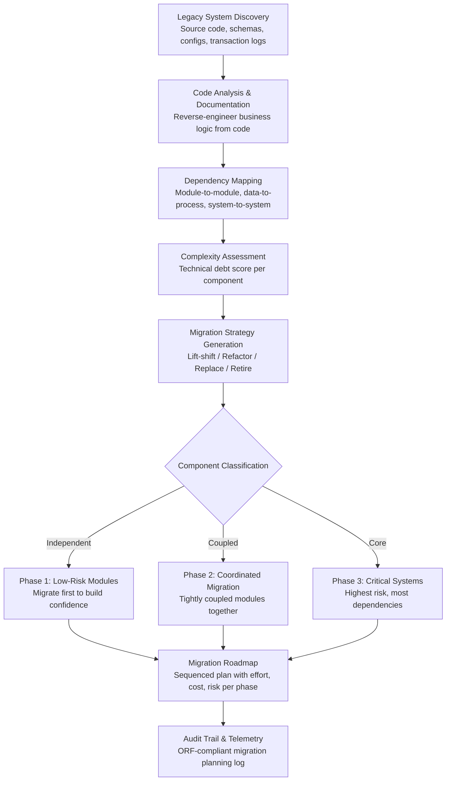

# Legacy System Migration Planner

Frankmax

NAICS 311-339, 423-454

> **Legacy Enterprises** — Legacy System Migration Planner

## Objective & Purpose

Legacy enterprises run critical operations on systems built 20-40 years ago. The average Fortune 500 company maintains 500+ applications, and studies show that 60-80% of IT budgets go to maintaining existing systems rather than building new capabilities. These legacy systems -- COBOL mainframes, AS/400 databases, on-premise ERP installations from the 1990s, custom-built MES (Manufacturing Execution Systems) with no vendor support -- represent both enormous accumulated business logic and enormous technical risk. The developers who built them are retiring, the hardware is approaching end-of-life, the software cannot integrate with modern cloud services, and every year of delay increases the migration cost by 15-25% as technical debt compounds.

The Legacy System Migration Planner uses AI to solve the hardest problem in modernization: understanding what the legacy system actually does. Documentation is invariably incomplete, outdated, or wrong. The people who built the system have left. The codebase has been patched thousands of times over decades. The Migration Planner reverse-engineers the legacy system by analyzing source code, database schemas, transaction logs, and runtime behavior to build a complete dependency map: which modules depend on which data, which processes must execute in sequence, which external systems integrate at which points, and which business rules are embedded in code rather than documented.

From this dependency map, the system generates a migration strategy: which components can be modernized independently (low dependency, well-isolated), which must be migrated together (tightly coupled), which can be replaced by commercial off-the-shelf products, and which require custom development. The strategy includes a sequenced migration roadmap with risk assessment at each stage, estimated effort and cost per phase, rollback contingencies, and parallel-run requirements. Organizations that approach migration with AI-generated dependency maps report 40-60% reductions in migration timeline and 50-70% reductions in post-migration defects compared to manual analysis approaches.

## Business Context

| Attribute | Value |
|---|---|
| **Business Process** | IT modernization |
| **Business Function** | IT Strategy |
| **Category** | Infrastructure |
| **Target Audience** | 8. Legacy Enterprises |
| **Bundle** | Enterprise Operations Pack ($4,500/mo) |
| **Monthly Cost of Inaction** | $50K-$500K (maintenance costs, integration failures, talent scarcity premiums) |

## BPMN Workflow

## Features

1. **Automated Code Analysis** — Parses legacy codebases across 30+ languages and frameworks: COBOL, RPG, PL/I, Natural/ADABAS, Fortran, Visual Basic 6, Classic ASP, PowerBuilder, Delphi, and legacy Java/C++. Extracts business rules, data transformations, workflow logic, and integration points from source code -- including undocumented behaviors embedded in decades of patches and workarounds.

2. **Database Schema Reverse Engineering** — Analyzes legacy database structures (IMS, IDMS, VSAM, DB2, Oracle, SQL Server) to understand data models, relationships, referential integrity rules, and stored procedures. Maps data lineage from source to consumption, identifying which applications read and write which data elements.

3. **Runtime Behavior Analysis** — Monitors actual system usage over 30-90 days to understand real-world behavior: which code paths execute (vs. dead code), peak load patterns, transaction volumes per module, and integration call frequencies. Runtime analysis frequently reveals that 40-60% of legacy code is never executed and can be safely excluded from migration scope.

4. **Dependency Graph Construction** — Builds a comprehensive dependency graph showing all relationships: module-to-module calls, data dependencies, external system integrations, batch job sequences, and shared resource contention points. The graph reveals which components can be migrated independently and which must move together.

5. **Migration Strategy Recommendation** — For each component, recommends the optimal migration approach: rehost (lift-and-shift to cloud infrastructure), replatform (minor modifications for cloud compatibility), refactor (restructure code for cloud-native architecture), replace (substitute with commercial SaaS/COTS), or retire (decommission unused components). Recommendations factor in business criticality, technical complexity, available talent, and budget constraints.

6. **Effort and Risk Estimation** — Estimates migration effort (person-months) and risk (likelihood and impact of migration failure) for each phase. Risk factors include: untestable code paths, undocumented integrations, data quality issues, and organizational change management complexity. Estimates calibrate against industry benchmarks and the organization's own migration history.

7. **Parallel-Run Planning** — Generates parallel-run strategies for critical systems: how long legacy and modern systems should run simultaneously, which transactions to reconcile, what discrepancy thresholds trigger rollback, and how to manage data synchronization during the transition period.

## Workflow & Automation

**Step 1: Legacy System Inventory** — Catalog all legacy systems in scope: application name, technology stack, business function, data stores, integration points, support team, and documentation status. The inventory establishes the migration universe and prioritization framework.

**Step 2: Source Code and Configuration Analysis** — Import source code repositories, database schemas, configuration files, and batch job definitions. The AI analysis engine parses all artifacts, extracting business logic, data transformations, and system dependencies into a structured model.

**Step 3: Runtime Behavior Monitoring** — Deploy lightweight monitoring agents to capture actual system behavior over 30-90 days: code execution paths, transaction volumes, data access patterns, integration call frequencies, and performance characteristics. Runtime data validates and enriches the static code analysis.

**Step 4: Dependency Map Assembly** — Combine static analysis and runtime behavior into a comprehensive dependency graph. Identify clusters of tightly coupled components, isolated modules, shared data dependencies, and integration bottlenecks. The graph is the foundation for migration sequencing.

**Step 5: Migration Strategy Development** — Apply the classification framework to each component: rehost, replatform, refactor, replace, or retire. Group components into migration phases based on dependency clusters, business criticality, and risk tolerance. Sequence phases to build organizational confidence with early wins.

**Step 6: Roadmap Generation and Review** — Produce a detailed migration roadmap: phases with timelines, resource requirements, cost estimates, risk assessments, rollback plans, and success criteria. The roadmap enters a review workflow with IT leadership, business stakeholders, and finance for approval and budget allocation.

## Input/Output Specifications

| Direction | Data | Format | Description |
|---|---|---|---|
| Input | Source code repositories | Git / SVN / file system | Legacy application source code in all languages |
| Input | Database schemas | DDL exports / catalog queries | Table definitions, relationships, stored procedures |
| Input | System configurations | Config files / documentation | Integration endpoints, batch schedules, environment configs |
| Input | Runtime telemetry | Agent-collected metrics | Transaction logs, code execution paths, performance data |
| Input | Business context | JSON / interviews | Application business function, criticality, owner |
| Output | Dependency map | JSON (graph format) + interactive visualization | Complete system dependency graph |
| Output | Migration roadmap | PDF + project plan (MS Project / Jira) | Phased plan with effort, cost, risk per component |
| Output | Code documentation | Markdown / HTML | AI-generated documentation of legacy business logic |
| Output | Audit trail | JSON (immutable log) | ORF-compliant migration planning and analysis log |

## Integration Points

| System | Integration Type | Data Flow |
|---|---|---|
| **Mainframe-to-Cloud Bridge** | Outbound migration plan | Migration strategy feeds bridge implementation priorities |
| **Process Mining & Optimization Engine** | Inbound process data | Actual business process flows inform migration priorities |
| **Tribal Knowledge Extractor** | Inbound context | Captured tribal knowledge fills documentation gaps |
| **Enterprise Knowledge Graph** | Outbound documentation | Generated legacy system documentation feeds knowledge graph |
| **DocuFlow -- Document Intelligence** | Infrastructure | Document extraction for existing system documentation |
| **Multi-Model AI Orchestrator** | Infrastructure | AI model routing for code analysis and pattern recognition |
| **Audit Trail and Traceability Engine** | Outbound log stream | All migration analysis logged immutably |
| **Failure Intelligence Library** | Outbound anonymized patterns | Migration failure patterns feed cross-industry intelligence |

## Pricing & Revenue Model

| Component | Pricing | Notes |
|---|---|---|
| **Enterprise Operations Pack** | $4,500/month | Includes Migration Planner + Process Mining + Tribal Knowledge |
| **Per-system analysis fee** | $8,000-$25,000 per system | Based on codebase size and complexity |
| **Annual subscription (portfolio)** | $6,500/month | Unlimited systems, continuous roadmap updates |
| **Runtime monitoring deployment** | +$2,000 one-time setup per system | Agent deployment and 90-day behavior capture |
| **Parallel-run planning module** | +$1,200/month | Data reconciliation and rollback strategy |
| **AI token consumption** | Included at 80% discount | High-volume processing during analysis phases |

**Revenue model**: Legacy System Migration Planner sells on risk reduction -- failed migration projects average $10M-$50M in wasted investment. The "burger" is AI-powered analysis at 40-60% of the cost of manual consulting engagements ($500K-$2M for a legacy assessment). The "fries" attach through continuous roadmap management, audit trail for governance, and Mainframe-to-Cloud Bridge implementation at 75-90% margin. Migration projects span 2-5 years, creating long-term engagement.

## NAICS/SIC Mapping

| NAICS Code | SIC Code | Industry | Relevance |
|---|---|---|---|
| 311-339 | 2000-3999 | Manufacturing | Manufacturing ERP and MES migration |
| 423-425 | 5000-5199 | Wholesale Trade | Distribution system modernization |
| 441-454 | 5211-5999 | Retail Trade | POS and inventory system migration |
| 522110 | 6021 | Commercial Banking | Core banking system modernization |
| 524114 | 6311 | Direct Health and Medical Insurance | Policy administration system migration |
| 541512 | 7372 | Computer Systems Design Services | IT modernization advisory |
| 221 | 4911-4932 | Utilities | SCADA and grid management system migration |
