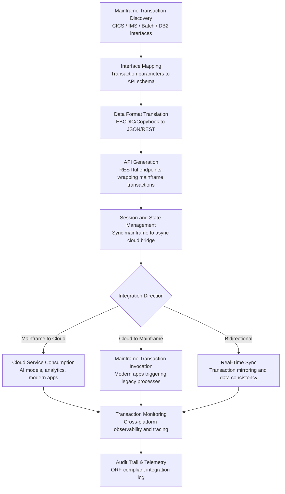

# Mainframe-to-Cloud Bridge

Frankmax

NAICS 311-339, 423-454

> **Legacy Enterprises** — Mainframe-to-Cloud Bridge

## Objective & Purpose

An estimated 220 billion lines of COBOL code run in production globally, processing 95% of ATM transactions, 80% of in-person retail transactions, and the backend systems of 75% of Fortune 500 companies. These mainframe systems are extraordinarily reliable -- five-nines uptime is standard -- but they exist in technological isolation. They cannot call modern REST APIs, consume cloud AI services, process JSON data natively, or participate in event-driven microservice architectures. Meanwhile, every new business capability (AI-powered analytics, real-time customer personalization, mobile-first interfaces) requires cloud-native architecture. The result is an integration gap that costs legacy enterprises $5M-$20M annually in custom middleware, manual data bridges, and delayed capability deployment.

The Mainframe-to-Cloud Bridge creates a real-time, bidirectional translation layer between mainframe systems and modern cloud services. Instead of rewriting 30-year-old COBOL programs (a multi-year, high-risk proposition), the Bridge wraps mainframe transactions in modern API interfaces, transforms data formats between EBCDIC/COBOL copybook structures and JSON/REST, manages session state across synchronous mainframe transactions and asynchronous cloud events, and provides observability into cross-platform transaction flows. The Bridge enables organizations to consume AI marketplace services (including all FrankMax offerings) from their existing mainframe-based business processes without modifying a single line of legacy code.

The strategic value extends beyond technical integration. The Bridge creates a data pipeline from mainframe transaction streams into cloud analytics platforms, unlocking decades of operational data that has been trapped in mainframe silos. A manufacturing company can feed mainframe production records into the Quality Prediction Engine. A bank can stream core banking transactions into the Fraud Detection Neural Network. An insurer can connect policy administration mainframe data to the Claims Processing Accelerator. The Bridge transforms the mainframe from a technical limitation into a data asset.

## Business Context

| Attribute | Value |
|---|---|
| **Business Process** | Application modernization |
| **Business Function** | IT Operations |
| **Category** | Infrastructure |
| **Target Audience** | 8. Legacy Enterprises |
| **Bundle** | Enterprise Operations Pack ($4,500/mo) |
| **Monthly Cost of Inaction** | $50K-$300K (integration costs, delayed capabilities, manual data bridges) |

## BPMN Workflow

## Features

1. **Automatic Interface Discovery** — Scans mainframe CICS transaction definitions, IMS program specifications, batch JCL, and DB2 stored procedures to automatically discover available mainframe interfaces. Maps parameters, data types, and calling conventions without manual documentation review.

2. **COBOL Copybook to JSON Transformation** — Automatically converts COBOL copybook data structures (fixed-length fields, packed decimal, EBCDIC encoding, REDEFINES, OCCURS DEPENDING ON) into equivalent JSON schemas. Handles the full complexity of COBOL data definitions including nested groups, redefined fields, and computational formats.

3. **REST API Generation** — Wraps discovered mainframe transactions in modern REST API endpoints with OpenAPI (Swagger) documentation. Each generated API includes request/response schemas, error handling, authentication, rate limiting, and versioning. APIs can be consumed by any modern application, cloud service, or integration platform.

4. **Real-Time Event Streaming** — Converts mainframe batch and transaction outputs into real-time event streams (Apache Kafka, AWS Kinesis, Azure Event Hubs). Enables downstream cloud applications to react to mainframe events in near-real-time rather than waiting for end-of-day batch extracts.

5. **Session State Management** — Bridges the architectural gap between synchronous mainframe transactions (which expect conversational, stateful interactions) and asynchronous cloud architectures (which expect stateless, event-driven patterns). Manages transaction context, commit/rollback coordination, and timeout handling across platforms.

6. **Cross-Platform Transaction Tracing** — Provides end-to-end observability for transactions that span mainframe and cloud systems. A single transaction ID traces from the cloud API call through the Bridge translation layer into the mainframe transaction and back. Performance metrics, error rates, and latency are tracked at each hop.

7. **Security and Compliance Bridge** — Maps mainframe security models (RACF, ACF2, Top Secret) to modern authentication and authorization frameworks (OAuth 2.0, SAML, OIDC). Ensures that mainframe access control policies are enforced consistently across the cloud integration layer.

## Workflow & Automation

**Step 1: Mainframe Interface Inventory** — Connect to the mainframe environment and scan for available interfaces: CICS transaction IDs, IMS program names, batch job definitions, and DB2 objects. The discovery process catalogs every available mainframe function with its parameters, data types, and usage patterns.

**Step 2: Data Model Mapping** — For each mainframe interface, the system analyzes the associated COBOL copybooks and data structures. It generates equivalent JSON schemas, handles data type conversions (packed decimal to numeric, EBCDIC to UTF-8, fixed-length to variable-length), and resolves complex structures (redefines, arrays with variable lengths).

**Step 3: API Generation and Configuration** — Generate REST API endpoints for each mapped mainframe function. Configure authentication, rate limiting, caching, timeout values, and error handling. Generate OpenAPI documentation and client SDKs for consuming applications.

**Step 4: Event Stream Configuration** — Identify mainframe outputs suitable for event streaming: transaction completion events, database change events, batch job outputs. Configure event stream connectors with appropriate serialization, partitioning, and retention settings.

**Step 5: Integration Testing** — Run comprehensive integration tests validating data fidelity (no data loss or corruption in translation), performance (latency within acceptable thresholds), error handling (mainframe errors properly surfaced through APIs), and security (access control consistently enforced).

**Step 6: Production Deployment and Monitoring** — Deploy the Bridge into production with cross-platform monitoring. Real-time dashboards show transaction volumes, latency distributions, error rates, and data throughput. Alerts trigger when performance degrades or errors exceed thresholds.

## Input/Output Specifications

| Direction | Data | Format | Description |
|---|---|---|---|
| Input | Mainframe transaction definitions | CICS CSD / IMS PSB / JCL | Transaction interfaces, program specifications |
| Input | COBOL copybooks | COBOL source | Data structure definitions for translation |
| Input | DB2 schemas | DDL / catalog queries | Database object definitions and relationships |
| Input | Cloud API requests | JSON / REST | Modern application requests for mainframe functions |
| Output | REST API endpoints | OpenAPI 3.0 specification | Generated APIs wrapping mainframe transactions |
| Output | Event streams | Kafka / Kinesis / Event Hubs | Real-time mainframe event feeds |
| Output | Transaction traces | JSON (distributed tracing) | Cross-platform transaction observability |
| Output | Audit trail | JSON (immutable log) | ORF-compliant integration activity log |

## Integration Points

| System | Integration Type | Data Flow |
|---|---|---|
| **Legacy System Migration Planner** | Inbound strategy | Migration roadmap determines Bridge implementation priorities |
| **Process Mining & Optimization Engine** | Outbound event data | Mainframe transaction events feed process mining analysis |
| **Quality Prediction Engine** | Outbound data feed | Manufacturing mainframe data feeds quality prediction models |
| **Predictive Maintenance Platform** | Outbound data feed | Equipment sensor data from mainframe feeds maintenance models |
| **Multi-Model AI Orchestrator** | Bidirectional | Cloud AI services accessed through Bridge; results returned to mainframe |
| **DocuFlow -- Document Intelligence** | Outbound data | Mainframe document data accessible to AI document processing |
| **Audit Trail and Traceability Engine** | Outbound log stream | All cross-platform transactions logged immutably |
| **Failure Intelligence Library** | Outbound anonymized patterns | Integration failure patterns feed cross-industry intelligence |

## Pricing & Revenue Model

| Component | Pricing | Notes |
|---|---|---|
| **Enterprise Operations Pack** | $4,500/month | Includes Cloud Bridge + Migration Planner + Process Mining |
| **Standalone -- Subscription** | $3,800/month | Up to 100 API endpoints, 1M transactions/month |
| **High-volume tier** | $6,000/month | Unlimited endpoints, 10M transactions/month |
| **Event streaming module** | +$1,200/month | Real-time mainframe event streaming to cloud |
| **Custom connector development** | $5,000-$15,000 one-time | Proprietary mainframe system connectors |
| **AI token consumption** | Included at 80% discount | AI services consumed through Bridge at marketplace rates |

**Revenue model**: Mainframe-to-Cloud Bridge is a strategic infrastructure product that creates deep platform dependency. Once mainframe transactions are routed through the Bridge, the organization consumes all marketplace AI services through it -- every AI token, every analytics query, every document processing request generates revenue. The "burger" is API-based mainframe integration at 50-70% of the cost of custom middleware development. The "fries" are every AI service consumed through the Bridge plus monitoring, security, and audit compliance at 75-90% margin.

## NAICS/SIC Mapping

| NAICS Code | SIC Code | Industry | Relevance |
|---|---|---|---|
| 311-339 | 2000-3999 | Manufacturing | Manufacturing mainframe and MES integration |
| 423-425 | 5000-5199 | Wholesale Trade | Distribution system mainframe integration |
| 522110 | 6021 | Commercial Banking | Core banking mainframe modernization |
| 524114 | 6311 | Direct Health and Medical Insurance | Policy admin mainframe integration |
| 441-454 | 5211-5999 | Retail Trade | POS and inventory mainframe bridge |
| 221 | 4911-4932 | Utilities | SCADA and billing mainframe integration |
| 481-488 | 4011-4789 | Transportation & Warehousing | Logistics mainframe modernization |
