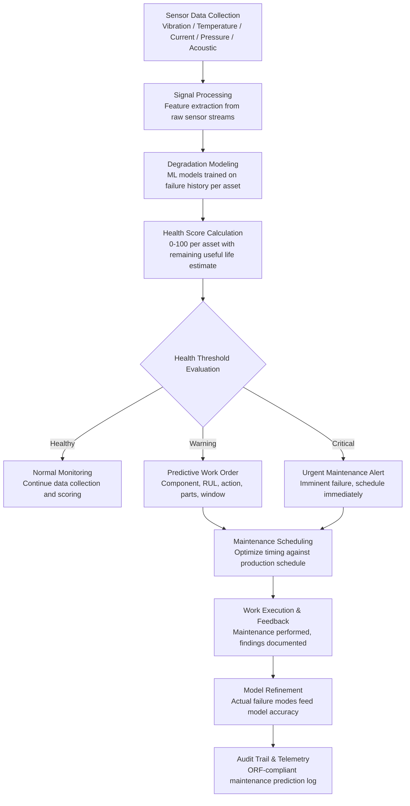

# Predictive Maintenance Platform

Frankmax

NAICS 311-339, 423-454

> **Legacy Enterprises** — Predictive Maintenance Platform

## Objective & Purpose

Unplanned equipment downtime costs industrial manufacturers an average of $260,000 per hour, according to Aberdeen Research. Across the manufacturing sector, unplanned downtime totals $50B+ annually in lost production, expedited repairs, overtime labor, and missed customer commitments. Legacy enterprises are particularly vulnerable because their equipment fleets span 20-40 years: older machines with fewer sensors, maintenance histories scattered across paper logbooks and disconnected CMMS (Computerized Maintenance Management System) databases, and maintenance strategies built on time-based schedules rather than condition-based intelligence. The result is a costly paradox: organizations either over-maintain (replacing parts that have remaining useful life, consuming maintenance labor on unnecessary inspections) or under-maintain (missing degradation signals until catastrophic failure).

The Predictive Maintenance Platform applies machine learning to equipment sensor data, maintenance records, and operational context to predict failures before they occur. The system ingests vibration data, temperature profiles, current draw patterns, pressure readings, flow rates, acoustic signatures, and any other measurable equipment parameter. It builds degradation models for each equipment asset that learn the progression from normal operating condition through early warning through imminent failure. When a piece of equipment begins exhibiting patterns that the model associates with approaching failure, the system generates a maintenance work order with specific details: which component is degrading, estimated remaining useful life (days or operating hours), recommended maintenance action, required parts, and optimal maintenance window.

The platform handles the unique challenge of legacy equipment fleets: mixed sensor availability (some machines have modern IoT sensors, others have only basic PLC outputs), heterogeneous data formats (SCADA, OPC-UA, Modbus, 4-20mA analog signals), and incomplete maintenance histories. The system starts with whatever data is available, provides value immediately with basic pattern detection, and improves as additional sensors are deployed and more operational history accumulates. Organizations deploying predictive maintenance report 25-40% reductions in unplanned downtime, 15-25% reductions in maintenance costs, and 10-20% extensions in equipment life.

## Business Context

| Attribute | Value |
|---|---|
| **Business Process** | Equipment maintenance |
| **Business Function** | Asset Management |
| **Category** | Operations |
| **Target Audience** | 8. Legacy Enterprises |
| **Bundle** | Enterprise Operations Pack ($4,500/mo) |
| **Monthly Cost of Inaction** | $50K-$1M (unplanned downtime, emergency repairs, premature replacements) |

## BPMN Workflow

## Features

1. **Universal Sensor Data Ingestion** — Collects data from any industrial sensor type and protocol: vibration (accelerometers, velocity sensors), temperature (thermocouples, RTDs, infrared), electrical (current transformers, power meters), pressure (transducers, gauges), flow (turbine, magnetic, ultrasonic), and acoustic (ultrasonic microphones). Supports OPC-UA, Modbus TCP/RTU, MQTT, MTConnect, BACnet, and 4-20mA analog conversion.

2. **Equipment-Specific Degradation Models** — Trains failure prediction models specific to each equipment class and individual asset. A centrifugal pump's failure modes (bearing wear, seal degradation, impeller erosion, cavitation) are modeled differently from a CNC machine's failure modes (spindle bearing, servo drive, ball screw wear, coolant system). Models learn from both the organization's own failure history and cross-industry failure patterns from the Failure Intelligence Library.

3. **Remaining Useful Life (RUL) Estimation** — Predicts not just that a failure will occur but when: estimated days or operating hours until the component reaches its failure threshold. RUL estimates carry confidence intervals that narrow as the degradation pattern develops. Maintenance can be planned for the optimal point: early enough to prevent failure, late enough to extract maximum component life.

4. **Prescriptive Maintenance Actions** — Goes beyond "this will fail" to "here is what to do": specific maintenance tasks (replace bearing, realign shaft, clean filter), required parts (with part numbers and inventory status), estimated labor hours, required skill level, and recommended maintenance window aligned with the production schedule.

5. **Legacy Equipment Support** — Handles equipment with minimal instrumentation by extracting predictive signals from available data: PLC outputs, power consumption patterns, cycle time variations, and production quality metrics. For equipment with no sensors, the system supports cost-effective retrofit recommendations: which sensors to add for maximum predictive value at minimum cost.

6. **Maintenance Cost Optimization** — Calculates the total cost of each maintenance strategy: run-to-failure (emergency repair cost + downtime cost + collateral damage), time-based (parts + labor + unnecessary replacements), and condition-based (monitoring cost + planned repair cost + avoided downtime). Demonstrates ROI by comparing actual costs against the counterfactual strategies.

7. **Fleet-Level Analytics** — Aggregates equipment health across the entire fleet: how many assets are healthy, warning, or critical at any given time. Identifies systemic issues (multiple assets of the same type exhibiting similar degradation patterns simultaneously), maintenance resource bottlenecks, and spare parts inventory requirements.

## Workflow & Automation

**Step 1: Asset Registration and Sensor Mapping** — Register equipment assets with their specifications, sensor configurations, and criticality classifications. Map sensor data streams to equipment-specific parameters. Configure data collection frequencies based on equipment criticality and sensor type.

**Step 2: Historical Data Import** — Import historical maintenance records from CMMS (SAP PM, IBM Maximo, Infor EAM): work orders, failure descriptions, parts consumed, and downtime duration. Import historical sensor data where available. This historical foundation trains the initial degradation models.

**Step 3: Baseline Establishment** — Analyze equipment behavior during known-good operating conditions to establish baseline signatures for each asset. Baselines capture normal operating patterns including production-dependent variations (higher vibration during high-speed runs, temperature variation with ambient conditions).

**Step 4: Model Training and Validation** — Train degradation models using historical failure data paired with sensor patterns preceding each failure. Validate models against held-out failure events: did the model predict the failure, with what lead time, and with what accuracy? Models are approved for production when accuracy exceeds configured thresholds.

**Step 5: Real-Time Monitoring and Prediction** — Deploy models to production. Sensor data streams continuously through the prediction engine, updating health scores and RUL estimates for every monitored asset. Alerts trigger when health scores cross warning or critical thresholds.

**Step 6: Work Order Generation and Scheduling** — Predictive alerts automatically generate maintenance work orders in the CMMS with all relevant details. Maintenance planners schedule work against the production calendar, optimizing for minimal production impact while respecting the predicted failure timeline.

**Step 7: Feedback and Continuous Improvement** — After maintenance is performed, technicians document actual findings: was the predicted failure mode correct, what was the actual component condition, were the recommended parts appropriate. This feedback refines the models and improves future prediction accuracy.

## Input/Output Specifications

| Direction | Data | Format | Description |
|---|---|---|---|
| Input | Sensor data streams | OPC-UA / Modbus / MQTT / analog | Vibration, temperature, current, pressure, acoustic |
| Input | Maintenance history | API (SAP PM, Maximo, Infor EAM) | Work orders, failure codes, parts, downtime |
| Input | Equipment specifications | JSON / CSV | Asset registry with specifications and criticality |
| Input | Production schedule | API (MES / ERP) | Production plans for maintenance window optimization |
| Output | Health scorecards | JSON + dashboard UI | Asset health scores with RUL estimates |
| Output | Predictive work orders | JSON (CMMS integration) | Specific maintenance actions with parts and timing |
| Output | Fleet analytics | REST API / dashboard | Fleet-wide health distribution and trend analysis |
| Output | Audit trail | JSON (immutable log) | ORF-compliant prediction and maintenance log |

## Integration Points

| System | Integration Type | Data Flow |
|---|---|---|
| **Quality Prediction Engine** | Bidirectional | Equipment health affects product quality; quality anomalies signal equipment issues |
| **Energy Consumption Optimizer** | Bidirectional | Degrading equipment consumes more energy; energy anomalies indicate equipment problems |
| **Process Mining & Optimization Engine** | Outbound data | Equipment downtime patterns feed process bottleneck analysis |
| **Tribal Knowledge Extractor** | Inbound context | Tribal maintenance knowledge enriches degradation models |
| **Mainframe-to-Cloud Bridge** | Infrastructure | Legacy SCADA and PLC data accessed through bridge |
| **Inventory Optimization Engine** | Outbound demand signals | Predicted maintenance parts requirements feed inventory planning |
| **Audit Trail and Traceability Engine** | Outbound log stream | All predictions and maintenance actions logged immutably |
| **Failure Intelligence Library** | Outbound anonymized patterns | Equipment failure patterns feed cross-industry intelligence |

## Pricing & Revenue Model

| Component | Pricing | Notes |
|---|---|---|
| **Enterprise Operations Pack** | $4,500/month | Includes Predictive Maintenance + Process Mining + Tribal Knowledge |
| **Standalone -- per asset tier** | $50-$200/month per monitored asset | Based on sensor count and equipment criticality |
| **Site license (over 100 assets)** | $3,500/month per site | Unlimited assets at a single facility |
| **Sensor retrofit advisory** | $2,000-$5,000 one-time per site | Assessment and recommendation for sensor additions |
| **Fleet analytics module** | +$800/month | Cross-site fleet health comparison and benchmarking |
| **AI token consumption** | Included at 80% discount | 2M tokens/month in bundle; overage at marketplace rates |

**Revenue model**: Predictive Maintenance sells on downtime avoidance -- a single prevented unplanned shutdown ($260K/hour average) pays for years of the platform. The "burger" is AI-powered maintenance prediction at 60-80% less than building internal data science and IoT infrastructure. The "fries" attach through fleet analytics, compliance documentation (OSHA, EPA, insurance requirements), and cross-site benchmarking at 75-90% margin. Per-asset pricing scales directly with the organization's equipment fleet, and the Failure Intelligence Library creates cross-industry value that compounds.

## NAICS/SIC Mapping

| NAICS Code | SIC Code | Industry | Relevance |
|---|---|---|---|
| 311-312 | 2000-2099 | Food Manufacturing | Processing equipment maintenance prediction |
| 325 | 2800-2899 | Chemical Manufacturing | Reactor and process equipment maintenance |
| 331-332 | 3300-3499 | Primary and Fabricated Metals | Rolling mill and furnace maintenance prediction |
| 333-336 | 3500-3799 | Machinery and Transportation Equipment | Assembly equipment and CNC maintenance |
| 221 | 4911-4932 | Utilities | Power generation and grid equipment maintenance |
| 211-213 | 1311-1389 | Oil and Gas / Mining | Drilling and extraction equipment prediction |
| 481-488 | 4011-4789 | Transportation & Warehousing | Fleet and facility equipment maintenance |
