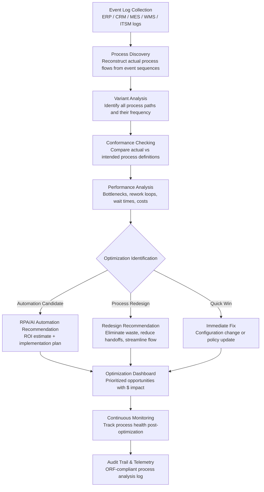

# Process Mining & Optimization Engine

Frankmax

NAICS 311-339, 423-454

> **Legacy Enterprises** — Process Mining & Optimization Engine

## Objective & Purpose

Legacy enterprises operate with business processes that have evolved organically over decades. The documented process (what the SOP says should happen) and the actual process (what people actually do) have diverged significantly. Studies show that the gap between documented and actual processes averages 40-60% -- meaning nearly half of all process steps are undocumented workarounds, informal escalation paths, or redundant activities that persist because "we have always done it this way." This process debt costs enterprises 20-30% of operational efficiency. For a manufacturing company with $500M in operating costs, that represents $100M-$150M in hidden waste annually.

The Process Mining & Optimization Engine reconstructs actual business processes from system event logs. Every enterprise system -- ERP, CRM, MES, WMS, ITSM, procurement -- generates event logs that record what happened, when, by whom, and in what sequence. The system ingests these logs, applies process mining algorithms to reconstruct the actual process flows (including all variants, exceptions, and workarounds), and compares them against intended process definitions. The result is a complete, evidence-based process map showing: the happy path (how the process is supposed to work), the actual path (how it really works), variant paths (different ways the process executes across departments or geographies), and waste paths (unnecessary loops, rework cycles, waiting times, and redundant approvals).

Beyond mapping, the system identifies optimization opportunities: bottlenecks (steps where work queues), rework loops (steps that frequently require re-execution), unnecessary handoffs (steps that add latency without value), and automation candidates (high-volume, rule-based steps suitable for RPA or AI automation). Each optimization opportunity is quantified in time and cost savings, enabling data-driven prioritization. Organizations that deploy process mining report 15-30% reductions in process cycle times and 20-40% reductions in process cost within the first year.

## Business Context

| Attribute | Value |
|---|---|
| **Business Process** | Business process analysis |
| **Business Function** | Operations |
| **Category** | Analytics |
| **Target Audience** | 8. Legacy Enterprises |
| **Bundle** | Enterprise Operations Pack ($4,500/mo) |
| **Monthly Cost of Inaction** | $50K-$500K (process waste, cycle time delays, missed optimization) |

## BPMN Workflow

## Features

1. **Multi-System Event Log Ingestion** — Connects to enterprise system event logs across 25+ platforms: SAP (transaction logs, change documents, workflow logs), Oracle (audit trail, workflow history), Salesforce (activity history, case history), ServiceNow (incident logs, change records), and manufacturing systems (MES event logs, SCADA logs). Normalizes heterogeneous log formats into a unified event schema.

2. **Automated Process Discovery** — Applies process mining algorithms (alpha miner, heuristic miner, inductive miner) to reconstruct complete process models from event data. Discovers the actual process as-is, including all variants, exceptions, and deviations -- not the idealized process in the SOP manual. Process models are rendered as interactive BPMN diagrams with frequency and performance overlays.

3. **Variant Analysis & Clustering** — Identifies all distinct paths through a process and clusters them by similarity. A purchase-to-pay process might have 200+ variants; the system clusters them into 8-12 meaningful groups (standard path, emergency purchase, international supplier, small-value expedited, etc.) and quantifies each variant's frequency, cost, and cycle time.

4. **Conformance Checking** — Compares discovered actual processes against intended process definitions (BPMN models, SOPs, regulatory requirements). Identifies deviations: skipped steps, reordered activities, unauthorized approvals, and non-compliant process paths. Each deviation is classified by severity and compliance risk.

5. **Root Cause Analysis** — Identifies the root causes behind process inefficiencies: why orders get stuck at a particular approval step (the approver is overloaded), why invoices loop through rework (data entry errors from a specific input channel), why manufacturing cycle times spike on Mondays (weekend shift handoff gaps). Root causes are traced to specific organizational, system, or data quality factors.

6. **Automation Opportunity Scoring** — Evaluates every process step for automation potential: volume (high-frequency steps), complexity (rule-based vs. judgment-required), data quality (structured inputs vs. unstructured), and exception rate (low exceptions suit automation). Produces a prioritized automation roadmap with ROI estimates per process step.

7. **Continuous Process Monitoring** — After optimization, the system continuously monitors process health: cycle time trends, variant distribution shifts, new deviation patterns, and regression to old habits. Alerts when process performance degrades or when new waste patterns emerge.

## Workflow & Automation

**Step 1: Event Log Configuration** — Identify target business processes and their supporting systems. Configure event log connectors to extract process-relevant events: case identifiers, activity names, timestamps, resources, and attributes. Validate data quality and completeness.

**Step 2: Process Discovery & Visualization** — Run process discovery algorithms on collected event data. The system produces interactive process maps showing all discovered paths with frequency counts, average durations, and resource assignments. Users can filter by time period, organizational unit, or process variant.

**Step 3: Conformance Analysis** — Import intended process definitions (BPMN models or textual SOPs). The system overlays actual behavior against intended behavior, highlighting deviations with severity classifications. Compliance-critical deviations are flagged for immediate attention.

**Step 4: Performance Bottleneck Identification** — Analyze process performance metrics: where does work queue (bottlenecks), where does work repeat (rework loops), where does work wait (idle time), and where do handoffs add latency without value. Each bottleneck is quantified in hours lost and dollars wasted per month.

**Step 5: Optimization Recommendation Generation** — Combine conformance gaps and performance bottlenecks into prioritized optimization recommendations. Each recommendation specifies: what to change, expected impact (time saved, cost reduced), implementation complexity, and dependencies. Recommendations are categorized as quick wins, process redesigns, or automation opportunities.

**Step 6: Implementation Tracking** — As optimization recommendations are implemented, the system monitors the impact: Did cycle time decrease as predicted? Did the rework loop eliminate? Did the automation achieve the projected throughput? Implementation tracking validates ROI and identifies follow-on optimization opportunities.

## Input/Output Specifications

| Direction | Data | Format | Description |
|---|---|---|---|
| Input | System event logs | CSV / API (SAP, Oracle, ServiceNow) | Case ID, activity, timestamp, resource, attributes |
| Input | Process definitions | BPMN XML / textual SOP | Intended process models for conformance checking |
| Input | Organizational data | API (HRIS) / CSV | Department structure, role assignments, cost centers |
| Input | Cost data | CSV / API (ERP) | Activity costs, resource rates, overhead allocation |
| Output | Process maps | BPMN + interactive visualization | Discovered actual process with variants and metrics |
| Output | Conformance report | JSON + PDF | Deviations from intended process with severity scores |
| Output | Optimization roadmap | JSON + PDF | Prioritized improvements with ROI estimates |
| Output | Audit trail | JSON (immutable log) | ORF-compliant process analysis and optimization log |

## Integration Points

| System | Integration Type | Data Flow |
|---|---|---|
| **Legacy System Migration Planner** | Outbound process intelligence | Actual process flows inform migration priorities and requirements |
| **Tribal Knowledge Extractor** | Inbound context | Captured tribal knowledge explains undocumented process variants |
| **Chokepoint Intelligence Engine** | Outbound analytics | Process bottlenecks feed enterprise chokepoint mapping |
| **Quality Prediction Engine** | Bidirectional | Process deviations correlated with quality outcomes |
| **DocuFlow -- Document Intelligence** | Infrastructure | Document extraction for SOP and policy analysis |
| **Multi-Model AI Orchestrator** | Infrastructure | AI model routing for process mining algorithms |
| **Audit Trail and Traceability Engine** | Outbound log stream | All process analysis logged immutably |
| **Failure Intelligence Library** | Outbound anonymized patterns | Process failure patterns feed cross-industry intelligence |

## Pricing & Revenue Model

| Component | Pricing | Notes |
|---|---|---|
| **Enterprise Operations Pack** | $4,500/month | Includes Process Mining + Migration Planner + Tribal Knowledge |
| **Standalone -- Subscription** | $3,200/month | Up to 10 processes, 3 source systems |
| **Enterprise tier** | $5,500/month | Unlimited processes and source systems |
| **Automation opportunity scoring** | +$900/month | RPA/AI automation candidate identification with ROI |
| **Continuous monitoring module** | +$800/month | Post-optimization process health tracking |
| **AI token consumption** | Included at 80% discount | 2M tokens/month in bundle; overage at marketplace rates |

**Revenue model**: Process Mining delivers rapid, measurable ROI -- 15-30% cycle time reductions within months. The "burger" is process discovery and optimization at 50-70% of the cost of consulting-led process improvement projects ($200K-$500K). The "fries" attach through continuous monitoring, compliance conformance reporting, and automation opportunity scoring at 75-90% margin. Process mining naturally expands: organizations start with one process and extend to 10-20 processes within 12 months.

## NAICS/SIC Mapping

| NAICS Code | SIC Code | Industry | Relevance |
|---|---|---|---|
| 311-339 | 2000-3999 | Manufacturing | Manufacturing process optimization and waste reduction |
| 423-425 | 5000-5199 | Wholesale Trade | Order-to-cash and procurement process optimization |
| 441-454 | 5211-5999 | Retail Trade | Supply chain and customer service process mining |
| 522110 | 6021 | Commercial Banking | Loan origination and payment processing optimization |
| 524114 | 6311 | Direct Health and Medical Insurance | Claims and underwriting process analysis |
| 541512 | 7372 | Computer Systems Design Services | IT service management process optimization |
| 221 | 4911-4932 | Utilities | Service delivery and maintenance process mining |
