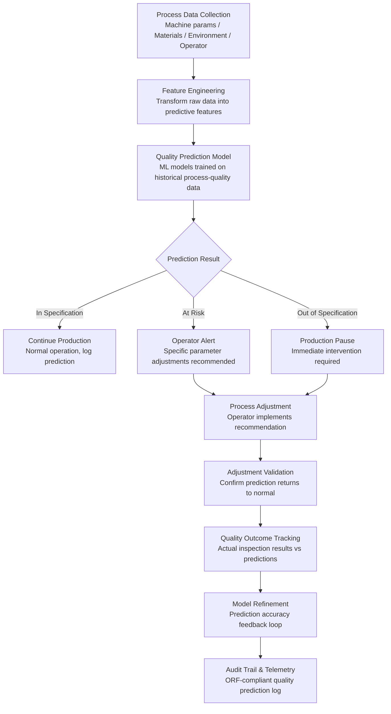

# Quality Prediction Engine

Frankmax

NAICS 311-339, 423-454

> **Legacy Enterprises** — Quality Prediction Engine

## Objective & Purpose

Quality defects detected post-production cost 10-100x more to remediate than defects caught in-process. A $0.50 component defect caught during assembly becomes a $50 rework item on the production line, a $500 warranty claim if shipped to a customer, and a $50,000 recall if the defect is systemic. The cost of poor quality (COPQ) in manufacturing averages 15-20% of sales revenue according to the American Society for Quality. For a manufacturer with $500M in revenue, that is $75M-$100M annually -- and most of it is preventable. The problem is that traditional quality management is reactive: inspect the finished product, detect the defect, and then trace backward to find the cause. By that point, hundreds or thousands of defective units may have been produced.

The Quality Prediction Engine flips this model from reactive to predictive. The system ingests upstream process data -- raw material properties, machine parameters (temperature, pressure, speed, vibration), environmental conditions (humidity, ambient temperature), operator actions, and supplier quality history -- and applies machine learning models to predict quality outcomes before the product reaches inspection. The system learns the complex, non-linear relationships between hundreds of process variables and quality outcomes: which combination of raw material batch, machine settings, and environmental conditions produces defects, and which produces optimal quality.

Prediction happens in real time, on the production line. If the model detects that current process conditions are trending toward a defect state, it alerts operators and process engineers with specific recommendations: adjust machine parameter X by Y%, switch to raw material lot Z, or pause production for equipment calibration. Early intervention prevents defects from being produced rather than detecting them after the fact. Organizations deploying predictive quality report 30-50% reductions in scrap rates, 25-40% reductions in warranty claims, and 20-35% reductions in inspection costs through reduced end-of-line sampling requirements.

## Business Context

| Attribute | Value |
|---|---|
| **Business Process** | Quality management |
| **Business Function** | Manufacturing/QA |
| **Category** | Operations |
| **Target Audience** | 8. Legacy Enterprises |
| **Bundle** | Enterprise Operations Pack ($4,500/mo) |
| **Monthly Cost of Inaction** | $50K-$500K (scrap costs, warranty claims, customer dissatisfaction, recalls) |

## BPMN Workflow

## Features

1. **Multi-Source Process Data Ingestion** — Collects data from PLCs (programmable logic controllers), SCADA systems, MES (manufacturing execution systems), LIMS (laboratory information management systems), and IoT sensors. Supports 100+ industrial protocols: OPC-UA, Modbus, MQTT, MTConnect, and proprietary equipment interfaces. Aggregates data at configurable frequencies from sub-second (high-speed manufacturing) to hourly (batch processes).

2. **Automated Feature Engineering** — Transforms raw process data into predictive features: rolling averages, rate-of-change calculations, interaction terms between variables, time-lagged features (because quality outcomes may depend on conditions from earlier process steps), and derived ratios. Feature importance analysis identifies which process variables have the greatest impact on quality outcomes.

3. **Multi-Product Quality Models** — Trains separate quality prediction models for each product, product variant, and production line. Models account for product-specific quality sensitivities: a pharmaceutical product may be sensitive to humidity while an automotive component is sensitive to vibration. Model libraries grow as new products are introduced and calibrated.

4. **Real-Time Prediction Dashboard** — Displays current quality prediction scores for every active production line in real time. Color-coded indicators (green/yellow/red) show whether current process conditions predict in-specification, at-risk, or out-of-specification quality outcomes. Drill-down views show which specific process variables are contributing to risk.

5. **Prescriptive Process Recommendations** — When the model detects quality risk, it generates specific, actionable recommendations: "Reduce extruder temperature by 3 degrees C," "Switch to material lot 4421-B," or "Increase mixing time by 15 seconds." Recommendations are derived from the model's understanding of which parameter changes will move the prediction from at-risk to in-specification.

6. **Root Cause Analytics** — When defects do occur, the system analyzes the process conditions that preceded them to identify root causes. Goes beyond simple correlation to identify causal chains: which sequence of process deviations led to the defect, and at which step intervention would have been most effective.

7. **Supplier Quality Integration** — Incorporates incoming material quality data (supplier certificates of analysis, incoming inspection results, material lot properties) into the prediction model. Identifies suppliers and material lots that systematically contribute to quality risk, enabling procurement decisions based on total quality cost rather than purchase price alone.

## Workflow & Automation

**Step 1: Data Infrastructure Setup** — Connect to production data sources: PLCs, SCADA, MES, LIMS, and IoT platforms. Configure data collection frequencies, variable mappings, and quality outcome definitions (which inspection measurements define pass/fail, what tolerance ranges apply).

**Step 2: Historical Data Analysis** — Analyze 6-12 months of historical production data paired with quality inspection results. Identify correlations between process variables and quality outcomes. Establish baseline quality rates and process capability indices (Cp, Cpk) for each product and production line.

**Step 3: Model Training and Validation** — Train quality prediction models using historical data. Validate model accuracy using holdout data: what percentage of actual defects would the model have predicted? Iterate on feature engineering and model architecture until prediction accuracy exceeds configurable thresholds (typically 85% or higher for defect prediction).

**Step 4: Real-Time Deployment** — Deploy validated models to production. Process data flows continuously into the prediction engine, generating quality scores in real time. Prediction latency is optimized for the production cycle: sub-second for high-speed lines, minutes for batch processes.

**Step 5: Operator Integration** — Integrate prediction alerts into operator workflows: HMI (Human-Machine Interface) displays, mobile alerts, and control room dashboards. Train operators on interpreting predictions and implementing recommended adjustments. Establish escalation procedures for out-of-specification predictions.

**Step 6: Continuous Learning** — Actual quality inspection results feed back into the prediction models. The system continuously updates model accuracy, recalibrates feature importance, and adapts to production changes (new materials, new equipment, process modifications). Monthly model performance reviews ensure prediction accuracy remains within targets.

## Input/Output Specifications

| Direction | Data | Format | Description |
|---|---|---|---|
| Input | Machine parameters | OPC-UA / Modbus / MQTT | Temperature, pressure, speed, vibration, position |
| Input | Material properties | API (LIMS) / CSV | Lot number, composition, physical properties |
| Input | Environmental conditions | IoT sensors | Humidity, ambient temperature, air quality |
| Input | Quality inspection results | API (MES, QMS) / CSV | Dimensional, visual, functional test results |
| Input | Supplier COAs | PDF (extracted) / API | Material certificates of analysis |
| Output | Quality predictions | JSON + HMI integration | Real-time pass/fail probability per unit |
| Output | Process recommendations | JSON + operator alerts | Specific parameter adjustment instructions |
| Output | Root cause analysis | JSON + PDF report | Defect root cause with contributing factors |
| Output | Audit trail | JSON (immutable log) | ORF-compliant quality prediction and outcome log |

## Integration Points

| System | Integration Type | Data Flow |
|---|---|---|
| **Predictive Maintenance Platform** | Bidirectional | Equipment health affects quality; quality defects indicate equipment issues |
| **Process Mining & Optimization Engine** | Inbound process data | Process flows inform which variables to monitor for quality |
| **Tribal Knowledge Extractor** | Inbound context | Expert quality heuristics inform model feature selection |
| **Supplier Dependency Risk Scorer** | Outbound quality data | Supplier quality performance feeds vendor risk scoring |
| **Energy Consumption Optimizer** | Bidirectional | Energy parameters affect quality; quality adjustments affect energy use |
| **Mainframe-to-Cloud Bridge** | Infrastructure | Legacy MES and SCADA data accessed through bridge |
| **Audit Trail and Traceability Engine** | Outbound log stream | All quality predictions and outcomes logged immutably |
| **Failure Intelligence Library** | Outbound anonymized patterns | Quality failure patterns feed cross-industry intelligence |

## Pricing & Revenue Model

| Component | Pricing | Notes |
|---|---|---|
| **Enterprise Operations Pack** | $4,500/month | Includes Quality Prediction + Process Mining + Tribal Knowledge |
| **Standalone -- per production line** | $1,800/month per line | Single product, single production line |
| **Multi-line deployment** | $800/month per additional line | Volume discount for additional lines |
| **Supplier quality integration** | +$600/month | Incoming material quality data incorporation |
| **Root cause analytics module** | +$500/month | Automated defect root cause analysis |
| **AI token consumption** | Included at 80% discount | 2M tokens/month in bundle; overage at marketplace rates |

**Revenue model**: Quality Prediction Engine sells on defect cost avoidance. A 30% reduction in scrap on a line producing $50M in annual output saves $2.25M-$3M per year (assuming 15% COPQ and 50% scrap portion). The "burger" is predictive quality at a fraction of building an internal data science team ($300K-$500K/year for two data scientists vs. $1,800/month per production line). The "fries" attach through audit compliance (ISO 9001, FDA, automotive IATF 16949), root cause analytics, and supplier quality scoring at 75-90% margin. Per-line pricing scales linearly with production capacity.

## NAICS/SIC Mapping

| NAICS Code | SIC Code | Industry | Relevance |
|---|---|---|---|
| 311-312 | 2000-2099 | Food Manufacturing | Food safety and quality prediction |
| 325 | 2800-2899 | Chemical Manufacturing | Process chemistry quality control |
| 326 | 3000-3089 | Plastics and Rubber Products | Extrusion and molding quality prediction |
| 331-332 | 3300-3499 | Primary and Fabricated Metals | Metallurgical quality prediction |
| 333-336 | 3500-3799 | Machinery and Transportation Equipment | Assembly quality prediction |
| 339 | 3800-3999 | Miscellaneous Manufacturing | Medical device and precision product quality |
| 334 | 3600-3699 | Computer and Electronic Products | Electronics manufacturing quality prediction |
