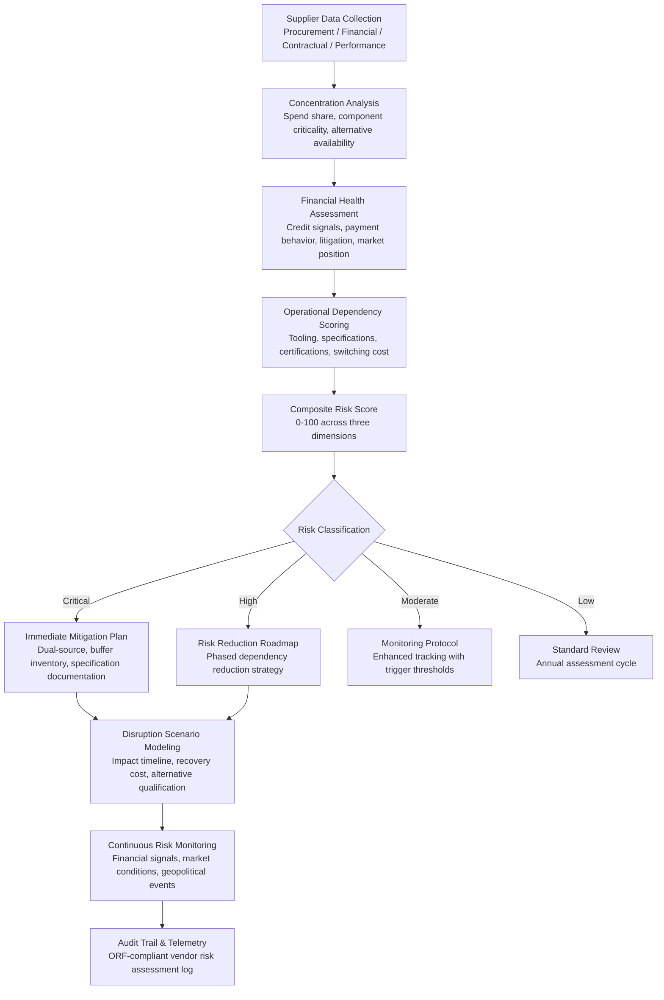

# Supplier Dependency Risk Scorer

Frankmax

NAICS 311-339, 423-454

> **Legacy Enterprises** — Supplier Dependency Risk Scorer

## Objective & Purpose

Legacy enterprises have built supply relationships over decades, and those long relationships often mask dangerous dependencies. A manufacturer sourcing a critical component from the same supplier for 20 years may have no idea that the supplier now represents a single point of failure: no qualified alternative exists, the tooling is proprietary to the supplier, the specifications have never been formally documented (they evolved through verbal agreements), and the supplier's financial health has deteriorated without notice. When that supplier fails -- and suppliers do fail, at a rate of 2-5% annually -- the manufacturer faces months of production disruption while qualifying a new source.

The Supplier Dependency Risk Scorer systematically evaluates every supplier relationship across three dimensions: concentration risk (what percentage of spend or critical inputs depends on this supplier, and are alternatives available?), financial health (is the supplier financially stable, or showing signs of distress?), and operational dependency (how deeply embedded is this supplier in the organization's operations -- proprietary tooling, unique specifications, sole-source certifications?). Each dimension produces a risk score on a 0-100 scale, and the composite score classifies each supplier relationship as low, moderate, high, or critical risk.

The scorer goes beyond simple assessment to model scenarios: "If Supplier X fails, what is the production impact, how long to qualify an alternative, and what is the total financial exposure?" For high-risk suppliers, the system generates risk mitigation plans: dual-sourcing strategies, specification documentation projects, strategic inventory buffers, and contractual protections. The platform also monitors risk continuously -- supplier financial signals, market conditions, and geopolitical factors that could trigger disruption -- providing early warning before a supplier relationship reaches crisis. Organizations that proactively manage supplier dependency risk report 40-60% reductions in supply disruption incidents and 25-35% reductions in disruption recovery time.

## Business Context

| Attribute | Value |
|---|---|
| **Business Process** | Vendor risk management |
| **Business Function** | Procurement |
| **Category** | Risk |
| **Target Audience** | 8. Legacy Enterprises |
| **Bundle** | Enterprise Operations Pack ($4,500/mo) |
| **Monthly Cost of Inaction** | $30K-$500K (supply disruption risk, emergency procurement premiums, production delays) |

## BPMN Workflow

## Features

1. **Spend Concentration Analysis** — Maps supplier spend across the entire procurement portfolio: total spend per supplier, spend by category, single-source vs. multi-source status for each commodity, and geographic concentration. Identifies suppliers that represent disproportionate risk: a supplier providing 2% of total spend but 100% of a critical component is higher risk than a supplier providing 20% of a commoditized input.

2. **Financial Health Monitoring** — Continuously monitors supplier financial signals: credit rating changes, payment behavior trends (paying their own suppliers slower indicates cash flow stress), litigation filings, management turnover, revenue and margin trends, and news sentiment. Financial distress signals trigger proactive engagement before the supplier fails.

3. **Operational Dependency Scoring** — Assesses how deeply each supplier is embedded in operations: proprietary tooling owned by the supplier, unique specifications that only this supplier can meet, certifications (automotive TS 16949, aerospace AS9100, FDA approval) that limit alternatives, and knowledge dependencies (the supplier understands requirements that are not fully documented).

4. **Alternative Supplier Intelligence** — For high-dependency suppliers, the system identifies potential alternatives: manufacturers with similar capabilities, geographic proximity, relevant certifications, and financial stability. Estimates qualification timeline and cost for each alternative, enabling proactive dual-sourcing before a crisis forces reactive sourcing.

5. **Disruption Impact Modeling** — Simulates the impact of each supplier failing: which production lines stop, which products cannot be shipped, what is the revenue impact per day/week/month, what is the estimated time to qualify and ramp an alternative supplier, and what emergency measures (spot market purchases, design changes, customer negotiations) could mitigate impact.

6. **Contract Risk Assessment** — Analyzes supplier contracts for risk provisions: termination notice periods, force majeure definitions, liability caps, intellectual property ownership, specification documentation requirements, and change-of-control provisions. Identifies contractual gaps that increase dependency risk.

7. **Mitigation Plan Generator** — For critical and high-risk suppliers, generates specific mitigation strategies: dual-sourcing initiation (identify and begin qualifying second source), specification documentation (capture undocumented specifications and tolerances), strategic inventory buildup (buffer stock to cover qualification timeline for alternatives), and contractual strengthening (add provisions for IP escrow, termination notice, and performance guarantees).

## Workflow & Automation

**Step 1: Supplier Portfolio Import** — Import the complete supplier base from procurement systems: supplier master data, spend history, commodity classifications, contract terms, and performance metrics. Map suppliers to the products and processes they support to establish criticality linkages.

**Step 2: Concentration Analysis** — Calculate concentration metrics for every supplier-commodity-location combination: spend share, number of qualified alternatives, geographic overlap with other suppliers, and criticality of supplied components. Flag single-source, sole-source, and high-concentration relationships.

**Step 3: Financial Health Assessment** — Connect to financial intelligence sources (Dun & Bradstreet, S&P Capital IQ, public filings) and behavioral data (payment behavior databases, litigation records) to assess each supplier's financial stability. Build financial health scores with trend indicators (improving, stable, or deteriorating).

**Step 4: Operational Dependency Evaluation** — Survey procurement and engineering teams to assess operational dependency factors: proprietary tooling, unique specifications, certification requirements, and switching costs. Combine survey data with contract analysis and procurement history to compute dependency scores.

**Step 5: Risk Scoring and Classification** — Combine concentration, financial health, and operational dependency scores into a composite risk classification. Apply configurable weighting (organizations may weight financial health more heavily than concentration, or vice versa). Generate the prioritized risk register.

**Step 6: Mitigation Planning and Execution** — For critical and high-risk suppliers, generate specific mitigation plans with timelines, costs, and responsible owners. Track mitigation plan execution: dual-sourcing progress, specification documentation completion, strategic inventory buildup, and contract renegotiation outcomes.

## Input/Output Specifications

| Direction | Data | Format | Description |
|---|---|---|---|
| Input | Procurement data | API (SAP Ariba, Coupa, Oracle) | Supplier master, spend history, PO and contract data |
| Input | Supplier financial data | API (D&B, S&P, public filings) | Credit ratings, financial statements, payment behavior |
| Input | Contract documents | PDF (extracted) / API | Terms, conditions, IP provisions, performance requirements |
| Input | Engineering specifications | JSON / documents | Component specifications, tolerances, material requirements |
| Input | Supplier performance data | API (SRM) / CSV | Delivery, quality, responsiveness metrics |
| Output | Risk scorecards | JSON + dashboard UI | Composite risk scores with dimension breakdown |
| Output | Mitigation plans | JSON + PDF | Specific risk reduction strategies with timelines |
| Output | Disruption scenarios | JSON + interactive dashboard | Impact modeling per supplier failure scenario |
| Output | Audit trail | JSON (immutable log) | ORF-compliant vendor risk assessment log |

## Integration Points

| System | Integration Type | Data Flow |
|---|---|---|
| **Inventory Optimization Engine** | Bidirectional | Supplier risk affects safety stock; inventory buffers mitigate risk |
| **Quality Prediction Engine** | Inbound quality data | Supplier quality performance enriches risk scoring |
| **Supply Chain Risk Neural Network** | Bidirectional | Detailed supplier risk feeds network-level risk modeling |
| **Predictive Maintenance Platform** | Cross-reference | Equipment parts supplier risk affects maintenance planning |
| **Compliance Documentation Generator** | Outbound risk data | Supplier risk assessments feed compliance documentation |
| **DocuFlow -- Document Intelligence** | Infrastructure | Contract extraction for risk provision analysis |
| **Audit Trail and Traceability Engine** | Outbound log stream | All risk assessments logged immutably |
| **Failure Intelligence Library** | Outbound anonymized patterns | Supplier failure patterns feed cross-industry intelligence |

## Pricing & Revenue Model

| Component | Pricing | Notes |
|---|---|---|
| **Enterprise Operations Pack** | $4,500/month | Includes Supplier Risk + Process Mining + Tribal Knowledge |
| **Standalone -- Subscription** | $2,500/month | Up to 500 suppliers assessed |
| **Enterprise tier (over 500 suppliers)** | $4,200/month | Unlimited suppliers with continuous monitoring |
| **Disruption scenario modeling** | +$900/month | On-demand impact simulation per supplier |
| **Alternative supplier intelligence** | +$700/month | Qualified alternative identification and matching |
| **AI token consumption** | Included at 80% discount | 2M tokens/month in bundle; overage at marketplace rates |

**Revenue model**: Supplier Dependency Risk Scorer sells on disruption avoidance -- a single major supplier failure costs $5M-$50M in production impact. The "burger" is systematic risk assessment at 40-60% of the cost of consulting-led supply risk audits ($100K-$300K one-time). The "fries" attach through continuous monitoring, disruption scenario modeling, and compliance documentation at 75-90% margin. The supplier risk database becomes a "kitchen" asset that compounds as more organizations contribute anonymized risk patterns.

## NAICS/SIC Mapping

| NAICS Code | SIC Code | Industry | Relevance |
|---|---|---|---|
| 311-339 | 2000-3999 | Manufacturing | Manufacturing supply base risk management |
| 423-425 | 5000-5199 | Wholesale Trade | Distribution vendor risk assessment |
| 441-454 | 5211-5999 | Retail Trade | Retail supplier dependency scoring |
| 236-238 | 1500-1799 | Construction | Subcontractor and material supplier risk |
| 481-488 | 4011-4789 | Transportation & Warehousing | Logistics provider dependency risk |
| 221 | 4911-4932 | Utilities | Critical infrastructure supplier risk |
| 622-623 | 8000-8099 | Healthcare | Medical supply vendor risk management |
