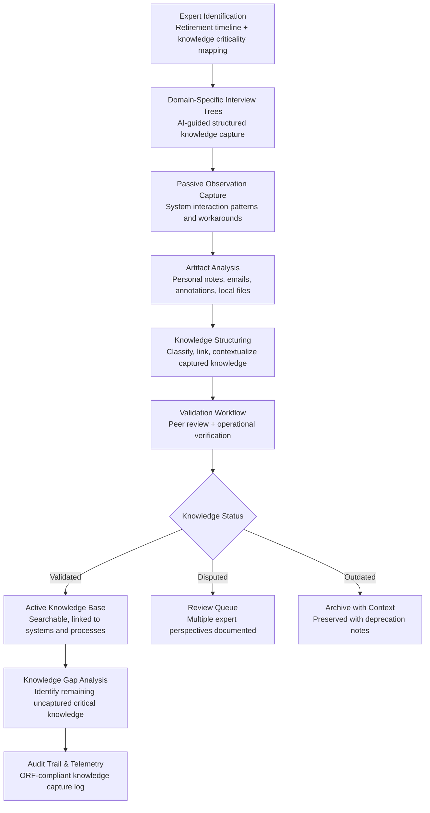

# Tribal Knowledge Extractor

Frankmax

NAICS 311-339, 423-454

> **Legacy Enterprises** — Tribal Knowledge Extractor

## Objective & Purpose

Legacy enterprises face an existential knowledge crisis. The baby boomer generation -- which built, configured, maintained, and optimized the systems and processes that run these organizations -- is retiring at a rate of 10,000 per day in the US alone. By 2030, an estimated 40% of the manufacturing workforce will have retired, taking with them knowledge that exists nowhere in documentation: why the production line runs at 92% instead of 95% (because the older machines overheat above 92%), which supplier contact to call when a shipment is delayed (not the official account manager but the warehouse supervisor named Dave), how to interpret the alarm code that triggers every Tuesday at 3 AM (it is a false alarm from a sensor that was installed backwards in 2006 and no one has ever fixed). This tribal knowledge -- accumulated over decades and stored only in human memory -- is worth millions in operational efficiency and risk avoidance.

The Tribal Knowledge Extractor uses AI to systematically capture, structure, and preserve undocumented institutional knowledge before it walks out the door. The system operates through three channels: structured knowledge interviews (AI-guided conversations with subject matter experts that follow domain-specific question trees to extract procedural, contextual, and exception-handling knowledge), passive observation capture (monitoring how experts interact with systems differently from documented procedures), and artifact analysis (extracting implicit knowledge from personal notes, email archives, local files, and annotation patterns on technical drawings).

The output is not a document dump but a structured knowledge base: searchable, interconnected, and actionable. Each piece of captured knowledge is linked to the systems, processes, and conditions it applies to. When a new operator encounters the Tuesday 3 AM alarm, the knowledge base provides not just the answer ("false alarm, sensor X installed backwards") but the context ("first identified by Jim Chen in 2006, confirmed by maintenance ticket #4421, approved to ignore by plant manager Sarah Williams"). The knowledge base becomes a permanent organizational asset that compounds as more experts contribute and as operational experience validates or updates captured knowledge.

## Business Context

| Attribute | Value |
|---|---|
| **Business Process** | Knowledge capture from retiring workforce |
| **Business Function** | Knowledge Management |
| **Category** | HR/Knowledge |
| **Target Audience** | 8. Legacy Enterprises |
| **Bundle** | Enterprise Operations Pack ($4,500/mo) |
| **Monthly Cost of Inaction** | $30K-$300K (lost expertise, extended training cycles, repeated mistakes) |

## BPMN Workflow

## Features

1. **Retirement Risk Dashboard** — Maps the organization's knowledge risk based on retirement timelines: which experts are within 1, 3, and 5 years of retirement, what knowledge domains they exclusively hold, and what business processes depend on their undocumented expertise. Prioritizes knowledge capture efforts by risk severity.

2. **AI-Guided Knowledge Interviews** — Structured interview sessions guided by domain-specific question trees. The AI interviewer adapts questions based on previous answers, follows interesting threads, and ensures comprehensive coverage of procedural knowledge, exception handling, troubleshooting heuristics, and contextual judgment. Interviews are transcribed and automatically structured.

3. **Passive Observation Engine** — Monitors how experts interact with systems (with their consent) to capture implicit knowledge: which screens they check before making decisions, which fields they mentally cross-reference, which sequence of actions they follow that differs from documented procedures, and what workarounds they routinely apply. Identifies the gap between documented and actual expert behavior.

4. **Artifact Mining** — Analyzes personal knowledge artifacts: annotated technical drawings, Excel workbooks with custom formulas, personal notes and cheat sheets, email threads with vendor contacts, and local file collections. Extracts structured knowledge from these informal sources and links it to relevant systems and processes.

5. **Knowledge Graph Construction** — Organizes captured knowledge into an interconnected graph: each knowledge element is linked to the systems it applies to, the conditions under which it is relevant, the source expert, the validation status, and related knowledge elements. Enables contextual knowledge retrieval: "Show me everything we know about this machine's maintenance quirks."

6. **Peer Validation Workflow** — Captured knowledge is routed to other experts and operators for validation. Multiple perspectives are documented, especially where experts disagree (which is itself valuable knowledge -- it indicates areas of uncertainty or context-dependent judgment).

7. **Knowledge Transfer Measurement** — Tracks knowledge transfer effectiveness: how quickly new operators reach competency, which knowledge base articles are most accessed, which knowledge gaps cause operational incidents, and how the organization's overall knowledge dependency on specific individuals changes over time.

## Workflow & Automation

**Step 1: Expert Mapping and Prioritization** — Identify employees with retirement timelines within the planning horizon. Map their unique knowledge domains against organizational criticality: which systems, processes, and decisions depend on their undocumented expertise. Prioritize capture efforts by combining retirement proximity with knowledge criticality.

**Step 2: Structured Knowledge Interview** — Schedule AI-guided interview sessions with prioritized experts. Sessions typically run 60-90 minutes, covering a specific knowledge domain. The AI guide adapts questions in real time, probing for details on exceptions, edge cases, and judgment calls that standard documentation misses. Sessions are recorded, transcribed, and automatically structured.

**Step 3: Passive Observation Period** — With expert consent, deploy observation tools that capture system interaction patterns over a 2-4 week period. The system identifies behaviors that deviate from documented procedures and flags them as potential tribal knowledge: custom workarounds, unofficial monitoring routines, and undocumented quality checks.

**Step 4: Artifact Collection and Analysis** — Collect personal knowledge artifacts: annotated documents, personal reference files, custom tools and templates, and historical correspondence. AI analysis extracts actionable knowledge from these informal sources and maps it to the organizational knowledge schema.

**Step 5: Knowledge Structuring and Linking** — All captured knowledge (from interviews, observation, and artifacts) is structured into the knowledge graph: classified by domain, linked to relevant systems and processes, tagged with applicability conditions, and annotated with source provenance. Duplicate and conflicting knowledge elements are flagged for resolution.

**Step 6: Validation and Publication** — Structured knowledge enters a peer validation workflow. Validated knowledge is published to the active knowledge base. Disputed knowledge is preserved with multiple perspectives documented. The knowledge base is integrated with operational systems to surface relevant knowledge at the point of need.

## Input/Output Specifications

| Direction | Data | Format | Description |
|---|---|---|---|
| Input | Expert interview recordings | Audio / video (transcribed) | Structured knowledge capture sessions |
| Input | System interaction logs | Agent-collected (with consent) | Expert system usage patterns and workarounds |
| Input | Personal artifacts | PDF, XLSX, DOCX, images | Annotated drawings, notes, custom tools |
| Input | Email archives | MBOX / PST (with consent) | Vendor contacts, troubleshooting threads |
| Input | HR data | API (HRIS) | Retirement timelines, role history, tenure |
| Output | Structured knowledge base | JSON + searchable UI | Interconnected knowledge graph with provenance |
| Output | Knowledge gap analysis | JSON + PDF | Uncaptured critical knowledge areas |
| Output | Transfer effectiveness metrics | REST API / dashboard | Knowledge adoption and competency tracking |
| Output | Audit trail | JSON (immutable log) | ORF-compliant knowledge capture and access log |

## Integration Points

| System | Integration Type | Data Flow |
|---|---|---|
| **Legacy System Migration Planner** | Outbound context | Tribal knowledge fills documentation gaps for legacy systems |
| **Process Mining & Optimization Engine** | Bidirectional | Process knowledge enriches mining analysis; mined processes identify knowledge gaps |
| **Enterprise Knowledge Graph** | Outbound knowledge | Captured knowledge feeds the organizational knowledge graph |
| **Quality Prediction Engine** | Outbound context | Expert quality heuristics inform prediction model training |
| **Predictive Maintenance Platform** | Outbound context | Equipment-specific tribal knowledge enriches maintenance models |
| **DocuFlow -- Document Intelligence** | Infrastructure | Document extraction for artifact analysis |
| **Audit Trail and Traceability Engine** | Outbound log stream | All knowledge capture activities logged immutably |
| **Failure Intelligence Library** | Outbound anonymized patterns | Knowledge loss patterns feed cross-industry intelligence |

## Pricing & Revenue Model

| Component | Pricing | Notes |
|---|---|---|
| **Enterprise Operations Pack** | $4,500/month | Includes Tribal Knowledge + Migration Planner + Process Mining |
| **Standalone -- Subscription** | $2,800/month | Up to 50 expert subjects, 10 knowledge domains |
| **Enterprise tier** | $4,500/month | Unlimited experts and domains |
| **AI-guided interview module** | +$1,000/month | Structured interview engine with domain-specific question trees |
| **Passive observation engine** | +$800/month | System interaction monitoring and pattern extraction |
| **AI token consumption** | Included at 80% discount | Interview transcription and analysis at marketplace rates |

**Revenue model**: Tribal Knowledge Extractor sells on irreversible loss prevention -- once an expert retires, their knowledge is gone forever. The urgency creates a strong sales driver tied to retirement timelines. The "burger" is systematic knowledge capture at 30-50% of the cost of consulting-led knowledge management projects ($100K-$300K per domain). The "fries" attach through knowledge base maintenance, transfer effectiveness analytics, and integration with operational systems at 75-90% margin. The knowledge base becomes a permanent "kitchen" asset with compounding value.

## NAICS/SIC Mapping

| NAICS Code | SIC Code | Industry | Relevance |
|---|---|---|---|
| 311-339 | 2000-3999 | Manufacturing | Manufacturing process and equipment tribal knowledge |
| 423-425 | 5000-5199 | Wholesale Trade | Distribution operations and vendor relationship knowledge |
| 221 | 4911-4932 | Utilities | Grid operations and infrastructure maintenance knowledge |
| 441-454 | 5211-5999 | Retail Trade | Store operations and merchandising expertise |
| 522110 | 6021 | Commercial Banking | Legacy banking system operational knowledge |
| 481-488 | 4011-4789 | Transportation & Warehousing | Logistics and fleet management knowledge |
| 211-213 | 1311-1389 | Oil and Gas / Mining | Extraction and refining operational expertise |
