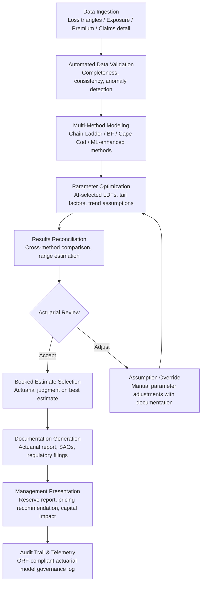

# Actuarial Model Accelerator

Frankmax

NAICS 522110-524298

> **Banks, Insurers, Financial Foundations** — Actuarial Model Accelerator

## Objective & Purpose

Actuarial modeling is the quantitative foundation of every insurance company -- reserving, pricing, capital modeling, and reinsurance decisions all depend on actuarial models that can take weeks to months to run. A typical reserving cycle requires actuaries to build and run loss development triangles, apply multiple methods (chain-ladder, Bornhuetter-Ferguson, Cape Cod, individual claim development), reconcile results, document assumptions, and present findings to management. For a multi-line insurer, this process consumes 4-8 weeks of a team of 3-5 actuaries per quarter. Pricing models for a single product line can take 2-3 months to update, and capital models (NAIC RBC, Solvency II SCR, AM Best BCAR) require 6-12 weeks for annual updates. The bottleneck is not actuarial knowledge -- it is the manual, spreadsheet-driven computation and documentation workflow.

The Actuarial Model Accelerator applies AI to compress actuarial modeling timelines by 10-100x without sacrificing rigor. The system provides three acceleration layers: computation (parallel processing of actuarial calculations that run sequentially in spreadsheets), methodology (AI-enhanced methods that identify optimal model parameters, detect anomalies in loss development patterns, and generate initial estimates that actuaries refine), and documentation (automatic generation of assumption documentation, methodology descriptions, and regulatory filings from model outputs).

The platform does not replace actuaries -- it amplifies them. Instead of spending 80% of their time on data preparation, calculation execution, and documentation, actuaries spend their time on judgment-intensive activities: evaluating assumption reasonableness, interpreting unusual patterns, communicating results to management, and making strategic recommendations. A reserving cycle that previously consumed 6 weeks becomes 3-5 days. A pricing update that took 3 months becomes 2-3 weeks. A capital model that required 12 weeks updates in 1-2 weeks. The time savings is not just efficiency -- it enables faster decision-making. An insurer that can update pricing monthly instead of annually can respond to market changes before competitors.

## Business Context

| Attribute | Value |
|---|---|
| **Business Process** | Reserving and pricing |
| **Business Function** | Actuarial |
| **Category** | Finance |
| **Target Audience** | 9. Banks, Insurers, Financial Foundations |
| **Bundle** | Financial Services Compliance Pack ($8,500/mo) |
| **Monthly Cost of Inaction** | $30K-$200K (slow pricing response, reserve inaccuracy, actuarial talent cost) |

## BPMN Workflow

## Features

1. **Multi-Method Reserving Engine** — Implements all standard actuarial reserving methods in a single platform: paid chain-ladder, incurred chain-ladder, Bornhuetter-Ferguson (paid and incurred), Cape Cod, frequency-severity, individual claim development, and Berquist-Sherman adjustments. Runs all methods simultaneously and presents comparative results for actuarial judgment.

2. **AI-Enhanced Parameter Selection** — Uses machine learning to identify optimal loss development factors (LDFs), tail factors, trend selections, and exposure on-level factors. The AI layer detects anomalies in development patterns (sudden shifts in development speed, unusual tail behavior, calendar year effects) that might bias results if standard selections are applied mechanically.

3. **Parallel Computation Engine** — Executes actuarial calculations across all methods, segments, and scenarios simultaneously using cloud-based parallel processing. A reserving analysis that runs sequentially in Excel over 3 days completes in minutes. Enables what-if analysis (varying assumptions) that would be impractical with manual computation.

4. **Pricing Model Automation** — Automates pricing model workflows: experience analysis (historical loss and premium data), rate indication calculation (comparing actual to expected loss ratios), classification analysis (multi-variate rate relativities by rating factor), and competitive positioning (market rate comparison). Produces rate filings with supporting documentation.

5. **Capital Model Integration** — Computes regulatory and rating agency capital requirements from actuarial model outputs: NAIC RBC (risk-based capital), Solvency II SCR (standard formula and partial internal model), AM Best BCAR, and S&P capital adequacy. Enables real-time capital impact analysis of underwriting, reserving, and reinsurance decisions.

6. **Automated Documentation** — Generates actuarial documentation from model outputs: Statement of Actuarial Opinion (SAO) drafts, reserve study reports, pricing filing exhibits, and regulatory submissions. Documentation includes methodology descriptions, assumption disclosures, data summaries, and result summaries -- formatted per ASOP (Actuarial Standards of Practice) requirements.

7. **Scenario and Sensitivity Analysis** — One-click sensitivity analysis: how do reserves change if LDFs shift by +/- 5%, if tail factors lengthen, if trend increases by 2 points, or if a pandemic-like event recurs? Scenario analysis enables management to understand the range of outcomes, not just the point estimate.

## Workflow & Automation

**Step 1: Data Preparation** — Import loss data (paid, incurred, reported, closed claims) from the claims system, premium data from billing, and exposure data from the policy administration system. The system validates data quality: checks for completeness, identifies coding errors, detects unusual patterns, and flags data quality issues for resolution.

**Step 2: Segmentation and Organization** — Organize data into actuarial triangles by line of business, coverage type, accident period, and any additional segmentation dimensions relevant to the analysis. The system automatically constructs triangles from granular data, eliminating manual triangle-building.

**Step 3: Multi-Method Analysis** — Run all applicable actuarial methods simultaneously. For each method, the AI layer selects initial parameters (LDFs, tail factors, trend) based on statistical analysis of the data patterns. Present comparative results across methods with diagnostics showing where methods agree and diverge.

**Step 4: Actuarial Review and Judgment** — Actuaries review AI-generated results, evaluate assumption reasonableness, apply professional judgment to select parameters and methods, and override AI selections where appropriate. Every override is documented with the actuary's rationale.

**Step 5: Estimate Selection and Documentation** — Select the booked reserve estimate from the range of results. The system generates the full actuarial report: data summaries, methodology descriptions, assumption documentation, results tables, and management summary. SAO drafts are produced for appointed actuary review and signature.

**Step 6: Management Communication and Filing** — Prepare management presentations with reserve impact analysis, year-over-year comparisons, and key driver explanations. Generate regulatory filing exhibits and statutory annual statement pages. All outputs are version-controlled with complete audit trail.

## Input/Output Specifications

| Direction | Data | Format | Description |
|---|---|---|---|
| Input | Claims data | API (claims system) / CSV | Paid, incurred, reported, closed claim detail by period |
| Input | Premium data | API (billing system) / CSV | Written, earned, and in-force premium by segment |
| Input | Exposure data | API (policy admin) / CSV | Policy count, insured values, car-years, etc. |
| Input | Rate filing data | CSV / JSON | Current rates, proposed changes, regulatory requirements |
| Input | Capital model parameters | JSON / manual | RBC factors, BCAR weights, Solvency II inputs |
| Output | Reserve estimates | JSON + XLSX + PDF | Point estimates, ranges, and method comparison |
| Output | Pricing indications | JSON + regulatory filing format | Rate indications with supporting exhibits |
| Output | Actuarial reports | PDF (ASOP-compliant) | Full reserve study, SAO draft, management summary |
| Output | Audit trail | JSON (immutable log) | ORF-compliant actuarial model governance log |

## Integration Points

| System | Integration Type | Data Flow |
|---|---|---|
| **Reinsurance Optimization Engine** | Bidirectional | Actuarial projections feed optimization; reinsurance structure feeds net modeling |
| **Claims Processing Accelerator** | Inbound claims data | Claims detail and development data feeds reserving models |
| **Underwriting Intelligence Engine** | Bidirectional | Pricing indications feed underwriting; underwriting results feed experience analysis |
| **Policyholder Behavior Predictor** | Inbound lapse data | Persistency assumptions feed premium projections |
| **Regulatory Reporting Automator** | Outbound data | Reserve estimates and pricing data feed regulatory filings |
| **Multi-Model AI Orchestrator** | Infrastructure | Compute allocation for parallel actuarial calculations |
| **Audit Trail and Traceability Engine** | Outbound log stream | All actuarial model operations logged immutably |
| **Failure Intelligence Library** | Outbound anonymized patterns | Actuarial model failure patterns feed cross-industry intelligence |

## Pricing & Revenue Model

| Component | Pricing | Notes |
|---|---|---|
| **Financial Services Compliance Pack** | $8,500/month | Actuarial Accelerator + AML/KYC + Regulatory Reporting + 2M AI tokens |
| **Standalone -- Reserving module** | $5,000/month | Multi-line reserving with all standard methods |
| **Pricing module add-on** | +$3,000/month | Rate indication, classification analysis, filing support |
| **Capital modeling module** | +$2,500/month | RBC, BCAR, Solvency II capital calculations |
| **Enterprise tier (all modules)** | $9,000/month | Full actuarial platform with all capabilities |
| **AI token consumption** | Included at 80% discount | 2M tokens/month in bundle; overage at marketplace rates |

**Revenue model**: Actuarial Model Accelerator sells on actuarial productivity -- compressing a 6-week reserving cycle to 3-5 days frees actuaries for higher-value work. For a team of 5 actuaries at $150K average salary, recovering 60% of their time represents $450K in annual productivity. The "burger" is AI-accelerated computation at a fraction of the cost of commercial actuarial software ($50K-$200K/year per seat). The "fries" attach through documentation automation, capital modeling, and regulatory filing support at 75-90% margin.

## NAICS/SIC Mapping

| NAICS Code | SIC Code | Industry | Relevance |
|---|---|---|---|
| 524126 | 6321 | Direct Property and Casualty Insurance | P&C reserving, pricing, and capital modeling |
| 524113 | 6311 | Direct Life Insurance | Life reserving and pricing acceleration |
| 524114 | 6311 | Direct Health and Medical Insurance | Health actuarial model acceleration |
| 524130 | 6321 | Reinsurance Carriers | Reinsurance pricing and reserving |
| 524298 | 6411 | All Other Insurance Activities | Actuarial consulting and advisory |
| 524210 | 6411 | Insurance Agencies and Brokerages | Agency actuarial support services |
| 541612 | 7371 | Human Resources Consulting | Benefits actuarial consulting (pension, health) |
