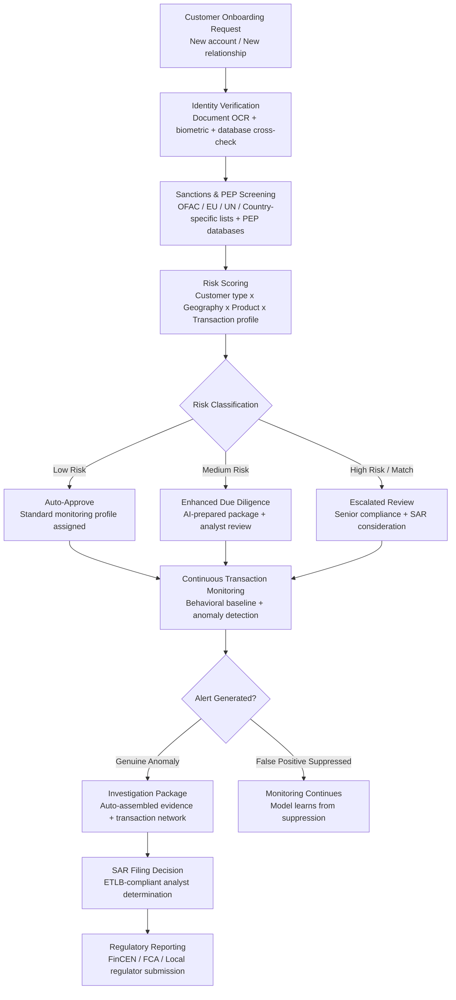

# AML/KYC Automation Platform

Frankmax

NAICS 522110-522298

> **Banks, Insurers, Financial Foundations** — Financial Services AI Operations

## Objective & Purpose

Anti-money laundering (AML) and know-your-customer (KYC) compliance is the single largest regulatory cost center in banking. Global financial institutions spend over $30 billion annually on AML compliance programs, employing approximately 500,000 compliance professionals worldwide. Despite this expenditure, the system is structurally broken: legacy rules-based transaction monitoring systems generate false positive rates of 95-98%, meaning that for every 100 alerts generated, only 2-5 represent actual suspicious activity. Compliance analysts spend 80%+ of their time investigating and clearing false positives, creating a labor-intensive, low-value cycle that scales linearly with transaction volume.

The AML/KYC Automation Platform replaces rules-based detection with AI-driven pattern recognition that reduces false positive rates by 70-85% while maintaining or improving true positive detection rates. The platform operates across three layers: (1) KYC onboarding automation, which verifies customer identity, screens against sanctions lists and PEP databases, and risk-scores new relationships in minutes rather than days; (2) continuous transaction monitoring, which analyzes transaction patterns against behavioral baselines rather than static thresholds, detecting genuine anomalies while ignoring routine activity that triggers legacy rules; (3) suspicious activity investigation, which auto-generates investigation packages with evidence trails for genuine alerts, reducing analyst investigation time from 4-6 hours to 30-45 minutes per case.

The financial case is immediate: a mid-size bank with 500,000 customers and $50B in assets typically employs 200-400 AML compliance staff at a total cost of $15M-$30M annually. Reducing false positives by 70% eliminates 60-70% of investigation workload, reallocating analyst capacity from clearing false alerts to investigating genuine threats. The platform also reduces regulatory risk: KYC/AML compliance gaps carry penalties of $100K-$10M per violation (Tier 1 Chokepoint #17), and the monthly cost of inaction is measured not just in fines but in potential enforcement actions, consent orders, and reputational damage.

## Business Context

| Attribute | Value |
|---|---|
| **Business Process** | Anti-money laundering compliance and identity verification |
| **Business Function** | Compliance / Financial Crime |
| **Category** | Regulatory |
| **Target Audience** | 9. Banks, Insurers, Financial Foundations |
| **Bundle** | Financial Services Compliance Pack ($8,500/mo) |
| **Monthly Cost of Inaction** | $100K-$10M in fines (Tier 1 Chokepoint #17) |
| **Regulatory Drivers** | BSA/AML, USA PATRIOT Act, 4th/5th/6th EU AMLD, FATF Recommendations |
| **Build Complexity** | 7/10 (regulatory certification required) |

## BPMN Workflow

## Features

1. **Automated Identity Verification** — Processes identity documents (passports, driver's licenses, national IDs) using OCR and document authentication AI. Verifies document integrity (tamper detection, format validation), extracts personal data, and cross-references against government databases and credit bureaus. Biometric matching (facial recognition against ID photos) adds a second verification layer. Average verification time: 90 seconds vs. 2-5 business days for manual KYC.

2. **Real-Time Sanctions & PEP Screening** — Screens customers and transaction counterparties against 200+ sanctions lists (OFAC SDN, EU Consolidated, UN Security Council, country-specific lists) and politically exposed person (PEP) databases. Fuzzy matching algorithms handle name variations, transliterations, and partial matches. Screening runs at onboarding, on a recurring schedule, and against every sanctions list update (typically daily).

3. **Dynamic Risk Scoring** — Assigns and continuously updates customer risk scores across multiple dimensions: customer type (individual, corporate, trust, correspondent bank), geographic risk (FATF grey/black list countries, high-risk jurisdictions), product risk (trade finance, private banking, wire transfers), and behavioral risk (transaction patterns vs. declared activity). Risk scores drive monitoring intensity, review frequency, and enhanced due diligence triggers.

4. **Behavioral Transaction Monitoring** — Replaces static threshold rules ("flag all wire transfers above $10,000") with behavioral baselines. The system builds a transaction profile for each customer based on 6+ months of historical activity, then detects genuine anomalies: sudden increases in transaction volume, new geographies, unusual counterparties, structuring patterns, and layering behaviors. False positive reduction: 70-85% vs. legacy rules-based systems.

5. **Network Analysis & Relationship Mapping** — Maps transaction networks to identify connected entities, shell company structures, and layered transaction chains used for money laundering. Visualizes fund flows across accounts, entities, and jurisdictions. Identifies beneficial ownership patterns that document-level analysis misses.

6. **Auto-Generated Investigation Packages** — When a genuine alert fires, the system pre-assembles the investigation package: alert details, customer profile, transaction history, relevant account activity, counterparty information, prior alerts and dispositions, and similar historical cases with outcomes. Analyst investigation time drops from 4-6 hours to 30-45 minutes per case.

7. **SAR/STR Auto-Drafting** — For cases requiring regulatory filing, the system drafts Suspicious Activity Reports (SARs) or Suspicious Transaction Reports (STRs) in the format required by the applicable regulator (FinCEN for US, FCA for UK, FINTRAC for Canada). Analysts review and approve the draft; the system handles electronic filing.

8. **Regulatory Examination Readiness** — Maintains a complete, queryable audit trail of all KYC decisions, transaction monitoring alerts, investigation outcomes, and SAR filing rationale. When regulators examine AML compliance, the system produces examination-ready documentation in the regulator's expected format, reducing examination preparation from weeks to hours.

## Workflow & Automation

**Step 1: Customer Onboarding** — A new customer relationship triggers the KYC workflow. The system collects identity information through the bank's onboarding channel (branch, online, mobile). For individuals: government ID, proof of address, source of funds declaration. For corporations: articles of incorporation, beneficial ownership declaration, authorized signatories. Documents are processed via AI extraction; data is verified against external databases.

**Step 2: Screening & Risk Assessment** — The customer's identity data is screened against sanctions lists, PEP databases, adverse media, and law enforcement databases. Simultaneously, the risk scoring model evaluates the customer across all risk dimensions. The combined output: verified identity, screening results (clear / potential match / confirmed match), and risk classification (low / medium / high / prohibited).

**Step 3: Due Diligence Decision** — Based on risk classification: low-risk customers are auto-approved with standard monitoring; medium-risk customers trigger enhanced due diligence (additional documentation, source of wealth verification, management approval); high-risk customers or sanctions matches are escalated to senior compliance for manual review and potential relationship denial. Every decision is logged with ETLB-compliant accountability binding.

**Step 4: Continuous Transaction Monitoring** — Once onboarded, all customer transactions are monitored continuously. The behavioral monitoring engine compares each transaction against the customer's established baseline. Deviations that exceed statistical thresholds generate alerts. The system also monitors for specific typology patterns: structuring (transactions just below reporting thresholds), layering (rapid movement through multiple accounts), and integration (legitimate-appearing transactions from illicit sources).

**Step 5: Alert Investigation** — Genuine alerts enter the investigation queue with pre-assembled packages. Analysts review the evidence, add notes, request additional information if needed, and make a disposition decision: dismiss (not suspicious), escalate (needs further investigation), or file (SAR/STR required). Each disposition feeds the model, improving future alert quality.

**Step 6: Regulatory Filing** — Cases requiring SAR/STR filing are auto-drafted in the applicable regulatory format. The analyst reviews the narrative, confirms accuracy, and approves filing. The system handles electronic submission to FinCEN (via BSA E-Filing), FCA, or other applicable regulator. Filing confirmation and acknowledgment are logged.

**Step 7: Ongoing Monitoring & Review** — Customer risk profiles are re-evaluated on a periodic basis (annually for low-risk, quarterly for medium-risk, monthly for high-risk) and when triggered by events (sanctions list updates, significant transaction changes, adverse media mentions). The system generates re-review packages automatically, maintaining continuous compliance without manual scheduling.

## Input/Output Specifications

| Direction | Data | Format | Description |
|---|---|---|---|
| Input | Customer identity documents | JPEG, PNG, PDF | Passports, IDs, proof of address, corporate documents |
| Input | Customer application data | JSON / API | Personal details, business information, source of funds |
| Input | Transaction data | ISO 20022 / SWIFT / Core banking API | Real-time and historical transaction records |
| Input | Sanctions lists | XML / API (OFAC, EU, UN) | Updated daily; 200+ global lists |
| Input | PEP databases | API | Politically exposed persons, relatives, close associates |
| Input | Adverse media | API / NLP feeds | Negative news screening across global media |
| Output | KYC verification result | JSON | Identity verified / failed, risk score, screening results |
| Output | Transaction alerts | JSON | Alert details, evidence package, recommended action |
| Output | SAR/STR drafts | FinCEN XML / FCA format / PDF | Pre-drafted regulatory filings |
| Output | Audit trail | JSON (immutable log) | ORF-compliant KYC and monitoring decision history |
| Output | Compliance dashboard | REST API / UI | Alert volumes, investigation times, SAR rates, false positive rates |

## Integration Points

| System | Integration Type | Data Flow |
|---|---|---|
| **Fraud Detection Neural Network** | Bidirectional | Fraud patterns inform AML monitoring; AML network analysis feeds fraud detection |
| **Claims Processing Accelerator** | Inbound verification | High-value claims trigger claimant identity verification |
| **Regulatory Reporting Automator** | Outbound data | AML metrics, SAR volumes, and compliance KPIs feed regulatory reports |
| **Underwriting Intelligence Engine** | Outbound risk data | Customer risk scores inform underwriting risk assessment |
| **Multi-Model AI Orchestrator** | Infrastructure | AI model routing for NLP, document extraction, and pattern detection |
| **Core Banking System** | Bidirectional API | Customer data and transactions in; risk scores and alerts out |
| **SWIFT / Payment Systems** | Inbound real-time | Wire transfer and payment data for real-time screening |
| **Audit Trail & Traceability Engine** | Outbound log stream | All compliance decisions logged immutably |

## Pricing & Revenue Model

| Component | Pricing | Notes |
|---|---|---|
| **Financial Services Compliance Pack** | $8,500/month | AML/KYC + Claims Accelerator + Regulatory Reporting + 2M AI tokens |
| **Standalone — Subscription** | $5,500/month | Up to 100,000 monitored customers |
| **Per-verification fee (KYC)** | $2-$5 per verification | Identity verification at onboarding and periodic re-review |
| **Per-alert investigation fee** | $8-$15 per alert | Pre-assembled investigation packages |
| **Enterprise tier (>500K customers)** | Custom pricing | Dedicated instance, custom typologies, regulator-specific modules |
| **SAR auto-drafting module** | +$1,200/month | Multi-jurisdiction SAR/STR generation |
| **Network analysis module** | +$1,800/month | Transaction network visualization and shell company detection |

**Revenue model**: AML/KYC is a compliance obligation -- banks cannot operate without it, and they cannot reduce spending without regulatory risk. The platform replaces $15M-$30M in annual compliance labor costs with a $150K-$300K annual platform fee. The "fries" layer: every KYC decision and transaction alert generates an audit trail event (ORF compliance at $800/month), feeds regulatory reporting (required by law), and improves the fraud detection network (separate subscription). Total revenue per banking customer: $200K-$500K annually when the full compliance stack attaches.

## NAICS/SIC Mapping

| NAICS Code | SIC Code | Industry | Relevance |
|---|---|---|---|
| 522110 | 6021 | Commercial Banking | Core AML/KYC compliance obligation |
| 522120 | 6022 | Savings Institutions | Deposit-taking AML requirements |
| 522130 | 6029 | Credit Unions | Member verification and transaction monitoring |
| 522210 | 6141 | Credit Card Issuing | Transaction monitoring for card fraud/AML |
| 522220 | 6153 | Sales Financing | Consumer lending AML compliance |
| 522298 | 6159 | All Other Nondepository Credit | Non-bank financial institution compliance |
| 523110 | 6211 | Investment Banking | Securities AML and KYC requirements |
| 523920 | 6282 | Portfolio Management | Investment advisor AML obligations |
