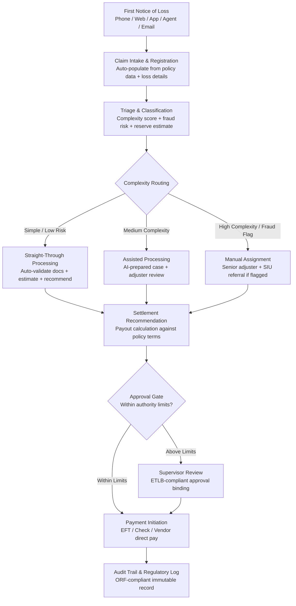

# Claims Processing Accelerator

Frankmax

NAICS 524114-524298

> **Banks, Insurers, Financial Foundations** — Financial Services AI Operations

## Objective & Purpose

Insurance claims processing is the industry's central operational pain point. The average property & casualty claim takes 30-45 days from first notice of loss (FNOL) to settlement. Life and health claims average 20-35 days. During that window, insurers carry reserve liabilities, employ adjusters and examiners at $60K-$90K fully loaded cost, manage customer dissatisfaction (claims experience is the #1 driver of policyholder churn), and face regulatory scrutiny for delayed settlements. Industry-wide, claims operations consume 60-70% of an insurer's operating expenses. For a mid-size insurer processing 200,000 claims annually at an average handling cost of $300-$500 per claim, total claims operations cost runs $60M-$100M per year.

The Claims Processing Accelerator applies AI across the full claims lifecycle: intake and triage (classifying claims by type, complexity, and likely fraud risk within seconds of FNOL), document validation (extracting and verifying information from loss reports, medical records, police reports, and repair estimates), damage estimation (using computer vision for property damage and actuarial models for liability estimation), and settlement recommendation (calculating payout amounts against policy terms and coverage limits). Straightforward claims -- those matching established patterns with complete documentation and no fraud indicators -- can be processed from FNOL to settlement recommendation in under 4 hours.

This is the #4 revenue priority in the marketplace and the primary wedge into the $8,500/month Financial Services Compliance Pack. Insurance is a high-attachment-rate vertical: every claims tool naturally requires governance (audit trail), compliance (regulatory reporting), and risk management (fraud detection) -- all of which are premium "fries" products. A single insurer deployment generates $100K-$300K in annual recurring revenue across the full compliance stack.

## Business Context

| Attribute | Value |
|---|---|
| **Business Process** | Insurance claims automation (FNOL through settlement) |
| **Business Function** | Claims Management |
| **Category** | Operations |
| **Target Audience** | 9. Banks, Insurers, Financial Foundations |
| **Revenue Priority** | #4 (60-90 day revenue stream) |
| **Bundle** | Financial Services Compliance Pack ($8,500/mo) |
| **Monthly Cost of Inaction** | $15K-$300K (Tier 1 Chokepoint #11) |
| **Wedge Strategy** | Insurance entry point; expands to fraud, underwriting, regulatory |

## BPMN Workflow

## Features

1. **Omnichannel FNOL Intake** — Accepts first notice of loss through any channel: phone (speech-to-text transcription), web portal (structured form), mobile app (photo/video upload), agent submission (pre-populated from policy data), and email (NLP extraction from unstructured text). All channels converge into a unified claim record within 60 seconds.

2. **Intelligent Triage Engine** — Classifies each claim along three dimensions within 30 seconds of intake: (a) complexity score (simple/medium/complex based on claim type, dollar amount, and documentation requirements), (b) fraud risk score (0-100 based on pattern matching against known fraud indicators), (c) initial reserve estimate (actuarial model based on claim type, jurisdiction, and historical settlement data).

3. **Document Validation & Extraction** — Processes supporting documentation using AI extraction: police reports (incident details, fault determination), medical records (diagnosis codes, treatment plans, prognosis), repair estimates (itemized damage, labor hours, parts costs), receipts (amounts, dates, vendors), and photos (computer vision for damage assessment). Cross-validates extracted data against claim statements for inconsistency detection.

4. **Straight-Through Processing (STP)** — Claims meeting STP criteria (complete documentation, below complexity threshold, no fraud indicators, within standard coverage terms) are processed end-to-end without human intervention. Target STP rate: 35-50% of all claims, up from the industry average of 5-15%. Each STP claim reduces handling cost from $300-$500 to under $20.

5. **Computer Vision Damage Assessment** — For property and auto claims, computer vision models analyze submitted photos and video to estimate damage severity, identify affected components, and generate preliminary repair cost estimates. Models trained on 10M+ damage images across property, auto, and equipment categories.

6. **Policy Terms Engine** — Automatically matches claim details against the applicable policy terms, endorsements, exclusions, and sub-limits. Identifies coverage gaps, applicable deductibles, co-insurance provisions, and policy limits. Reduces coverage determination time from hours to seconds and eliminates manual policy lookup errors.

7. **Reserve Accuracy Optimization** — Dynamically adjusts claim reserves as new information arrives (additional documentation, adjuster notes, medical updates). Maintains reserve accuracy within 5% of actual settlement for 80%+ of claims, reducing both over-reserving (trapped capital) and under-reserving (financial surprises).

8. **Regulatory Compliance Engine** — Automatically tracks claim handling against jurisdictional SLAs: acknowledgment deadlines (24-48 hours in most states), investigation timelines, payment deadlines, and required communications. Generates regulatory-compliant correspondence templates and flags claims approaching SLA violations.

## Workflow & Automation

**Step 1: Claim Intake & Registration** — A loss event triggers FNOL through any intake channel. The system auto-populates the claim record from the policyholder's policy data (coverage details, deductibles, limits, endorsements) and captures loss-specific information (date of loss, type of loss, description, affected parties). A unique Claim Processing ID is assigned, and the claim enters the processing pipeline.

**Step 2: Triage & Classification** — Within 30 seconds of registration, the triage engine classifies the claim. The system analyzes claim characteristics against historical patterns: claim type, reported dollar amount, policy type, claimant history (prior claims frequency, litigation history), geographic risk factors, and documentation completeness. Output: complexity score, fraud risk score, initial reserve estimate, and processing path assignment.

**Step 3: Document Collection & Validation** — The system identifies required documentation based on claim type and jurisdiction (police report for theft, medical records for injury, repair estimate for property damage). Automated requests are sent to the claimant and third parties. As documents arrive, AI extraction pulls structured data and cross-validates against the claim statement. Discrepancies are flagged for adjuster review.

**Step 4: Damage Assessment & Estimation** — For property/auto claims, computer vision analyzes submitted photos to generate preliminary damage estimates. For liability/injury claims, actuarial models estimate settlement ranges based on diagnosis codes, treatment plans, jurisdiction, and comparable case outcomes. For all claim types, the estimation module produces a recommended settlement range with confidence intervals.

**Step 5: Coverage Determination** — The policy terms engine matches the validated claim against applicable coverage. The system identifies: which coverage part applies, applicable deductible, any exclusions that may reduce or deny coverage, sub-limits that cap specific loss types, and whether other insurance provisions apply. Coverage determination is documented with specific policy language citations.

**Step 6: Settlement Recommendation** — Combining damage estimation and coverage determination, the system generates a settlement recommendation: recommended payout amount, calculation methodology, supporting evidence, and any open items requiring additional information. For STP-eligible claims, the recommendation proceeds directly to payment authorization. For complex claims, the recommendation packages all analysis for adjuster review.

**Step 7: Payment & Closure** — Approved settlements initiate payment through the insurer's payment system (EFT, check, or direct vendor pay for repair claims). The claim record is closed with a complete audit trail: every document, every analysis, every decision point, every human interaction. Closed claims feed the actuarial models and fraud detection patterns for continuous improvement.

## Input/Output Specifications

| Direction | Data | Format | Description |
|---|---|---|---|
| Input | FNOL data | JSON/XML (ACORD standards) | Loss details, policyholder information, incident description |
| Input | Policy data | API / ACORD AL3 | Coverage terms, endorsements, limits, deductibles |
| Input | Supporting documents | PDF, JPEG, PNG, DOCX, TIFF | Police reports, medical records, repair estimates, photos |
| Input | Third-party data | API feeds | Weather data, police records, medical databases, repair cost indexes |
| Input | Historical claims data | CSV / database connection | Prior claims for pattern training and benchmarking |
| Output | Triage classification | JSON | Complexity score, fraud risk score, reserve estimate, path assignment |
| Output | Settlement recommendation | JSON + PDF report | Payout amount, methodology, evidence package |
| Output | Regulatory compliance log | JSON (immutable) | SLA tracking, required communications, deadline compliance |
| Output | Audit trail | JSON (immutable log) | ORF-compliant complete claim processing history |
| Output | Analytics dashboard | REST API / UI | Claims volume, STP rate, cycle time, reserve accuracy, fraud detection rate |

## Integration Points

| System | Integration Type | Data Flow |
|---|---|---|
| **Fraud Detection Neural Network** | Bidirectional | Fraud risk scores feed triage; confirmed fraud patterns feed detection models |
| **Underwriting Intelligence Engine** | Outbound analytics | Claims experience data feeds underwriting risk models and pricing |
| **AML/KYC Automation Platform** | Cross-reference | Claimant identity verification for high-value claims |
| **Regulatory Reporting Automator** | Outbound data | Claims metrics feed regulatory submissions (state filings, NAIC reports) |
| **DocuFlow — Document Intelligence** | Infrastructure | Document extraction models power claims document processing |
| **Multi-Model AI Orchestrator** | Infrastructure | AI model routing for claims analysis, estimation, and fraud detection |
| **Audit Trail & Traceability Engine** | Outbound log stream | Complete claims processing history logged immutably |
| **Policy Administration System** | Bidirectional API | Policy data in; claims status and payment data out |

## Pricing & Revenue Model

| Component | Pricing | Notes |
|---|---|---|
| **Financial Services Compliance Pack** | $8,500/month | Claims Accelerator + AML/KYC + Regulatory Reporting + 2M AI tokens |
| **Standalone — Subscription** | $4,500/month | Up to 5,000 claims/month |
| **Per-claim processing fee** | $3-$8 per claim | Volume-based; decreases with scale |
| **Enterprise tier (>20K claims/mo)** | Custom pricing | Dedicated instance, custom models, SLA guarantees |
| **Computer Vision add-on** | +$1,200/month | Photo/video damage assessment models |
| **STP optimization module** | +$800/month | Advanced rules engine for higher straight-through rates |
| **AI token consumption** | Included at 80% discount | 2M tokens/month in bundle; overage at marketplace rates |

**Revenue model**: Claims Processing Accelerator is the wedge product for insurance -- the "burger" that gets insurers onto the platform. Priced to beat the cost of manual claims handling ($300-$500/claim vs. $3-$8/claim for STP-eligible claims). The "fries" attach naturally: fraud detection (required for claims), regulatory reporting (required by law), audit trail (required by examiners), and underwriting intelligence (feeds from claims data). Target attachment rate: 65%+ for at least one governance add-on within 90 days. Full Financial Services Compliance Pack adoption within 6 months.

## NAICS/SIC Mapping

| NAICS Code | SIC Code | Industry | Relevance |
|---|---|---|---|
| 524114 | 6311 | Direct Health and Medical Insurance | Health and medical claims processing |
| 524126 | 6321 | Direct Property and Casualty Insurance | P&C claims automation |
| 524113 | 6311 | Direct Life Insurance | Life and disability claims |
| 524127 | 6331 | Direct Title Insurance | Title claims processing |
| 524128 | 6399 | Other Direct Insurance | Specialty lines claims |
| 524210 | 6411 | Insurance Agencies and Brokerages | Claims facilitation for agents |
| 524291 | 6399 | Claims Adjusting | Third-party claims administration |
| 524298 | 6411 | All Other Insurance Activities | Reinsurance claims, specialty claims |
